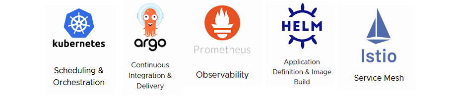

# Capítulo 1: Introdução a Computação em Nuvem

# 1.7 Cloud Native

_[Cloud Native](https://en.wikipedia.org/wiki/Cloud-native_computing)_ é um termo que se refere a uma abordagem de desenvolvimento voltada para aplicações projetadas e executadas nativamente na nuvem. Essas aplicações são projetadas para serem distribuídas e desenvolvidas com o objetivo de aproveitar ao máximo as características e benefícios da Computação em Nuvem, como escalabilidade, resiliência e agilidade.

Uma aplicação que se beneficia dos recursos da nuvem possui a capacidade de se antecipar a falhas e manter sua estabilidade, mesmo diante de indisponibilidades na infraestrutura, sejam elas planejadas ou não _[(zero downtime)](https://en.wikipedia.org/wiki/Downtime)_. Nesse contexto, a _"indisponibilidade"_ pode se referir tanto a problemas técnicos quanto também a qualquer alteração que exija a implementação de um novo código.

É importante dizer que aplicações Cloud Native não se limitam a serem executadas apenas em serviços básicos do modelo _IaaS_, como rede, máquinas virtuais ou bare metal. Em vez disso, elas são projetadas para tiraram o máximo de proveito dos diversos serviços e recursos oferecidos pela nuvem. Uma abordagem que se restringe apenas ao _"move to cloud"_, não torna sua aplicação Cloud Native.

Como discutido na seção sobre DevOps, a responsabilidade de manter o _[Uptime](https://en.wikipedia.org/wiki/Uptime)_ das aplicações não recai apenas sobre a equipe de operações, mas também sobre os desenvolvedores. Ambas as equipes têm a responsabilidade de projetar sistemas com _[baixo acoplamento](https://en.wikipedia.org/wiki/Loose_coupling)_ que sejam resilientes, gerenciáveis e observáveis.

Arquiteturas de _[microserviços](https://en.wikipedia.org/wiki/Microservices)_ são especialmente adequadas nesse contexto, pois promovem a decomposição de uma _[aplicação monolítica](https://en.wikipedia.org/wiki/Monolithic_application)_ em serviços menores, autônomos e distribuídos, evitando assim os chamados _[pontos únicos de falha](https://en.wikipedia.org/wiki/Single_point_of_failure)_. Cada serviço possui uma única responsabilidade, e a proposta é que esses serviços colaborem entre si para formar a aplicação como um todo.

Nesse contexto, _Computação em Nuvem_ refere-se ao ambiente onde o software é executado, enquanto _Cloud Native_ diz respeito à forma como esse software é projetado e executado.

Além de tudo o que já foi dito, desenvolver software de acordo com os padrões Cloud Native frequentemente contribui para a redução de custos, pois elimina o _[overprovisioning](https://en.wikipedia.org/wiki/Overprovisioning)_ ao permitir que os recursos sejam escalados conforme a demanda de utilização. 

!!! note "NOTA"
    Overprovisioning é um termo utilizado em ambientes de computação e infraestrutura de TI que se refere à prática de alocar mais recursos do que o necessário para atender à demanda de uma aplicação ou serviço.

Aplicações Cloud Native possuem as seguintes características:

### Contêineres

### Microserviços

### DevOps e Automação

## 1.7.1 Cloud Native Computing Foundation (CNCF)

A _[CNCF](https://www.cncf.io/)_, ou _[Cloud Native Computing Foundation](https://www.cncf.io/)_, fundada em 2015, é uma organização sem fins lucrativos associada à _[Linux Foundation](https://www.linuxfoundation.org/)_, dedicada a promover e facilitar o desenvolvimento e a adoção de tecnologias nativas da nuvem.

_[CNCF](https://www.cncf.io/)_ promove, por meio de um ecossistema de projetos de código aberto e independentes de fornecedores, a adoção de paradigmas que possibilitam o desenvolvimento de aplicações _escaláveis, resilientes, gerenciáveis e observáveis_. Isso permite a implementação de mudanças de alto impacto de forma frequente e previsível, com o mínimo de esforço.

Conforme mencionado em seu _[FAQ](https://www.cncf.io/about/faq/#why-is-cncf-needed)_, as tecnologias da CNCF não estão sujeitas ao chamado _[vendor lock-in](https://en.wikipedia.org/wiki/Vendor_lock-in)_ e são portáveis entre diferentes provedores de nuvem.

!!! note "NOTA"
    Consulte a definição de [Cloud Native da CNCF na versão 1.1](https://github.com/cncf/toc/blob/main/DEFINITION.md#portugu%C3%AAs-brasileiro), que descreve os princípios e características fundamentais desse conceito.

A CNCF hospeda diversos projetos que possibilitam o desenvolvimento de aplicações Cloud Native sem o risco de _[vendor lock-in](https://en.wikipedia.org/wiki/Vendor_lock-in)_, garantindo a portabilidade entre diferentes provedores de nuvem.

!!! note "NOTA"
    Consulte ["Graduated and Incubating Projects"](https://www.cncf.io/projects/) para acessar a lista dos projetos mantidos pela CNCF.