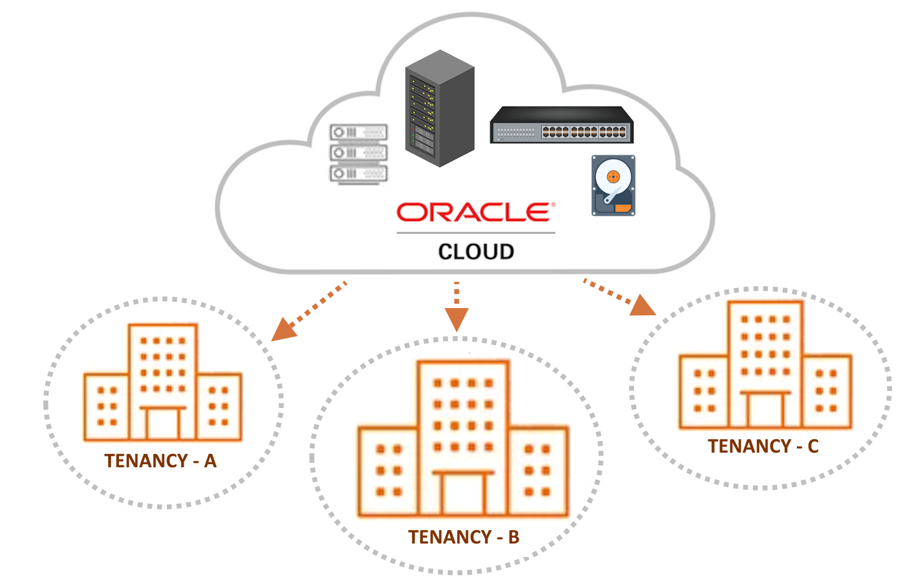
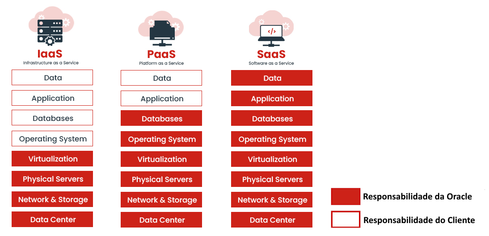

# Capítulo 1: Introdução a Computação em Nuvem

# 1.2 Definições do NIST

Como você viu na seção anterior, a Computação em Nuvem, ou Cloud Computing, não é um conceito recente. Nesta seção, apresentaremos um conjunto de definições formais que contribuirão para um entendimento mais abrangente dessa tecnologia.

Um documento que detalha os conceitos relacionados à definição de Computação em Nuvem é o _["The NIST Definition of Cloud Computing"](https://csrc.nist.gov/pubs/sp/800/145/final)_, publicado em setembro de 2011. Esse documento é amplamente reconhecido como uma referência essencial na área de Computação em Nuvem.

De acordo com o NIST, a Computação em Nuvem é um modelo que possibilita o acesso, por meio da Internet, a um conjunto de recursos computacionais (como rede, armazenamento, servidores e serviços) que podem ser rapidamente criados e liberados de maneira simples, sem a necessidade de intervenção humana, como, por exemplo, ligar para um helpdesk para solicitar a criação de um servidor.

O NIST também especifica que um provedor de Computação em Nuvem deve apresentar _cinco características essenciais_. Além disso, o usuário que consome os serviços deve ser capaz de implantar sua aplicação ou provisionar sua infraestrutura, utilizando um dos _três modelos de serviço_ disponíveis (IaaS, PaaS ou SaaS), escolhendo entre um dos _modelos de implementação_ (nuvem pública, privada, híbrida ou comunitária).

Iniciaremos com a descrição das _cinco características essenciais_ que todo provedor de nuvem deve obrigatóriamente ter para ser reconhecido como um verdadeiro provedor de serviços em nuvem. Em seguida, abordaremos os _três tipos de serviços disponíveis_ e, por fim, discutiremos os _quatro modelos de implantação_.

## 1.2.1 Cinco Características Essenciais

Estas são as características essenciais que devem estar presentes quando se trata de Computação em Nuvem. Em essência, um provedor de serviços que oferece Computação em Nuvem deve, no mínimo, possuir as seguintes características essenciais:

### On-demand self-service (Serviço sob demanda)

Um usuário que consome serviços em nuvem pode criar servidores, redes, bancos de dados e outros recursos conforme a sua necessidade, tudo isso por meio da rede, sem precisar de qualquer intervenção humana por parte do provedor de nuvem.

### Broad Network Access (Amplo Acesso à Rede)

Os recursos computacionais estão disponíveis por meio da rede e devem ser acessíveis através de mecanismos padronizados, permitindo seu uso em dispositivos como celulares, tablets, laptops e estações de trabalho.

A expressão _"mecanismos padronizados"_ refere-se a métodos, protocolos ou interfaces que são amplamente aceitos e utilizados na indústria, que garantem a comunicação e a operação eficaz entre diferentes sistemas e serviços. Nesse contexto, podemos citar o protocolo TCP/IP, que é universalmente adotado, padronizado por meio de documentos RFC (Request for Comments) e implementado pela maioria dos sistemas operacionais disponíveis. Em outras palavras, o uso do protocolo TCP/IP serve como um meio padronizado para criar ou acessar os recursos oferecidos pelo provedor de nuvem.

### Resource Pooling (Agrupamento de Recursos)

Os recursos computacionais de um provedor de nuvem são agrupados para atender a múltiplos clientes, que permanecem isolados uns dos outros, por meio de um modelo conhecido como _multi-tenant_ (multilocatário). 

Empresas ou indivíduos pagam para acessar um _pool virtual de recursos compartilhados_, incluindo serviços de computação, armazenamento e rede, que estão localizados em servidores remotos, pertencentes e gerenciados por provedores de serviços. 

Os diferentes recursos, tanto físicos quanto virtuais, são dinamicamente atribuídos e reatribuídos conforme a demanda do cliente. Geralmente, o cliente não tem controle ou conhecimento sobre a localização exata dos recursos fornecidos pelo provedor de nuvem. 

Por exemplo, no OCI ao escolher a região _"Brazil East (São Paulo)"_, o usuário é informado de que seus recursos serão criados no Brasil, especificamente em alguma das cidades da grande _São Paulo_. No entanto, não é possível identificar em qual datacenter esses recursos estarão alocados.

### Rapid Elasticity (Elasticidade Rápida)

Os recursos computacionais do provedor de nuvem podem ser rapidamente criados e liberados de maneira elástica, e, em alguns casos, de forma automática, em resposta à demanda de utilização.

Para o consumidor, há a percepção de que os recursos são ilimitados e podem ser ampliados rapidamente; no entanto, é fundamental que essa expansão esteja, evidentemente, associada a custos.

### Measured Service (Serviço Medido)

Refere-se à capacidade que um provedor de serviços em nuvem possui para monitorar e relatar a utilização dos recursos de TI por seus consumidores de maneira transparente. O provedor realiza a cobrança com base no que é medido ou efetivamente consumido, garantindo que essa informação seja clara e de fácil visualização tanto para o consumidor dos serviços quanto para o próprio provedor de nuvem.

Por exemplo, é responsabilidade do provedor de nuvem esclarecer como é realizada a cobrança de uma máquina virtual. Nesse caso, a cobrança pode ser baseada na quantidade de horas em que a máquina virtual permanece ativa ou na quantidade de dias em que está em uso.

## 1.2.2 Modelos de Serviços (Service Models)

Um provedor de nuvem, de acordo com a especificação do NIST, deve ser capaz de oferecer serviços em _três modalidades distintas_. Essa especificação não apenas detalha o que cada modalidade oferece ao consumidor, mas também esclarece as responsabilidades tanto do consumidor (você) quanto do provedor de nuvem (Oracle).

!!! note "NOTA"
    Para maiores informações sobre as responsabilidades que envolve o uso da nuvem entre você e a Oracle, consulte [Modelo de Responsabilidade Compartilhada para Resiliência](https://docs.oracle.com/pt-br/iaas/Content/cloud-adoption-framework/oci-shared-responsibility.htm).

### IaaS - Infrastructure as a Service (Infraestrutura como Serviço)

É a capacidade que um provedor de serviços em nuvem tem de oferecer uma infraestrutura de processamento (compute), armazenamento (storage) e rede (network). Dessa forma, o cliente não precisa se preocupar em gerenciar a virtualização, a infraestrutura física (como cabeamento, ar condicionado, energia elétrica, entre outros) ou os dispositivos de rede (switches e roteadores).

No contexto do serviço de _[Compute](https://docs.oracle.com/en-us/iaas/Content/Compute/Concepts/computeoverview.htm)_ no OCI, classificado como IaaS, ao criar uma instância, o sistema operacional é pré-instalado. A partir daí, o cliente tem a liberdade de instalar o que desejar; no entanto, a administração total do sistema operacional, incluindo atualizações de software, segurança e gerenciamento de usuários, é de responsabilidade do cliente, e não do provedor de nuvem.

### PaaS - Platform as a Service (Plataforma como Serviço)

O provedor de nuvem oferece uma plataforma que permite aos usuários executar, desenvolver e gerenciar aplicações. Em outras palavras, o modelo PaaS disponibiliza tecnologias para os desenvolvedores desenvolver suas aplicações.

O modelo também abstrai os detalhes da infraestrutura subjacente, como rede, virtualização e sistema operacional. Isso significa que o cliente não tem acesso direto ao sistema operacional ou ao hardware, e não precisa se preocupar com atualizações de software, por exemplo. Como resultado, esse modelo se torna mais fácil de operar e mais econômico em comparação ao IaaS.

Um exemplo de serviço de plataforma é o [OCI Functions](../chapter-5/functions.md), que será abordado posteriormente. Ao utilizar o Functions, você é responsável apenas pelo _código da sua função_, enquanto a criação da infraestrutura computacional necessária para executá-la fica a cargo do OCI. Isso inclui a configuração da rede, a criação das máquinas virtuais para rodar o código, o download do contêiner, entre outros.

### SaaS - Software as a Service (Software como Serviço)

São aplicativos hospedados na nuvem que funcionam sem a necessidade de download ou instalação local. Toda a infraestrutura necessária para a execução do software — desde o gerenciamento do hardware e do sistema operacional até a própria aplicação — é gerenciada pelo provedor de nuvem. O cliente é responsável apenas pela configuração, personalização para atender às suas necessidades e uso do software.

A Oracle oferece uma ampla gama de soluções empresariais no modelo SaaS, incluindo o [Oracle ERP Cloud](https://www.oracle.com/erp-4/), [Oracle HCM Cloud](https://www.oracle.com/human-capital-management-4/), [Oracle CX Cloud](https://www.oracle.com/cx/platform/) e [Oracle SCM Cloud](https://www.oracle.com/scm-4/), entre outras.

Todas essas soluções são softwares prontos para uso e acessíveis através de um navegador web. Você pode personalizar o software para atender às suas necessidades específicas, sem qualquer interação com a infraestrutura computacional subjacente utilizada pelo software.

## 1.2.3 Modelos de Implantação (Deployment Models) 

Os modelos de implantação definem as diferentes maneiras pelas quais a infraestrutura de nuvem pode ser provisionada.

### Nuvem Pública

A infraestrutura da Computação em Nuvem é disponibilizada e comercializada para o público em geral. Este é o modelo mais amplamente utilizado e oferecido por grandes corporações, como a Oracle.

### Nuvem Privada

A infraestrutura da Computação em Nuvem é destinada ao uso exclusivo de uma única organização. As tecnologias em nuvem são implementadas em ambientes controlados, onde tanto o provedor quanto o consumidor pertencem à mesma entidade.

Em outras palavras, a Private Cloud é um modelo em que os serviços de nuvem são fornecidos dentro de uma infraestrutura privada.

Um exemplo é o _[OCI Dedicated Region](https://www.oracle.com/cloud/cloud-at-customer/dedicated-region/)_, também conhecido como _Oracle Dedicated Region Cloud@Customer_. Essa solução da Oracle permite que as organizações implementem uma região completa da Oracle Cloud em suas próprias instalações ou em um data center específico.

!!! note "NOTA"
    Para maiores informações consulte ["Dedicated Region"](https://www.oracle.com/cloud/cloud-at-customer/dedicated-region/).

### Nuvem Híbrida

A infraestrutura da Computação em Nuvem geralmente é composta por duas ou mais nuvens (privada, comunitária ou pública) interconectadas entre si.

Um exemplo é o ["Oracle Cloud at Customer"](https://www.oracle.com/cloud/cloud-at-customer/), que implementa toda a tecnologia de Computação em Nuvem diretamente no datacenter do cliente. Além disso, essa solução se conecta aos serviços de nuvem pública da Oracle.

### Nuvem Comunitária

A infraestrutura da Computação em Nuvem é utilizada por uma comunidade específica de clientes de diferentes organizações que compartilham interesses comuns. A administração da nuvem comunitária é geralmente realizada por administradores da própria comunidade, embora em alguns casos possa ser gerenciada por um terceiro.