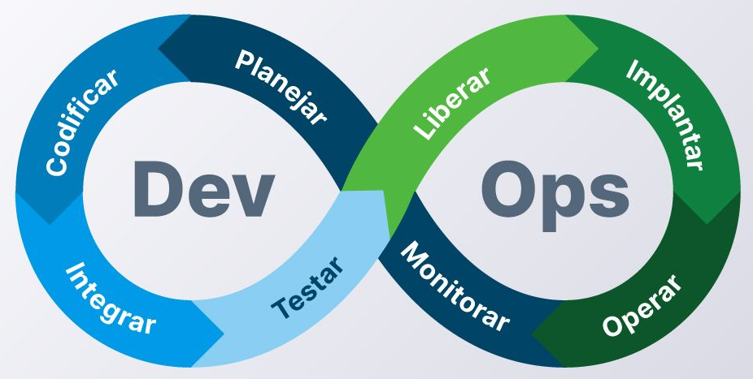
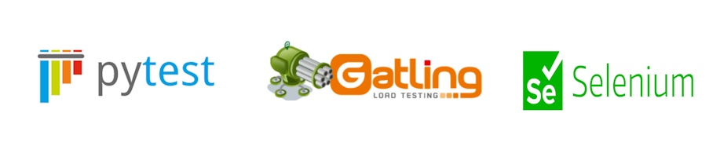
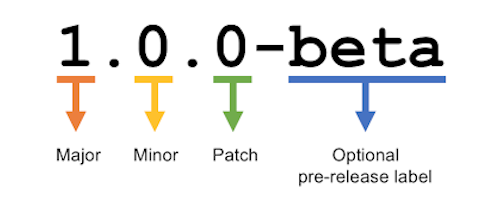

# Capítulo 1: Introdução a Computação em Nuvem

# 1.6 DevOps

Historicamente, antes do surgimento da Computação em Nuvem, a área de _Tecnologia da Informação (TI)_ era praticamente dividida em dois departamentos:

- **Departamento de Sistemas (ou Desenvolvimento)**
    - Formado pelos programadores, analistas de sistemas e arquitetos de software.

- **Departamento de Suporte (ou Operações)**
    - Formado pelos administradores de redes, sistemas operacionais, segurança e suporte técnico.

Diante dessa divisão, as equipes de TI trabalhavam de forma isolada, o que era prejudicial para os negócios. A falta de comunicação e colaboração resultava, principalmente, em atrasos na implantação de sistemas (deploy).

Um desenvolvedor de software está focado em _"codar"_ rapidamente para realizar suas entregas, seja implementando uma nova funcionalidade ou corrigindo um bug que impacta a produção.

Por sua vez, a _equipe de operações (sysadmins)_ se concentra em assegurar o funcionamento eficiente e seguro da infraestrutura de TI. Suas atividades incluem o monitoramento da infraestrutura, gerenciamento da capacidade, execução de backups, fornecimento de suporte técnico, gerenciamento de serviços de rede como servidores DNS, HTTP, e-mail, entre outros.

Quando surgia qualquer tipo de problema, seja no software ou na infraestrutura de TI, as equipes frequentemente se culpavam mutuamente, em vez de colaborarem para encontrar soluções e ainda, se concentravam em atividades reativas, como a resolução de incidentes e problemas, em vez de direcionar seus esforços para melhorias proativas e inovações.

Tanto o software quanto a infraestrutura de TI são _"entidades vivas"_ que exigem cuidados constantes. Isso inclui a correção de funcionalidades, a resolução de bugs, a mitigação de problemas de segurança, a redução de custos e o aprimoramento do desempenho. Não se trata de algo que você controí ou programa uma única vez e abandona.

Diante dessas dificuldades enfrentadas pelas equipes de TI frustrados com os atritos constantes das áreas, surge o conceito de _[DevOps](https://engsoftmoderna.info/cap10.html)_, que visa proporcionar um fluxo de trabalho mais integrado e eficiente entre as equipes de desenvolvimento e operações.

O termo DevOps combina as palavras _"Desenvolvimento"_ e _"Operações"_ e representa uma disrupção na cultura tradicional de implantação de sistemas onde o objetivo é aprimorar a comunicação e a colaboração entre _desenvolvedores (devs)_ e _profissionais de operações (sysadmins)_.

O símbolo do infinito, representado pelo oito deitado, que simboliza o DevOps, demonstra que cada etapa do fluxo de desenvolvimento, implantação, testes e monitoramento deve ser executada sequencialmente, por meio de pequenas entregas constantes, em um ciclo contínuo.

DevOps não é uma tecnologia nem sugere a criação de um novo profissional responsável _"fim a fim"_ por toda a TI. Em vez disso, ele promove a integração entre as equipes de desenvolvimento e operações, evitando a formação de silos independentes e buscando tornar a implantação de sistemas mais ágil e menos traumática.  

**_Você deve estar se perguntando: qual é a relação entre DevOps e Computação em Nuvem?_**

A resposta é simples: tudo! A Computação em Nuvem possibilitou tratar a TI como um software, permitindo a criação de recursos de TI por meio de código. Isso significa que praticamente tudo pode ser automatizado desdes a criação da infraestrutura, testes até a implantação do software.

DevOps advoga a automatização de todos os passos necessários para colocar um sistema em produção e monitorar o seu correto funcionamento. A ideia é adotar princípios ágeis não apenas na fase de desenvolvimento, mas também na fase de implantação. 

## 1.6.1 As Etapas do DevOps

As etapas do DevOps formam um ciclo contínuo. Após completar todas as fases, o processo retorna à primeira etapa, iniciando um novo ciclo de melhoria e entrega de novas funcionalidades.

É importante ressaltar que todos os membros da equipe são responsáveis pela entrega do software. Além disso, as etapas de entrega devem ser automatizadas, abrangendo desde a construção do código (build) e a execução de testes até a configuração e ativação dos servidores, a configuração da rede e o carregamento do banco de dados, etc.

A seguir, apresentamos uma breve descrição das etapas do DevOps, acompanhada de algumas das ferramentas mais utilizadas atualmente em cada fase:

### Planejar

Nesta etapa, ocorre todo o planejamento, bem como a definição dos requisitos e objetivos do projeto. Em outras palavras, é o momento em que as equipes se alinham sobre o que precisa ser feito e quem será responsável por cada tarefa.

Ferramentas de gerenciamento de projetos, como _[Jira](https://en.wikipedia.org/wiki/Integrated_development_environment)_ e _[Trello](https://trello.com/)_, são amplamente utilizadas nesta etapa.

### Codificar

A fase de _"Codificar"_ no contexto do DevOps refere-se ao processo de desenvolvimento de software, no qual os desenvolvedores escrevem o código-fonte com base nos requisitos e especificações estabelecidos durante a fase de planejamento.

Ferramentas de desenvolvimento, como _[IDEs (Ambientes de Desenvolvimento Integrados)](https://en.wikipedia.org/wiki/Integrated_development_environment)_ como _[VSCode](https://code.visualstudio.com/)_ e _[Eclipse](https://eclipseide.org/)_, são amplamente utilizadas nesta etapa.

### Build + Integrar

Aqui duas ações principais entram em cena: a _Build (ou compilação do código-fonte)_ e a _Integração_.

A ação de _Build_ tem como objetivo gerar os chamados  _[artefatos](https://en.wikipedia.org/wiki/Artifact_(software_development))_, que consistem em versões executáveis do sistema, prontas para serem implantadas (deploy) nos ambientes de desenvolvimento, homologação e produção.

A ação de Integrar está diretamente ligada à _[Integração Contínua (Continuous Integration ou CI)](https://en.wikipedia.org/wiki/Continuous_integration)_. Essa prática de desenvolvimento sugere que o código em desenvolvimento seja integrado ao código existente por meio de pequenos _[commits](https://en.wikipedia.org/wiki/Commit_(version_control))_, realizados de forma frequente e em intervalos curtos. Essa abordagem minimiza a acumulação de alterações e novas funcionalidades, evitando que se tornem difíceis de mesclar posteriormente.

Podemos destacar algumas ferramentas de build, como o _[docker build](https://docs.docker.com/get-started/docker-concepts/building-images/build-tag-and-publish-an-image/)_, que é utilizado para construir imagens de contêineres, _[Maven](https://maven.apache.org/what-is-maven.html)_ projetos Java e o _[Make](https://www.gnu.org/software/make/)_, que é comum em projetos de código aberto em C/C++.

Como ferramentas de _Integração Contínua_, podemos destacar o _[OCI DevOps](https://www.oracle.com/cloud/cloud-native/devops-service/)_, além de _[Jenkins](https://www.jenkins.io/)_ e _[Travis CI](https://www.travis-ci.com/)_.

### Testar

Além de assegurar que o sistema compila sem erros após cada novo commit, é fundamental verificar se ele mantém o comportamento esperado, ou seja, se continua funcionando corretamente.

Os responsáveis por garantir o funcionamento adequado do sistema são os _[Testes Automatizados](https://en.wikipedia.org/wiki/Test_automation)_, que são implementados nesta etapa do processo.

Ferramentas como _[PyTest](https://docs.pytest.org/en/stable/)_, _[Gattling](https://gatling.io/)_, _[Selenium](https://www.selenium.dev/)_ ou _[JUnit](https://junit.org)_, são alguns exemplos que podem ser utilizadas nessa etapa.

### Liberar (Release)

A fase de liberação, ou _[Release](https://en.wikipedia.org/wiki/Software_release_life_cycle)_, refere-se à versão do software que foi aprovada e está pronta para implantação. O objetivo dessa etapa é que, após a compilação do software e a conclusão dos testes, tenhamos uma nova versão pronta para o deploy.

A versão do software passa por diferentes estágios, incluindo _pre-alpha, alpha, beta e release candidate_, até que a _versão final_ (gold) seja liberada ao público.

Além desses estágios, existe uma prática recomendada para o versionamento de software conhecida como _"[Versionamento Semântico](https://semver.org/lang/pt-BR/)"_ que utiliza números no formato MAJOR.MINOR.PATCH:

- **Versão Maior (MAJOR)**
    - Indica que ocorreram mudanças incompatíveis com a versão anterior. Por exemplo, a versão 2.0.0 não é compatível com a versão 1.0.0.

- **Versão Menor (MINOR)**
    -  Indica que novas funcionalidades foram adicionadas ao software, mantendo a compatibilidade com versões anteriores. Por exemplo, a versão 2.1.0 é compatível com a versão 2.2.0.

- **Versão de Correção (PATCH)**
    - Indica que houveram pequenas correções no software e que também, não afeta a compatibilidade.

Rótulos adicionais podem ser utilizados para fornecer informações mais específicas sobre a versão do software. Exemplos de rótulos incluem:

- **Alpha**
    - Geralmente utilizado para indicar uma versão inicial que ainda está em  desenvolvimento e é considerada instável. Exemplo: 1.0.0-alpha

- **Beta** 
    - Indica uma versão que está mais avançada no desenvolvimento, mas que ainda pode conter bugs e requer feedback dos usuários. Exemplo: 1.0.0-beta

- **RC (release candidate)**
    - Refere-se a uma versão quase final, que está pronta para testes finais antes do lançamento oficial. Exemplo: 1.0.0-rc.1

Esses rótulos ajudam a comunicar o estado e a estabilidade da versão do software.

### Implantar (deploy)

Na etapa de _Implantação_, existem duas práticas principais: _[Deployment Contínuo (Continuous Deployment ou CD)](https://en.wikipedia.org/wiki/Continuous_deployment)_ e _[Entrega Contínua (Continuous Delivery ou CD)](https://en.wikipedia.org/wiki/Continuous_delivery)_.

A Entrega Contínua é uma prática que garante que o software esteja sempre em um estado que pode ser implantado em produção a qualquer momento. 

Por outro lado, o Deployment Contínuo avança um passo além, permitindo que cada alteração que passa nos testes automatizados seja automaticamente implantada em produção, sem a necessidade de intervenção manual.

Ambas as práticas visam minimizar o tempo entre a conclusão do desenvolvimento e a disponibilização do software para os usuários, de forma automatizada e sem intervenção manual a qualquer hora. O processo deve ser simples como apertar um botão.

Ferramentas de Deployment Contínuo como _[OCI DevOps](https://www.oracle.com/cloud/cloud-native/devops-service/)_, _[Argo CD](https://argo-cd.readthedocs.io/en/stable/)_ ou _[CircleCI](https://circleci.com/)_ são alguns exemplos que podem ser utilizadas nessa etapa.

### Operar

A etapa de Operar no contexto de DevOps refere-se à fase em que o software é colocado em produção e monitorado para garantir seu desempenho, disponibilidade e segurança.

### Monitoramento

Por fim, a etapa final, Monitoramento, envolve a coleta, análise e interpretação de dados relacionados ao desempenho do software, à infraestrutura e à experiência do usuário.

Uma monitoração eficaz inclui a utilização de métricas de desempenho, logs e traces, que são essenciais para identificar problemas, otimizar o funcionamento do sistema e garantir uma experiência satisfatória para os usuários.

Ferramentas de observabilidade, como _[Oracle Application Performance Monitoring (APM)](https://www.oracle.com/manageability/application-performance-monitoring/)_, _[Prometheus](https://prometheus.io/)_ e _[Grafana](https://grafana.com/)_, são exemplos.

