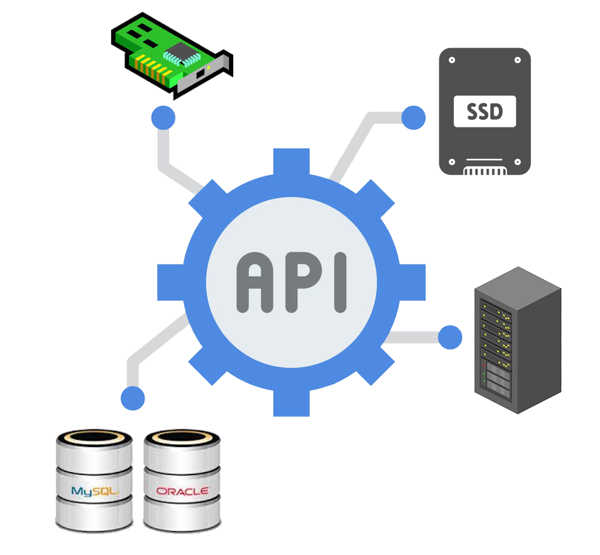
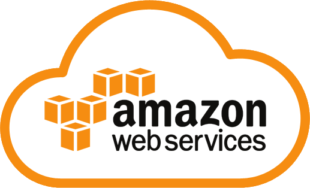
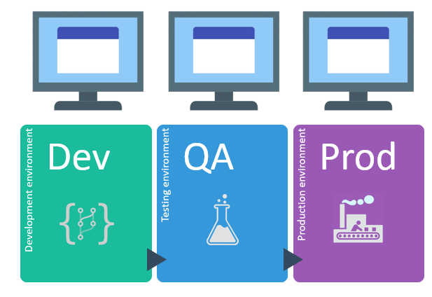

# Capítulo 1: Introdução a Computação em Nuvem

# 1.1 Um pouco de História

Explicar o que é _Computação em Nuvem_ torna-se mais claro quando se compreende os motivos que levaram à sua criação. A forma moderna da Computação em Nuvem surgiu na _[Amazon](https://en.wikipedia.org/wiki/Amazon_(company))_, quando empresa percebeu a necessidade de criar recursos de TI de maneira ágil, para atender à crescente demanda de seu e-commerce.

Essa necessidade impulsionou a empresa a buscar soluções que permitissem escalar rapidamente sua infraestrutura, resultando na inovação que conhecemos hoje como Computação em Nuvem.

!!! note "NOTA"
    Outras empresas também desempenharam papéis pioneiros e significativos no desenvolvimento e na popularização da computação em nuvem. O texto destaca a Amazon, pois ela foi uma das primeiras plataformas a oferecer serviços de Computação em Nuvem de maneira abrangente e acessível.

A Amazon foi fundada por _[Jeff Bezos](https://en.wikipedia.org/wiki/Jeff_Bezos)_ em 1994, começando sua trajetória como uma _livraria online_. Bezos teve a ideia de colocar a venda na Internet, uma quantidade enorme de livros num volume comparável, na sua cabeça, à quantidade de água do rio Amazonas.

Para Jeff Bezos, que na época tinha 31 anos, vender livros online era uma oportunidade promissora, pois poderia ser feito por meio de uma _loja virtual_ praticamente sem a necessidade de manter estoque. A estratégia consistia em encomendar aos distribuidores apenas as unidades efetivamente compradas pelos clientes. Além disso, Bezos acreditava que os livros eram produtos fáceis de vender e transportar, e que poderiam ser adquiridos por impulso, o que tornava o modelo de negócios ainda mais atraente.

Com o passar do tempo, a empresa começou a enfrentar desafios significativos relacionados à sua infraestrutura de TI. Com o rápido aumento no número de clientes e pedidos, tornou-se cada vez mais difícil melhorar o desempenho do seu site e a eficiência de suas operações.

O aumento da demanda na livraria online, especialmente durante períodos de pico como as festas de fim de ano, frequentemente resultava em lentidão e falhas no sistema, resultando em perdas significativas de vendas.

Além da Amazon, por volta do ano 2000, diversas startups de diferentes setores estavam rapidamente surgindo, crescendo e se proliferando. No entanto, nenhum data center da época estava preparado para atender a essa demanda crescente.

De fato, o mundo de infraestrutura de TI não estava preparado para acompanhar esse crescimento acelerado. Os recursos de TI precisavam ser criados e disponibilizados para uso de forma rápida, com custos acessíveis e sem a burocracia imposta pelos processos _[ITIL](https://en.wikipedia.org/wiki/ITIL)_ da época.

Na Amazon e no ecossistema de startups da época, cada novo projeto demandava muito tempo apenas para configurar a infraestrutura, a rede, as máquinas e os bancos de dados. Sempre que era necessário utilizar esse conjunto de recursos para um novo projeto, era preciso reconstruir e reconfigurar tudo do zero.

Startups são frequentemente fundadas em cenários de incerteza, representando negócios que podem ter sucesso ou fracassar. Elas lançam softwares e crescem rapidamente, testando suas ideias no mercado na esperança de obter lucro. Agora, imagine se esse tipo de empresa tivesse que adquirir todo o hardware de TI antecipadamente, apenas para descobrir posteriormente que o negócio não deu certo. 

Pare e reflita por um momento, considerando apenas a infraestrutura: **_"Qual é o custo para uma empresa adquirir e manter o hardware, além de contar com um profissional responsável por criar, configurar e gerenciar a infraestrutura de TI durante toda a vida útil de sua aplicação?"_**

Para enfrentar esses desafios, a Amazon investiu em servidores, data centers e tecnologias de software para aprimorar a escalabilidade e a confiabilidade de suas operações. A empresa começou a desenvolver soluções internas que permitiam a criação de toda a infraestrutura por meio de _[APIs REST](https://en.wikipedia.org/wiki/REST)_, possibilitando que seus desenvolvedores provisionassem e gerenciassem recursos de forma programática.

Isso foi um marco na época, pois significava que qualquer usuário poderia criar, modificar e excluir recursos de TI, como servidores, armazenamento e bancos de dados, por meio de chamadas de API, em vez de depender de processos manuais.

Com base nessa experiência adquirida, a Amazon identificou a oportunidade de criar e oferecer um serviço que automatizasse e gerenciasse todos os recursos de TI, eliminando a necessidade de reconstruir tudo do zero repetidamente. Isso possibilitou que empresas de todos os tamanhos criassem e acessassem recursos de computação de forma escalável e econômica. Assim, as empresas passaram a se preocupar menos com a compra de hardware e mais com a contratação de serviços.

Foi nesse contexto que, em 2006, a Amazon lançou a _[AWS (Amazon Web Services)](https://en.wikipedia.org/wiki/Amazon_Web_Services)_ ao público, oferecendo serviços que permitiam a criação de infraestrutura por meio da web.

As tecnologias introduzidas pela _AWS_ tornaram possível algo que antes era extremamente desafiador: **_destruir e recriar máquinas em questão de segundos_**. 

Esse modelo permitiu que desenvolvedores, mesmo sem experiência em criação de infraestrutura, provisionassem máquinas rapidamente e disponibilizassem suas aplicações para o mundo. Assim, surgiu a _Infraestrutura como Serviço (IaaS - Infrastructure as a Service)_, que passou a tratar a infraestrutura de TI como software.

Além de oferecer _Infraestrutura como Serviço (IaaS)_, a AWS trouxe um diferencial significativo em relação aos _[VPS (Servidores Virtuais Privados)](https://en.wikipedia.org/wiki/Virtual_private_server)_ da época: a implementação de um modelo inovador de **_cobrança e controle_**. 

Em vez de pagar uma mensalidade fixa, os usuários passaram a adotar um sistema de pagamento baseado em **_horas de uso_**, que ficou conhecido depois como _[Pay-As-You-Go (PAGY)](https://www.oracle.com/industries/payg-services-price-list/)_.

")

Pagar apenas pelas horas de uso trouxe uma flexibilidade significativa. Se você precisasse de uma máquina maior por um determinado período, bastava fazer a alteração e, em seguida, retornar para uma máquina menor, pagando apenas pelas horas utilizadas de acordo com o tamanho da máquina. 

Ficou fácil criar e recriar ambientes de teste separados dos ambientes de produção, permitindo que uma máquina fosse mantida ligada apenas durante o horário de expediente e desligada, se necessário, nos finais de semana. Essa abordagem não apenas proporcionou agilidade, mas também resultou em uma redução significativa nos custos associados à infraestrutura de TI.

Por fim, esse novo modelo de provisionamento de infraestrutura foi aprimorado e replicado em várias regiões geográficas ao redor do mundo, em diferentes data centers. Isso possibilitou que grandes empresas escalassem rapidamente suas operações e oferecessem serviços mais próximos de seus usuários finais.

Assim, surgiu o que passou a ser conhecido como _Computação em Nuvem_, uma inovação que beneficiaria o mundo.

Em 2010, a Computação em Nuvem se expandiu rapidamente, com a introdução de novos modelos de serviço, como _Plataforma como Serviço (Platform as a Service - PaaS)_ e _Software como Serviço (Sofware as a Service - SaaS)_. Outras empresas, como Oracle, Google, Microsoft e IBM, também ingressaram no mercado, oferecendo suas próprias soluções em nuvem.

Hoje, a Computação em Nuvem é uma parte fundamental da infraestrutura de TI, permitindo que empresas de todos os tamanhos acessem recursos computacionais de forma rápida, escalável e flexível, pagamento somente pelo uso que é feito.