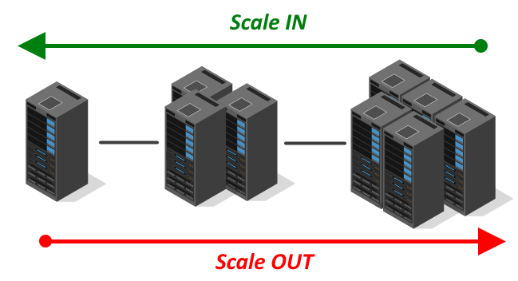
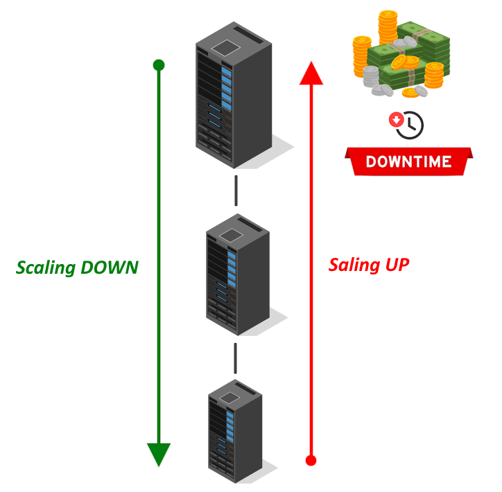

# Capítulo 1: Introdução a Computação em Nuvem

# 1.4 Terminologias da Computação em Nuvem

A seguir, são apresentados alguns termos comuns relacionados aos benefícios e funcionalidades da Computação em Nuvem:

## 1.4.1 Alta disponibilidade (High Availability - HA)

Ambientes computacionais configurados para estarem sempre disponíveis (24 horas por dia, 7 dias por semana, 365 dias por ano). Esses ambientes contam com hardware redundante e uma arquitetura de software projetada para alta disponibilidade, eliminando pontos únicos de falha. Em caso de qualquer falha, componentes de backup são acionados de forma transparente, garantindo que não haja impacto para o usuário final.

## 1.4.2 Tolerante a falhas (Fault Tolerance)

Descreve como um provedor de Computação em Nuvem assegura um nível mínimo de indisponibilidade para os serviços oferecidos aos seus consumidores.

!!! note "NOTA"
    Consulte [Objetivos de Nível de Serviço para Serviços de Nuvem Pública Oracle PaaS e IaaS](https://docs.oracle.com/pt-br/iaas/Content/General/Reference/servicelevelobjectives.htm) para obter mais informações sobre os tempos de SLA dos serviços disponíveis no OCI.

## 1.4.3 Escalabilidade (Scalability)

Representa a capacidade de um recurso de TI de se adaptar a variações na demanda de uso, seja ela crescente ou decrescente.

Existem diferentes tipos de escalabilidade dos serviços, que incluem:

### Scaling Out/In

Conhecida como _escalabilidade horizontal_, essa abordagem envolve a alocação ou liberação de recursos de TI do mesmo tipo.

A escalabilidade horizontal consiste em adicionar mais servidores iguais lateralmente, com o objetivo de aumentar a capacidade geral de processamento ao distribuir a carga de trabalho.

### Scaling Up/Down

Conhecida como _escalabilidade vertical_, essa abordagem é menos comum, pois, além de ser mais cara, frequentemente resulta na indisponibilidade dos recursos envolvidos durante o processo.

É importante lembrar que o hardware possui limites quanto à quantidade máxima de memória que pode ser disponibilizada e ao aumento da capacidade de processamento, entre outros fatores.

## 1.4.4 Elasticidade (Elasticity)

Capacidade de adicionar ou remover recursos com o mínimo de atrito e sem causar indisponibilidade. Por exemplo, adicionar mais espaço em disco a um servidor que está em funcionamento.