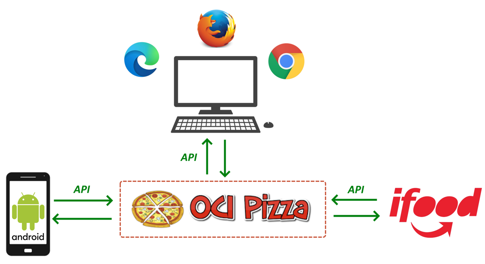
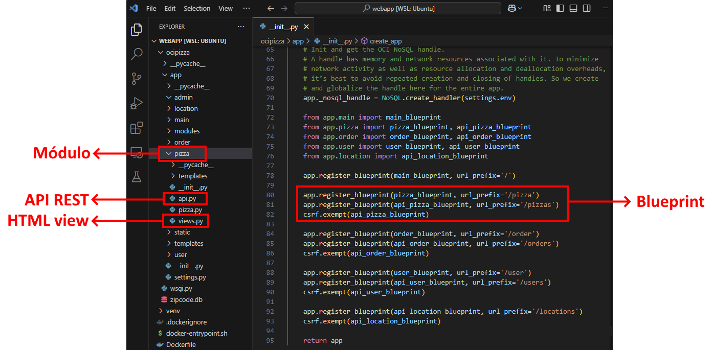

---
hide:
  - toc
---

# Capítulo 2: Aplicação OCI PIZZA

# 2.4 APIs RESTful

## 2.4.1 O que é uma API?

A _[API (Application Programming Interface)](https://pt.wikipedia.org/wiki/Interface_de_programa%C3%A7%C3%A3o_de_aplica%C3%A7%C3%B5es)_, ou _[Interface de Programação de Aplicativos](https://pt.wikipedia.org/wiki/Interface_de_programa%C3%A7%C3%A3o_de_aplica%C3%A7%C3%B5es)_, é um _conjunto de regras_ e _protocolos_ que possibilita a comunicação e a troca de dados entre diferentes aplicações, mesmo quando desenvolvidas usando diferentes tecnologias. 

!!! note "NOTA"
    Nem toda API é uma API web, e existem diversas variações que utilizam diferentes protocolos e tecnologias, como _[SOAP (Simple Object Access Protocol)](https://pt.wikipedia.org/wiki/SOAP)_, APIs que realizam chamadas de procedimento remoto _(RPC - Remote Procedure Calls)_, entre outras. Nesta seção, o foco será explicar as APIs web que utilizam o protocolo _[HTTP](https://en.wikipedia.org/wiki/HTTP)_ e que seguem os princípios do _REST_.

Duas palavras-chave que ajudam a definir o papel das APIs são:

- **Conjunto de Regras**
    - Está relacionado ao _contrato de comunicação_ da API, ou sua _interface_, que  define basicamente detalhes como os endpoints utilizados na comunicação, o formato das requisições e respostas, os tipos de dados e as informações sobre autenticação. Esse contrato é indispensável para os desenvolvedores, pois fornece uma especificação clara que facilita a compreensão de como a API deve ser utilizada.

- **Protocolo**
    - Os computadores utilizam protocolos para se comunicar. Um protocolo é um conjunto de regras que deve ser seguido para que a troca de informações ocorra. No caso da aplicação **OCI PIZZA**, as funcionalidades disponíveis por meio das APIs utilizam o protocolo _[HTTP](https://en.wikipedia.org/wiki/HTTP)_. 

APIs são utilizadas para expor uma ou mais funcionalidades de uma aplicação, permitindo que essas funcionalidades sejam acessadas por outras aplicações por meio de uma interface simples, ao mesmo tempo em que ocultam os detalhes complexos da implementação.

Uma outra forma de entender o que é uma API é considerar que nós, humanos, dependemos de interfaces gráficas para interagir e trocar dados com as aplicações que usamos, enquanto as próprias aplicações utilizam APIs para facilitar a troca de informações entre si.

Atualmente, muitas aplicações web são desenvolvidas usando o conceito _API First_, o que permite a separação entre as camadas de frontend e backend. Isso significa que é possível, por exemplo, criar uma interface gráfica utilizando _HTML_, _CSS_ e _JavaScript_, e uma aplicação móvel nativa para _[Android](https://pt.wikipedia.org/wiki/Android)_ desenvolvida em _[Java](https://www.java.com/en/)_ ou _[Kotlin](https://kotlinlang.org/)_, onde ambas utilizam o mesmo conjunto de APIs do backend.

Por fim, as APIs facilitam a integração entre diferentes sistemas e, no caso da aplicação **OCI PIZZA**, uma plataforma como o _[iFood](https://www.ifood.com.br/)_ pode utilizar suas APIs para permitir que os usuários façam pedidos diretamente pelo aplicativo do _[iFood](https://www.ifood.com.br/)_, sem a necessidade de acessar a interface web da aplicação **OCI PIZZA**.



## 2.4.2 Recursos e Representações 

Recursos são os elementos fundamentais dos sistemas web, a ponto de as aplicações web serem frequentemente classificadas como _"aplicações orientadas a recursos"[^1]_. Um recurso pode ser qualquer item disponibilizado por um servidor web, como um documento HTML, um documento PDF, um vídeo, um processo de negócio, um dispositivo, entre outros.

Um recurso pode ser entendido como sendo a representação de um elemento do mundo real dentro de um contexto computacional. Exemplos de recursos da aplicação **OCI PIZZA** incluem: `Pizza`, `Pessoa` ou `Pedido`.

Recursos que são disponibilizados por um servidor web possuem uma ou mais formas de _representações_. O recurso `Pizza` dentro do contexto da aplicação **OCI PIZZA**, é representado da seguinte forma:

```bash linenums="1" 
$ curl https://api.ocipizza.com.br/pizzas/5
{
  "data": {
    "description": "presunto coberto com mussarela, milho, ervilha, palmito, ovo e cebola.",
    "id": 5,
    "image": "https://objectstorage.sa-saopaulo-1.oraclecloud.com/n/we1rxz34/b/pizza-img/o/pizza-portuguesa.jpg",
    "name": "portuguesa",
    "price": "54.99"
  },
  "message": "null",
  "status": "success"
}
```

`Pizza` é, na verdade, um objeto que possui algumas propriedades que o descrevem. No exemplo acima, uma `Pizza` é representada através de um documento do tipo _[JSON](https://pt.wikipedia.org/wiki/JSON)_. No entanto, nada impede que esse objeto seja representado também em formatos como _[XML](https://pt.wikipedia.org/wiki/XML)_ ou _[HTML](https://pt.wikipedia.org/wiki/HTML)_, por exemplo. A escolha do formato dependerá de como você decide implementar as representações dos seus recursos.

Os recursos representados pela aplicação **OCI PIZZA** seguem a especificação _[JSend](https://github.com/omniti-labs/jsend)_, que estabelece diretrizes sobre como as respostas _[JSON](https://pt.wikipedia.org/wiki/JSON)_ devem ser formatadas. O _[JSend](https://github.com/omniti-labs/jsend)_ é fácil de implementar e proporciona um formato que considero elegante e de fácil interpretação para as aplicações consumidoras.

Toda resposta de uma aplicação que segue a especificação _[JSend](https://github.com/omniti-labs/jsend)_ inclui os seguintes campos:

- **data**
    - Campo que contém os dados da resposta à solicitação. Este campo pode incluir uma lista de objetos, um único objeto ou o valor `null`, que indica a ausência de dados.

- **status**
    - `success`: indica que a solicitação foi processada com êxito.
    - `fail`: indica uma falha no processamento da solicitação, geralmente relacionada a dados inválidos fornecidos pelo cliente.
    - `error`: indica uma exceção que impede o servidor de processar a solicitação.

- **message**
    - Mensagem descritiva que indica o motivo da falha, seja ela do tipo `fail` ou `error`. No caso de `success`, o campo `status` geralmente é `null`, indicando a ausência de uma mensagem.

Por exemplo, ao tentar recuperar um _[CEP](https://pt.wikipedia.org/wiki/C%C3%B3digo_de_Endere%C3%A7amento_Postal)_ inválido da aplicação **OCI PIZZA**, obtemos o seguinte erro:

```bash linenums="1"
$ curl http://api.ocipizza.com.br/locations/zipcodes/0395381
{
  "data": "null",
  "message": "Cannot find state and city from zipcode.",
  "status": "fail"
}
```

!!! note "NOTA"
    Consulte o link _[JSend](https://github.com/omniti-labs/jsend)_ para mais informações sobre essa especificação.

[^1]: [Robinson, Ian; Webber, Jim; Parastatidis, Savas, *REST in Practice*, Chapter 1. The Web As a Platform for Building Distributed Systems. O'Reilly Media](https://amzn.to/43DR3SM)

## 2.4.3 REST

Agora que entendemos o que é uma API, bem como os conceitos sobre _recursos_ e _representações_, podemos avançar para compreender o que é _[REST](https://pt.wikipedia.org/wiki/REST)_.

Definido por _[Roy Thomas Fielding](https://en.wikipedia.org/wiki/Roy_Fielding)_ em sua _[tese de Ph.D.](https://ics.uci.edu/~fielding/pubs/dissertation/top.htm)_, _[REST](https://pt.wikipedia.org/wiki/REST)_, que significa _[REpresentational State Transfer (Transferência de Estado Representacional)](https://pt.wikipedia.org/wiki/REST)_, não é uma tecnologia e não é um protocolo, mas sim um _estilo arquitetural_ que orienta o design de APIs para serviços _web modernos (web services)_. Uma API que segue as especificações desse estilo arquitetural é chamada de _[REST API](https://pt.wikipedia.org/wiki/REST)_. 

!!! note "NOTA"
    Um _web service_ é considerado _RESTful_ quando todas as suas APIs estão em conformidade com os princípios e restrições _[REST](https://pt.wikipedia.org/wiki/REST)_.

O significado de cada palavra do acrônimo _[REST](https://pt.wikipedia.org/wiki/REST)_ é detalhado a seguir:

- **Transferência**
    - Refere-se ao processo de enviar e receber as representações dos recursos através da rede. Essa transferência ocorre por meio de chamadas que utilizam o protocolo HTTP.

- **Estado**
    - Refere-se a condição atual do recurso naquele instante de tempo. Quando um cliente interage com um recurso, ele pode, desde que tenha a devida autorização, modificar seu estado (por exemplo, atualizar o valor da `Pizza`).

- **Representacional**
    - Refere-se à forma como um recurso é apresentado ou representado para o mundo externo. Por exemplo, o recurso `Pizza` pode ser representado por meio de um documento JSON.

_[REST](https://pt.wikipedia.org/wiki/REST)_ define _seis características arquiteturais_ que devem ser seguidas na construção de APIs. Essas características são essenciais para que uma API seja considerada _"verdadeiramente RESTful"_. Sistemas que incorporam todos esses princípios são classificados como _RESTful_, exceto pela sexta característica, que é opcional. 

As seis características são:

- **1. Client-Server (cliente-servidor)**
    - Servidores e clientes podem ser desenvolvidos ou substituídos de forma independente, sem qualquer dependência entre si. Isso significa que tanto o cliente quanto o servidor têm suas próprias responsabilidades. Por exemplo, o servidor pode "comunicar-se" com o cliente sem se preocupar com a experiência do usuário. O cliente, por sua vez, precisa conhecer apenas as _[URIs](https://pt.wikipedia.org/wiki/URI)_ dos recursos disponibilizados pelo servidor.

- **2. Stateless (sem estado)**
    - O HTTP é um protocolo que funciona com um modelo de requisição e resposta. Isso significa que o cliente envia uma requisição e o servidor responde com base nessa solicitação. O REST estabelece que o ciclo de requisição/resposta deve ser autônomo, ou seja, uma resposta não deve depender de informações previamente armazenadas pelo cliente. Em outras palavras, cada requisição deve ser tratada como uma nova solicitação, sem histórico, e o servidor não precisa e nem deve reter nenhuma informação do cliente para concluir o ciclo de requisição/resposta.

- **3. Cacheable (cache)**
    - Em REST, o cache deve ser aplicado apenas aos recursos que explicitamente indicam que podem ser armazenados em cache. Por exemplo, respostas que contenham instruções no cabeçalho HTTP como `Cache-Control: public, max-age=86400`, indicam que essas respostas podem ser armazenadas em cache pelo cliente.  Usar cache melhora o desempenho, pois os dados armazenados em cache podem ser acessados mais rapidamente do que ao consultar um servidor remoto.
    
- **4. Uniform interface (interface uniforme)**
    - Pode ser considerado um dos aspectos mais importantes, pois estabelece o _contrato_ entre cliente e servidor. O termo _"contrato"_ refere-se à interface da API que você cria para seus recursos, bem como à forma padronizada que os dados devem assumir. Todos os recursos expostos devem ser manipuláveis e acessíveis exclusivamente por meio dos métodos conhecidos do protocolo _HTTP (GET, POST, PUT, etc.)_. Além disso, é fundamental que os recursos expostos sigam algumas boas práticas relacionadas à nomenclatura, formatos de URL e formatos de dados, como HTML, XML e/ou JSON.

- **5. Layered system (sistema em camadas)**
    - O REST possibilita a implementação de uma arquitetura em camadas, onde as APIs podem ser hospedadas em um _servidor A_, os dados armazenados em um _servidor B_ e a autenticação das solicitações realizada por um _servidor C_, por exemplo. Geralmente, o cliente não consegue identificar se está se comunicando diretamente com o servidor final ou se está passando por um intermediário durante o processo.

- **6. Code on demand (código sob demanda)**
    - Essa é uma restrição opcional que permite ao servidor enviar trechos de código para o cliente executar. Essa ideia se torna mais clara quando consideramos o funcionamento dos _[Applets Java](https://en.wikipedia.org/wiki/Java_applet)_, onde um código ou uma pequena aplicação desenvolvida em Java, chamada de _[Applet](https://en.wikipedia.org/wiki/Java_applet)_, é transmitida do servidor para o cliente executar. 

## 2.4.4 APIs da aplicação OCI PIZZA

Toda a lógica da aplicação foi organizada em diferentes módulos, cada um responsável por uma funcionalidade específica. Por exemplo, o módulo `pizza` não apenas exibe o cardápio de pizzas, mas também permite a manipulação de suas informações.

!!! note "NOTA"
    Um módulo é um diretório que contém arquivos _[Python](https://www.python.org/)_. Dividir uma aplicação em módulos é uma prática recomendada que melhora a organização, a manutenção e a escalabilidade do código.

Os módulos da aplicação **OCI PIZZA** são organizados por meio de _[Blueprints](https://flask.palletsprojects.com/en/stable/blueprints/)_. Um _[Blueprints](https://flask.palletsprojects.com/en/stable/blueprints/)_, em _[Flask](https://flask.palletsprojects.com/en/stable/)_, é uma maneira de organizar uma aplicação em componentes menores como se fossem mini-aplicações.

!!! note "NOTA"
    Consulte _["Modular Applications with Blueprints"](https://flask.palletsprojects.com/en/stable/blueprints/)_ para obter mais informações sobre _[Blueprints](https://flask.palletsprojects.com/en/stable/blueprints/)_ em _[Flask](https://flask.palletsprojects.com/en/stable/)_.

Na aplicação **OCI PIZZA**, cada módulo é organizado em duas partes principais:

- **HTML Views**
    - Contém o código que é responsável por gerar o conteúdo HTML para os usuários. Toda a lógica das _HTML Views_ está centralizada no arquivo `views.py` de cada módulo.
    
- **API REST**
    - Contém o código que expõe as _APIs REST_ do módulo. A lógica relacionada às _APIs REST_ estão contidas no arquivo `api.py` de cada módulo.
    


### **APIs REST**

REST especifica algumas boas práticas utilizando os mecanismos do HTTP para construção de APIs, como por exemplo, CRUD APIs que especificam como os clientes podem realizar operações de criação, leitura, atualização e exclusão utilizando os verbos HTTP:

| CRUD        | Verbo HTTP | Descrição                                  |
|-------------|------------|--------------------------------------------|
| C (Create)  | POST       | Cria um novo recurso.                      |
| R (Read)    | GET        | Recupera os dados de um recurso existente. |
| U (Update)  | PUT,PATCH  | Atualiza os dados de um recurso existente. |
| D (Delete)  | DELETE     | Remove um recurso.                         |

!!! note "NOTA"
    Há uma diferença entre PUT e PATCH onde o verbo PUT é utilizado para substituír o recurso por completo com novos valores. Já o verbo PATCH é usado para atualizar propriedades individuais de um recurso.

**Pizza**

| Método | Endpoint               | Descrição                                 | Protegido   |
|--------|------------------------|-------------------------------------------|-------------|
| GET    | /pizzas            | Lista todas as pizzas                     | Não         |
| GET    | /pizzas/{pizza_id} | Obtém os detalhes de uma pizza específica | Não         |
| POST   | /pizzas            | Adiciona uma nova pizza                   | Sim (Admin) |
| PUT    | /pizzas/{pizza_id} | Atualiza informações de uma pizza         | Sim (Admin) |
| DELETE | /pizzas/{pizza_id} | Remove uma pizza                          | Sim (Admin) |

**Order**

| Método | Endpoint                               | Descrição                                                        | Protegido   |
|--------|----------------------------------------|------------------------------------------------------------------|-------------|
| GET    | /orders                            | Lista todos os pedidos                                           | Sim (Admin) |
| GET    | /orders/users/{user_id}            | Lista todos os pedidos associado a um usuário específico         | Sim         |
| GET    | /orders/{order_id}/users/{user_id} | Obtém os detalhes de um pedido associado a um usuário específico | Sim         |
| GET    | /orders/{order_id}                 | Obtém os detalhes de um pedido específico                        | Sim         |
| POST   | /orders/users/{user_id}            | Criar um novo pedido associado a um usuário específico           | Sim         |
| PUT    | /orders/users/{user_id}            | Atualiza as informações de um pedido de um usuário específico    | Sim         |
| DELETE | /orders/{order_id}                 | Remove um pedido                                                 | Sim (Admin) |

**User**

| Método | Endpoint                               | Descrição                                        | Protegido   |
|--------|----------------------------------------|--------------------------------------------------|-------------|
| GET    | /users                             | Lista todos os usuários                          | Sim (Admin) |
| GET    | /users/{user_id}                   | Obtém os detalhes de um usuário específico       | Sim         |
| POST   | /users                             | Criar um novo usuário                            | Não         |
| PUT    | /users/{user_id}                   | Atualiza as informações de um usuário específico | Sim         |
| DELETE | /users/{user_id}                   | Remove um usuário                                | Sim (Admin) |
| POST   | /users/login  | Autentica um usuário e faz login        | Não       |
| POST   | /users/logout | Faz logout do usuário autenticado       | Não       |

**Location**

| Método | Endpoint                     | Descrição                                          | Protegido   | 
|--------|------------------------------|----------------------------------------------------|-------------|
| GET    | /api/locations               | Lista todos os Estados e Cidades                   | Sim (Admin) |
| GET    | /api/locations/{zipcode}     | Obtém o Estado e a Cidade através do código postal | Sim         |
| POST   | /api/locations               | Cria um Estado e Cidade                            | Sim (Admin) |
| PUT    | /api/locations/{location_id} | Atualiza as informações de um Estado e Cidade      | Sim (Admin) |
| DELETE | /api/locations/{location_id} | Remove um Estado e Cidade                          | Sim (Admin) |