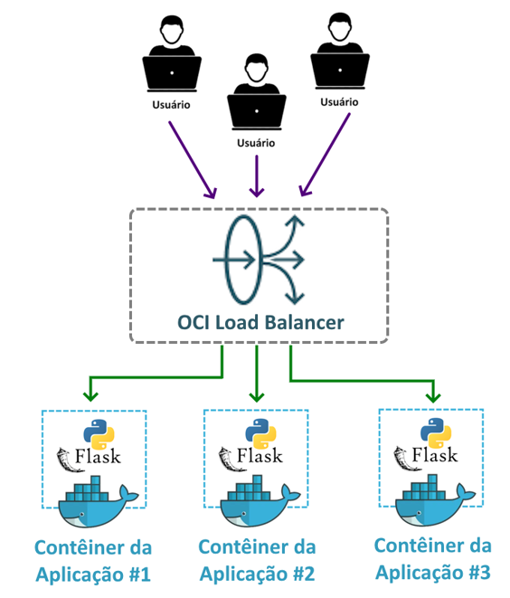

---
hide:
  - toc
---

# Capítulo 2: Aplicação OCI PIZZA

# 2.3 Arquitetura da Aplicação OCI PIZZA

## 2.3.1 Overengineering

Decidi abordar o tema do <a href="https://en.wikipedia.org/wiki/Overengineering" target="_blank">Overengineering</a> logo no início desta seção, pois é importante esclarecer que parte do que será apresentado ao longo do livro é, de fato, um exemplo de <a href="https://en.wikipedia.org/wiki/Overengineering" target="_blank">Overengineering</a>.

<a href="https://en.wikipedia.org/wiki/Overengineering" target="_blank">Overengineering</a> é um termo utilizado para descrever a prática de criar um produto ou sistema com mais complexidade ou recursos do que o necessário, muitas vezes resultando em desperdício de tempo e dinheiro. 

Ao longo dos capítulos deste livro, o <a href="https://en.wikipedia.org/wiki/Overengineering" target="_blank">Overengineering</a> se tornará mais evidente, especialmente ao abordarmos a transição da <a href="https://pt.wikipedia.org/wiki/Aplica%C3%A7%C3%A3o_monol%C3%ADtica" target="_blank">Arquitetura Monolítica</a> para uma <a href="https://pt.wikipedia.org/wiki/Microsservi%C3%A7o" target="_blank">Arquitetura de Microsserviços</a>. Em uma aplicação real e simples como a **OCI PIZZA**, uma <a href="https://pt.wikipedia.org/wiki/Aplica%C3%A7%C3%A3o_monol%C3%ADtica" target="_blank">Arquitetura Monolítica</a> é, de fato, a melhor escolha.

Por fim, é importante lembrar que o objetivo deste livro é explorar as práticas e os conceitos relacionados ao termo <a href="https://ocn.dev.br/capitulo-1/cloud-native/">Cloud Native</a>, utilizando uma aplicação real como exemplo, além de demonstrar como utilizar os serviços em nuvem oferecidos pelo <a href="https://ocn.dev.br/capitulo-3/">OCI</a>. Assim, em determinados momentos, abordaremos soluções mais complexas e que não são necessárias para o problema que a aplicação **OCI PIZZA** busca resolver, mas que ajudam a ilustrar algumas práticas na implementação de aplicações <a href="https://ocn.dev.br/capitulo-1/cloud-native/">Cloud Native</a> no <a href="https://ocn.dev.br/capitulo-3/">OCI</a>.

A dica que fica é: para uma aplicação do mundo real, é importante mantê-la o mais simples possível.

<h3 style="text-align: center; font-style: italic;">
Keep It Simple, Stupid (KISS)
</h3>

## 2.3.2 Código-Fonte da Aplicação OCI PIZZA

Nesta seção, serão apresentados detalhes sobre o código-fonte da aplicação **OCI PIZZA**, sua estrutura, a arquitetura utilizada no <a href="https://ocn.dev.br/capitulo-3/">OCI</a> e informações sobre desenvolvimento de software com a linguagem de programação <a href="https://www.python.org/" target="_blank">Python</a>, utilizando o microframework <a href="https://flask.palletsprojects.com/en/stable/" target="_blank">Flask</a>.  

### **Antes do Desenvolvimento**

Após a definição dos requisitos, chega o momento de escolher a linguagem de programação, o framework e, o mais importante, definir de forma macro a arquitetura que será adotada inicialmente pela aplicação web para resolver o problema proposto.

Neste estágio, em que o foco é iniciar o desenvolvimento, diversas dúvidas podem surgir, como:

- Qual é a melhor linguagem de programação? 
- Qual é o melhor framework? 
- Qual é a arquitetura ideal para esta aplicação?

Essas questões são comuns no contexto do desenvolvimento de software, e a melhor resposta para elas é:

- Escolha a linguagem de programação e o framework que você mais conhece.
- Defina sua arquitetura de modo que ela resolva o seu problema da forma mais simples possível.

Para o desenvolvimento da aplicação **OCI PIZZA**, optou-se pela linguagem de programação <a href="https://www.python.org/" target="_blank">Python</a> e pelo microframework <a href="https://flask.palletsprojects.com/en/stable/" target="_blank">Flask</a> para a construção de aplicações web.

### **Download do Código-Fonte**

Todo o código-fonte dos exemplos apresentados neste livro, que incluem a aplicação **OCI PIZZA**, estão disponíveis em um único repositório no <a href="https://pt.wikipedia.org/wiki/GitHub" target="_blank">GitHub</a> chamado <a href="https://github.com/daniel-armbrust/ocn-ocipizza" target="_blank"><b><i>"ocn-ocipizza"</i></b></a>.

Para baixar o código-fonte ou _"clonar o repositório"_, conforme a terminologia do <a href="https://git-scm.com/" target="_blank">Git</a>, em sua máquina local, utilize o seguinte comando:

```bash linenums="1"
$ git clone https://github.com/daniel-armbrust/ocn-ocipizza
```

!!! note "NOTA"
    Visite a página <a href="https://git-scm.com/downloads" target="_blank"><i>https://git-scm.com/downloads</i></a> para informações detalhadas sobre instalação e dowload do <a href="https://git-scm.com/downloads" target="_blank">Git</a>.

Após a execução do comando, será criado um diretório local chamado <a href="https://github.com/daniel-armbrust/ocn-ocipizza" target="_blank"><b><i>"ocn-ocipizza"</i></b></a>, com a seguinte estrutura:

```bash linenums="1"
$ tree -A -L 2 -d ocn-ocipizza/
ocn-ocipizza/
├── apendice-a
│   └── roteamento-avancado
├── bucket
│   └── img
├── functions
│   ├── fn-password-recovery-email
│   └── fn-user-register-email
├── ia
│   └── chatbot-ocilang
├── nosql
│   ├── data
│   └── ddl
├── scripts
│   └── capitulo-2
├── smtp
└── webapp
    └── ocipizza
```

- **apendice-a**
    - Diretório que inclui diversos HOWTOs sobre temas variados do <a href="https://ocn.dev.br/capitulo-3/">OCI</a>. Esses HOWTOs são documentos que tratam de assuntos específicos e oferecem instruções sobre como realizar tarefas específicas.

- **functions**
    - Código-fonte das funções auxiliares utilizadas pela aplicação web **OCI PIZZA**. Essas funções são implantadas e executadas a partir do serviço <a href="https://docs.oracle.com/pt-br/iaas/Content/Functions/home.htm" target="_blank">OCI Functions</a>. 

- **scripts**
    - Diretório que contém os scripts [OCI CLI](../capitulo-3/gerenciando-o-oci-atraves-do-oci-cli.md) de cada capítulo, utilizados para criar recursos no <a href="https://ocn.dev.br/capitulo-3/">OCI</a>. 

- **webapp**
    - Diretório que contém o código-fonte da aplicação web **OCI PIZZA**.

## 2.3.3 Introdução ao Microframework Flask

A aplicação é uma aplicação web desenvolvida em _[Python](https://www.python.org/)_ utilizando o microframework _[Flask](https://flask.palletsprojects.com/en/stable/)_. O _[Flask](https://flask.palletsprojects.com/en/stable/)_ é considerado "micro" porque sua instalação padrão inclui apenas os componentes essenciais necessários para a criação de aplicações web.

Após a definição dos requisitos da aplicação web **OCI PIZZA**, o próximo passo é o desenvolvimento, seguido pela modelagem e design da arquitetura da aplicação.

A arquitetura da aplicação **OCI PIZZA**, assim como também qualquer outra arquitetura, pode ser dividida em:

```bash linenums="1"
$ tree -A -d ocn-ocipizza/webapp/
ocn-ocipizza/webapp/
└── ocipizza
    └── app
        ├── location
        ├── main
        │   └── templates
        ├── modules
        ├── order
        │   └── templates
        ├── pizza
        │   └── templates
        ├── static
        │   ├── css
        │   ├── img
        │   └── js
        ├── templates
        └── user
            └── templates

17 directories
```

### **Arquitetura da Aplicação**

Também conhecido como _Arquitetura Lógica_, refere-se à estrutura e organização dos componentes de software, definindo como eles interagem e se comunicam para atender aos requisitos funcionais e não funcionais da aplicação.

A aplicação é uma aplicação web desenvolvida em _[Python](https://www.python.org/)_ utilizando o microframework _[Flask](https://flask.palletsprojects.com/en/stable/)_. O _[Flask](https://flask.palletsprojects.com/en/stable/)_ é considerado "micro" porque sua instalação padrão inclui apenas os componentes essenciais necessários para a criação de aplicações web.

#### **Módulos**

A seguir, estão os módulos da aplicação **OCI PIZZA**, acompanhados de uma breve descrição:

- **main**
    - Módulo encarregado de exibir a página principal da aplicação.

- **user**
    - Módulo encarregado das funcionalidades relacionadas aos usuários, incluindo registro, login, logout e outras operações.

- **pizza**
    - Módulo que implementa a lógica para manipulação e gerenciamento das informações associadas à Pizza.

- **admin**
    - Módulo encarregado de gerenciar as funcionalidades do painel administrativo.

- **order**
    - Módulo encarregado de gerenciar as funcionalidades relacionadas ao pedido de compra.

- **location**
    - Módulo que fornece uma API REST para recuperar o endereço do usuário com base no _[Código de Endereçamento Postal (CEP)](https://pt.wikipedia.org/wiki/C%C3%B3digo_de_Endere%C3%A7amento_Postal)_. Os dados dos endereços são armazenados em um banco de dados _[SQLite](https://sqlite.org/index.html)_.

- **modules**
    - Módulo que oferece funcionalidades genéricas utilizadas por todos os outros módulos, como o arquivo `nosql.py`, que contém a classe responsável pelas interações com o banco de dados _[NoSQL](../capitulo-5/index.md)_.

#### **Bibliotecas e Dependências**

A seguir, estão algumas das bibliotecas externas ao _[Flask](https://flask.palletsprojects.com/en/stable/)_ que a aplicação **OCI PIZZA** utiliza e que podem ser instaladas por meio do gerenciador de pacotes _[pip](https://pip.pypa.io/en/stable/)_:

- **[Flask-WTF](https://flask-wtf.readthedocs.io/en/1.2.x/)**
    - _[Flask-WTF](https://flask-wtf.readthedocs.io/en/1.2.x/)_ é uma extensão do Flask que integra o _[WTForms](https://wtforms.readthedocs.io/en/3.2.x/)_ com o objetivo de simplificar a criação e validação de formulários web.

- **[Flask-Login](https://flask-wtf.readthedocs.io/en/1.2.x/)**
    - _[Flask-Login](https://flask-wtf.readthedocs.io/en/1.2.x/)_ é uma extensão do Flask que simplifica a autenticação de usuários e o gerenciamento de sessões.

- **[Jinja2](https://jinja.palletsprojects.com/en/stable/)**
    - _[Jinja2](https://jinja.palletsprojects.com/en/stable/)_ é uma biblioteca de template para Python que facilita a geração de HTML dinâmicos.

- **[Flask-JWT-Extended](https://flask-jwt-extended.readthedocs.io/en/stable/)**
    - _[Flask-JWT-Extended](https://flask-jwt-extended.readthedocs.io/en/stable/)_ é uma extensão do Flask que simplifica a autenticação baseada em _[JSON Web Tokens (JWT)](https://pt.wikipedia.org/wiki/JSON_Web_Token)_.

- **[Flask-Session](https://flask-session.readthedocs.io/en/latest/)**
    - _[Flask-Session](https://flask-session.readthedocs.io/en/latest/)_ é uma extensão do _Flask_ que permite o gerenciamento de sessões do lado do servidor _(server-side sessions)_, oferecendo suporte a diferentes backends de armazenamento, como o _[Redis](https://redis.io/open-source/)_.

- **[gunicorn](https://gunicorn.org/)**
    - _[Gunicorn](https://gunicorn.org/)_ é um servidor _HTTP Python WSGI_ que permite a execução de aplicações web de forma eficiente e escalável. Ele é usado em aplicações web desenvolvidas em _Python/Flask_ pois dá suporte a gerenciar múltiplos processos para lidar com diversas requisições simultâneas.

- **[borneo](https://pypi.org/project/borneo/)**
    - Borneo é uma biblioteca que permite a interação com o _[Oracle NoSQL Database](https://docs.oracle.com/en/database/other-databases/nosql-database/index.html)_ usando a linguagem Python.

- **[OCI Python SDK](https://docs.oracle.com/en-us/iaas/Content/API/SDKDocs/pythonsdk.htm)**
    - O _[OCI Python SDK]((https://docs.oracle.com/en-us/iaas/Content/API/SDKDocs/pythonsdk.htm))_ é uma biblioteca que permite interagir com os serviços da Oracle Cloud Infrastructure (OCI) usando a linguagem Python.

#### **Flask Blueprints**

Outra característica interessante do Flask são os _[Blueprints](https://flask.palletsprojects.com/en/stable/blueprints/)_, que permitem organizar e estruturar aplicações em módulos. Na imagem a seguir, apresentamos o código dos _[blueprints](https://flask.palletsprojects.com/en/stable/blueprints/)_ utilizados pela aplicação **OCI PIZZA**:


_[Blueprints](https://flask.palletsprojects.com/en/stable/blueprints/)_ podem ser transformados em serviços independentes ou microsserviços, operando como mini aplicações _[Flask](https://flask.palletsprojects.com/en/stable/)_ que possuem sua própria lógica de negócios, templates HTML para a interface de usuário, API REST e banco de dados. Esta será a abordagem adotada pelo livro para demonstrar uma forma de criar microsserviços.


!!! note "NOTA"
    Na seção _["2.4 Ambiente de Desenvolvimento"](./ambiente-de-desenvolvimento.md)_, serão explorados mais detalhes sobre o código-fonte da aplicação **OCI PIZZA**.

### **Arquitetura da Infraestrutura**

Ao olhar para _"fora da aplicação"_, temos a _Arquitetura da Infraestrutura_, também conhecida como _Arquitetura Física_. Aqui, definem-se a topologia de rede utilizada, o endereçamento IP e demais serviços necessários para o funcionamento da aplicação. Esses serviços incluem os servidores para executar a aplicação, servidores responsáveis pelo envio de e-mails, entre outros.


- **Aplicação Web**
    - O papel da _Aplicação Web_ é oferecer uma interface interativa e acessível aos usuários através do navegador. Em outras palavras, ela atua como o ponto de contato online entre o usuário e a pizzaria, permitindo que os clientes realizem consultas, façam pedidos e acompanhem o status das entregas.

- **Banco de Dados NoSQL**
    - _Banco de Dados NoSQL_ para persistência dos dados da aplicação. O banco de dados utilizado no ambiente de desenvolvimento será o _[Oracle NoSQL Database - Community Edition versão 24.4.11](https://www.oracle.com/database/technologies/nosql-database-server-downloads.html)_.

- **Serviço HTTP**
    - O _Serviço HTTP_ é um processo simples em _[Python](https://www.python.org/)_ que simula um _[Bucket](https://docs.oracle.com/pt-br/iaas/Content/Object/Tasks/managingbuckets.htm)_ do serviço _[Object Storage](https://docs.oracle.com/pt-br/iaas/Content/Object/Concepts/objectstorageoverview.htm)_ do OCI, sendo utilizado para disponibilizar as imagens do cardápio de pizzas aos usuários.

- **Funções**
    - O _[Fn Project](https://fnproject.io/)_ é uma plataforma serverless de código aberto projetada para a execução de _Funções como Serviço (FaaS - Functions as a Service)_. Devido ao funcionamento do protocolo HTTP, que opera com um modelo de requisição/resposta, as funções são utilizadas para executar código de forma independente e desacoplada da aplicação web. O OCI utiliza o _[Fn Project](https://fnproject.io/)_ em seu _[Serviço Functions](https://docs.oracle.com/pt-br/iaas/Content/Functions/Concepts/functionsoverview.htm)_, e, por essa razão, o ambiente de desenvolvimento da aplicação também adotará essa plataforma.

- **Serviço SMTP**
    - O _Serviço SMTP_ é um processo simples em _[Python](https://www.python.org/)_ utilizado para receber os e-mails gerados pela aplicação. Os e-mails, que podem ser enviados para ativar um cadastro de usuário ou para redefinição de senha, são direcionados a este serviço. A ideia de utilizar este serviço é evitar a configuração completa de um servidor SMTP, simulando, de certa forma, o _[Serviço Email Delivery do OCI](https://docs.oracle.com/pt-br/iaas/Content/Email/Concepts/overview.htm)_ 

- **Serviço REDIS**
    - _[Redis](https://redis.io/open-source/)_ é um banco de dados em memória com estrutura de dados chave-valor que será utilizado pelo _Flask_ para armazenar dados de sessão do usuário _(server-side sessions)_. Armazenar as sessões em um serviço externo permite escalar a aplicação horizontalmente, atendendo a um aumento na demanda de acesso sem comprometer a experiência do usuário.

!!! note "NOTA"
    Note que tudo é executado em contêineres em uma rede de conteineres gerenciada pelo _[Docker](./entendendo-os-conteineres.md)_. A exceção são as _Funções_, que são executadas fora da rede de contêineres, diretamente no _HOST_ que gerencia esses contêineres. Além disso, os serviços auxiliares utilizados pela aplicação simulam os serviços do OCI, facilitando assim a transição da aplicação desenvolvida localmente para a nuvem.

### **Arquitetura de Dados**

Eu chamo de _Arquitetura de Dados_ tudo que se refere ao banco de dados da aplicação, incluindo a escolha do tipo, seja relacional ou não relacional _([NoSQL](../capitulo-5/index.md))_, bem como o design das tabelas e suas relações.

A aplicação **OCI PIZZA** é simples, assim como o conjunto de dados que ela manipula. Por essa razão, considero que o tipo de banco de dados mais adequado, dado que não há relacionamentos complexos entre as tabelas, é o _[NoSQL](../capitulo-5/index.md)_. 

A seguir, apresentamos as tabelas da aplicação, acompanhadas das descrições correspondentes de cada uma delas:

- **user**
    - Tabela responsável por armazenar informações de registro dos usuários, incluindo nome, e-mail, senha, telefone, etc.

- **user.order**
    - Tabela relacionada à tabela `user`, responsável por armazenar as ordens de compra que correspondem aos pedidos de pizza dos usuários.

- **pizza**
    - Tabela responsável por armazenar o cardápio de pizzas.

- **email_verification**
    - Tabela responsável por gerenciar as ações de redefinição de senha dos usuários.

!!! note "NOTA"
    No _["Capítulo 5: Oracle NoSQL Database Cloud Service"](../capitulo-5/index.md)_, serão explorados mais detalhes sobre o tipo _[NoSQL](../capitulo-5/index.md)_ de banco de dados.

## 2.2.4 Considerações sobre Escalabilidade e Gerenciamento de Sessões

Arquiteturas construídas na nuvem conseguem tirar proveito de um recurso chamado _[Load Balancer](../capitulo-5/load-balancer.md)_, que tem como objetivo distribuir o tráfego de rede destinado a um website entre múltiplos servidores de aplicação, aumentando assim o poder de processamento e garantindo maior disponibilidade e desempenho.

No desenho abaixo, é possível observar várias instâncias idênticas da aplicação **OCI PIZZA** sendo acessadas por diversos usuários por meio de um _[Load Balancer](../capitulo-5/load-balancer.md)_: 



Recursos como _[Compute Autoscaling](https://docs.oracle.com/en-us/iaas/Content/Compute/Tasks/autoscalinginstancepools.htm)_ ou _[Kubernetes Cluster Autoscaler](https://docs.oracle.com/en-us/iaas/Content/ContEng/Tasks/contengscalingkubernetesclustersnodepools.htm)_ permitem a adição automática de mais servidores de aplicação ou instâncias da aplicação atrás de um _[Load Balancer](../capitulo-5/load-balancer.md)_, com base em métricas de utilização, como CPU ou memória. Esta ação de adicionar mais servidores de aplicação para atender a um maior número de usuários é conhecida como _[Escalabilidade Horizontal](../capitulo-1/terminologias.md#143-escalabilidade-scalability)_.

O objetivo da _[Escalabilidade Horizontal](../capitulo-1/terminologias.md#143-escalabilidade-scalability)_ é aumentar a capacidade de processamento por meio da soma dos recursos de múltiplos servidores, permitindo que o sistema lide com um maior volume de requisições e usuários simultâneos.

A _[Escalabilidade Horizontal](../capitulo-1/terminologias.md#143-escalabilidade-scalability)_ funciona bem e sem muito trabalho enquanto a aplicação se mantiver _Stateless_. Basicamente, uma aplicação _stateless_ é aquela que não armazena informações sobre o _"estado de um usuário"_ entre as requisições, permitindo que cada requisição seja processada de maneira única e independente.

Se as requisições são _stateless_, elas podem ser atendidas por qualquer servidor de aplicação, e quanto mais servidores houver, mais requisições independentes poderão ser processadas simultaneamente.

O problema começa quando a aplicação precisa armazenar o estado do usuário, que deve ser transmitido entre as requisições feitas. Nesse caso, os servidores precisam _"lembrar do usuário"_ para completar uma requisição. Essas aplicações são conhecidas como _Aplicações Stateful_.

_Aplicações Stateful_ introduzem complexidade quando se trata de _[Escalabilidade Horizontal](../capitulo-1/terminologias.md#143-escalabilidade-scalability)_ e, se mal implementadas, podem comprometer a experiência do usuário.

Uma das funcionalidades da aplicação **OCI PIZZA** é o _"Carrinho de Compras"_, que permite ao usuário adicionar e manter as pizzas selecionadas para, posteriormente, realizar o pedido. As pizzas escolhidas são armazenadas nas _sessões do usuário_, de modo que, quando o usuário decidir finalizar a compra, o servidor saiba exatamente quais pizzas ele selecionou. De fato, dados no _"Carrinho de Compras"_ não podem ser perdidos até a conclusão da compra.

O _[Flask](https://flask.palletsprojects.com/en/stable/)_ através da extensão _[Flask-Session](https://flask-session.readthedocs.io/en/latest/)_, permite gerenciar as _sessões dos usuários_ por meio de _[HTTP cookie](https://en.wikipedia.org/wiki/HTTP_cookie)_, possibilitando que a aplicação _"lembre do usuário"_.

Por design, o protocolo _HTTP_ é _stateless_, mas, através do uso de _[HTTP cookie](https://en.wikipedia.org/wiki/HTTP_cookie)_, é possível transformar uma aplicação que utiliza esse protocolo em _stateful_. O _[HTTP cookie](https://en.wikipedia.org/wiki/HTTP_cookie)_ é, então, utilizado como uma forma de _"lembrar do usuário"_ ou _"lembrar dos itens salvos no carrinho de compras"_.

A extensão _[Flask-Session](https://flask-session.readthedocs.io/en/latest/)_ implementa o gerenciamento de sessão de duas formas:

- **[Client-side sessions](https://flask-session.readthedocs.io/en/latest/introduction.html#client-side-vs-server-side-sessions)**
    - Armazenam informações de sessão no navegador do usuário.

- **[Server-side sessions](https://flask-session.readthedocs.io/en/latest/introduction.html#client-side-vs-server-side-sessions)**
    - Armazenam informações de sessão no servidor.

Ambos os modos, utilizam _[HTTP cookie](https://en.wikipedia.org/wiki/HTTP_cookie)_, mas a principal diferença entre eles é que o modo _[Client-side sessions](https://flask-session.readthedocs.io/en/latest/introduction.html#client-side-vs-server-side-sessions)_ impõe um limite máximo de 4 kB. Isso significa que as informações armazenadas na sessão, que são incluídas no _cookie_, não podem exceder 4 kilobytes (4096 bytes).

Por outro lado, o modo _[Server-side sessions](https://flask-session.readthedocs.io/en/latest/introduction.html#client-side-vs-server-side-sessions)_ utiliza uma camada de armazenamento no servidor. Nesse caso, o _cookie_ serve apenas como um identificador, enquanto todas as informações da sessão são armazenadas em um sistema de armazenamento no servidor. Como resultado, o limite de tamanho pode ser maior do que 4 kB. Além disso, um outro fator a ser considerado é em relação a segurança, pois dados sensíveis são mantidos no servidor, em vez de serem armazenados no _cookie_, que fica sendo transmitido pela rede em cada requisição feita pelo usuário.

!!! note "NOTA"
    Para mais informações sobre as diferentes maneiras de gerenciar sessões, consulte _["Flask-Session documentation"](https://flask-session.readthedocs.io/en/latest/index.html)_.

A aplicação **OCI PIZZA** utiliza o _[Redis](https://redis.io/open-source/)_ para armazenar os dados das sessões dos usuários. A implementação de _[Server-side sessions](https://flask-session.readthedocs.io/en/latest/introduction.html#client-side-vs-server-side-sessions)_ com o _[Redis](https://redis.io/open-source/)_ proporciona _[Escalabilidade Horizontal](../capitulo-1/terminologias.md#143-escalabilidade-scalability)_, permitindo que o _[Load Balancer](../capitulo-5/load-balancer.md)_ distribua as requisições entre os diferentes servidores de aplicação.


<h3 style="text-align: center; font-style: italic;">
A conta é simples: para cada novo servidor de aplicação adicionado, o poder de processamento total aumenta, permitindo atender a um número maior de usuários.
</h3>