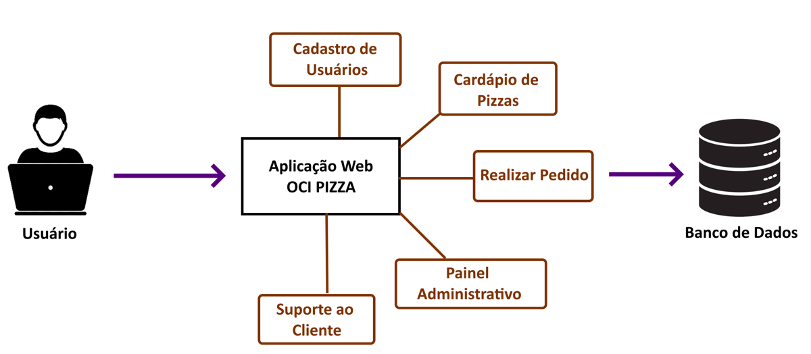

---
hide:
  - toc
---

# Capítulo 2: Aplicação OCI PIZZA

# 2.2 Arquitetura de Software

Após a definição dos requisitos da aplicação web OCI PIZZA, o próximo passo é a modelagem e o design da arquitetura da aplicação. Antes de apresentar a arquitetura inicial proposta, faremos uma introdução aos conceitos de arquitetura de software, destacando os tipos mais utilizados atualmente. Também será apresentado um trecho do fluxo de execução que ilustra a ação do usuário ao realizar um pedido de pizza, servindo como base para o diagrama de classes da aplicação. Esses conceitos de arquitetura serão abordados não apenas nesta seção, mas ao longo de todo o livro.

## 2.2.1 Overengineering

Decidi abordar o tema do _[Overengineering](https://en.wikipedia.org/wiki/Overengineering)_ logo no início dessa seção, pois já adianto que parte de todo o exposto no livro é SIM, _[Overengineering](https://en.wikipedia.org/wiki/Overengineering)_.

_[Overengineering](https://en.wikipedia.org/wiki/Overengineering)_ é um termo utilizado para descrever a prática de criar um produto ou sistema com mais complexidade ou recursos do que o necessário, muitas vezes resultando em desperdício de tempo, dinheiro e recursos. Em termos mais simples, refere-se à introdução de complexidade desnecessária por parte de desenvolvedores ou arquitetos.

Ao longo dos capítulos deste livro, o _[Overengineering](https://en.wikipedia.org/wiki/Overengineering)_ se tornará mais evidente, especialmente ao discutirmos a transição de uma arquitetura monolítica para uma arquitetura de microsserviços. Em uma aplicação real e simples como a OCI PIZZA, uma arquitetura monolítica atende muito bem.

É importante lembrar que o objetivo deste livro é demonstrar aspectos _[Cloud Native](../capitulo-1/cloud-native.md)_ e como utilizar os serviços em nuvem oferecidos pelo OCI. Portanto, em alguns momentos, apresentaremos soluções mais complexas que podem parecer desnecessárias para o problema que a aplicação OCI PIZZA resolve. No entanto, o foco final é apresentar conceitos que podem ser úteis ao lidar com aplicações maiores e com uma base de código mais complexa.

<h3 style="text-align: center; font-style: italic;">
Keep It Simple, Stupid (KISS)
</h3>

## 2.2.2 Introdução a Arquitetura de Software

Após a definição dos requisitos, chega o momento de escolher a linguagem de programação, o framework e, o mais importante, definir de forma macro a arquitetura que será adotada inicialmente pela aplicação web para resolver o problema proposto.

Neste estágio, em que o foco é iniciar o desenvolvimento, diversas dúvidas podem surgir, como:

- Qual é a melhor linguagem de programação? 
- Qual é o melhor framework? 
- Qual é a arquitetura ideal para esta aplicação?

Essas questões são comuns no contexto do desenvolvimento de software, e a melhor resposta para elas é:

- Escolha a linguagem de programação e o framework que você mais conhece.
- Defina sua arquitetura de modo que ela resolva o seu problema da forma mais simples possível.

Lembre-se de que não existe _["bala de prata"](https://pt.wikipedia.org/wiki/Bala_de_prata)_ nem uma solução única e definitiva. Diferentes problemas, diferentes soluções.

Falando de _[arquitetura de software](https://pt.wikipedia.org/wiki/Arquitetura_de_software)_, é importante destacar que existem diferentes tipos de arquiteturas e várias definições sobre o que é _[arquitetura de software](https://pt.wikipedia.org/wiki/Arquitetura_de_software)_. Segundo _[Marco Tulio Valente](https://www.linkedin.com/in/mtov/)_, autor do livro _[Engenharia de Software Moderna](https://engsoftmoderna.info/)_, a arquitetura se refere ao _**"projeto em mais alto nível"**_. 

Uma outra definição que eu particularmente gosto vem da _[Wikipédia](https://pt.wikipedia.org/wiki/Arquitetura_de_software)_, que diz: _"A arquitetura de software de um sistema consiste na definição dos componentes de software, suas propriedades externas, e seus relacionamentos com outros softwares."_

Portanto, pode-se afirmar que a definição de uma arquitetura começa com um _"projeto em mais alto nível"_, elaborado a partir dos requisitos ou das _[Histórias de Usuário](./da-necessidade-a-definicao-de-requisitos.md#histórias-de-usuários)_. Essas histórias se transformam em funcionalidades ou componentes de software que se comunicam entre si, colaborando para resolver um problema do mundo real.

Assim, de maneira simplificada, inicialmente temos o seguinte desenho de arquitetura da aplicação que será desenvolvida:

 

### **Arquitetura em Três Camadas**

A arquitetura em camadas pode ser definida como um processo de decomposição de sistemas complexos em camadas com o objetivo de facilitar a compreensão, o desenvolvimento, a manutenção e o mais importante, a separação de responsabilidades.

Quando se discute arquitetura em camadas no contexto de aplicações web, faz-se referência ao modelo conhecido como _["Arquitetura em Três Camadas"](https://pt.wikipedia.org/wiki/Modelo_em_tr%C3%AAs_camadas)_. Este modelo funciona muito bem para representar a arquitetura de aplicações web e é comumente utilizado porque reflete a estrutura organizacional de uma empresa, onde as pessoas são agrupadas com base em suas competências.

Para esclarecer o papel de cada camada, o desenho abaixo apresenta as três camadas desse estilo arquitetural, juntamente com algumas tecnologias associadas e as competências das equipes envolvidas no desenvolvimento e suporte de uma aplicação:

 

- **Camada de Apresentação ou Inteface com o Usuário**
    - A Camada de Apresentação, ou Inteface com o Usuário, representa a interface gráfica _(GUI - Graphical User Interface)_ com a qual o usuário interage com a aplicação. No mundo web, as interfaces de usuário são desenvolvidas pelos _Desenvolvedores Frontend_, utilizando um conjunto de tecnologias como _HTML_, _CSS_ e _JavaScript_.

- **Camada de Aplicação ou Lógica de Negócios**
    - A Camada de Aplicação, ou Lógica de Negócio, é responsável por implementar as regras de negócio da aplicação. As regras de negócios que uma aplicação deve implementar são, então, codificadas pelos _Desenvolvedores Backend_ utilizando linguagens de programação de alto nível, como _Python_, _Java_ ou _Go_. 
    
- **Camada de Persistência ou Banco de Dados**
    - A Camada de Persistência, ou Banco de Dados, é responsável por armazenar de forma persistente os dados da aplicação. Os Administradores de Banco de Dados (DBAs) são os responsáveis por projetar, manter a integridade e a saúde dos Bancos de Dados de acordo com as exigências da aplicação.

Por fim, é possível representar o papel de cada camada dentro desse modelo arquitetural:

 

!!! note "NOTA"
    O termo _Desenvolvedor Full Stack_ refere-se a um profissional de tecnologia com habilidades de programação que abrange todas as camadas de desenvolvimento, tanto no Frontend quanto no Backend. A linguagem de programação mais destacada nesse contexto é o _JavaScript_, que pode ser executado no navegador e, por meio de implementações como o _[Node.js](https://nodejs.org/en)_, também no servidor, onde residem as regras de negócio. Bibliotecas JavaScript, como _[Sequelize](https://sequelize.org/)_ e _[TypeORM](https://typeorm.io/)_, permitem que os desenvolvedores interajam com bancos de dados, facilitando desde a criação de tabelas até a execução de instruções SQL, sem a necessidade de conhecimentos avançados em tecnologias de banco de dados. Assim, dependendo do tamanho da aplicação, um _Desenvolvedor Full Stack_ pode atuar em todas as camadas do projeto.

Outro termo utilizado por alguns frameworks de desenvolvimento que possui o mesmo significado da _[Arquitetura em Três Camadas](https://pt.wikipedia.org/wiki/Modelo_em_tr%C3%AAs_camadas)_ é a  _[Arquitetura MVC (Model-View-Controller)](https://pt.wikipedia.org/wiki/MVC)_ ou _[Arquitetura Modelo-Visão-Controle](https://pt.wikipedia.org/wiki/MVC)_. Na sigla MVC, a letra M de _Model_, corresponde à _Camada de Persistência_, a letra V de _View_ refere-se à _Camada de Apresentação_, e a letra C de _Controller_ refere-se à _Camada de Aplicação_.

Uma variação do padrão MVC é o _MVT (Model-View-Template)_, utilizado por alguns frameworks, como o _[Flask](https://flask.palletsprojects.com/en/stable/)_. Nesse modelo, a lógica de apresentação e controle é integrada na View, que utiliza Templates para renderizar a interface do usuário. A camada Model mantém sua função original.

### **Arquitetura Monolítica**

O termo Sistema, Aplicação ou _Arquitetura Monolítica_, referem-se a uma aplicação que, independentemente da quantidade de funcionalidades implementadas — seja por meio de módulos, classes ou funções — é implantada e executada através de único processo de computador. Em outras palavras, tudo é executado a partir de um único processo.

!!! note "NOTA"
    Processo de computador ou de sistema operacional será explorado na seção _["2.3 Entendendo os Contêineres"](./entendendo-os-conteineres.md)_. Por enquanto, é importante entender que um processo é o termo utilizado para se referir a uma instância de um programa em execução, gerenciada por um sistema operacional.

Outra definição de _[Sam Newman](https://www.linkedin.com/in/samnewman/)_, autor do livro _[Migrando Sistemas Monolíticos Para Microsserviços](https://amzn.to/3Z9Dh96)_, afirma que: _**"Quando todas as funcionalidades de um sistema tiverem que ser implantadas em conjunto, considero que esse é um sistema monolítico."**_. Embora seja possível ter várias instâncias desse único processo por questões de escalabilidade ou tolerância a falhas, todo o código da aplicação permanece contido dentro desse único processo.

Um _Sistema Monolítico_ pode ser classificado como um _Sistema Monolítico Modular_. Essa característica permite que a lógica da aplicação seja separada em diferentes módulos, possibilitando o trabalho em cada um deles de forma independente. No entanto, a essência monolítica é mantida, uma vez que todas as funcionalidades ainda são executadas sob um único processo e constituem uma única unidade de implantação.

A aplicação OCI PIZZA foi inicialmente desenvolvida usando essa característica de ser um _Monolítico Modular_. Nela, há diferentes módulos que foram criados de forma independente, mas operam em conjunto.

 

!!! note "NOTA"
    A análise detalhada do código-fonte da aplicação OCI PIZZA será apresentada na seção _["2.4 Ambiente de Desenvolvimento"](./capitulo-2/ambiente-de-desenvolvimento.md)_. 
    

#### **Vantagens dos Sistemas Monolíticos**

Sistema monolítico não é código legado ou código velho ou um tipo de arquitetura ultrapassada que deve ser evitada. MVPs usam monolítico.

Os monolitos são implantados somente em um único lugar, por isso é considerado de ser uma vantagem sobre os microsserviços.

#### **Desvantagens dos Sistemas Monolíticos**

Se mudar uma linha de código no monolito, deve-se fazer um deploy por completo (acomplamento de implantação).

Sitemas Monolíticos limitam as opções de usar diferentes tecnologias.