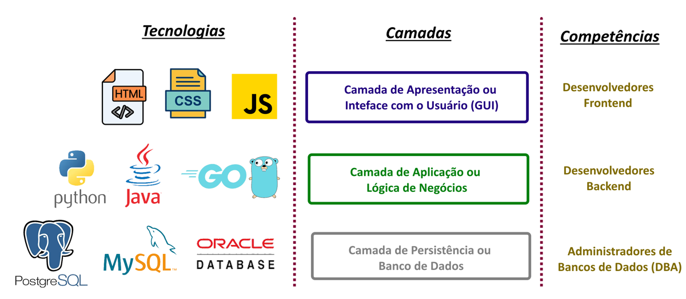
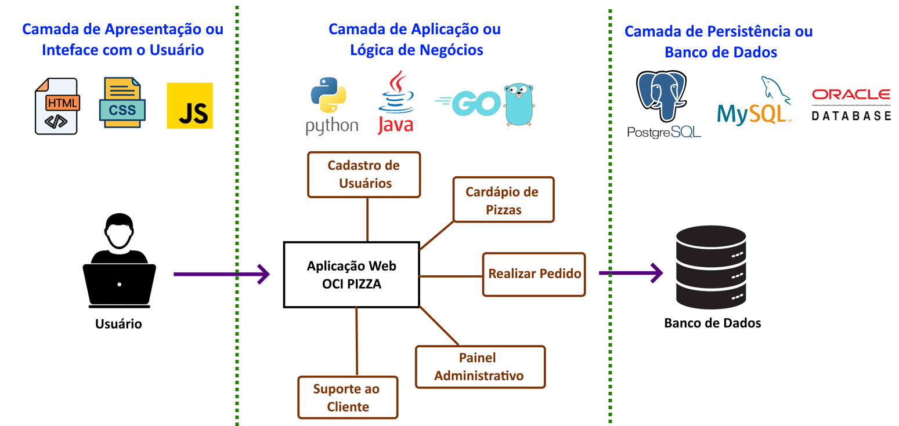
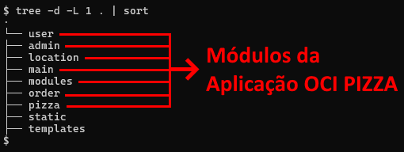
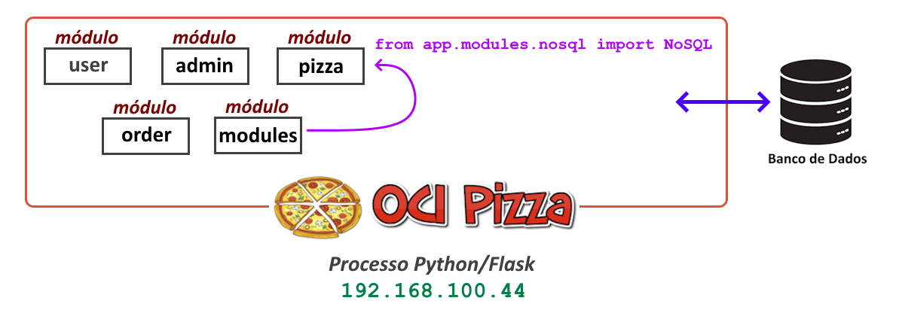
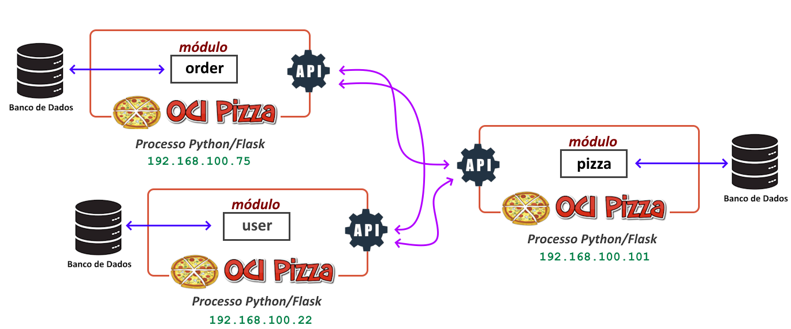
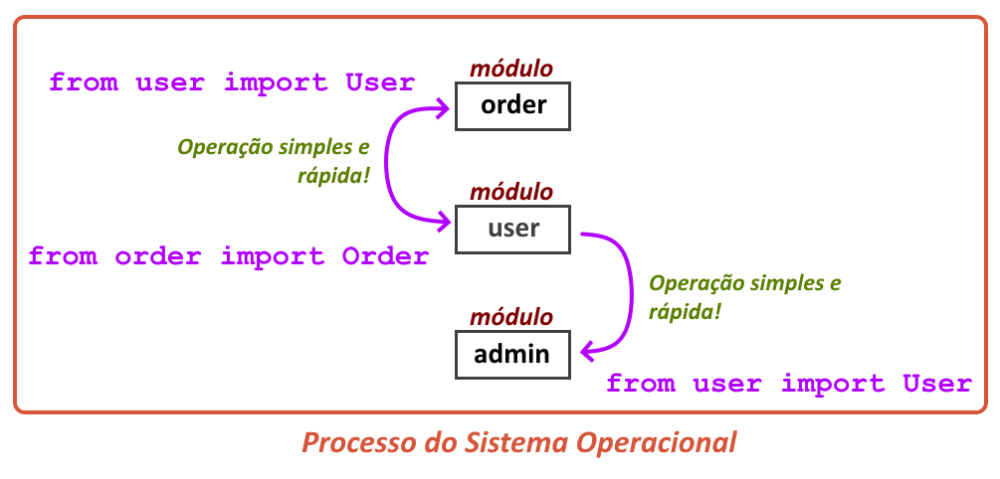
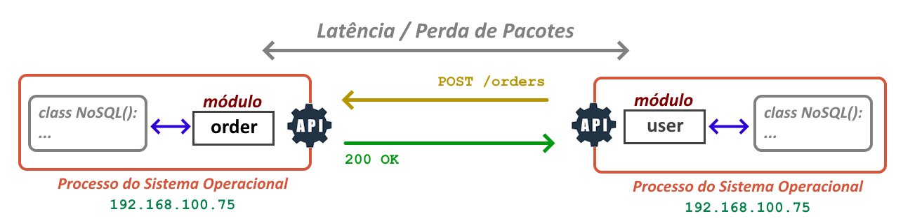

---
hide:
  - toc
---

# Capítulo 2: Aplicação OCI PIZZA

# 2.5 Arquitetura de Software

## 2.5.1 Introdução a Arquitetura de Software

Ao abordar <a href="https://pt.wikipedia.org/wiki/Arquitetura_de_software" target="_blank">Arquitetura de Software</a>, é importante ressaltar que existem diferentes tipos de arquiteturas e algumas definições sobre o que ela representa no contexto do desenvolvimento de software. Segundo <a href="https://www.linkedin.com/in/mtov/" target="_blank">Marco Tulio Valente</a>, autor do livro <a href="https://engsoftmoderna.info/" target="_blank"><i>"Engenharia de Software Moderna"</i></a>, a arquitetura se refere ao _**"projeto em mais alto nível"**_. 

Uma outra definição que eu particularmente gosto vem da <a href="https://pt.wikipedia.org/wiki/Arquitetura_de_software" target="_blank">Wikipédia</a>, que diz: 

<h3 style="text-align: center; font-style: italic;">
A arquitetura de um sistema consiste na definição dos componentes de software, suas propriedades externas, e seus relacionamentos com outros softwares.
</h3>

Portanto, é possível afirmar que:

<h3 style="text-align: center; font-style: italic;">
A definição de uma arquitetura começa com um "projeto em mais alto nível", elaborado a partir dos requisitos ou das Histórias de Usuário. Essas histórias se transformam em funcionalidades ou componentes de software que se comunicam entre si, colaborando para resolver um problema do mundo real.
</h3>

Alguns tipos mais comuns de <a href="https://pt.wikipedia.org/wiki/Arquitetura_de_software" target="_blank">Arquitetura de Software</a> incluem:

### **Arquitetura em Três Camadas**

A <a href="https://pt.wikipedia.org/wiki/Modelo_em_tr%C3%AAs_camadas" target="_blank">Arquitetura em Camadas</a> pode ser definida como um processo de decomposição de um sistema complexo em camadas, visando facilitar a compreensão, o desenvolvimento e a manutenção, além de promover a separação de responsabilidades.

Quando se discute arquitetura em camadas no contexto de aplicações web, faz-se referência ao modelo conhecido como <a href="https://pt.wikipedia.org/wiki/Modelo_em_tr%C3%AAs_camadas" target="_blank"><i>"Arquitetura em Três Camadas"</i></a>. Este modelo funciona muito bem para representar a arquitetura de aplicações web e é comumente utilizado porque reflete a estrutura organizacional de uma empresa, onde as pessoas são agrupadas com base em suas competências.

Para esclarecer o papel de cada camada, o desenho abaixo apresenta as três camadas desse estilo arquitetural, juntamente com algumas tecnologias associadas e as competências das equipes envolvidas no desenvolvimento e suporte de uma aplicação:

 

- **Camada de Apresentação ou Inteface com o Usuário**
    - A Camada de Apresentação, ou Inteface com o Usuário, representa a interface gráfica _(GUI - Graphical User Interface)_ com a qual o usuário interage com a aplicação. No mundo web, as interfaces de usuário são desenvolvidas pelos _Desenvolvedores Frontend_, utilizando um conjunto de tecnologias como _HTML_, _CSS_ e _JavaScript_.

- **Camada de Aplicação ou Lógica de Negócios**
    - A Camada de Aplicação, ou Lógica de Negócio, é responsável por implementar as regras de negócio da aplicação. As regras de negócios que uma aplicação deve implementar são, então, codificadas pelos _Desenvolvedores Backend_ utilizando linguagens de programação de alto nível, como <a href="https://www.python.org/" target="_blank">Python</a>, <a href="https://www.java.com/" target="_blank">Java</a> ou <a href="https://go.dev/" target="_blank">Go</a>. 
    
- **Camada de Persistência ou Banco de Dados**
    - A Camada de Persistência, ou Banco de Dados, é responsável por armazenar de forma persistente os dados da aplicação. Os _Administradores de Banco de Dados (DBAs)_ são os responsáveis por projetar, manter a integridade e a saúde dos Bancos de Dados de acordo com as exigências da aplicação.

Por fim, é possível representar as três camadas dentro desse modelo arquitetural:

 

!!! note "NOTA"
    O termo **Desenvolvedor Full Stack** refere-se a um profissional de tecnologia que possui habilidades de programação abrangendo todas as camadas de desenvolvimento, incluindo Frontend, Backend e Persistência de Dados. A linguagem de programação que mais se destaca nesse contexto é o <a href="https://developer.mozilla.org/en-US/docs/Web/JavaScript" target="_blank">JavaScript</a>, que pode ser executado no navegador e, por meio de implementações como o <a href="https://nodejs.org/en" target="_blank">Node.js</a>, também do lado do servidor. Bibliotecas <a href="https://developer.mozilla.org/en-US/docs/Web/JavaScript" target="_blank">JavaScript</a>, como <a href="https://sequelize.org/" target="_blank">Sequelize</a> e <a href="https://typeorm.io/" target="_blank">TypeORM</a>, permitem que os desenvolvedores interajam com bancos de dados, facilitando desde a criação de tabelas até a execução de instruções SQL, sem a necessidade de conhecimentos avançados em tecnologias de banco de dados. Assim, dependendo do tamanho da aplicação, um **Desenvolvedor Full Stack** pode atuar em todas as camadas do projeto.

Outro termo utilizado por alguns frameworks de desenvolvimento que possui o mesmo significado da <a href="https://pt.wikipedia.org/wiki/Modelo_em_tr%C3%AAs_camadas" target="_blank">Arquitetura em Três Camadas</a> é a  <a href="https://pt.wikipedia.org/wiki/MVC" target="_blank">Arquitetura MVC (Model-View-Controller)</a> ou <a href="https://pt.wikipedia.org/wiki/MVC" target="_blank">Arquitetura Modelo-Visão-Controle</a>. Na sigla <a href="https://pt.wikipedia.org/wiki/MVC" target="_blank">MVC</a>, a letra **M** de **Model**, corresponde à **Camada de Persistência**, a letra **V** de **View** refere-se à **Camada de Apresentação**, e a letra **C** de **Controller** refere-se à **Camada de Aplicação**.

Uma variação do padrão <a href="https://pt.wikipedia.org/wiki/MVC" target="_blank">MVC</a> é o **MVT (Model-View-Template)**, utilizado por alguns frameworks, como o <a href="https://flask.palletsprojects.com/en/stable/" target="_blank">Flask</a>. Nesse modelo, a lógica de apresentação e controle é integrada na **View**, que utiliza **Templates** para renderizar a interface do usuário. A camada **Model** mantém sua função original que corresponde à **Camada de Persistência** de dados.

### **Arquitetura Monolítica**

<a href="https://pt.wikipedia.org/wiki/Aplica%C3%A7%C3%A3o_monol%C3%ADtica" target="_blank">Arquitetura Monolítica</a>, ou <a href="https://pt.wikipedia.org/wiki/Aplica%C3%A7%C3%A3o_monol%C3%ADtica" target="_blank">Sistema Monolítico</a>, refere-se a uma aplicação que, independentemente da quantidade de funcionalidades implementadas - seja por meio de módulos, classes ou funções - <b>é implantada e executada como um único processo</b> de computador.

!!! note "NOTA"
    Processo de computador ou de sistema operacional será explorado na seção <a href="https://ocn.dev.br/capitulo-6/entendendo-os-conteineres/"><i>"6.1 Entendendo os Contêineres"</i></a> do <a href="https://ocn.dev.br/capitulo-6/">Capítulo 6</a>. Por enquanto, é importante entender que um processo é o termo utilizado para se referir a uma instância de um programa em execução, gerenciada pelo sistema operacional.

Outra definição de <a href="https://www.linkedin.com/in/samnewman/" target="_blank">Sam Newman</a>, autor do livro <a href="https://novatec.com.br/livros/migrando-monoliticos-para-microsservicos/"><i>"Migrando Sistemas Monolíticos Para Microsserviços"</i></a>, afirma que: 

<h3 style="text-align: center; font-style: italic;">
Quando todas as funcionalidades de um sistema tiverem que ser implantadas em conjunto, considero que esse é um sistema monolítico. Embora seja possível ter várias instâncias desse único processo por questões de escalabilidade ou tolerância a falhas, todo o código da aplicação permanece contido dentro desse único processo.
</h3>

Um **Sistema Monolítico** pode ser classificado como um **Sistema Monolítico Modular**. Essa característica permite que a lógica da aplicação seja separada em diferentes módulos, possibilitando o trabalho em cada um deles de forma independente. No entanto, a essência monolítica é mantida, uma vez que todas as funcionalidades ainda são executadas sob um <b>único processo</b>.

A aplicação **OCI PIZZA** foi desenvolvida utilizando a característica de ser um **Monolítico Modular**, na qual diferentes módulos operam em conjunto, cada um com responsabilidades bem definidas. A troca de informações entre os módulos internos da aplicação ocorre dentro de um <b>único processo</b> <a href="https://flask.palletsprojects.com/en/stable/" target="_blank">Python/Flask</a>.

 

    
#### **Vantagens da Arquitetura Monolítica**

**1.** Uma <a href="https://pt.wikipedia.org/wiki/Aplica%C3%A7%C3%A3o_monol%C3%ADtica" target="_blank">Arquitetura Monolítica</a> é uma abordagem válida e, de fato, é frequentemente a mais recomendada para o início da construção de um software. Ela se destaca como a melhor escolha para a criação rápida de protótipos ou <a href="https://pt.wikipedia.org/wiki/Prova_de_conceito" target="_blank">provas de conceito (PoC - Proof of Concept)</a>.

**2.** <a href="https://pt.wikipedia.org/wiki/Aplica%C3%A7%C3%A3o_monol%C3%ADtica" target="_blank">Sistemas Monolíticos</a> são mais fáceis de implantar (deploy) porque todo o código está contido em um único repositório, o que permite que a implantação e a execução ocorram a partir de um único local.

**3.** É mais fácil reutilizar código entre diferentes partes da aplicação. Por exemplo em <a href="https://www.python.org/" target="_blank">Python</a>, uma instrução do tipo `from app.modules.nosql import NoSQL` permite importar a funcionalidade de um módulo para outro. Além disso, a comunicação entre os diferentes módulos da aplicação, que são executados dentro de um mesmo processo, é mais rápida.

**4.** A estrutura unificada de um monólito facilita o teste das interações entre os componentes, tornando a execução de testes fim a fim mais fácil. Além disso, por operar como um único processo, a monitoração de uma aplicação monolítica é geralmente mais fácil de implementar.

#### **Desvantagens da Arquitetura Monolítica**

**1.** Mudanças no código de um monólito exigem a implantação completa de toda a aplicação. Isso significa que, ao realizar uma atualização ou correção, é necessário reimplantar o sistema inteiro, o que pode resultar em períodos de inatividade e maior complexidade na gestão de versões.

**2.** Devido ao fato de todo o código estar contido em um único repositório, alterações em diferentes partes do código por diferentes desenvolvedores, podem resultar em um aumento nos conflitos de <a href="https://pt.wikipedia.org/wiki/Fus%C3%A3o_(controle_de_vers%C3%A3o)" target="_blank">merge</a>. Esses conflitos podem atrasar as implantações do sistema.

**3.** <a href="https://pt.wikipedia.org/wiki/Aplica%C3%A7%C3%A3o_monol%C3%ADtica" target="_blank">Sistemas Monolíticos</a> limitam as opções de utilização de diferentes tecnologias. Por exemplo, um monolito escrito em <a href="https://www.python.org/" target="_blank">Python</a> possui toda a sua base de código nessa linguagem, o que significa que não é possível mesclar funcionalidades em <a href="https://www.python.org/" target="_blank">Python</a> e <a href="https://www.java.com/" target="_blank">Java</a> dentro da mesma aplicação.

**4.** Dizemos que um monólito está sujeito a uma **"Falha Total"**. Essa expressão significa que um erro ou falha em qualquer parte do código pode levar à indisponibilidade total da aplicação.

### **Arquitetura de Microsserviços**

<a href="https://pt.wikipedia.org/wiki/Microsservi%C3%A7o" target="_blank">Arquitetura de Microsserviços</a> ou, <a href="https://pt.wikipedia.org/wiki/Microsservi%C3%A7o" target="_blank">Arquitetura baseada em Microsserviços</a>, é um padrão arquitetural que consiste em diversos serviços independentes, desacoplados e distribuídos. Cada serviço é considerado _"micro"_ porque possui uma base de código menor na qual implementa uma única funcionalidade da aplicação (responsabilidade única). Esses diversos e _"micros serviços"_, são executados em **processos independentes** e, juntos, se combinam para formar o sistema como um todo.

<h3 style="text-align: center; font-style: italic;">
Microsserviços são serviços que podem ser implantados de forma independente e são modelados em torno de um domínio de negócios - Autor: <a href="https://www.linkedin.com/in/samnewman/" target="_blank">Sam Newman</a>
</h3>

Pelo fato de que cada <a href="https://pt.wikipedia.org/wiki/Microsservi%C3%A7o" target="_blank">microsserviço</a> possui a sua própria base de código, isso permite a utilização de diferentes tecnologias para seu desenvolvimento e possibilita que sejam **implantados de forma independente**. Por serem independentes, os <a href="https://pt.wikipedia.org/wiki/Microsservi%C3%A7o" target="_blank">microsserviços</a> também podem ter suas próprias bases de dados independentes, o que é considerado uma boa prática ao adotar esse estilo arquitetural.

Outra afirmação que ajuda a descrever os <a href="https://pt.wikipedia.org/wiki/Microsservi%C3%A7o" target="_blank">microsserviços</a> é que eles funcionam como componentes completos de uma funcionalidade da aplicação, e que incluem sua própria interface de usuário, lógica de negócios e gerenciamento de dados.

Toda a comunicação entre os serviços ocorre pela rede utilizando algum protocolo, sendo os mais comuns o <a href="https://pt.wikipedia.org/wiki/Hypertext_Transfer_Protocol" target="_blank">HTTP</a> e o <a href="https://pt.wikipedia.org/wiki/GRPC" target="_blank">gRPC</a>.

 

!!! note "NOTA"
    A aplicação **OCI PIZZA** é composta por módulos bastante simples, e a separação desses módulos em serviços independentes pode resultar em mais complexidade do que benefícios para a aplicação. Lembre-se que o objetivo aqui é apresentar parte dos conceitos sobre <a href="https://pt.wikipedia.org/wiki/Microsservi%C3%A7o" target="_blank">Arquitetura de Microsserviços</a> por meio de uma aplicação real e de fácil compreensão.

!!! note "NOTA"
    Assista o video <a href="https://youtu.be/ISYKx8sa53g?si=GO0k1Sn0MaDNglfV" target="_blank"><i>"Deconstructing the Monolith (Shopify Unite Track 2019)"</i></a>, que explica um pouco sobre a transição da <a href="https://www.shopify.com/br" target="_blank">Shopify</a> de um grande monólito escrito em <a href="https://pt.wikipedia.org/wiki/Ruby_on_Rails" target="_blank">Ruby on Rails</a> para uma arquitetura de <a href="https://pt.wikipedia.org/wiki/Microsservi%C3%A7o" target="_blank">Arquitetura de Microsserviços</a>, composta por _"mini-aplicações"_ <a href="https://pt.wikipedia.org/wiki/Ruby_on_Rails" target="_blank">Rails</a> distribuídas.

#### **Vantagens da Arquitetura de Microsserviços**

**1.** Cada <a href="https://pt.wikipedia.org/wiki/Microsservi%C3%A7o" target="_blank">microsserviço</a>, por ter uma base de código menor, tende a apresentar poucos conflitos de <a href="https://pt.wikipedia.org/wiki/Fus%C3%A3o_(controle_de_vers%C3%A3o)" target="_blank">merge</a> entre os desenvolvedores.

**2.** O desevolvimento e as implantações (deploy) são menores, mais rápidas e independentes. Isso significa que é possível modificar o código de um <a href="https://pt.wikipedia.org/wiki/Microsservi%C3%A7o" target="_blank">microsserviço</a> e implantá-lo em produção sem afetar outros <a href="https://pt.wikipedia.org/wiki/Microsservi%C3%A7o" target="_blank">microsserviços</a>.

**3.** <a href="https://pt.wikipedia.org/wiki/Microsservi%C3%A7o" target="_blank">Microsserviços</a> são independentes em termos de tecnologia. Em uma aplicação, é possível ter microsserviços desenvolvidos em <a href="https://www.java.com/" target="_blank">Java</a>, outros em <a href="https://www.python.org/" target="_blank">Python</a> e ainda outros em <a href="https://go.dev/" target="_blank">Go</a>. Todos eles, independente da linguagem de programação utilizada, colaboram para compor a aplicação como um todo.

**4.** O impacto nos negócios é menor quando ocorre um problema. Se um <a href="https://pt.wikipedia.org/wiki/Microsservi%C3%A7o" target="_blank">microsserviço</a> específico falha, isso é considerado uma **Falha Parcial**, o que significa que apenas uma parte da aplicação é afetada. Dessa forma, a aplicação como um todo não fica indisponível como ocorre em [Aplicações Monolíticas](#arquitetura-monolítica).

#### **Desvantagens da Arquitetura de Microsserviços**

**1.** <a href="https://pt.wikipedia.org/wiki/Microsservi%C3%A7o" target="_blank">Microsserviços</a> são mais difíceis de testar e monitorar. Os testes integrados e de fim a fim precisam incluir diferentes <a href="https://pt.wikipedia.org/wiki/Microsservi%C3%A7o" target="_blank">microsserviços</a>, o que torna o processo mais trabalhoso e complexo. A monitoração também se torna mais complexa devido à quantidade de <a href="https://pt.wikipedia.org/wiki/Microsservi%C3%A7o" target="_blank">microsserviços</a> que compõem a aplicação.

**2.** A comunicação entre diferentes <a href="https://pt.wikipedia.org/wiki/Microsservi%C3%A7o" target="_blank">microsserviços</a> é realizada por meio da rede, o que traz consigo outros problemas, como maior latência e perda de pacotes nas chamadas entre os serviços.

**3.** Em uma <a href="https://pt.wikipedia.org/wiki/Microsservi%C3%A7o" target="_blank">Arquitetura de Microsserviços</a>, cada <a href="https://pt.wikipedia.org/wiki/Microsservi%C3%A7o" target="_blank">microsserviço</a> pode ter suas próprias dependências, requisitos e ciclos de desenvolvimento. Isso significa que pode ser necessário implementar múltiplas esteiras de <a href="https://pt.wikipedia.org/wiki/CI/CD" target="_blank">CI/CD</a>, uma para cada <a href="https://pt.wikipedia.org/wiki/Microsservi%C3%A7o" target="_blank">microsserviço</a>.

**4.** O gerenciamento de vulnerabilidades se torna mais difícil. Quando uma vulnerabilidade de segurança é identificada em uma dependência de um <a href="https://pt.wikipedia.org/wiki/Microsservi%C3%A7o" target="_blank">microsserviço</a>, é importante lembrar de atualizar todos os <a href="https://pt.wikipedia.org/wiki/Microsservi%C3%A7o" target="_blank">microsserviços</a> que utilizam essa dependência.

## 2.2.2 Arquitetura Monolítica vs. Microsserviços

Nesta seção, apresento uma conclusão sobre quando utilizar uma <a href="https://pt.wikipedia.org/wiki/Aplica%C3%A7%C3%A3o_monol%C3%ADtica" target="_blank">Arquitetura Monolítica</a> e quando optar por uma <a href="https://pt.wikipedia.org/wiki/Microsservi%C3%A7o" target="_blank">Arquitetura de Microsserviços</a>, trazendo um paralelo com a aplicação de exemplo **OCI PIZZA**, onde a primeira dica é:

<h3 style="text-align: center; font-style: italic;">
Não existe <a href="https://pt.wikipedia.org/wiki/Bala_de_prata" target="_blank">"bala de prata"</a> nem uma solução única e definitiva. Diferentes problemas exigem diferentes soluções.
</h3>

Com base nas pesquisas que realizei e nas leituras sobre arquitetura de software, onde diversos especialistas discutem o tema, é que:

<h3 style="text-align: center; font-style: italic;">
Comece de forma simples, criando uma aplicação monolítica. Inicialmente, é mais fácil desenvolver e organizar as funcionalidades da aplicação em módulos simples que possam ser reutilizados dentro de um único processo do sistema operacional, em vez de codificar interações por meio da rede entre os diferentes módulos.
</h3>

Deve-se considerar que não há um único motivo para migrar da sua arquitetura altual para uma <a href="https://pt.wikipedia.org/wiki/Microsservi%C3%A7o" target="_blank">Arquitetura de Microsserviços</a>. Outra discussão sobre isso, que também considero importante, é que essa transição só começa a fazer sentido quando a base de código cresce a ponto de ser necessário ter mais desenvolvedores trabalhando em diferentes partes do código da aplicação. 

Com um maior número de desenvolvedores trabalhando na mesma base de código, aumentam as chances de conflitos de <a href="https://pt.wikipedia.org/wiki/Fus%C3%A3o_(controle_de_vers%C3%A3o)" target="_blank">merge</a>, o que pode acarretar atrasos na entrega de correções ou novas funcionalidades. Por outro lado, bases de código menores geralmente têm equipes de desenvolvimento menores, o que podem apresentar poucos conflitos de <a href="https://pt.wikipedia.org/wiki/Fus%C3%A3o_(controle_de_vers%C3%A3o)" target="_blank">merge</a>. Isso permite que novas funcionalidades ou correções sejam implantadas de forma mais rápida e a qualquer momento.

Conforme mencionado na seção sobre as _["Vantagens da Arquitetura Monolítica"](#vantagens-da-arquitetura-monolítica)_, utilizar as funcionalidades de um módulo por meio de uma instrução `import`, que é executada dentro de um único processo, é mais fácil, mais rápido e possibilita uma reutilização de código de uma forma mais simples.

 

Ao adotar <a href="https://pt.wikipedia.org/wiki/Microsservi%C3%A7o" target="_blank">microsserviços</a>, a abordagem muda. Por exemplo, o código de uma classe que interage com um banco de dados do tipo <a href="https://pt.wikipedia.org/wiki/NoSQL" target="_blank">NoSQL</a>, precisará estar presente e ser replicado em todos os <a href="https://pt.wikipedia.org/wiki/Microsservi%C3%A7o" target="_blank">microsserviços</a> que necessitam dessa funcionalidade. Caso haja a necessidade de ajustes nessa classe, será necessário realizar o _redeploy_ de todos os <a href="https://pt.wikipedia.org/wiki/Microsservi%C3%A7o" target="_blank">microsserviços</a> que a utilizam. Como alternativa, é possível criar um <a href="https://pt.wikipedia.org/wiki/Microsservi%C3%A7o" target="_blank">microsserviço</a> dedicado exclusivamente à interação com o banco de dados. No entanto, em ambos os casos, há um aumento na complexidade do sistema.

E, por fim, como um último ponto de destaque, os <a href="https://pt.wikipedia.org/wiki/Microsservi%C3%A7o" target="_blank">microsserviços</a> apresentam desafios relacionados a transações distribuídas e à rede. No que se refere a problemas de rede, podem ocorrer latências variáveis na comunicação entre diferentes <a href="https://pt.wikipedia.org/wiki/Microsservi%C3%A7o" target="_blank">microsserviços</a>, o que pode resultar na necessidade de retransmissões e, em casos extremos, na perda de conectividade e perda de informações. Quanto às transações distribuídas, o principal problema é a possibilidade de existir inconsistências nos dados, que podem surgir, por exemplo, quando uma leitura é realizada antes da conclusão de uma escrita.

## 2.5.3 Outras definições sobre Arquitetura

### **Arquitetura da Aplicação**

Também conhecido como **Arquitetura Lógica**, refere-se à estrutura e organização dos componentes de software, definindo como eles interagem e se comunicam para atender aos requisitos funcionais e não funcionais da aplicação.

### **Arquitetura da Infraestrutura**

Ao considerar a "infraestrutura externa à aplicação", encontramos a **Arquitetura da Infraestrutura**, também conhecida como **Arquitetura Física**. 

Parte da **Arquitetura Física** inclui a topologia de rede utilizada, o endereçamento IP e outros serviços auxiliares essenciais para o funcionamento da aplicação. Esses serviços abrangem servidores destinados à execução da aplicação, servidores responsáveis pelo envio de e-mails, entre outros.

### **Arquitetura de Dados**

Eu chamo de _Arquitetura de Dados_ tudo que se refere ao banco de dados da aplicação, incluindo a escolha do tipo, seja relacional ou não relacional _([NoSQL](../capitulo-5/index.md))_, bem como o design das tabelas e suas relações.

A aplicação **OCI PIZZA** é simples, assim como o conjunto de dados que ela manipula. Por essa razão, considero que o tipo de banco de dados mais adequado, dado que não há relacionamentos complexos entre as tabelas, é o _[NoSQL](../capitulo-5/index.md)_.