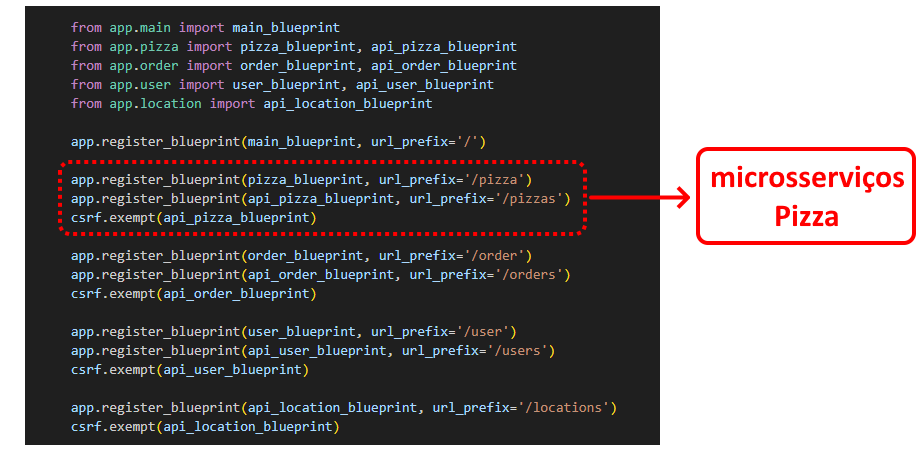
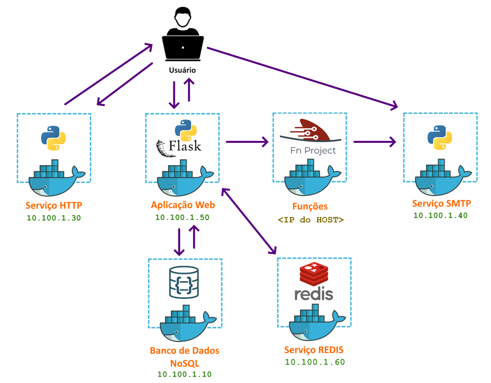

---
hide:
  - toc
---

# Capítulo 2: Aplicação OCI PIZZA

# 2.2 Arquitetura de Software

Após a definição dos requisitos da aplicação web **OCI PIZZA**, o próximo passo é o desenvolvimento, seguido pela modelagem e design da arquitetura da aplicação. Este livro não entra nos detalhes de como desenvolver uma aplicação web, nem aborda aspectos de programação. Em vez disso, serão apresentados conceitos sobre arquitetura de software, juntamente com uma explicação de como a arquitetura da aplicação **OCI PIZZA** foi elaborada, considerando seu funcionamento.

## 2.2.1 Overengineering

Decidi abordar o tema do <a href="https://en.wikipedia.org/wiki/Overengineering" target="_blank">Overengineering</a> logo no início desta seção, pois é importante esclarecer que parte do que será apresentado ao longo do livro é, de fato, um exemplo de <a href="https://en.wikipedia.org/wiki/Overengineering" target="_blank">Overengineering</a>.

<a href="https://en.wikipedia.org/wiki/Overengineering" target="_blank">Overengineering</a> é um termo utilizado para descrever a prática de criar um produto ou sistema com mais complexidade ou recursos do que o necessário, muitas vezes resultando em desperdício de tempo e dinheiro. 

Ao longo dos capítulos deste livro, o <a href="https://en.wikipedia.org/wiki/Overengineering" target="_blank">Overengineering</a> se tornará mais evidente, especialmente ao abordarmos a transição da _Arquitetura Monolítica_ para uma _Arquitetura de Microsserviços_. Em uma aplicação real e simples como a **OCI PIZZA**, uma _Arquitetura Monolítica_ é, de fato, a melhor escolha.

Por fim, é importante lembrar que o objetivo deste livro é explorar as práticas e os conceitos relacionados ao termo <a href="https://ocn.dev.br/capitulo-1/cloud-native/">Cloud Native</a>, utilizando uma aplicação real como exemplo, além de demonstrar como utilizar os serviços em nuvem oferecidos pelo <a href="https://ocn.dev.br/capitulo-3/">OCI</a>. Assim, em determinados momentos, abordaremos soluções mais complexas e que não são necessárias para o problema que a aplicação **OCI PIZZA** busca resolver, mas que ajudam a ilustrar algumas práticas na implementação de aplicações <a href="https://ocn.dev.br/capitulo-1/cloud-native/">Cloud Native</a> no <a href="https://ocn.dev.br/capitulo-3/">OCI</a>.

<h3 style="text-align: center; font-style: italic;">
Keep It Simple, Stupid (KISS)
</h3>

## 2.2.2 Introdução a Arquitetura de Software

Após a definição dos requisitos, chega o momento de escolher a linguagem de programação, o framework e, o mais importante, definir de forma macro a arquitetura que será adotada inicialmente pela aplicação web para resolver o problema proposto.

Neste estágio, em que o foco é iniciar o desenvolvimento, diversas dúvidas podem surgir, como:

- Qual é a melhor linguagem de programação? 
- Qual é o melhor framework? 
- Qual é a arquitetura ideal para esta aplicação?

Essas questões são comuns no contexto do desenvolvimento de software, e a melhor resposta para elas é:

- Escolha a linguagem de programação e o framework que você mais conhece.
- Defina sua arquitetura de modo que ela resolva o seu problema da forma mais simples possível.

Falando de <a href="https://pt.wikipedia.org/wiki/Arquitetura_de_software" target="_blank">arquitetura de software</a>, é importante destacar que existem diferentes tipos de arquiteturas e várias definições sobre o que é <a href="https://pt.wikipedia.org/wiki/Arquitetura_de_software" target="_blank">arquitetura de software</a>. Segundo <a href="https://www.linkedin.com/in/mtov/" target="_blank">Marco Tulio Valente</a>, autor do livro <a href="https://engsoftmoderna.info/" target="_blank">Engenharia de Software Moderna</a>, a arquitetura se refere ao _**"projeto em mais alto nível"**_. 

Uma outra definição que eu particularmente gosto vem da <a href="https://pt.wikipedia.org/wiki/Arquitetura_de_software" target="_blank">Wikipédia</a>, que diz: 

<h3 style="text-align: center; font-style: italic;">
A arquitetura de um sistema consiste na definição dos componentes de software, suas propriedades externas, e seus relacionamentos com outros softwares.
</h3>

Portanto, é possível afirmar que:

<h3 style="text-align: center; font-style: italic;">
A definição de uma arquitetura começa com um "projeto em mais alto nível", elaborado a partir dos requisitos ou das Histórias de Usuário. Essas histórias se transformam em funcionalidades ou componentes de software que se comunicam entre si, colaborando para resolver um problema do mundo real.
</h3>

De maneira simplificada, inicialmente temos o seguinte desenho de arquitetura da aplicação que será desenvolvida:

Alguns tipos mais comuns de arquitetura de software incluem:

### **Arquitetura em Três Camadas**

A <a href="https://pt.wikipedia.org/wiki/Modelo_em_tr%C3%AAs_camadas" target="_blank">Arquitetura em Camadas</a> pode ser definida como um processo de decomposição de um sistema complexo em camadas, visando facilitar a compreensão, o desenvolvimento e a manutenção, além de promover a separação de responsabilidades.

Quando se discute arquitetura em camadas no contexto de aplicações web, faz-se referência ao modelo conhecido como <a href="https://pt.wikipedia.org/wiki/Modelo_em_tr%C3%AAs_camadas" target="_blank">"Arquitetura em Três Camadas"</a>. Este modelo funciona muito bem para representar a arquitetura de aplicações web e é comumente utilizado porque reflete a estrutura organizacional de uma empresa, onde as pessoas são agrupadas com base em suas competências.

Para esclarecer o papel de cada camada, o desenho abaixo apresenta as três camadas desse estilo arquitetural, juntamente com algumas tecnologias associadas e as competências das equipes envolvidas no desenvolvimento e suporte de uma aplicação:

 

- **Camada de Apresentação ou Inteface com o Usuário**
    - A Camada de Apresentação, ou Inteface com o Usuário, representa a interface gráfica _(GUI - Graphical User Interface)_ com a qual o usuário interage com a aplicação. No mundo web, as interfaces de usuário são desenvolvidas pelos _Desenvolvedores Frontend_, utilizando um conjunto de tecnologias como _HTML_, _CSS_ e _JavaScript_.

- **Camada de Aplicação ou Lógica de Negócios**
    - A Camada de Aplicação, ou Lógica de Negócio, é responsável por implementar as regras de negócio da aplicação. As regras de negócios que uma aplicação deve implementar são, então, codificadas pelos _Desenvolvedores Backend_ utilizando linguagens de programação de alto nível, como <a href="https://www.python.org/" target="_blank">Python</a>, <a href="https://www.java.com/" target="_blank">Java</a> ou <a href="https://go.dev/" target="_blank">Go</a>. 
    
- **Camada de Persistência ou Banco de Dados**
    - A Camada de Persistência, ou Banco de Dados, é responsável por armazenar de forma persistente os dados da aplicação. Os Administradores de Banco de Dados (DBAs) são os responsáveis por projetar, manter a integridade e a saúde dos Bancos de Dados de acordo com as exigências da aplicação.

Por fim, é possível representar as três camadas dentro desse modelo arquitetural:

 

!!! note "NOTA"
    O termo **Desenvolvedor Full Stack** refere-se a um profissional de tecnologia que possui habilidades de programação abrangendo todas as camadas de desenvolvimento, incluindo Frontend, Backend e Persistência de Dados. A linguagem de programação que mais se destaca nesse contexto é o <a href="https://developer.mozilla.org/en-US/docs/Web/JavaScript" target="_blank">JavaScript</a>, que pode ser executado no navegador e, por meio de implementações como o <a href="https://nodejs.org/en" target="_blank">Node.js</a>, também do lado do servidor. Bibliotecas <a href="https://developer.mozilla.org/en-US/docs/Web/JavaScript" target="_blank">JavaScript</a>, como <a href="https://sequelize.org/" target="_blank">Sequelize</a> e <a href="https://typeorm.io/" target="_blank">TypeORM</a>, permitem que os desenvolvedores interajam com bancos de dados, facilitando desde a criação de tabelas até a execução de instruções SQL, sem a necessidade de conhecimentos avançados em tecnologias de banco de dados. Assim, dependendo do tamanho da aplicação, um **Desenvolvedor Full Stack** pode atuar em todas as camadas do projeto.

Outro termo utilizado por alguns frameworks de desenvolvimento que possui o mesmo significado da <a href="https://pt.wikipedia.org/wiki/Modelo_em_tr%C3%AAs_camadas" target="_blank">Arquitetura em Três Camadas</a> é a  <a href="https://pt.wikipedia.org/wiki/MVC" target="_blank">Arquitetura MVC (Model-View-Controller)</a> ou <a href="https://pt.wikipedia.org/wiki/MVC" target="_blank">Arquitetura Modelo-Visão-Controle</a>. Na sigla <a href="https://pt.wikipedia.org/wiki/MVC" target="_blank">MVC</a>, a letra **M** de **Model**, corresponde à **Camada de Persistência**, a letra **V** de **View** refere-se à **Camada de Apresentação**, e a letra **C** de **Controller** refere-se à **Camada de Aplicação**.

Uma variação do padrão <a href="https://pt.wikipedia.org/wiki/MVC" target="_blank">MVC</a> é o **MVT (Model-View-Template)**, utilizado por alguns frameworks, como o <a href="https://flask.palletsprojects.com/en/stable/" target="_blank">Flask</a>. Nesse modelo, a lógica de apresentação e controle é integrada na **View**, que utiliza **Templates** para renderizar a interface do usuário. A camada **Model** mantém sua função original, correspondendo à **Camada de Persistência** de dados.

### **Arquitetura Monolítica**

<a href="https://pt.wikipedia.org/wiki/Aplica%C3%A7%C3%A3o_monol%C3%ADtica" target="_blank">Arquitetura Monolítica</a>, ou <a href="https://pt.wikipedia.org/wiki/Aplica%C3%A7%C3%A3o_monol%C3%ADtica" target="_blank">Sistema Monolítico</a>, refere-se a uma aplicação que, independentemente da quantidade de funcionalidades implementadas - seja por meio de módulos, classes ou funções - <b>é implantada e executada como um único processo</b> de computador.

!!! note "NOTA"
    Processo de computador ou de sistema operacional será explorado na seção <a href="https://ocn.dev.br/capitulo-6/entendendo-os-conteineres/">"6.1 Entendendo os Contêineres"</a> do <a href="https://ocn.dev.br/capitulo-6/">capítulo 6</a>. Por enquanto, é importante entender que um processo é o termo utilizado para se referir a uma instância de um programa em execução, gerenciada pelo sistema operacional.

Outra definição de <a href="https://www.linkedin.com/in/samnewman/" target="_blank">Sam Newman</a>, autor do livro <a href="https://novatec.com.br/livros/migrando-monoliticos-para-microsservicos/"><i>"Migrando Sistemas Monolíticos Para Microsserviços"</i></a>, afirma que: 

<h3 style="text-align: center; font-style: italic;">
Quando todas as funcionalidades de um sistema tiverem que ser implantadas em conjunto, considero que esse é um sistema monolítico. Embora seja possível ter várias instâncias desse único processo por questões de escalabilidade ou tolerância a falhas, todo o código da aplicação permanece contido dentro desse único processo.
</h3>

Um **Sistema Monolítico** pode ser classificado como um **Sistema Monolítico Modular**. Essa característica permite que a lógica da aplicação seja separada em diferentes módulos, possibilitando o trabalho em cada um deles de forma independente. No entanto, a essência monolítica é mantida, uma vez que todas as funcionalidades ainda são executadas sob um único processo.

A aplicação **OCI PIZZA** foi desenvolvida utilizando a característica de ser um **Monolítico Modular**, na qual diferentes módulos operam em conjunto, cada um com responsabilidades bem definidas. A troca de informações entre os módulos internos da aplicação ocorre dentro de um único processo <a href="https://flask.palletsprojects.com/en/stable/" target="_blank">Python/Flask</a>.

 

    
#### **Vantagens da Arquitetura Monolítica**

**1.** Uma Arquitetura Monolítica é uma abordagem válida e, de fato, é frequentemente a mais recomendada para o início da construção de um software. Ela se destaca como a melhor escolha para a criação rápida de protótipos ou <a href="https://pt.wikipedia.org/wiki/Prova_de_conceito" target="_blank">provas de conceito (PoC - Proof of Concept)</a>.

**2.** Sistemas Monolíticos são mais fáceis de implantar (deploy) porque todo o código está contido em um único repositório, o que permite que a implantação e a execução ocorram a partir de um único local.

**3.** É mais fácil reutilizar código entre diferentes partes da aplicação. Por exemplo em <a href="https://www.python.org/" target="_blank">Python</a>, uma instrução do tipo `from app.modules.nosql import NoSQL` permite importar a funcionalidade de um módulo para outro. Além disso, a comunicação entre os diferentes módulos da aplicação, que são executados dentro de um mesmo processo, é mais rápida.

**4.** A estrutura unificada de um monólito facilita o teste das interações entre os componentes, tornando a execução de testes fim a fim mais fácil. Além disso, por operar como um único processo, a monitoração de uma aplicação monolítica é geralmente mais fácil de implementar.

#### **Desvantagens da Arquitetura Monolítica**

**1.** Mudanças no código de um monólito exigem a implantação completa de toda a aplicação. Isso significa que, ao realizar uma atualização ou correção, é necessário reimplantar o sistema inteiro, o que pode resultar em períodos de inatividade e maior complexidade na gestão de versões.

**2.** Devido ao fato de todo o código estar contido em um único repositório, alterações em diferentes partes do código por diferentes desenvolvedores, podem resultar em um aumento nos conflitos de <a href="https://pt.wikipedia.org/wiki/Fus%C3%A3o_(controle_de_vers%C3%A3o)" target="_blank">merge</a>. Esses conflitos podem atrasar as implantações do sistema.

**3.** Sistemas monolíticos limitam as opções de utilização de diferentes tecnologias. Por exemplo, um monolito escrito em <a href="https://www.python.org/" target="_blank">Python</a> possui toda a sua base de código nessa linguagem, o que significa que não é possível mesclar funcionalidades em <a href="https://www.python.org/" target="_blank">Python</a> e <a href="https://www.java.com/" target="_blank">Java</a> dentro da mesma aplicação.

**4.** Dizemos que um monólito está sujeito a uma **"Falha Total"**. Essa expressão significa que um erro ou falha em qualquer parte do código pode levar à indisponibilidade total da aplicação.

### **Arquitetura de Microsserviços**

<a href="https://pt.wikipedia.org/wiki/Microsservi%C3%A7o" target="_blank">Arquitetura de Microsserviços</a> ou, <a href="https://pt.wikipedia.org/wiki/Microsservi%C3%A7o" target="_blank">Arquitetura baseada em Microsserviços</a>, é um padrão arquitetural que consiste em diversos serviços independentes, desacoplados e distribuídos. Cada serviço é considerado _"micro"_ porque possui uma base de código menor na qual implementa uma única funcionalidade da aplicação (responsabilidade única). Esses diversos e _"micros serviços"_, são executados em **processos independentes** e, juntos, se combinam para formar o sistema como um todo.

<h3 style="text-align: center; font-style: italic;">
Microsserviços são serviços que podem ser implantados de forma independente e são modelados em torno de um domínio de negócios - Autor: <a href="https://www.linkedin.com/in/samnewman/" target="_blank">Sam Newman</a>
</h3>

Pelo fato de que cada <a href="https://pt.wikipedia.org/wiki/Microsservi%C3%A7o" target="_blank">microsserviço</a> possui a sua própria base de código, isso permite a utilização de diferentes tecnologias para seu desenvolvimento e possibilita que sejam **implantados de forma independente**. Por serem independentes, os <a href="https://pt.wikipedia.org/wiki/Microsservi%C3%A7o" target="_blank">microsserviços</a> também podem ter suas próprias bases de dados independentes, o que é considerado uma boa prática ao adotar esse estilo arquitetural.

Outra afirmação que ajuda a descrever os <a href="https://pt.wikipedia.org/wiki/Microsservi%C3%A7o" target="_blank">microsserviços</a> é que eles funcionam como componentes completos de uma funcionalidade da aplicação, e que incluem sua própria interface de usuário, lógica de negócios e gerenciamento de dados.

Toda a comunicação entre os serviços ocorre pela rede utilizando algum protocolo, sendo os mais comuns o <a href="https://pt.wikipedia.org/wiki/Hypertext_Transfer_Protocol" target="_blank">HTTP</a> e o <a href="https://pt.wikipedia.org/wiki/GRPC" target="_blank">gRPC</a>.

 

!!! note "NOTA"
    A aplicação **OCI PIZZA** é composta por módulos bastante simples, e a separação desses módulos em serviços independentes pode resultar em mais complexidade do que benefícios para a aplicação. Lembre-se que o objetivo aqui é apresentar parte dos conceitos sobre <a href="https://pt.wikipedia.org/wiki/Microsservi%C3%A7o" target="_blank">Arquitetura de Microsserviços</a> por meio de uma aplicação real e de fácil compreensão.

!!! note "NOTA"
    Assista o video <a href="https://youtu.be/ISYKx8sa53g?si=GO0k1Sn0MaDNglfV" target="_blank"><i>"Deconstructing the Monolith (Shopify Unite Track 2019)"</i></a>, que explica um pouco sobre a transição da <a href="https://www.shopify.com/br" target="_blank">Shopify</a> de um grande monólito escrito em <a href="https://pt.wikipedia.org/wiki/Ruby_on_Rails" target="_blank">Ruby on Rails</a> para uma arquitetura de <a href="https://pt.wikipedia.org/wiki/Microsservi%C3%A7o" target="_blank">Arquitetura de Microsserviços</a>, composta por _"mini-aplicações"_ <a href="https://pt.wikipedia.org/wiki/Ruby_on_Rails" target="_blank">Rails</a> distribuídas.

#### **Vantagens da Arquitetura de Microsserviços**

**1.** Cada microsserviço, por ter uma base de código menor, tende a apresentar poucos ou nenhum conflito de _[merge](https://pt.wikipedia.org/wiki/Fus%C3%A3o_(controle_de_vers%C3%A3o))_ entre os desenvolvedores envolvidos no seu desenvolvimento. Além disso, 

**2.** O desevolvimento e as implantações (deploy) são menores, mais rápidas e independentes. Isso significa que é possível modificar o código de um microsserviço e implantá-lo em produção sem afetar outros microsserviços.

**3.** Microsserviços são independentes em termos de tecnologia. Em uma aplicação, é possível ter microsserviços desenvolvidos em _[Java](https://www.java.com/en/)_, outros em _[Python](https://www.python.org/)_ e ainda outros em _[Go](https://go.dev/)_. Todos eles, independente da linguagem de programação utilizada, todos eles colaboram para compor a aplicação como um todo.

**4.** O impacto nos negócios é menor quando ocorre um problema. Se um microsserviço específico falha, isso é considerado uma _Falha Parcial_, o que significa que apenas uma parte da aplicação é afetada. Dessa forma, a aplicação como um todo não fica indisponível, apenas uma de suas partes.

#### **Desvantagens da Arquitetura de Microsserviços**

**1.** Microsserviços são mais difíceis de testar e monitorar. Os testes integrados e de fim a fim precisam incluir diferentes microsserviços, o que torna o processo mais trabalhoso e complexo. A monitoração também se torna mais complexa devido ao grande número de microsserviços que podem compor uma aplicação.

**2.** A comunicação entre diferentes microsserviços é realizada por meio da rede, o que traz consigo outros problemas, como maior latência e perda de pacotes nas chamadas entre os diversos serviços.

**3.** Em uma Arquitetura de Microsserviços, cada microsserviço pode ter suas próprias dependências, requisitos e ciclos de desenvolvimento. Isso significa que pode ser necessário implementar múltiplas esteiras de CI/CD, uma para cada microsserviço.

**4.** O gerenciamento de vulnerabilidades se torna mais difícil. Quando uma vulnerabilidade de segurança é identificada em uma dependência de um microsserviço, é importante lembrar de atualizar todos os microsserviços que utilizam essa dependência.

### **Arquitetura Monolítica vs. Microsserviços**

Aqui deixo uma conclusão final sobre quando usar uma _[Arquitetura Monolítica](#arquitetura-monolítica)_ e quando optar por uma _[Arquitetura de Microsserviços](#arquitetura-de-microsserviços)_, trazendo um paralelo com a aplicação de exemplo **OCI PIZZA**, onde a primeira dica é:

<h3 style="text-align: center; font-style: italic;">
Não existe <a href="https://pt.wikipedia.org/wiki/Bala_de_prata">"bala de prata"</a> nem uma solução única e definitiva. Diferentes problemas exigem diferentes soluções.
</h3>

Com base nas pesquisas que realizei e nas leituras sobre arquitetura de software, onde diversos especialistas discutem o tema, é que:

<h3 style="text-align: center; font-style: italic;">
Comece de forma simples, utilizando uma aplicação monolítica. Inicialmente, é mais fácil desenvolver e organizar as funcionalidades da aplicação em módulos simples que possam ser reutilizados dentro de um único processo do sistema operacional, em vez de codificar interações por meio da rede entre os diferentes módulos.
</h3>

Deve-se considerar que não há um único motivo para migrar da sua arquitetura altual para uma _[Arquitetura de Microsserviços](#arquitetura-de-microsserviços)_. Outra discussão sobre isso, que também considero importante, é que essa transição só começa a fazer sentido quando a base de código cresce a ponto de ser necessário ter mais desenvolvedores trabalhando em diferentes partes do código da aplicação. Com um maior número de desenvolvedores trabalhando na mesma base de código, aumentam as chances de conflitos de _[merge](https://pt.wikipedia.org/wiki/Fus%C3%A3o_(controle_de_vers%C3%A3o))_, o que pode acarretar atrasos na entrega de correções ou novas funcionalidades. Por outro lado, bases de código menores geralmente têm equipes de desenvolvimento menores, o que podem apresentar poucos ou nenhum conflito de _[merge](https://pt.wikipedia.org/wiki/Fus%C3%A3o_(controle_de_vers%C3%A3o))_. Isso permite que novas funcionalidades ou correções sejam implantadas de forma mais rápida e a qualquer momento.

Conforme mencionado na seção sobre as _[Vantagens da Arquitetura Monolítica](#vantagens-da-arquitetura-monolítica)_, utilizar as funcionalidades de um módulo por meio de uma instrução `import`, que é executada dentro de um único processo, é mais fácil, mais rápido e possibilita uma reutilização de código mais eficiente.

 

Nesse mesmo contexto, ao adotar microsserviços, a abordagem muda. Por exemplo, o código de uma classe _[NoSQL](../capitulo-5/index.md)_, responsável por realizar interações com o banco de dados, precisará estar presente e ser replicado em todos os microsserviços que necessitam dessa funcionalidade. Caso haja a necessidade de ajustes nessa classe, será necessário realizar o _redeploy_ de todos os microsserviços que a utilizam. Como alternativa, é possível criar um microsserviço dedicado exclusivamente à interação com o banco de dados. No entanto, em ambos os casos, há um aumento na complexidade do sistema.

E, por fim, como um último ponto de destaque, os microsserviços apresentam desafios relacionados a transações distribuídas e à rede. No que se refere a problemas de rede, podem ocorrer latências variáveis na comunicação entre diferentes microsserviços, o que pode resultar na necessidade de retransmissões e, em casos extremos, na perda de conectividade e perda de informações. Quanto às transações distribuídas, o principal problema é a possibilidade de existir inconsistências nos dados, que podem surgir, por exemplo, quando uma leitura é realizada antes da conclusão de uma escrita.

## 2.2.3 Arquitetura da Aplicação OCI PIZZA

A arquitetura da aplicação **OCI PIZZA**, assim como qualquer outra arquitetura, pode ser dividida em:

### **Arquitetura da Aplicação**

Também conhecido como _Arquitetura Lógica_, refere-se à estrutura e organização dos componentes de software, definindo como eles interagem e se comunicam para atender aos requisitos funcionais e não funcionais da aplicação.

A aplicação é uma aplicação web desenvolvida em _[Python](https://www.python.org/)_ utilizando o microframework _[Flask](https://flask.palletsprojects.com/en/stable/)_. O _[Flask](https://flask.palletsprojects.com/en/stable/)_ é considerado "micro" porque sua instalação padrão inclui apenas os componentes essenciais necessários para a criação de aplicações web.

#### **Módulos**

A seguir, estão os módulos da aplicação **OCI PIZZA**, acompanhados de uma breve descrição:

- **main**
    - Módulo encarregado de exibir a página principal da aplicação.

- **user**
    - Módulo encarregado das funcionalidades relacionadas aos usuários, incluindo registro, login, logout e outras operações.

- **pizza**
    - Módulo que implementa a lógica para manipulação e gerenciamento das informações associadas à Pizza.

- **admin**
    - Módulo encarregado de gerenciar as funcionalidades do painel administrativo.

- **order**
    - Módulo encarregado de gerenciar as funcionalidades relacionadas ao pedido de compra.

- **location**
    - Módulo que fornece uma API REST para recuperar o endereço do usuário com base no _[Código de Endereçamento Postal (CEP)](https://pt.wikipedia.org/wiki/C%C3%B3digo_de_Endere%C3%A7amento_Postal)_. Os dados dos endereços são armazenados em um banco de dados _[SQLite](https://sqlite.org/index.html)_.

- **modules**
    - Módulo que oferece funcionalidades genéricas utilizadas por todos os outros módulos, como o arquivo `nosql.py`, que contém a classe responsável pelas interações com o banco de dados _[NoSQL](../capitulo-5/index.md)_.

#### **Bibliotecas e Dependências**

A seguir, estão algumas das bibliotecas externas ao _[Flask](https://flask.palletsprojects.com/en/stable/)_ que a aplicação **OCI PIZZA** utiliza e que podem ser instaladas por meio do gerenciador de pacotes _[pip](https://pip.pypa.io/en/stable/)_:

- **[Flask-WTF](https://flask-wtf.readthedocs.io/en/1.2.x/)**
    - _[Flask-WTF](https://flask-wtf.readthedocs.io/en/1.2.x/)_ é uma extensão do Flask que integra o _[WTForms](https://wtforms.readthedocs.io/en/3.2.x/)_ com o objetivo de simplificar a criação e validação de formulários web.

- **[Flask-Login](https://flask-wtf.readthedocs.io/en/1.2.x/)**
    - _[Flask-Login](https://flask-wtf.readthedocs.io/en/1.2.x/)_ é uma extensão do Flask que simplifica a autenticação de usuários e o gerenciamento de sessões.

- **[Jinja2](https://jinja.palletsprojects.com/en/stable/)**
    - _[Jinja2](https://jinja.palletsprojects.com/en/stable/)_ é uma biblioteca de template para Python que facilita a geração de HTML dinâmicos.

- **[Flask-JWT-Extended](https://flask-jwt-extended.readthedocs.io/en/stable/)**
    - _[Flask-JWT-Extended](https://flask-jwt-extended.readthedocs.io/en/stable/)_ é uma extensão do Flask que simplifica a autenticação baseada em _[JSON Web Tokens (JWT)](https://pt.wikipedia.org/wiki/JSON_Web_Token)_.

- **[Flask-Session](https://flask-session.readthedocs.io/en/latest/)**
    - _[Flask-Session](https://flask-session.readthedocs.io/en/latest/)_ é uma extensão do _Flask_ que permite o gerenciamento de sessões do lado do servidor _(server-side sessions)_, oferecendo suporte a diferentes backends de armazenamento, como o _[Redis](https://redis.io/open-source/)_.

- **[gunicorn](https://gunicorn.org/)**
    - _[Gunicorn](https://gunicorn.org/)_ é um servidor _HTTP Python WSGI_ que permite a execução de aplicações web de forma eficiente e escalável. Ele é usado em aplicações web desenvolvidas em _Python/Flask_ pois dá suporte a gerenciar múltiplos processos para lidar com diversas requisições simultâneas.

- **[borneo](https://pypi.org/project/borneo/)**
    - Borneo é uma biblioteca que permite a interação com o _[Oracle NoSQL Database](https://docs.oracle.com/en/database/other-databases/nosql-database/index.html)_ usando a linguagem Python.

- **[OCI Python SDK](https://docs.oracle.com/en-us/iaas/Content/API/SDKDocs/pythonsdk.htm)**
    - O _[OCI Python SDK]((https://docs.oracle.com/en-us/iaas/Content/API/SDKDocs/pythonsdk.htm))_ é uma biblioteca que permite interagir com os serviços da Oracle Cloud Infrastructure (OCI) usando a linguagem Python.

#### **Flask Blueprints**

Outra característica interessante do Flask são os _[Blueprints](https://flask.palletsprojects.com/en/stable/blueprints/)_, que permitem organizar e estruturar aplicações em módulos. Na imagem a seguir, apresentamos o código dos _[blueprints](https://flask.palletsprojects.com/en/stable/blueprints/)_ utilizados pela aplicação **OCI PIZZA**:

_[Blueprints](https://flask.palletsprojects.com/en/stable/blueprints/)_ podem ser transformados em serviços independentes ou microsserviços, operando como mini aplicações _[Flask](https://flask.palletsprojects.com/en/stable/)_ que possuem sua própria lógica de negócios, templates HTML para a interface de usuário, API REST e banco de dados. Esta será a abordagem adotada pelo livro para demonstrar uma forma de criar microsserviços.

!!! note "NOTA"
    Na seção _["2.4 Ambiente de Desenvolvimento"](./ambiente-de-desenvolvimento.md)_, serão explorados mais detalhes sobre o código-fonte da aplicação **OCI PIZZA**.

### **Arquitetura da Infraestrutura**

Ao olhar para _"fora da aplicação"_, temos a _Arquitetura da Infraestrutura_, também conhecida como _Arquitetura Física_. Aqui, definem-se a topologia de rede utilizada, o endereçamento IP e demais serviços necessários para o funcionamento da aplicação. Esses serviços incluem os servidores para executar a aplicação, servidores responsáveis pelo envio de e-mails, entre outros.

- **Aplicação Web**
    - O papel da _Aplicação Web_ é oferecer uma interface interativa e acessível aos usuários através do navegador. Em outras palavras, ela atua como o ponto de contato online entre o usuário e a pizzaria, permitindo que os clientes realizem consultas, façam pedidos e acompanhem o status das entregas.

- **Banco de Dados NoSQL**
    - _Banco de Dados NoSQL_ para persistência dos dados da aplicação. O banco de dados utilizado no ambiente de desenvolvimento será o _[Oracle NoSQL Database - Community Edition versão 24.4.11](https://www.oracle.com/database/technologies/nosql-database-server-downloads.html)_.

- **Serviço HTTP**
    - O _Serviço HTTP_ é um processo simples em _[Python](https://www.python.org/)_ que simula um _[Bucket](https://docs.oracle.com/pt-br/iaas/Content/Object/Tasks/managingbuckets.htm)_ do serviço _[Object Storage](https://docs.oracle.com/pt-br/iaas/Content/Object/Concepts/objectstorageoverview.htm)_ do OCI, sendo utilizado para disponibilizar as imagens do cardápio de pizzas aos usuários.

- **Funções**
    - O _[Fn Project](https://fnproject.io/)_ é uma plataforma serverless de código aberto projetada para a execução de _Funções como Serviço (FaaS - Functions as a Service)_. Devido ao funcionamento do protocolo HTTP, que opera com um modelo de requisição/resposta, as funções são utilizadas para executar código de forma independente e desacoplada da aplicação web. O OCI utiliza o _[Fn Project](https://fnproject.io/)_ em seu _[Serviço Functions](https://docs.oracle.com/pt-br/iaas/Content/Functions/Concepts/functionsoverview.htm)_, e, por essa razão, o ambiente de desenvolvimento da aplicação também adotará essa plataforma.

- **Serviço SMTP**
    - O _Serviço SMTP_ é um processo simples em _[Python](https://www.python.org/)_ utilizado para receber os e-mails gerados pela aplicação. Os e-mails, que podem ser enviados para ativar um cadastro de usuário ou para redefinição de senha, são direcionados a este serviço. A ideia de utilizar este serviço é evitar a configuração completa de um servidor SMTP, simulando, de certa forma, o _[Serviço Email Delivery do OCI](https://docs.oracle.com/pt-br/iaas/Content/Email/Concepts/overview.htm)_ 

- **Serviço REDIS**
    - _[Redis](https://redis.io/open-source/)_ é um banco de dados em memória com estrutura de dados chave-valor que será utilizado pelo _Flask_ para armazenar dados de sessão do usuário _(server-side sessions)_. Armazenar as sessões em um serviço externo permite escalar a aplicação horizontalmente, atendendo a um aumento na demanda de acesso sem comprometer a experiência do usuário.

!!! note "NOTA"
    Note que tudo é executado em contêineres em uma rede de conteineres gerenciada pelo _[Docker](./entendendo-os-conteineres.md)_. A exceção são as _Funções_, que são executadas fora da rede de contêineres, diretamente no _HOST_ que gerencia esses contêineres. Além disso, os serviços auxiliares utilizados pela aplicação simulam os serviços do OCI, facilitando assim a transição da aplicação desenvolvida localmente para a nuvem.

### **Arquitetura de Dados**

Eu chamo de _Arquitetura de Dados_ tudo que se refere ao banco de dados da aplicação, incluindo a escolha do tipo, seja relacional ou não relacional _([NoSQL](../capitulo-5/index.md))_, bem como o design das tabelas e suas relações.

A aplicação **OCI PIZZA** é simples, assim como o conjunto de dados que ela manipula. Por essa razão, considero que o tipo de banco de dados mais adequado, dado que não há relacionamentos complexos entre as tabelas, é o _[NoSQL](../capitulo-5/index.md)_. 

A seguir, apresentamos as tabelas da aplicação, acompanhadas das descrições correspondentes de cada uma delas:

- **user**
    - Tabela responsável por armazenar informações de registro dos usuários, incluindo nome, e-mail, senha, telefone, etc.

- **user.order**
    - Tabela relacionada à tabela `user`, responsável por armazenar as ordens de compra que correspondem aos pedidos de pizza dos usuários.

- **pizza**
    - Tabela responsável por armazenar o cardápio de pizzas.

- **email_verification**
    - Tabela responsável por gerenciar as ações de redefinição de senha dos usuários.

!!! note "NOTA"
    No _["Capítulo 5: Oracle NoSQL Database Cloud Service"](../capitulo-5/index.md)_, serão explorados mais detalhes sobre o tipo _[NoSQL](../capitulo-5/index.md)_ de banco de dados.

## 2.2.4 Considerações sobre Escalabilidade e Gerenciamento de Sessões

Arquiteturas construídas na nuvem conseguem tirar proveito de um recurso chamado _[Load Balancer](../capitulo-5/load-balancer.md)_, que tem como objetivo distribuir o tráfego de rede destinado a um website entre múltiplos servidores de aplicação, aumentando assim o poder de processamento e garantindo maior disponibilidade e desempenho.

No desenho abaixo, é possível observar várias instâncias idênticas da aplicação **OCI PIZZA** sendo acessadas por diversos usuários por meio de um _[Load Balancer](../capitulo-5/load-balancer.md)_: 

Recursos como _[Compute Autoscaling](https://docs.oracle.com/en-us/iaas/Content/Compute/Tasks/autoscalinginstancepools.htm)_ ou _[Kubernetes Cluster Autoscaler](https://docs.oracle.com/en-us/iaas/Content/ContEng/Tasks/contengscalingkubernetesclustersnodepools.htm)_ permitem a adição automática de mais servidores de aplicação ou instâncias da aplicação atrás de um _[Load Balancer](../capitulo-5/load-balancer.md)_, com base em métricas de utilização, como CPU ou memória. Esta ação de adicionar mais servidores de aplicação para atender a um maior número de usuários é conhecida como _[Escalabilidade Horizontal](../capitulo-1/terminologias.md#143-escalabilidade-scalability)_.

O objetivo da _[Escalabilidade Horizontal](../capitulo-1/terminologias.md#143-escalabilidade-scalability)_ é aumentar a capacidade de processamento por meio da soma dos recursos de múltiplos servidores, permitindo que o sistema lide com um maior volume de requisições e usuários simultâneos.

A _[Escalabilidade Horizontal](../capitulo-1/terminologias.md#143-escalabilidade-scalability)_ funciona bem e sem muito trabalho enquanto a aplicação se mantiver _Stateless_. Basicamente, uma aplicação _stateless_ é aquela que não armazena informações sobre o _"estado de um usuário"_ entre as requisições, permitindo que cada requisição seja processada de maneira única e independente.

Se as requisições são _stateless_, elas podem ser atendidas por qualquer servidor de aplicação, e quanto mais servidores houver, mais requisições independentes poderão ser processadas simultaneamente.

O problema começa quando a aplicação precisa armazenar o estado do usuário, que deve ser transmitido entre as requisições feitas. Nesse caso, os servidores precisam _"lembrar do usuário"_ para completar uma requisição. Essas aplicações são conhecidas como _Aplicações Stateful_.

_Aplicações Stateful_ introduzem complexidade quando se trata de _[Escalabilidade Horizontal](../capitulo-1/terminologias.md#143-escalabilidade-scalability)_ e, se mal implementadas, podem comprometer a experiência do usuário.

Uma das funcionalidades da aplicação **OCI PIZZA** é o _"Carrinho de Compras"_, que permite ao usuário adicionar e manter as pizzas selecionadas para, posteriormente, realizar o pedido. As pizzas escolhidas são armazenadas nas _sessões do usuário_, de modo que, quando o usuário decidir finalizar a compra, o servidor saiba exatamente quais pizzas ele selecionou. De fato, dados no _"Carrinho de Compras"_ não podem ser perdidos até a conclusão da compra.

O _[Flask](https://flask.palletsprojects.com/en/stable/)_ através da extensão _[Flask-Session](https://flask-session.readthedocs.io/en/latest/)_, permite gerenciar as _sessões dos usuários_ por meio de _[HTTP cookie](https://en.wikipedia.org/wiki/HTTP_cookie)_, possibilitando que a aplicação _"lembre do usuário"_.

Por design, o protocolo _HTTP_ é _stateless_, mas, através do uso de _[HTTP cookie](https://en.wikipedia.org/wiki/HTTP_cookie)_, é possível transformar uma aplicação que utiliza esse protocolo em _stateful_. O _[HTTP cookie](https://en.wikipedia.org/wiki/HTTP_cookie)_ é, então, utilizado como uma forma de _"lembrar do usuário"_ ou _"lembrar dos itens salvos no carrinho de compras"_.

A extensão _[Flask-Session](https://flask-session.readthedocs.io/en/latest/)_ implementa o gerenciamento de sessão de duas formas:

- **[Client-side sessions](https://flask-session.readthedocs.io/en/latest/introduction.html#client-side-vs-server-side-sessions)**
    - Armazenam informações de sessão no navegador do usuário.

- **[Server-side sessions](https://flask-session.readthedocs.io/en/latest/introduction.html#client-side-vs-server-side-sessions)**
    - Armazenam informações de sessão no servidor.

Ambos os modos, utilizam _[HTTP cookie](https://en.wikipedia.org/wiki/HTTP_cookie)_, mas a principal diferença entre eles é que o modo _[Client-side sessions](https://flask-session.readthedocs.io/en/latest/introduction.html#client-side-vs-server-side-sessions)_ impõe um limite máximo de 4 kB. Isso significa que as informações armazenadas na sessão, que são incluídas no _cookie_, não podem exceder 4 kilobytes (4096 bytes).

Por outro lado, o modo _[Server-side sessions](https://flask-session.readthedocs.io/en/latest/introduction.html#client-side-vs-server-side-sessions)_ utiliza uma camada de armazenamento no servidor. Nesse caso, o _cookie_ serve apenas como um identificador, enquanto todas as informações da sessão são armazenadas em um sistema de armazenamento no servidor. Como resultado, o limite de tamanho pode ser maior do que 4 kB. Além disso, um outro fator a ser considerado é em relação a segurança, pois dados sensíveis são mantidos no servidor, em vez de serem armazenados no _cookie_, que fica sendo transmitido pela rede em cada requisição feita pelo usuário.

!!! note "NOTA"
    Para mais informações sobre as diferentes maneiras de gerenciar sessões, consulte _["Flask-Session documentation"](https://flask-session.readthedocs.io/en/latest/index.html)_.

A aplicação **OCI PIZZA** utiliza o _[Redis](https://redis.io/open-source/)_ para armazenar os dados das sessões dos usuários. A implementação de _[Server-side sessions](https://flask-session.readthedocs.io/en/latest/introduction.html#client-side-vs-server-side-sessions)_ com o _[Redis](https://redis.io/open-source/)_ proporciona _[Escalabilidade Horizontal](../capitulo-1/terminologias.md#143-escalabilidade-scalability)_, permitindo que o _[Load Balancer](../capitulo-5/load-balancer.md)_ distribua as requisições entre os diferentes servidores de aplicação.

<h3 style="text-align: center; font-style: italic;">
A conta é simples: para cada novo servidor de aplicação adicionado, o poder de processamento total aumenta, permitindo atender a um número maior de usuários.
</h3>