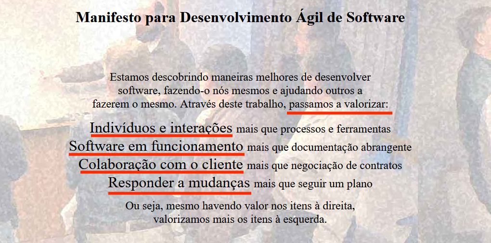

---
hide:
  - toc
---

# Capítulo 2: Aplicação OCI PIZZA

# 2.1 Da Necessidade à Definição de Requisitos

Esta sessão apresenta uma introdução básica à Engenharia de Requisitos. Nele, apresento as etapas iniciais, desde a definição do problema até a formulação dos requisitos, que servirão como guia para o desenvolvimento de uma aplicação web simples.

## 2.2.1 Contado do Cliente

Imagine que você é uma empresa ou uma agência de desenvolvimento de software que acaba de receber uma ligação de um potencial cliente, ansioso para discutir suas necessidades e como você pode ajudá-lo a transformar suas ideias em soluções digitais eficazes.

O diálogo a seguir ilustra a interação entre você, o desenvolvedor, e seu cliente, Gabriel:

    
Gabriel (cliente)

    
Olá! Eu sou o Gabriel, proprietário da "OCI PIZZA". Estou interessado em criar um site para o meu negócio. Você pode me ajudar?

    
Você (desenvolvedor)

    
Olá, Gabriel! Claro, ficaremos felizes em ajudar. Você já tem alguma ideia do que gostaria de incluir no seu site?
    

    
Gabriel (cliente)

    
Sim, eu gostaria de ter uma página inicial com uma apresentação da pizzaria, uma seção para o nosso cardápio, informações de contato e um formulário para pedidos online.

    
Você (desenvolvedor)

    
Ótimo! Isso é um bom começo. Você já tem um design em mente ou gostaria de sugestões?
    

    
Gabriel (cliente)

    
Eu gostaria de algo que fosse visualmente atraente, com cores quentes, que lembrassem pizza. Também quero que seja fácil de navegar.

    
Você (desenvolvedor)

    
Perfeito! Podemos desenvolver um design que atenda perfeitamente às suas necessidades. Você tem fotos das suas pizzas e do local que gostaria de usar no site?

    
Gabriel (cliente)

    
Sim, tenho algumas fotos que tirei. Posso enviá-las para vocês.

    
Você (desenvolvedor)

    
Excelente! Isso ajudará a tornar o site mais pessoal. E quanto ao cardápio, você já tem uma versão digital que podemos usar?

    
Gabriel (cliente)

    
Sim, eu tenho um PDF do cardápio. Posso enviar isso também.

    
Você (desenvolvedor)

    
Ótimo! E sobre o sistema de pedidos online, você gostaria de integrar um serviço de entrega ou prefere que os pedidos sejam feitos apenas para retirada?

    
Gabriel (cliente)

    
Eu gostaria de oferecer ambos, se possível. Quero que os clientes possam escolher entre retirar na loja ou receber em casa.

    
Você (desenvolvedor)

    
Entendi. Podemos implementar um sistema de pedidos que permita essas opções. Você já tem um método de pagamento em mente?

    
Gabriel (cliente)

    
Eu gostaria de aceitar cartões de crédito e débito, além de pagamentos via PIX.

    
Você (desenvolvedor)

    
Sem problemas! Vamos integrar essas opções de pagamento. Agora, você já tem um domínio registrado para o site?

    
Gabriel (cliente)

    
Não, ainda não. Você pode me ajudar com isso?

    
Você (desenvolvedor)

    
Claro! Podemos ajudá-lo a registrar um domínio que se encaixe no nome da sua pizzaria. Você tem alguma ideia de qual nome gostaria de usar?

    
Gabriel (cliente)

    
Eu pensei em algo como "ocipizza.com.br".

    
Você (desenvolvedor)

    
Esse nome parece ótimo! Vamos verificar se está disponível. Por último, qual é o seu prazo para ter o site pronto?

    
Gabriel (cliente)

    
Eu gostaria de ter o site pronto em um mês, se possível. Estamos planejando uma promoção e seria ótimo ter tudo funcionando até lá.

    
Você (desenvolvedor)

    
Vamos trabalhar para atender a esse prazo. Vou preparar uma proposta com todos os detalhes e custos envolvidos e entrarei em contato em breve. Alguma outra dúvida ou consideração?

    
Gabriel (cliente)

    
Não, isso é tudo por enquanto. Obrigado pela ajuda!

    
Você (desenvolvedor)

    
De nada, Gabriel! Estamos ansiosos para trabalhar com você. Fique à vontade para entrar em contato se tiver mais perguntas. Até logo!

## 2.2.2 Engenharia de Requisitos

Com base neste primeiro contato, podemos iniciar a elaboração de uma descrição concisa das funcionalidades do sistema, alinhadas às necessidades do cliente.

Definir _"o que um sistema deve fazer"_, ou seja, suas funcionalidades, refere-se ao que chamamos de **_Requisitos Funcionais_** ou **_Requisitos do Usuário_**. 

Além dos requisitos funcionais, há uma outra categoria de requisitos chamada **_Requisitos Não-Funcionais_** ou **_Requisitos de Sistema_**. Esses requisitos tratam de aspectos como desempenho, usabilidade, segurança e escalabilidade, entre outros, e são especificados de maneira quantitativa, utilizando métricas para garantir sua mensuração e avaliação.

A definição e especificação de requisitos são etapas fundamentais no processo de desenvolvimento de software, pois estabelecem as diretrizes necessárias para a construção e entrega do produto. Basicamente, quando o assunto é desenvolvimento de software, duas abordagens principais que podem ser adotadas, abrangendo desde a definição dos requisitos até os processos de desenvolvimento, documentação e entrega:

- **[Processos Waterfall (Modelo em cascata)](https://pt.wikipedia.org/wiki/Modelo_em_cascata)**
    - Primeiro a ser proposto e inspirado nos processos das engenharias tradicionais, esse modelo coleta todas as informações necessárias para o desenvolvimento no início do projeto. Após a criação de uma documentação detalhada, o desenvolvimento avança de forma linear e sequencial, seguindo etapas que se sucedem em cascata, sem realizar interações ou coletar feedback do cliente ao longo do processo.
    
- **[Práticas Ágeis](https://pt.wikipedia.org/wiki/Desenvolvimento_%C3%A1gil_de_software)**
    - Modo alternativo ao _Waterfall_ para o desenvolvimento de software que prioriza a construção incremental de sistemas, mantendo uma interação contínua com o cliente. Práticas ágeis focam na coleta constante de feedback, possibilitando entregas regulares e frequentes de pequenas funcionalidades.

Processos no estilo _[Waterfall](https://pt.wikipedia.org/wiki/Modelo_em_cascata)_ exigem um levantamento detalhado dos requisitos, seguido pela elaboração de uma documentação completa antes da implementação do que foi especificado. O sistema é disponibilizado ao cliente para validação somente após a conclusão de todo o desenvolvimento.

O principal problema do modelo _[Waterfall](https://pt.wikipedia.org/wiki/Modelo_em_cascata)_ é que a documentação se torna um requisito obrigatório, muitas vezes mais valorizado do que o próprio software funcionando conforme as expectativas do cliente. A espera pela conclusão de toda a documentação antes de iniciar o desenvolvimento pode resultar em um produto que não atende mais às necessidades do cliente, que podem ter mudado desde o início do projeto.

Em fevereiro de 2001, na cidade de Snowbird, no estado de Utah, nos Estados Unidos, um grupo de dezessete Engenheiros de Software propôs um modo alternativo para construção de software, que prioriza a proximidade com o cliente e não documentações extensas antes de todo o desenvolvimento, promovendo interações curtas e constantes ao longo do processo de desenvolvimento. Essa nova forma de trabalho resultou no que é conhecido como _["Manifesto do Desenvolvimento Ágil de Software"](https://agilemanifesto.org/iso/ptbr/manifesto.html)_, que prioriza certos princípios e valores em relação a outros, conforme destacado na imagem abaixo:

!!! note "NOTA"
    A versão em português do Brasil do _["Manifesto do Desenvolvimento Ágil de Software"](https://agilemanifesto.org/iso/ptbr/manifesto.html)_ está disponível neste _[link](https://agilemanifesto.org/iso/ptbr/manifesto.html)_.

De certa forma, _"Práticas Ágeis"_ ou _"ser ágil"_ estão mais relacionadas a um estilo de _"fazer acontecer"_ do que à implementação de uma ferramenta, processo ou qualquer forma de controle. A agilidade está mais relacionada às ações necessárias para alcançar um objetivo acordado, com expectativas alinhadas, especialmente quando não se tem clareza sobre como atingi-lo. Esse processo, de certa forma, segue um ciclo que se repete da seguinte maneira:

1. Avançar um passo de cada vez.
2. Avaliar os resultados de cada passo.
3. Ajustar o caminho caso os resultados não estejam de acordo com o esperado.
4. Repetir o ciclo.

Além disso, as _"Práticas Ágeis"_ introduziram novas abordagens para a criação de software, incluindo o _[desenvolvimento guiado por testes (test-driven development)](https://pt.wikipedia.org/wiki/Test-driven_development)_, que consiste em escrever os testes antes do código, e a _[integração contínua (continuous integration)](https://pt.wikipedia.org/wiki/Integra%C3%A7%C3%A3o_cont%C3%ADnua)_, que recomenda que os desenvolvedores integrem o código produzido o quanto antes no repositório principal do projeto, se possível todo dia.

Para se definir requisitos dentro das _"Práticas Ágeis"_, utiliza-se linguagem natural, empregando o que chamamos de _[Histórias de Usuários (User Stories)](https://pt.wikipedia.org/wiki/Hist%C3%B3ria_de_usu%C3%A1rio)_, que será explorado a seguir.

### **[Histórias de Usuários](https://pt.wikipedia.org/wiki/Hist%C3%B3ria_de_usu%C3%A1rio)**

Após o diálogo com o cliente, identificou-se a necessidade de desenvolver uma aplicação web que apresente a pizzaria e inclua seções para o cardápio e cadastro de usuários para realizar pedidos de pizza.

Com base na necessidade apresentada, é possível especificar de forma simples as _[Histórias de Usuários](https://pt.wikipedia.org/wiki/Hist%C3%B3ria_de_usu%C3%A1rio)_ a seguir:

- **Cadastro de Usuário**
    - Como um novo cliente, eu quero me cadastrar na aplicação, para que eu possa fazer pedidos de pizzas.

- **Cardápio de Pizzas**
    - Como um cliente, eu quero navegar pelo cardápio de pizzas, para que eu possa ver as opções disponíveis e escolher a que mais gosto.

- **Filtros de Pesquisa**
    - Como um cliente, eu quero filtrar as pizzas por categoria (como vegetarianas ou especiais), para que eu possa encontrar rapidamente o que estou procurando.

- **Adicionar ao Carrinho**
    - Como um cliente, eu quero adicionar pizzas e bebidas ao meu carrinho, para que eu possa revisar antes de finalizar o meu pedido.

- **Realizar Pedido**
    - Como cliente, desejo fazer o pedido da pizza informando um endereço para a entrega.

- **Painel Administrativo**
    - Como um funcionário da pizzaria, eu quero que o sistema me permita visualizar e gerenciar os pedidos em andamento, além de gerar relatórios sobre vendas e o desempenho geral da pizzaria

- **Suporte ao Cliente**
    - Como um cliente, eu quero ter acesso a um chat de suporte, para que eu possa esclarecer dúvidas, obter informações sobre o status do meu pedido e resolver quaisquer problemas relacionados à minha experiência de compra.

É importante ressaltar que, no caso desta aplicação, os requisitos são simples. No entanto, documentar os requisitos de uma aplicação maior, com mais funcionalidades a serem desenvolvidas, não é uma tarefa fácil, pois é impossível prever todos os aspectos do sistema desde o início. 

!!! note "NOTA"
    O documento _[workflow-funcionament-pizzaria.pdf](./workflow-funcionament-pizzaria.pdf)_, enviado pelo cliente, serviu como base para a elaboração das _[Histórias de Usuários](https://pt.wikipedia.org/wiki/Hist%C3%B3ria_de_usu%C3%A1rio)_ e também proporcionou uma visão geral do funcionamento da pizzaria.