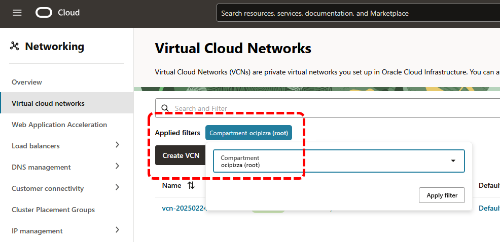
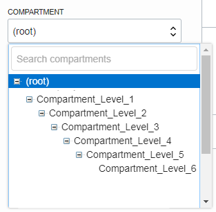

# Capítulo 2: OCI Foundations

# 2.6 IAM, Limites e Cotas

O serviço _[Identity and Access Management (IAM)](https://docs.oracle.com/pt-br/iaas/Content/Identity/getstarted/identity-domains.htm)_ fornece recursos para o **_gerenciamento de identidades_** e o **_controle de acesso_** aos recursos que você cria e gerencia no OCI.

- **Gerenciamento de Identidades**
    - Envolve a administração de usuários, senhas e grupos.

- **Controle de Acesso**
    - Refere-se às políticas de acesso que definem e concedem autorizações, determinando quem pode acessar quais recursos e em que nível.

Toda ação realizada sobre qualquer recurso no OCI, deve ser iniciada por um usuário válido que consiga se **_autenticar_**. Este é o primeiro passo no processo de concessão de acesso. Após uma autenticação bem-sucedida, o OCI verifica se o usuário possui a **_autorização_** necessária para executar a ação solicitada.

Esse conjunto de processos, que começa com a verificação da autenticação e passa pela checagem de autorização, é gerenciado pelo serviço _[IAM](https://docs.oracle.com/pt-br/iaas/Content/Identity/getstarted/identity-domains.htm)_. 

Em resumo, o _[IAM](https://docs.oracle.com/pt-br/iaas/Content/Identity/getstarted/identity-domains.htm)_ assegura que apenas usuários autenticados e autorizados possam interagir com recursos específicos, garantindo a segurança e a integridade do seu ambiente no OCI.

Iniciaremos com uma explicação sobre o **_gerenciamento de identidades_**, abordando usuários e grupos. Em seguida, discutiremos o processo de **_autorização ou controle de acesso_** e, por último, exploraremos o que são _[Limites do Serviço](https://docs.oracle.com/pt-br/iaas/Content/General/Concepts/servicelimits.htm)_ e _[Cotas de Compartimento](https://docs.oracle.com/pt-br/iaas/Content/Quotas/Concepts/resourcequotas.htm)_.

## 2.6.1 Gerenciamento de Identidades

Cada ação realizada nos recursos do OCI, que incluem os recursos do seu _[Tenancy](../capitulo-1/definicoes-nist.md#resource-pooling-agrupamento-de-recursos)_, deve ser executada por um usuário nomeado e válido, independentemente de ser através do _[Web Console](./acessando-o-oci.md#web-console)_, _[OCI CLI](./acessando-o-oci.md#oci-cli-oci-command-line-interface)_ ou _[SDK](./acessando-o-oci.md#oci-sdk-oci-software-development-kits)_.

O gerenciamento de identidades no OCI é feito através de dois recursos:

- **[Contas de Usuários](https://docs.oracle.com/en-us/iaas/Content/Identity/users/about-managing-users.htm)**
    - Uma conta de usuário é uma entidade que representa uma pessoa ou um serviço que pode interagir com os recursos do OCI.

- **[Grupos de Usuários](https://docs.oracle.com/pt-br/iaas/Content/Identity/groups/managinggroups.htm)**
    - Um grupo de usuários é uma coleção de contas de usuários que compartilham as mesmas permissões e políticas de acesso.

Iniciaremos a explicação sobre o _Gerenciamento de Identidades_ através do usuário _Administrador_ do _[Tenancy](../capitulo-1/definicoes-nist.md#resource-pooling-agrupamento-de-recursos)_. Em seguida, abordaremos o processo de criação de usuários e grupos.

### Usuário Administrador

Toda conta criada no OCI possui, por padrão, um usuário _administrador_. Além de ter **_acesso total_** ao _[Tenancy](../capitulo-1/definicoes-nist.md#resource-pooling-agrupamento-de-recursos)_, este é o primeiro usuário do _[IAM](https://docs.oracle.com/pt-br/iaas/Content/Identity/getstarted/identity-domains.htm)_ criado após a ativação da conta, sendo responsável por configurar todos os demais usuários.

O usuário administrador pertence automaticamente ao grupo **_Administrators_**. Você não pode excluir esse grupo, e deve sempre haver pelo menos um usuário contido nele. 

```bash linenums="1"
$ oci iam group list --name "Administrators"
{
  "data": [
    {
      "compartment-id": "ocid1.tenancy.oc1..aaaaaaaaaaaaaaaaaaaaaaaaaaaaaaaaaaaaaaaa",
      "defined-tags": {},
      "description": "Administrators",
      "freeform-tags": {},
      "id": "ocid1.group.oc1..aaaaaaaaqqqqqzzzzzyyyyyyyyxxxxxx",
      "inactive-status": null,
      "lifecycle-state": "ACTIVE",
      "name": "Administrators",
      "time-created": "2024-09-16T19:11:12.670000+00:00"
    }
  ]
}
```

Apenas para registrar, e abordaremos isso mais adiante, o acesso total ao _[Tenancy](../capitulo-1/definicoes-nist.md#resource-pooling-agrupamento-de-recursos)_ para o grupo **_Administrators_** é concedido por meio de uma _[Policy](https://docs.oracle.com/pt-br/iaas/Content/Identity/policieshow/Policy_Basics.htm#top)_ chamada **_"Tenant Admin Policy"_**. Essa _[Policy](https://docs.oracle.com/pt-br/iaas/Content/Identity/policieshow/Policy_Basics.htm#top)_ pode ser consultada utilizando o comando abaixo:

```bash linenums="1"
$ oci iam policy list \
> --compartment-id "ocid1.tenancy.oc1..aaaaaaaaaaaaaaaaaaaaaaaaaaaaaaaaaaaaaaaa" \
> --name "Tenant Admin Policy" \
> --query 'data[].statements'
[
  [
    "ALLOW GROUP Administrators to manage all-resources IN TENANCY"
  ]
]
```

!!! note "NOTA"
    O comando para consultar a _[policy](https://docs.oracle.com/pt-br/iaas/Content/Identity/policieshow/Policy_Basics.htm#top)_ _"Tenant Admin Policy"_ deve incluir, no parâmetro _--compartment-id_, o valor _[OCID](./gerenciando-o-oci-atraves-do-oci-cli.md#251-oracle-cloud-identifier-ocid)_ do _[Tenancy](../capitulo-1/definicoes-nist.md#resource-pooling-agrupamento-de-recursos)_. Note que o comando anterior, que exibiu o grupo _Administrators_, trouxe esse valor por meio da chave _"compartment-id"_.

### Criando Usuários

O comando abaixo é utilizado para criar um novo usuário com o nome de login _fulano.beltrano_:

```bash linenums="1"
$ oci iam user create \
> --name "fulano.beltrano" \
> --email "fbeltrano@sem-dominio.br" \
> --description "Usuário Fulano Beltrano da equipe de Redes." \
> --wait-for-state "ACTIVE"
```

O parâmetro **_--email_** permite especificar o endereço de e-mail do usuário, que deve ser exclusivo entre todos os usuários do _[Tenancy](../capitulo-1/definicoes-nist.md#resource-pooling-agrupamento-de-recursos)_. Uma das principais funções desse endereço de e-mail é facilitar ações de _recuperação de senha_, por exemplo.

Para definir uma senha para o usuário, que será utilizada para acessar o OCI por meio da _[Web Console](./acessando-o-oci.md#web-console)_, é necessário primeiro obter o _[OCID](./gerenciando-o-oci-atraves-do-oci-cli.md#251-oracle-cloud-identifier-ocid)_ do usuário utilizando o seguinte comando:

```bash linenums="1"
$ oci iam user list --name "fulano.beltrano" --query "data[].id"
[
  "ocid1.user.oc1..aaaaaaaaaaaaaaaaaaaaaaaaaaaaaaaaaaaaaaaa"
]
```

Com o _[OCID](./gerenciando-o-oci-atraves-do-oci-cli.md#251-oracle-cloud-identifier-ocid)_ do usuário, é possível definir uma nova senha, seja para um novo acesso ou em caso de perda da senha anterior:

```bash linenums="1"
$ oci iam user ui-password create-or-reset \
> --user-id "ocid1.user.oc1..aaaaaaaaaaaaaaaaaaaaaaaaaaaaaaaaaaaaaaaa"
{
  "data": {
    "inactive-status": null,
    "lifecycle-state": "ACTIVE",
    "password": "EbvyTY9r8Zl6",
    "time-created": "2025-03-28T16:44:40.393000+00:00",
    "user-id": "ocid1.user.oc1..aaaaaaaaaaaaaaaaaaaaaaaaaaaaaaaaaaaaaaaa"
  },
  "etag": "518161f35e8944e8a28c923c4a8bb7b5"
}
```

Observe que a senha, presente na chave _"password"_, foi gerada automaticamente pelo OCI.

!!! note "NOTA"
    Consulte _["Gerenciando Políticas de Senha"](https://docs.oracle.com/pt-br/iaas/Content/Identity/passwordpolicies/Managing-Password-Policies.htm)_ para obter mais informações sobre como ajustar as políticas de senha do Tenancy.

!!! note "NOTA"
    O OCI também oferece suporte ao uso de usuários federados, além dos usuários locais criados diretamente no IAM. Para um exemplo de como federar usuários com o _Microsoft Active Directory (AD)_, consulte o apêndice _[A.4 Federação com Microsoft Active Directory (AD)](../apendice-a/federacao-com-microsoft-active-directory.md)_.

### Criando Grupos

O acesso aos diversos recursos do OCI é concedido a grupos, e não a usuários individuais. Isso significa que, como administrador, você deve autorizar um grupo de usuários em vez de conceder permissões a cada usuário individual.

Um **_grupo é uma coleção de usuários_**, e um usuário pode ser membro de mais de um grupo.

Para criar um grupo de usuários, execute o comando abaixo:

```bash linenums="1"
$ oci iam group create \
> --name "group-network" \
> --description "Grupo de usuários que pertencem à equipe de Redes." \
> --wait-for-state "ACTIVE"
```

!!! note "NOTA"
    O script **_[scripts/capitulo-2/groups.sh](https://github.com/daniel-armbrust/ocipizza-iac/blob/main/scripts/capitulo-2/groups.sh)_** contido no repositório **_["ocipizza-iac"](https://github.com/daniel-armbrust/ocipizza-iac)_**, inclui todos os comandos necessários para a criação dos grupos que serão utilizados nos exemplos apresentados neste capítulo.

Após a criação do grupo, é possível adicionar usuários a ele. Para isso, é necessário obter o _[OCID](./gerenciando-o-oci-atraves-do-oci-cli.md#251-oracle-cloud-identifier-ocid)_ tanto do grupo quanto do usuário que será adicionado.

O comando abaixo retorna o _[OCID](./gerenciando-o-oci-atraves-do-oci-cli.md#251-oracle-cloud-identifier-ocid)_ do grupo _group-network_ recém-criado:

```bash linenums="1"
$ oci iam group list --name "group-network" --query "data[].id"
[
  "ocid1.group.oc1..aaaaaaaaaaaaaaaaaaaaaaaaaaaaaaaaaaaaaaaa"
]
```

Para adicionar o usuário _fulano.beltrano_ ao grupo _group-network_, utilize o seguinte comando:

```bash linenums="1"
$ oci iam group add-user \
> --group-id "ocid1.group.oc1..aaaaaaaaaaaaaaaaaaaaaaaaaaaaaaaaaaaaaaaa" \
> --user-id "ocid1.user.oc1..aaaaaaaaaaaaaaaaaaaaaaaaaaaaaaaaaaaaaaaa"
```

O comando abaixo exibe a lista de usuários que são membros do grupo _group-network_:

```bash linenums="1"
$ oci iam group list-users \
> --group-id "ocid1.group.oc1..aaaaaaaaaaaaaaaaaaaaaaaaaaaaaaaaaaaaaaaa" \
> --all \
> --query "data[].name"
[
  "fulano.beltrano"
]
```

## 2.6.2 Controle de Acesso

Toda interação com as APIs do OCI exige uma **_autorização_** explícita. Isso significa que, por exemplo, para que um usuário possa criar uma _[VCN](https://docs.oracle.com/pt-br/iaas/Content/Network/Tasks/Overview_of_VCNs_and_Subnets.htm)_, após se autenticar com sucesso, ele deve ter as permissões adequadas para realizar essa ação.

A concessão de acesso ou autorização no OCI é realizada por meio de dois recursos principais, que são:

- **[Compartimentos](https://docs.oracle.com/pt-br/iaas/Content/Identity/compartments/managingcompartments.htm)**
    - São unidades de organização que permitem agrupar e isolar recursos, facilitando a gestão e o controle de acesso.

- **[Políticas de Acesso](https://docs.oracle.com/pt-br/iaas/Content/Identity/access/manage-accessresources.htm)**
    - São regras que definem permissões e controlam o acesso aos recursos.

Uma boa prática é iniciar o _"desenho do processo de autorização"_ com as definições dos _[compartimentos](https://docs.oracle.com/pt-br/iaas/Content/Identity/compartments/managingcompartments.htm)_. Após a criação dos _[compartimentos](https://docs.oracle.com/pt-br/iaas/Content/Identity/compartments/managingcompartments.htm)_, é necessário criar as _[políticas de acesso](https://docs.oracle.com/pt-br/iaas/Content/Identity/access/manage-accessresources.htm)_ para permitir que um _[grupo de usuários](#criando-grupos)_ crie e gerencie os recursos contidos em cada _[compartimento](https://docs.oracle.com/pt-br/iaas/Content/Identity/compartments/managingcompartments.htm)_ específico.

### [Compartimentos](https://docs.oracle.com/pt-br/iaas/Content/Identity/compartments/managingcompartments.htm)

_[Compartimentos](https://docs.oracle.com/pt-br/iaas/Content/Identity/compartments/managingcompartments.htm)_, ou _[Compartments](https://docs.oracle.com/pt-br/iaas/Content/Identity/compartments/managingcompartments.htm)_, são uma **_estrutura lógica_** que permite **_organizar_** e **_isolar_** os recursos que você cria no OCI. Utilizar _[compartimentos](https://docs.oracle.com/pt-br/iaas/Content/Identity/compartments/managingcompartments.htm)_ facilita o gerenciamento desses recursos e proporciona uma camada adicional de **_proteção contra acessos não autorizados_**.

!!! note "NOTA"
    **Lembre-se:** um _[compartimento](https://docs.oracle.com/pt-br/iaas/Content/Identity/compartments/managingcompartments.htm)_, juntamente com sua _[política de acesso](https://docs.oracle.com/pt-br/iaas/Content/Identity/access/manage-accessresources.htm)_ correspondente, protege o acesso dos usuários às APIs do OCI, permitindo listar, criar, excluir ou atualizar recursos na nuvem. No entanto, os _[compartimento](https://docs.oracle.com/pt-br/iaas/Content/Identity/compartments/managingcompartments.htm)_ não impõem controle de acesso em nível de rede, ou seja, não funcionam como um _firewall_.

Toda conta no OCI possui um **_Root Compartment_** ou **_Tenancy Compartment_**, que é criado automaticamente após a ativação da conta. Isso se deve ao fato de que todos os recursos que você cria, deve ser colocado dentro de um _[compartimento](https://docs.oracle.com/pt-br/iaas/Content/Identity/compartments/managingcompartments.htm)_. Em outras palavras, cada recurso deve pertencer a um único _[compartimento](https://docs.oracle.com/pt-br/iaas/Content/Identity/compartments/managingcompartments.htm)_.

O nome do **_Root Compartment_** corresponde ao **_nome da conta_** que foi especificado durante o processo de cadastro _(ocipizza)_. Você pode obter o seu _[OCID](./gerenciando-o-oci-atraves-do-oci-cli.md#251-oracle-cloud-identifier-ocid)_ utilizando o comando abaixo:

```bash linenums="1"
$ oci iam compartment list \
> --include-root \
> --all \
> --name "ocipizza" \
> --query 'data[*].[name,id]'
[
  [
    "ocipizza",
    "ocid1.tenancy.oc1..aaaaaaaaaaaaaaaaaaaaaaaaaaaaaaaaaaaaaaaa"
  ]
]
```

Entenda o **_Root ou Tenancy Compartment_**, como se fosse o _"contêiner pai"_ que abriga todos os seus recursos no OCI, incluindo os recursos de outros _[compartimento](https://docs.oracle.com/pt-br/iaas/Content/Identity/compartments/managingcompartments.htm)_.

!!! note "NOTA"
    Alocar recursos diretamente no _Root Compartment_ não é uma boa prática, especialmente quando há diferentes usuários na organização que precisarão interagir com os recursos no OCI. A boa prática é ter diferentes _[compartimentos](https://docs.oracle.com/pt-br/iaas/Content/Identity/compartments/managingcompartments.htm)_ sendo que cada compartimento, será gerenciado por um grupo específico de usuários.

A _[Web Console](./acessando-o-oci.md#web-console)_ filtra a exibição dos seus recursos por _[compartimento](https://docs.oracle.com/pt-br/iaas/Content/Identity/compartments/managingcompartments.htm)_ dentro da região, e você deve selecionar o _[compartimento](https://docs.oracle.com/pt-br/iaas/Content/Identity/compartments/managingcompartments.htm)_ em que deseja trabalhar a partir de uma lista.


<br>

Os _[compartimento](https://docs.oracle.com/pt-br/iaas/Content/Identity/compartments/managingcompartments.htm)_ são **_recursos globais_** e, uma vez criados, estarão disponíveis em todas as regiões inscritas.

Por fim, é possível criar até **_seis subcompartimentos_** dentro de um _[compartimento](https://docs.oracle.com/pt-br/iaas/Content/Identity/compartments/managingcompartments.htm)_, e a maioria dos recursos pode ser movida entre _[compartimentos](https://docs.oracle.com/pt-br/iaas/Content/Identity/compartments/managingcompartments.htm)_.


<br>

#### Compartimentos da Aplicação OCI Pizza

Para ilustrar melhor o uso de _[compartimentos](https://docs.oracle.com/pt-br/iaas/Content/Identity/compartments/managingcompartments.htm)_, imagine diferentes grupos de profissionais de TI colaborando no desenvolvimento da aplicação **_[OCI PIZZA](../capitulo-3/ocipizza-overview.md)_**. Esses grupos incluem:

- **REDES**
    - Grupo de pessoas responsáveis pela criação e gerenciamento dos recursos de rede no OCI.
        
- **APLICAÇÃO**
    - Grupo de pessoas responsáveis pela criação e gerenciamento de recursos de computação, bem como pela implantação da aplicação.

- **DBA**
    - Grupo de pessoas responsáveis pela criação e gerenciamento dos Bancos de Dados.

A separação de funções por tipo de profissional é uma prática comum que garante que cada equipe tenha acesso somente aos recursos necessários para desempenhar suas atividades. Por exemplo, os profissionais da equipe de **_REDES_** terão permissão apenas para gerenciar recursos de rede, como _[VCNs](../capitulo-4/servico-de-redes.md)_, _[sub-redes](../capitulo-4/servico-de-redes.md)_, _[VPNs Site-To-Site](https://docs.oracle.com/pt-br/iaas/Content/Network/Tasks/overviewIPsec.htm)_, etc.

Por outro lado, os profissionais de **_APLICAÇÃO_** terão acesso somente aos recursos de computação, como _[Compute Instances](https://docs.oracle.com/pt-br/iaas/Content/Compute/Concepts/computeoverview.htm)_, _[Container Instances](https://docs.oracle.com/pt-br/iaas/Content/container-instances/overview-of-container-instances.htm)_, _[Kubernetes Engine (OKE)](https://docs.oracle.com/pt-br/iaas/Content/ContEng/Concepts/contengoverview.htm)_, etc.

Da mesma forma, os profissionais **_DBA_** terão acesso somente aos recursos de bancos de dados, como o _[Oracle NoSQL](https://docs.oracle.com/en/database/other-databases/nosql-database/index.html)_.

Além da separação por grupos de usuários, outra forma de organizar os recursos é através da distinção por _"ambientes"_, como **_Produção (PRD)_**, **_Homologação (HML)_** e **_Desenvolvimento (DEV)_**.

Com base nessas definições, temos a seguinte estrutura de _[compartimentos](https://docs.oracle.com/pt-br/iaas/Content/Identity/compartments/managingcompartments.htm)_ e _subcompartimentos (child compartments)_ para o _ambiente de produção (prd)_:


<br>

A partir do desenho, é possível observar que o grupo de usuários de redes _(group-network)_ terá autorização para criar recursos de rede exclusivamente no _[compartimento](https://docs.oracle.com/pt-br/iaas/Content/Identity/compartments/managingcompartments.htm)_ _cmp-network_. Outros grupos de usuários, como o de _aplicação (group-appl)_ e o de _DBA (group-dba)_, também terão permissões restritas aos seus respectivos _[compartimentos](https://docs.oracle.com/pt-br/iaas/Content/Identity/compartments/managingcompartments.htm)_ _(cmp-appl e cmp-database)_. Por fim, o grupo _Administrators_ tem acesso total a todos os _[compartimentos](https://docs.oracle.com/pt-br/iaas/Content/Identity/compartments/managingcompartments.htm)_.

Para criar um compartimento, utilize o seguinte comando:

```bash linenums="1"
$ oci iam compartment create \
> --compartment-id "ocid1.tenancy.oc1..aaaaaaaaaaaaaaaaaaaaaaaaaaaaaaaaaaaaaaaa" \
> --name "cmp-prd" \
> --description "Compartimento para os recursos de produção (cmp-prd)." \
> --wait-for-state "ACTIVE"
```

Após a criação do _[compartimento](https://docs.oracle.com/pt-br/iaas/Content/Identity/compartments/managingcompartments.htm)_, obteremos seu  _[OCID](./gerenciando-o-oci-atraves-do-oci-cli.md#251-oracle-cloud-identifier-ocid)_ que será utilizado na criação do próximo _[compartimento](https://docs.oracle.com/pt-br/iaas/Content/Identity/compartments/managingcompartments.htm)_, estabelecendo assim a hierarquia de _[compartimentos](https://docs.oracle.com/pt-br/iaas/Content/Identity/compartments/managingcompartments.htm)_, igual ao que foi apresentado na imagem anterior.

```bash linenums="1"
$ oci iam compartment list \
> --name "cmp-prd" \
> --query "data[].id"
[
  "ocid1.compartment.oc1..aaaaaavvvvvvvddddddddddd"
]
```

Com o _[OCID](./gerenciando-o-oci-atraves-do-oci-cli.md#251-oracle-cloud-identifier-ocid)_ do _[compartimento](https://docs.oracle.com/pt-br/iaas/Content/Identity/compartments/managingcompartments.htm)_ do _ambiente de produção (prd)_, prosseguimos para a criação do próximo _[compartimento](https://docs.oracle.com/pt-br/iaas/Content/Identity/compartments/managingcompartments.htm)_, que é o _cmp-network_:

```bash linenums="1"
$ oci iam compartment create \
> --compartment-id "ocid1.compartment.oc1..aaaaaavvvvvvvddddddddddd" \
> --name "cmp-network" \
> --description "Compartimento para os recursos de redes do ambiente de produção." \
> --wait-for-state "ACTIVE"
```

A criação dos demais _[compartimentos](https://docs.oracle.com/pt-br/iaas/Content/Identity/compartments/managingcompartments.htm)_ seguem a mesma lógica e não serão apresentados aqui.

!!! note "NOTA"
    O script **_[scripts/capitulo-2/compartments.sh](https://github.com/daniel-armbrust/ocipizza-iac/blob/main/scripts/capitulo-2/compartments.sh)_** contido no repositório **_["ocipizza-iac"](https://github.com/daniel-armbrust/ocipizza-iac)_**, inclui todos os comandos para a criação dos _[compartimentos](https://docs.oracle.com/pt-br/iaas/Content/Identity/compartments/managingcompartments.htm)_ da aplicação OCI PIZZA.


### [Políticas de Acesso](https://docs.oracle.com/pt-br/iaas/Content/Identity/access/manage-accessresources.htm)

!!! note "NOTA"
    Esse tipo de separação, aplica o conceito de _segurança da informação_ conhecido como _[principio do menor ou mínimo privilégio (least privilege)](https://en.wikipedia.org/wiki/Principle_of_least_privilege)_, no qual determina que um usuário, programa ou sistema, deve ter acesso restrito apenas às permissões necessárias para desempenhar suas funções específicas.

## 2.6.3 Grupos Dinâmicos

## 2.6.4 Gerenciamento de Regiões

### Home Region

## 2.6.5 Audit