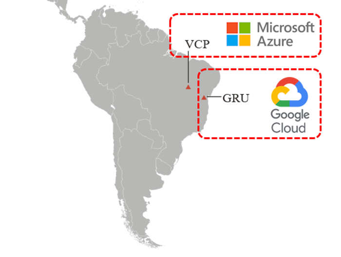
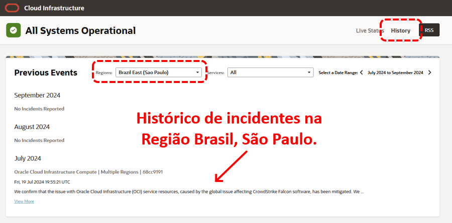

# Capítulo 2: OCI Foundations

# 2.1 Introdução ao OCI

A _[Oracle Cloud Infrastructure (OCI)](https://www.oracle.com/cloud/)_ é a plataforma de computação em nuvem da Oracle, projetada para atender a diversas necessidades pessoais e empresariais. Ela oferece uma ampla gama de serviços, incluindo computação, armazenamento, rede, banco de dados, inteligência artificial e muito mais. Isso permite que você ou sua empresa implementem soluções em nuvem flexíveis e escaláveis em um ambiente seguro e de alto desempenho.

Antes de começar a utilizar o _[OCI](https://www.oracle.com/cloud/)_, é fundamental compreender alguns conceitos básicos que ajudarão no planejamento da sua arquitetura computacional na nuvem.

## 2.1.1 Região

Uma _[região](https://docs.oracle.com/pt-br/iaas/Content/General/Concepts/regions.htm)_ é uma área geográfica que abriga **_um ou mais data centers_**, os quais podem ser utilizados para construir sua infraestrutura de TI. As regiões podem ser separadas por grandes distâncias, abrangendo países ou até mesmo continentes.

A ideia de ter múltiplas regiões disponíveis em todo o mundo é permitir que você expanda seu negócio globalmente, além de possibilitar a construção de arquiteturas altamente disponíveis. Ter a possibilidade de criar e disponibilizar seus recursos computacionais em diversas localidades do mundo, não apenas melhora a resiliência e a redundância dos seus serviços, mas também assegura que seus usuários tenham acesso às suas aplicações com baixa latência, independentemente da sua localização geográfica.

Toda região possui **_três tipos de identificações_**, cada uma utilizada em contextos diferentes. As colunas da tabela abaixo, _"Nome da Região"_, _"Identificador"_ e _"Chave da Região"_, são usadas para identificar uma região específica:

| Nome da Região              | Localidade        | Identificador | Chave da Região |
|-----------------------------|-------------------|---------------|-----------------|
| Brazil East (Sao Paulo)     | São Paulo, Brasil | sa-saopaulo-1 | GRU             |
| Brazil Southeast (Vinhedo)  | Vinhedo, Brasil   | sa-vinhedo-1  | VCP             |
| Chile Central (Santiago)    | Santiago, Chile   | sa-santiago-1 | SCL             |
| US East (Ashburn)           | Ashburn, VA       | us-ashburn-1  | IAD             |
| Japan East (Tokyo)          | Tokyo, Japão      | ap-tokyo-1    | NRT             |

!!! note "NOTA"
    Aqui foram listados apenas alguns nomes de regiões. A Oracle cria e disponibiliza novas regiões ao redor do mundo periodicamente. Para uma lista completa e atualizada das regiões disponíveis, consulte _["Regiões e Domínios de Disponibilidade"](https://docs.oracle.com/pt-br/iaas/Content/General/Concepts/regions.htm)_.

Através da _[Console Web do OCI](https://docs.public.oneportal.content.oci.oraclecloud.com/pt-br/iaas/Content/GSG/Tasks/signingin.htm)_, o _"Nome da Região"_ é o utilizado:

  

Já para alguns _[Identificadores de Recursos (OCID)](https://docs.oracle.com/pt-br/iaas/Content/General/Concepts/identifiers.htm)_, o _"Identificador"_ da região é usado:

!!! note "NOTA"
    Por enquanto, é importante entender que todo recurso criado dentro do OCI possui um identificador único chamado _[Oracle Cloud ID (OCID)](https://docs.oracle.com/pt-br/iaas/Content/General/Concepts/identifiers.htm#Oracle)_. Na seção XYZ, abordaremos mais detalhes sobre _[OCID](https://docs.oracle.com/pt-br/iaas/Content/General/Concepts/identifiers.htm#Oracle)_.

Já o nome do domínio utilizado pelo serviço do _[Container Registry](https://docs.oracle.com/pt-br/iaas/Content/Registry/Concepts/registryoverview.htm)_, pode utilizar tanto o _"Identificador"_ quanto a _"Chave da Região"_:

Por fim, algumas regiões oferecem conectividade direta com outros provedores de nuvem, como _[Microsoft Azure](https://docs.oracle.com/pt-br/iaas/Content/Network/Concepts/azure.htm)_ e _[Google Cloud](https://docs.oracle.com/en-us/iaas/Content/Network/Concepts/access-to-google-cloud-platform.htm)_, o que possibilita a criação de arquiteturas _[Multicloud](https://docs.oracle.com/pt-br/iaas/Content/multicloud/Oraclemulticloud.htm)_.

## 2.1.2 Availability Domains (AD)

Um _[Availability Domains (AD)](https://docs.oracle.com/pt-br/iaas/Content/General/Concepts/regions.htm)_ ou _[Domínio de Disponibilidade](https://docs.oracle.com/pt-br/iaas/Content/General/Concepts/regions.htm)_, é basicamente um **_data center_** que reside dentro de uma região. 

Dentro de uma região, podem existir um ou, no máximo, três _[Availability Domains](https://docs.oracle.com/pt-br/iaas/Content/General/Concepts/regions.htm)_ interconectados por links de baixa latência. A principal razão de existir múltiplos _[Availability Domains](https://docs.oracle.com/pt-br/iaas/Content/General/Concepts/regions.htm)_ em uma região é permitir a criação de recursos de TI de forma distribuída, evitando assim o que é conhecido como _"ponto único de falha"_.

Os _[Availability Domains](https://docs.oracle.com/pt-br/iaas/Content/General/Concepts/regions.htm)_ são isolados uns dos outros, não compartilham infraestrutura e são projetados para serem tolerantes a falhas. Caso um deles venha a falhar, isso não impacta os outros _[Availability Domains](https://docs.oracle.com/pt-br/iaas/Content/General/Concepts/regions.htm)_ em operação na mesma região.

")

Para algumas regiões onde há somente um _[Availability Domain](https://docs.oracle.com/pt-br/iaas/Content/General/Concepts/regions.htm)_, o _[OCI](https://www.oracle.com/cloud/)_ oferece a opção de utilizar uma outra região geograficamente mais próxima. Esse é o caso do Brasil, onde existem duas regiões relativamente próximas: São Paulo e Vinhedo.

Os recursos que você cria no OCI podem ser do tipo _global (Cross-Region)_, o que significa que são criados uma vez e disponibilizados em todas as regiões nas quais você está inscrito. Também podem ser _recursos regionais (Regional Resources)_, que são criados em uma região e se tornam acessíveis por todos os _[Availability Domains](https://docs.oracle.com/pt-br/iaas/Content/General/Concepts/regions.htm)_ dessa região, ou _recursos específicos do [Availability Domains](https://docs.oracle.com/pt-br/iaas/Content/General/Concepts/regions.htm) (Availability Domain-Specific)_, que estão disponíveis apenas dentro de um determinado _[Availability Domain](https://docs.oracle.com/pt-br/iaas/Content/General/Concepts/regions.htm)_.

Compreender essa característica ao criar seus recursos no OCI permite que você desenvolva uma infraestrutura redundante e resiliente, assegurando que sua arquitetura continue operante mesmo diante de falhas. E lembre-se: é importante ter em mente que **_tudo falha, até o OCI falha_**.

Alguns exemplos referentes à localidade dos recursos incluem:

- **Global (Cross-Region)**
    - [Usuários](https://docs.oracle.com/pt-br/iaas/Content/Identity/users/about-managing-users.htm)
    - [Grupos de Usuários](https://docs.oracle.com/pt-br/iaas/Content/Identity/groups/managinggroups.htm)
    - [Políticas do IAM](https://docs.oracle.com/pt-br/iaas/Content/Identity/policieshow/Policy_Basics.htm)

- **Recursos Regionais (Regional Resources)**
    - [Virtual Cloud Networks (VCNs)](https://docs.oracle.com/pt-br/iaas/Content/Network/Tasks/Overview_of_VCNs_and_Subnets.htm)
    - [Sub-redes](https://docs.oracle.com/pt-br/iaas/Content/Network/Tasks/Overview_of_VCNs_and_Subnets.htm)
    - [Container Registry](https://docs.oracle.com/pt-br/iaas/Content/Registry/Concepts/registryoverview.htm)

- **Recursos Específicos do Availability Domains (Availability Domain-Specific)**
    - [Compute Instances (Máquinas Virtuais ou Físicas)](https://docs.oracle.com/pt-br/iaas/Content/Compute/Concepts/computeoverview.htm)
    - [Container Instances](https://docs.oracle.com/pt-br/iaas/Content/container-instances/overview-of-container-instances.htm)
    - [Block Volume](https://docs.oracle.com/pt-br/iaas/Content/Block/Concepts/overview.htm)

!!! note "NOTA"
    Para uma lista completa sobre os tipos de recursos com base em sua disponibilidade, consulte _["Resource Availability"](https://docs.oracle.com/en-us/iaas/Content/General/Concepts/regions.htm#Resource)_.

## 2.1.3 Fault Domains (FD)

Um _[Fault Domain](https://docs.oracle.com/pt-br/iaas/Content/General/Concepts/regions.htm#fault)_ é um agrupamento de hardware e infraestrutura dentro de um _Availability Domain_. Cada _Availability Domain_ possui **_três Fault Domains_**, que também podem ser utilizados para distribuir os recursos computacionais que você cria no OCI em diferentes conjuntos isolados de hardware.

Ao criar um recurso de computação _[(Compute Instance)](https://docs.oracle.com/pt-br/iaas/Content/Compute/Concepts/computeoverview.htm)_, é possível selecionar em qual dos _três [Fault Domain](https://docs.oracle.com/pt-br/iaas/Content/General/Concepts/regions.htm#fault)_ disponíveis sua máquina virtual será criada. Falhas ou eventos de manutenção que afetam um determinado _[Fault Domain](https://docs.oracle.com/pt-br/iaas/Content/General/Concepts/regions.htm#fault)_ não causam indisponibilidade em outros _[Fault Domains](https://docs.oracle.com/pt-br/iaas/Content/General/Concepts/regions.htm#fault)_. Caso um _[Fault Domain](https://docs.oracle.com/pt-br/iaas/Content/General/Concepts/regions.htm#fault)_ não seja selecionado, o OCI escolherá automaticamente um para você.

")

!!! note "NOTA"
    Consulte _["Manutenção da Infraestrutura"](https://docs.oracle.com/pt-br/iaas/Content/Compute/References/infrastructure-maintenance.htm#infrastructure-maintenance)_ para obter mais informações sobre as manutenções realizadas pelo OCI que podem afetar suas instâncias computacionais em diferentes _[Fault Domain](https://docs.oracle.com/pt-br/iaas/Content/General/Concepts/regions.htm#fault)_.

!!! note "NOTA"
    Um _[Fault Domain](https://docs.oracle.com/pt-br/iaas/Content/General/Concepts/regions.htm#fault)_ pode ser entendido como um data center lógico dentro de um data center físico ou, mais especificamente, dentro de um _[Availability Domain](https://docs.oracle.com/pt-br/iaas/Content/General/Concepts/regions.htm)_.

## 2.1.4 Níveis de Proteção

Em resumo, os níveis de proteção contra falhas que o OCI disponibiliza são:

- **Regiões**
    - Em muitos países, há duas regiões relativamente próximas que podem ser utilizadas caso uma região venha a falhar.

- **Availability Domains**
    - Proporciona proteção e disponibilidade contra falhas gerais que podem ocorrer em um Availability Domain específico.

- **Fault Domains**
    - Proporciona proteção e disponibilidade dentro de um Availability Domain, isolando os recursos em diferentes conjuntos de hardware.

## 2.1.5 OCI Status

_[OCI Status](https://ocistatus.oraclecloud.com)_ ou _[OCI Service Health Dashboard](https://ocistatus.oraclecloud.com)_ é um painel de acesso público que fornece o _"status atual"_ de todos os serviços do OCI por região. Além da monitoração em tempo real, é possível consultar o histórico de incidentes que já ocorreram na infraestrutura do OCI.

Para acessar a página do _[OCI Status](https://ocistatus.oraclecloud.com)_ ou _[OCI Service Health Dashboard](https://ocistatus.oraclecloud.com)_, insira o seguinte endereço no seu navegador:

Assim que a página for carregada, você poderá selecionar a localidade geográfica para verificar o _"status atual"_ dos serviços nas regiões da localidade selecionada:

  

Por meio do link **_History_**, é possível consultar os problemas anteriores de uma região específica:

!!! note "NOTA"
    Para mais informações, consulte a documentação do _[OCI Status](https://ocistatus.oraclecloud.com)_ em _["Status do Sistema"](https://docs.oracle.com/pt-br/iaas/Content/General/Concepts/status-service.htm)_.