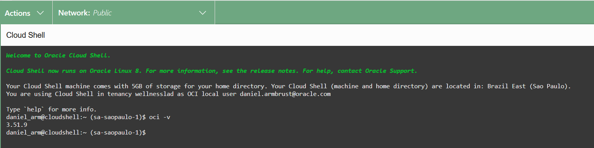

# Capítulo 2: OCI Foundations

# 2.5 Introdução ao OCI CLI

Na seção _["2.4 Acessando o OCI"](./acessando-o-oci.md)_, vimos que o _[OCI CLI](https://docs.oracle.com/pt-br/iaas/Content/API/Concepts/cliconcepts.htm)_ é uma ferramenta de linha de comando _(CLI - Command Line Interface)_ que permite interagir com as APIs do OCI. Com o _[OCI CLI](https://docs.oracle.com/pt-br/iaas/Content/API/Concepts/cliconcepts.htm)_, por meio de seus comandos, parâmetros e opções, é possível criar e gerenciar toda a sua infraestrutura no OCI.

Nos exemplos deste livro, o _[OCI CLI](https://docs.oracle.com/pt-br/iaas/Content/API/Concepts/cliconcepts.htm)_ e o _[Terraform](https://www.terraform.io/)_ serão os principais meios de interação com o OCI, uma vez que a _[Web Console](https://docs.oracle.com/pt-br/iaas/Content/GSG/Concepts/console.htm)_, por ser uma interface gráfica, sofre alterações e atualizações com maior frequência.

Esta seção oferece uma compreensão completa de como utilizar o _[OCI CLI](https://docs.oracle.com/pt-br/iaas/Content/API/Concepts/cliconcepts.htm)_ para criar e gerenciar sua infraestrutura no OCI.

## 2.5.1 Instalação do OCI CLI

Para começar a utilizar o _[OCI CLI](https://docs.oracle.com/pt-br/iaas/Content/API/Concepts/cliconcepts.htm)_, é necessário primeiro instalá-lo de acordo com o seu sistema operacional. No meu caso, o _[OCI CLI](https://docs.oracle.com/pt-br/iaas/Content/API/Concepts/cliconcepts.htm)_ será instalado em um **_[Oracle Linux versão 8](https://www.oracle.com/linux/technologies/oracle-linux-downloads.html)_**.

```bash linenums="1"
$ cat /etc/oracle-release
Oracle Linux Server release 8.10
```

!!! note "NOTA"
    O _Oracle Linux_ é gratuito e pode ser baixado no site _[Oracle Linux Downloads](https://www.oracle.com/linux/technologies/oracle-linux-downloads.html)_.

**1.** Baixar o instalador do _[OCI CLI](https://docs.oracle.com/pt-br/iaas/Content/API/Concepts/cliconcepts.htm)_ através do seguinte comando:

```bash linenums="1"
$ wget https://raw.githubusercontent.com/oracle/oci-cli/master/scripts/install/install.sh
```

**2.** Execute o script que foi baixado com a opção **_"--accept-all-defaults"_** para realizar uma instalação em que todas as perguntas serão respondidas com os valores padrão:

```bash linenums="1"
$ sh ./install.sh --accept-all-defaults
```

**3.** Por fim, para verificar se o _[OCI CLI](https://docs.oracle.com/pt-br/iaas/Content/API/Concepts/cliconcepts.htm)_ foi instalado com sucesso, basta executar o comando abaixo para exibir a sua versão:

```bash linenums="1"
$ oci -v
3.52.1
```

!!! note "NOTA"
    A documentação disponível no link _[Instalando a CLI](https://docs.oracle.com/pt-br/iaas/Content/API/SDKDocs/cliinstall.htm#Quickstart)_ oferece mais informações sobre como instalar o _[OCI CLI](https://docs.oracle.com/pt-br/iaas/Content/API/Concepts/cliconcepts.htm)_ em diferentes sistemas operacionais.

### Atualizando o OCI CLI

É sempre recomendável verificar se estamos utilizando a versão mais recente do _[OCI CLI](https://docs.oracle.com/pt-br/iaas/Content/API/Concepts/cliconcepts.htm)_ disponível.

```bash linenums="1"
$ oci --latest-version
3.53.0
You are using OCI CLI version 3.52.1, however version 3.53.0 is available. You should consider upgrading using https://docs.oracle.com/iaas/Content/API/SDKDocs/cliupgrading.htm
```

Neste caso, o comando nos alertou sobre a necessidade de atualização. Além de corrigir bugs e implementar melhorias, a atualização também permite a interação com novos serviços do OCI.

Para realizar a atualização, basta executar o comando abaixo:

```bash linenums="1"
$ pip3 install oci-cli --upgrade
```

Pronto! Agora podemos confirmar que a atualização do _[OCI CLI](https://docs.oracle.com/pt-br/iaas/Content/API/Concepts/cliconcepts.htm)_ foi bem-sucedida, pois não há mais avisos relacionados à atualização de versão:

```bash linenums="1"
$ oci --latest-version
3.52.1
```

### Cloud Shell

Uma instalação _"pronta para uso"_ do _[OCI CLI](https://docs.oracle.com/pt-br/iaas/Content/API/Concepts/cliconcepts.htm)_, está disponível por meio do _[Cloud Shell](https://docs.oracle.com/pt-br/iaas/Content/API/Concepts/cloudshellintro.htm)_, que pode ser acessado pela _Web Console_:


<br>

O _[Cloud Shell](https://docs.oracle.com/pt-br/iaas/Content/API/Concepts/cloudshellintro.htm)_ é um terminal Linux acessível por meio da _Web Console_ que oferece um _shell_ pré-autenticado com várias ferramentas já instaladas, incluindo o _[OCI CLI](https://docs.oracle.com/pt-br/iaas/Content/API/Concepts/cliconcepts.htm)_.



!!! note "NOTA"
    Consulte _["O que está Incluído no Cloud Shel"](https://docs.oracle.com/pt-br/iaas/Content/API/Concepts/cloudshellintro.htm)_ para acessar uma lista completa das ferramentas e utilitários disponíveis no _[Cloud Shell](https://docs.oracle.com/pt-br/iaas/Content/API/Concepts/cloudshellintro.htm)_.

## 2.5.2 API Keys

