---
hide:
  - toc
---

# Capítulo 2: OCI Foundations

# 2.3 Modelos de Cobraça

Um dos principais benefícios da Computação em Nuvem é a facilidade de provisionar recursos de TI a um custo significativamente mais acessível em comparação ao modelo on-premises.

O OCI oferece uma ampla gama de serviços e recursos computacionais que podem ser criados de forma fácil e rápida. No entanto, é essencial compreender como cada serviço ou recurso é tarifado e cobrado, a fim de evitar surpresas indesejadas no final do mês.

Neste capítulo, abordaremos os diferentes modelos de cobrança disponíveis no OCI, detalhando como a tarifação de alguns serviços e recursos computacionais

## 2.3.1 Pay As You Go (PAYG) e Oracle Universal Credits (OUC)

Basicamente há dois _Modelos de Cobrança_ disponíveis:

### **Pay As You Go (PAYG)**

_Pay As You Go (PAYG)_ ou _"Pague conforme o uso"_ é o mais popular no universo da Computação em Nuvem, sendo especialmente indicado para usuários que estão explorando a nuvem ou desenvolvendo protótipos.

Dentro desse modelo de cobrança, existe o que chamados de _["Preço de Lista"](https://www.oracle.com/cloud/price-list/)_, que consiste em uma tabela que detalha todos os serviços e recursos disponíveis no OCI, incluindo seus respectivos valores e a forma como cada um deles é cobrado. A maioria dos itens dessa lista é cobrado por _"horas de utilização"_.

Para entendermos melhor como os itens são efetivamente cobrados, vamos analisar o exemplo da criação de uma _[Máquina Virtual (VM)](https://docs.oracle.com/en-us/iaas/Content/Compute/Concepts/computeoverview.htm)_ com as seguintes especificações: _sistema operacional Windows_, _2 OCPUs_, _8 GB de memória RAM_ e um disco de _100 GB_ e outro de _200 GB_.

!!! note "NOTA"
    No OCI, **1 OCPU** é equivalente a **2 vCPUs**. No exemplo mencionado, a _[Máquina Virtual](https://docs.oracle.com/en-us/iaas/Content/Compute/Concepts/computeoverview.htm)_ será configurada com **2 OCPUs**, o que equivale a **4 vCPUs**.

A estrutura de uma _[Máquina Virtual (VM)](https://docs.oracle.com/en-us/iaas/Content/Compute/Concepts/computeoverview.htm)_ no OCI é composta por diversos recursos que influenciam diretamente no seu custo final. O desenho a seguir ilustra essa composição:

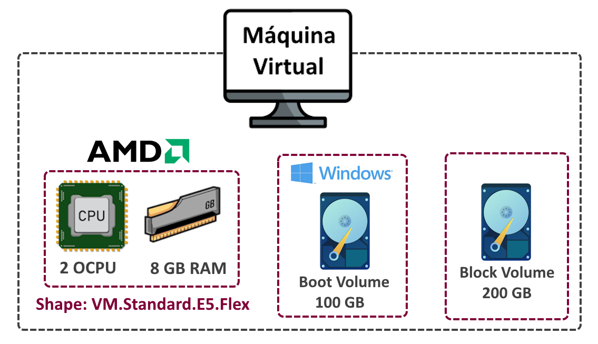
 

A partir dos recursos que formam a _[Máquina Virtual (VM)](https://docs.oracle.com/en-us/iaas/Content/Compute/Concepts/computeoverview.htm)_, é possível consultar os valores diretamenta na página do _["Preço de Lista"](https://www.oracle.com/cloud/price-list/)_.

!!! note "NOTA"
    O objetivo aqui é fornecer uma visão geral de como os recursos e serviços no OCI são cobrados. Realizar cálculos manuais com base nos itens listados na página _["Preço de Lista"](https://www.oracle.com/cloud/price-list/)_ pode resultar em erros. A abordagem mais eficaz, como veremos na seção a seguir, é utilizar o _[OCI Cost Estimator](https://www.oracle.com/cloud/costestimator.html)_.
    
Antes de começarmos a entender os cálculos, é importante ressaltar que os valores apresentados no _["Preço de Lista"](https://www.oracle.com/cloud/price-list/)_ estão disponíveis em diferentes moedas. Para o nosso propósito, iremos focar nos valores em Real (R$):

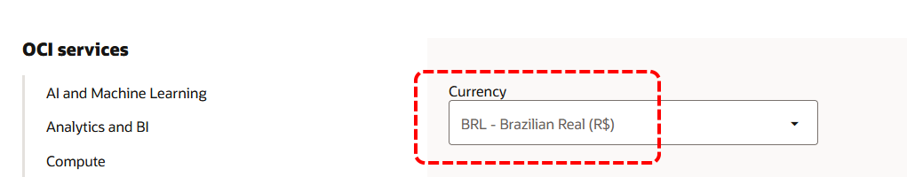
 

!!! note "NOTA"
    Sempre consulte a página _["Preço de Lista"](https://www.oracle.com/cloud/price-list/)_ para obter os valores mais atualizados e detalhados sobre os serviços e recursos disponíveis no OCI.

!!! note "NOTA"
    Para os cálculos de horas de utilização, utilizaremos o valor de **744**, que corresponde ao total de horas em um período de **31 dias**.

#### **2 OCPUs**

Existem diferentes tipos de processadores, ou OCPUs, disponíveis no OCI, e cada tipo possui um valor diferente por _horas de utilização_. Por exemplo, um processador do tipo **Ampere A1** tem um custo menor por hora, sendo **R$ 0,055112**, enquanto um processador do tipo **AMD** custa **R$ 0,082668** e um processador do tipo **Intel** tem um valor de **R$ 0,110224**.

!!! note "NOTA"
    Consulte a seção XYZ para maiores detalhes sobre OCPU e os tipos de processadores disponíveis no OCI.

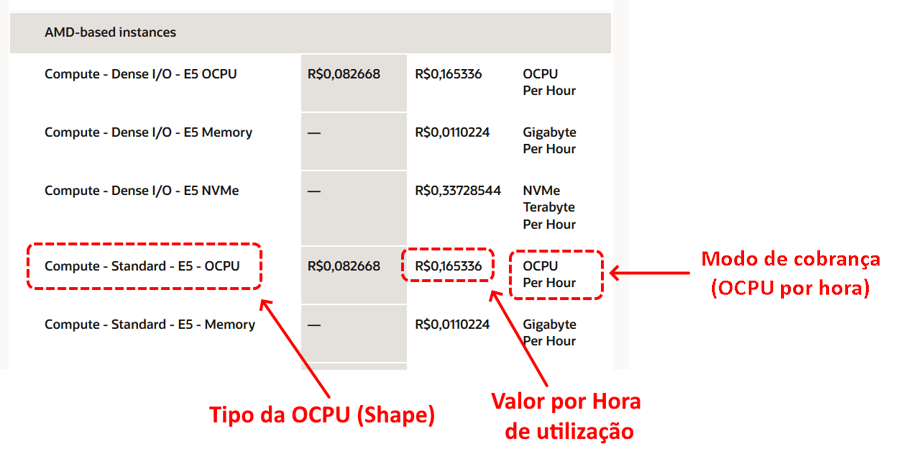

A _[Máquina Virtual](https://docs.oracle.com/en-us/iaas/Content/Compute/Concepts/computeoverview.htm)_ de exemplo possui **_duas OCPUs AMD do tipo E5_** e permanecerá ligada durante todo o mês **(31 dias = 744 horas/mês)**. Com base nisso, podemos realizar o seguinte cálculo:

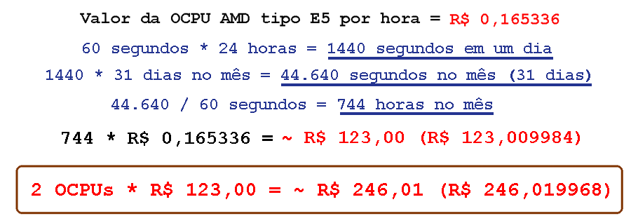
 

#### **8 GB de Memória RAM**

Para a memória, o cálculo segue o mesmo princípio:

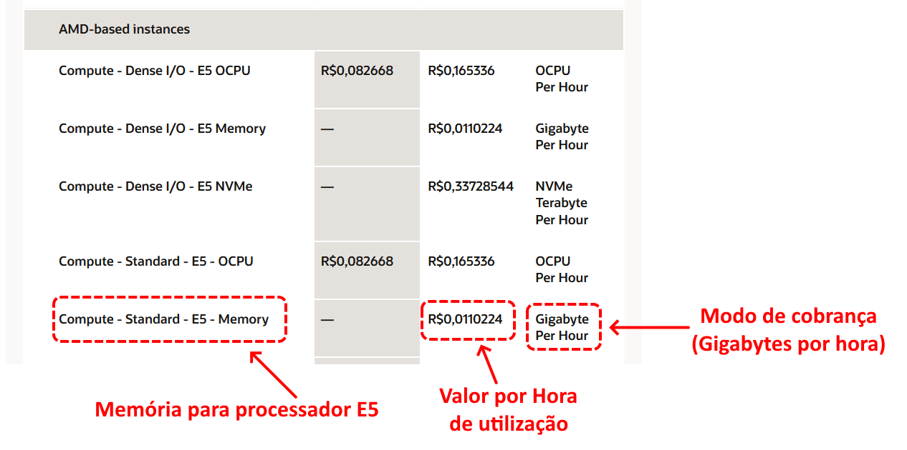
 

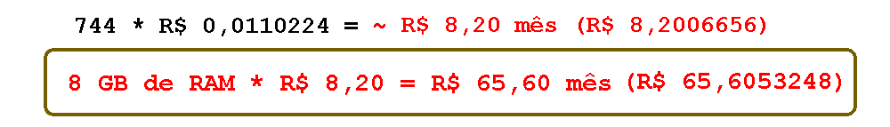
 

#### **Boot Volume (100 GB) e Block Volume (200 GB)**

Para o cálculo do _[Block Volume](https://docs.oracle.com/pt-br/iaas/Content/Block/Concepts/overview.htm)_, é fundamental considerar que a _[Máquina Virtual](https://docs.oracle.com/en-us/iaas/Content/Compute/Concepts/computeoverview.htm)_ de exemplo necessita de um _[Block Volume](https://docs.oracle.com/pt-br/iaas/Content/Block/Concepts/overview.htm)_ de **100 GB** para a imagem do sistema operacional Windows, conhecido como _Boot Volume_. Além disso, será necessário um segundo _Block Volume_, destinado ao armazenamento de dados da aplicação, com um tamanho de **200 GB**. Assim, o total a ser considerado é de **300 GB**.

O _[Block Volume](https://docs.oracle.com/pt-br/iaas/Content/Block/Concepts/overview.htm)_ é cobrado com base na quantidade de _Gigabytes utilizados por mês_:

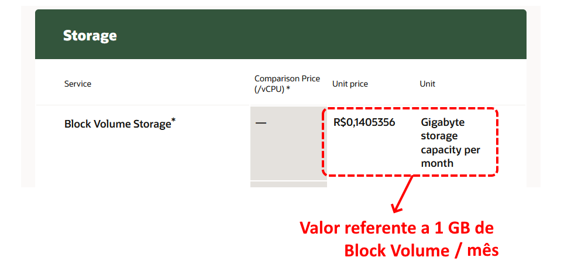

Diante disso, segue o cáclulo do _[Block Volume](https://docs.oracle.com/pt-br/iaas/Content/Block/Concepts/overview.htm)_ que será usado:

 

!!! note "NOTA"
    No OCI, o serviço _[Block Volume](https://docs.oracle.com/pt-br/iaas/Content/Block/Concepts/overview.htm)_ introduz o conceito de **_"Unidades de Desempenho de Volume (Volume Performance Units - VPUs)_**". Isso permite aumentar a quantidade de _IOPS_ e _throughput por GB_ de um _[Block Volume](https://docs.oracle.com/pt-br/iaas/Content/Block/Concepts/overview.htm)_. Quanto maior o desempenho, maior será o custo associado. Para simplificar os cálculos realizados aqui, considerou-se **_0 VPUs_**. Para mais detalhes, consulte a página _["Oracle Cloud Storage Pricing"](https://www.oracle.com/cloud/storage/pricing/?er=221886)_.

#### **Licença do Sistema Operacional Windows**

Como o exemplo envolve uma _[Máquina Virtual](https://docs.oracle.com/en-us/iaas/Content/Compute/Concepts/computeoverview.htm)_ com o sistema operacional **Windows**, é necessário incluir também o custo da sua licença:

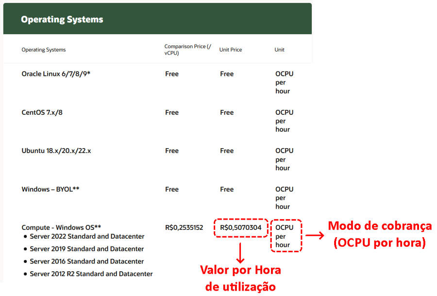
 

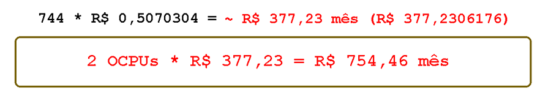
 

#### **Custo Total da Máquina Virtual**

Após calcular todos os itens, obtemos o custo total de uma _[Máquina Virtual](https://docs.oracle.com/en-us/iaas/Content/Compute/Concepts/computeoverview.htm)_ no OCI para o período de **31 dias**, utilizando o modelo de cobrança _Pay As You Go (PAYG)_:

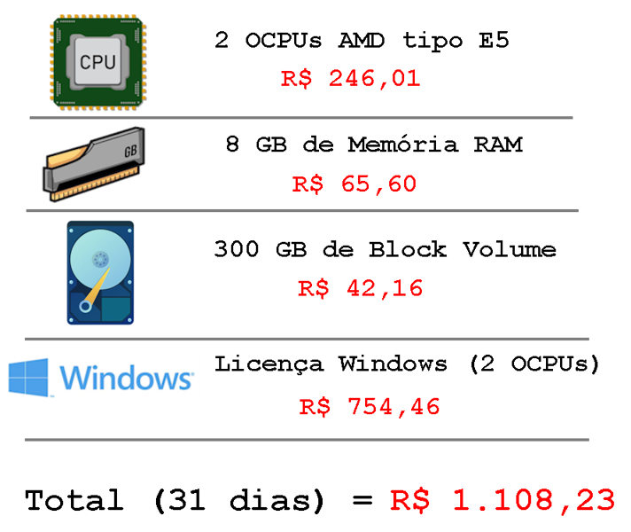
 

### [Oracle Universal Credits (OUC)](https://www.oracle.com/cloud/universal-credits/)

O modelo de cobrança _Pay As You Go (PAYG)_ é vantajoso porque permite que os usuários paguem apenas pelos recursos que realmente utilizam, facilitando a realização de testes e _provas de conceito (PoC)_. Além disso, esse modelo possibilita que startups e pequenas empresas criem recursos de TI sem a necessidade de grandes investimentos iniciais.

Quando a sua necessidade por recursos computacionais no OCI se torna **_mais previsível_** — ou seja, quando você sabe que uma determinada máquina virtual, banco de dados, etc., precisarão permanecer _"ligados"_ durante todo o ano devido às exigências do negócio e dos clientes — os custos do modelo _Pay As You Go_ podem ser otimizados. 

**_[Oracle Universal Credits](https://www.oracle.com/cloud/universal-credits/)_** é um modelo de cobrança em que o cliente paga antecipadamente por um conjunto de recursos ou serviços por um período específico, geralmente de um ano ou mais. Isso implica a existência de um **_contrato fixo_** que detalha quais recursos do OCI serão utilizados pelo cliente durante esse período determinado.

Esse modelo é contratado diretamente com a equipe de vendas da Oracle. Após uma análise das suas necessidades, é possível negociar descontos sobre os itens do _["Preço de Lista"](https://www.oracle.com/cloud/price-list/)_.

A equipe de vendas pode ser contactada diretamente pelo número <a href="tel:08008914433" class="font-weight: bold; font-style: italic;">0800-891-4433</a>.

Por fim, é importante lembrar que a Computação em Nuvem é uma forma de disponibilizar recursos de TI para que qualquer usuário com uma conta ativa possa criar e utilizar esses recursos. No entanto, mesmo na Computação em Nuvem, os recursos de TI não são infinitos. Ao provisionar recursos no modelo _Pay-As-You-Go_, não há garantias de que esses recursos estarão disponíveis para criação e uso imediato.

!!! note "NOTA"
    Quando a criação de um recurso no OCI falha devido à falta de capacidade, o erro **_"Out of host capacity"_** é exibido. Esse erro ocorre quando não há infraestrutura física suficiente para provisionar uma instância de computação. Isso pode acontecer ao tentar criar instâncias em um _Fault Domain_ ou em um _Availability Domain_ específicos, onde a capacidade disponível foi totalmente utilizada.

Por outro lado, ao optar pelo modelo **_[Oracle Universal Credits](https://www.oracle.com/cloud/universal-credits/)_**, você tem a garantia de que os recursos estarão prontos para uso assim que solicitar sua criação. Isso ocorre porque você pagou antecipadamente, o que notifica a Oracle sobre sua intenção de utilizar os recursos definidos no contrato. Em resposta, a Oracle, por meio de seu Gerenciamento de Capacidade, ajusta a região, o _Availability Domain_ e o _Fault Domain_ para atender a essa demanda.

## 2.3.2 OCI Cost Estimator

O _[OCI Cost Estimator](https://www.oracle.com/cloud/costestimator.html)_ é uma ferramenta fornecida pelo OCI que permite aos usuários estimar os custos associados ao uso de recursos e serviços na nuvem.

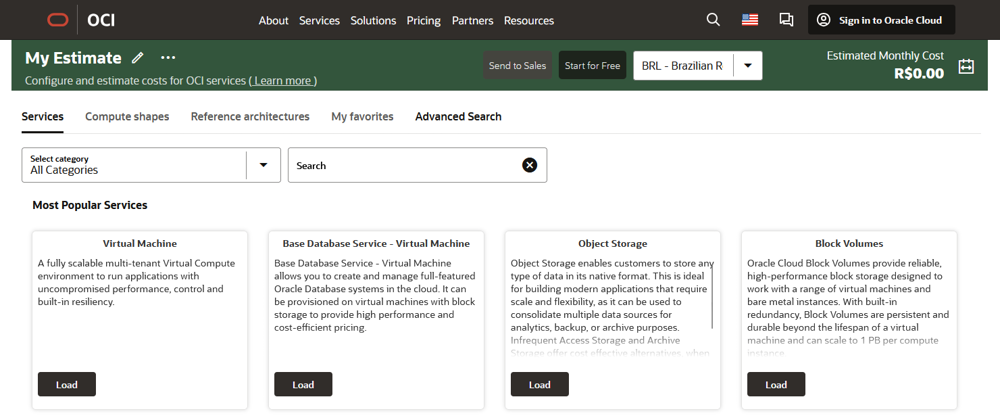
 

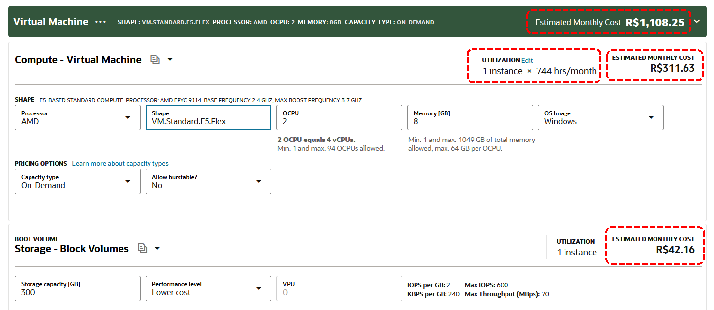
 

A utilização do _[OCI Cost Estimator](https://www.oracle.com/cloud/costestimator.html)_ é a maneira recomendada para calcular os custos associados aos recursos computacionais que você pretende utilizar no OCI. Essa ferramenta oferece uma estimativa precisa e detalhada, ajudando você a planejar e gerenciar seu orçamento de forma eficaz.

## 2.3.3 Free Tier e o Always Free

Existem dois modos de utilização gratuita que ficam disponíveis após a criação e ativação da sua conta no OCI. São eles:

### **Free Tier**

Após criar e ativar sua conta no OCI, a Oracle oferece **_US$300_** em créditos válidos por até **_30 dias_**, que podem ser utilizados em qualquer serviço disponível no OCI. Esse benefício é conhecido como _[Modo Gratuito](https://www.oracle.com/br/cloud/free/)_ ou _[Free Tier](https://www.oracle.com/br/cloud/free/)_ e é disponibilizado como um período de avaliação logo após a conclusão da ativação da sua nova conta no OCI.

!!! note "NOTA"
    Consulte _["Perguntas frequentes do Modo Gratuito da OCI Cloud"](https://www.oracle.com/br/cloud/free/faq/)_ para maiores detalhes sobre o _[Modo Gratuito](https://www.oracle.com/br/cloud/free/)_.

!!! note "NOTA"
    Lembrando que o _[Modo Gratuito](https://www.oracle.com/br/cloud/free/)_ **_não inclui SLA_**. Isso quer dizer que, usuários que usam apenas recursos de uso livre não podem utilizar o _[Oracle Support](https://www.oracle.com/br/support/)_.

### **Always Free**

Todas as contas criadas no OCI, sejam gratuitas ou pagas, possuem um _[conjunto de recursos](https://docs.oracle.com/pt-br/iaas/Content/FreeTier/freetier_topic-Always_Free_Resources.htm)_ disponíveis para uso na _[Home Region](https://docs.oracle.com/pt-br/iaas/Content/Identity/regions/managingregions.htm#Home)_, conhecidos como _[Always Free](https://docs.oracle.com/pt-br/iaas/Content/FreeTier/freetier_topic-Always_Free_Resources.htm)_. Os recursos _[Always Free](https://docs.oracle.com/pt-br/iaas/Content/FreeTier/freetier_topic-Always_Free_Resources.htm)_ são vitalícios, ou seja, não há cobrança e estarão sempre disponíveis para uso gratuito enquanto sua conta estiver ativa.

Os recursos elegíveis ao _[Always Free](https://docs.oracle.com/pt-br/iaas/Content/FreeTier/freetier_topic-Always_Free_Resources.htm)_ podem ser consultados através do link _"[Recursos Always Free](https://docs.oracle.com/pt-br/iaas/Content/FreeTier/freetier_topic-Always_Free_Resources.htm)"_. 

Alguns dos serviços elegíveis incluem:

- Até duas instâncias de computação do tipo AMD shape VM.Standard.E2.1.Micro.
- 4 OCPUs e 24 GB de memória, que podem ser utilizados para até quatro instâncias de computação do tipo ARM shape VM.Standard.A1.
- 200 GB de Block Volume.
- 20 GB de Object Storage.
- Três tabelas Oracle NoSQL Database com até 25 GB de armazenamento, além de 133 milhões de leituras e 133 milhões de gravações por mês.
- Dois Oracle Autonomous Database com 1 OCPU e 20 GB de armazenamento.
- Um Load Balancer com largura de banda mínima e máxima de 10 Mbps.

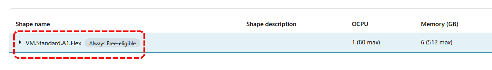
 

Esses serviços permitem que você explore e utilize o OCI sem custos, enquanto sua conta estiver ativa.

!!! note "NOTA"
    Sempre consulte o link _"[Recursos Always Free](https://docs.oracle.com/pt-br/iaas/Content/FreeTier/freetier_topic-Always_Free_Resources.htm)"_ para obter uma lista completa e atualizada dos recursos elegíveis ao  _[Always Free](https://docs.oracle.com/pt-br/iaas/Content/FreeTier/freetier_topic-Always_Free_Resources.htm)_.

## 2.3.4 O custo da Transferência de Dados

Como parte da análise de custos no OCI, é fundamental entender o custo de _Transferência de Dados_, ou _Data Transfer_. Este custo está associado ao tráfego de dados que sai (outbound) do OCI para a Internet ou para outra região.

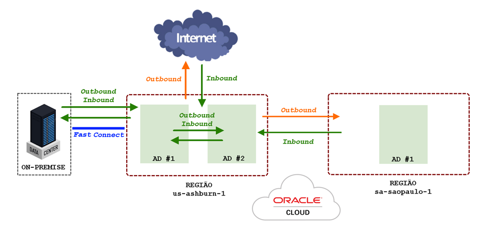
 

Em outras palavras, qualquer volume de tráfego de rede de saída (outbound) que **ultrapasse 10 TB** dentro do mês, incorrerá em uma taxa adicional de **R$ 0,13778** por Gigabyte. Ao iniciar um novo mês, o contador é zerado, permitindo que você comece a contabilizar novamente o tráfego de saída sem custos adicionais até o limite de 10 TB.

 

!!! note "NOTA"
    Para cada região, os valores para o Data Transfer podem variar. É sempre recomendável consultar o _["Preço de Lista"](https://www.oracle.com/cloud/price-list/)_ na seção _[Networking](https://www.oracle.com/cloud/price-list/#pricing-networking)_ para obter os valores mais atualizados e específicos para a sua região.

Para todo o tráfego de rede que entra no OCI (inbound), não há custos associados.

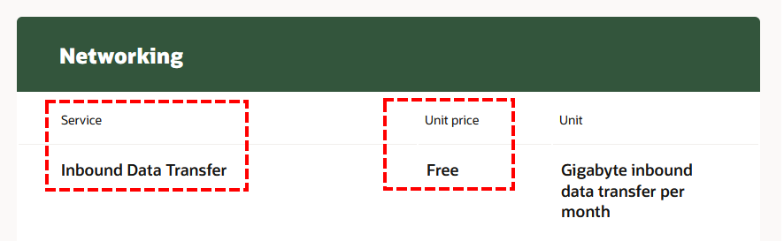
 

Para o tráfego de rede que entra (inbound) e sai (outbound) do OCI por meio do _[FastConnect](https://docs.oracle.com/pt-br/iaas/Content/Network/Concepts/fastconnectoverview.htm)_, não há custos associados à Transferência de Dados, uma vez que se trata de uma conexão de rede dedicada ao seu Tenancy.

No entanto, existe uma taxa por horas de uso, que varia de acordo com a largura de banda contratada:

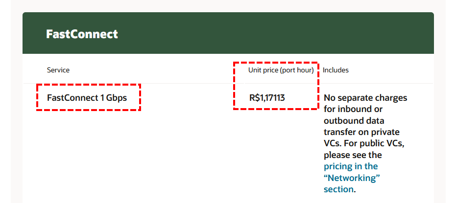
 

!!! note "NOTA"
    Em resumo, o serviço _[FastConnect](https://docs.oracle.com/pt-br/iaas/Content/Network/Concepts/fastconnectoverview.htm)_ permite que você conecte seu data center (on-premises) ao OCI por meio de uma conexão privada e dedicada. Além disso, existe uma opção para utilizar o _[FastConnect](https://docs.oracle.com/pt-br/iaas/Content/Network/Concepts/fastconnectoverview.htm)_ para conexões públicas via Internet. Para mais informações, consulte a documentação _["Visão Geral do FastConnect"](https://docs.oracle.com/pt-br/iaas/Content/Network/Concepts/fastconnectoverview.htm)_.

## 2.3.5 Considerações finais

Para concluir, gostaria de destacar alguns fatores que impactam diretamente os custos ao utilizar o OCI:

1. **Tamanho do recurso**: Quanto maior o recurso, mais caro ele é (ex: mais CPU, mais memória, mais storage, etc).

2. **Tipo do recurso**: Máquina virtual, Máquina física (Bare Metal), shapes Dense I/O ou shapes equipados com GPU, possuem custos diferentes.

3. **CPU Dedicada**: O uso de uma CPU dedicada e _"ligada"_ para sua utilização é sempre mais caro do que optar por serviços prontos.

4. **Serviços PaaS**: Alguns serviços do tipo _[PaaS](../capitulo-1/definicoes-nist.md)_ são mais caros por serem _"prontos para uso"_ pois oferecerem gerenciamento automático de funções como backups, patches de segurança e alta disponibilidade.

5. **Custo por Região**: No OCI, para a maioria dos recursos, não há distinção de valores quando forem criados em regiões diferentes. Ou seja, o custo de uma máquina virtual criada aqui no Brasil (sa-saopaulo-1) é o mesmo, caso ela seja criada na região do Japão (ap-osaka-1), ou qualquer outra, por exemplo.

6. **Tipos de Processadores**: O OCI oferece processadores AMD, ARM e Intel para máquinas virtuais e físicas. Os processadores ARM são mais baratos que os AMD, que, por sua vez, são mais baratos que os Intel.

7. **Cobrança de Recursos**: A cobrança por uma máquina virtual ou física é interrompida assim que ela é desligada. No entanto, os discos (Block Storage) alocados continuam a ser cobrados, independentemente do estado da máquina.

8. **Discos NVMe**: Alguns shapes de máquinas virtuais ou físicas utilizam discos do tipo _[NVMe](https://docs.oracle.com/pt-br/iaas/Content/Compute/Concepts/computeperformance.htm)_, que oferecem desempenho superior, mas são mais caros. A cobrança por esse tipo de armazenamento permanece ativa até que a máquina seja encerrada _[(terminate)](https://docs.oracle.com/pt-br/iaas/Content/Compute/References/computeshapes.htm#vm-gpu)_.

9. **Unidades de Desempenho de Volume (VPUs)**: O serviço Block Volume utiliza o conceito de VPUs, permitindo aumentar a quantidade de IOPS e throughput por GB de disco. Quanto maior o desempenho, maior será o custo.

10. **Licenciamento do Windows**: Ao criar uma instância de Computação com o sistema operacional Microsoft Windows, haverá uma cobrança adicional pelo _[custo do licenciamento](https://docs.oracle.com/pt-br/iaas/Content/Compute/References/microsoftlicensing.htm#pricing)_. Além disso, shapes _[Dense I/O](https://docs.oracle.com/pt-br/iaas/Content/Compute/References/computeshapes.htm#vm-dense)_, equipados com _[GPU](https://docs.oracle.com/pt-br/iaas/Content/Compute/References/computeshapes.htm#vm-gpu)_ ou características _HPC (High-Performance Computing)_, também têm custos de licenciamento até seu _[encerramento (terminate)](https://docs.oracle.com/pt-br/iaas/Content/Compute/References/computeshapes.htm#vm-gpu)_.

11. **Recursos de Rede**: No OCI, a maioria dos recursos de rede, como NAT Gateway, Internet Gateway, Service Gateway, VCN, sub-redes e IPs públicos, não gera custos. Os custos associados à rede são limitados ao _[FastConnect](https://docs.oracle.com/pt-br/iaas/Content/Network/Concepts/fastconnectoverview.htm)_ e ao _Data Transfer (outbound)_.