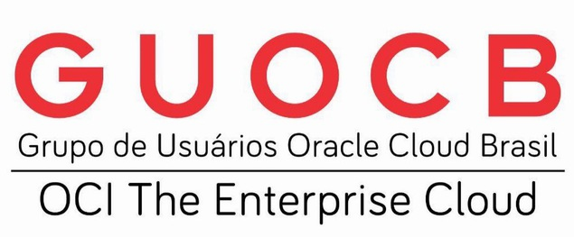
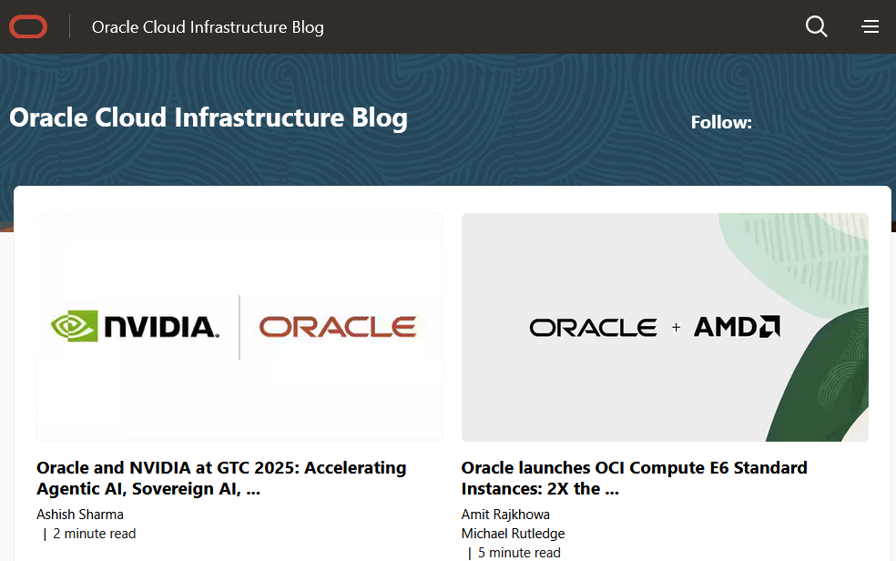
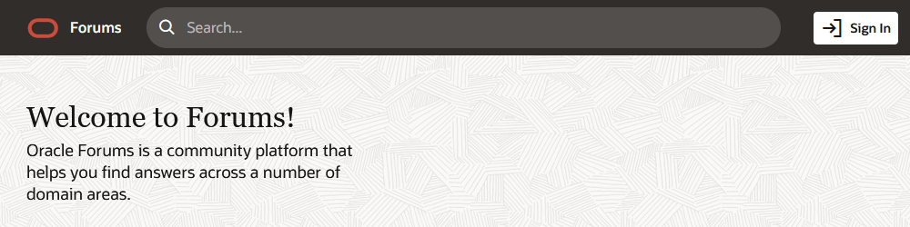
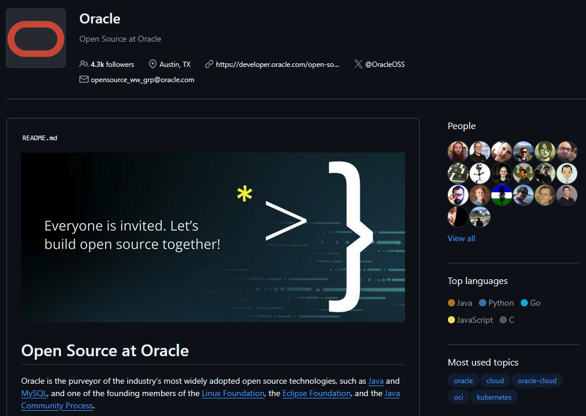
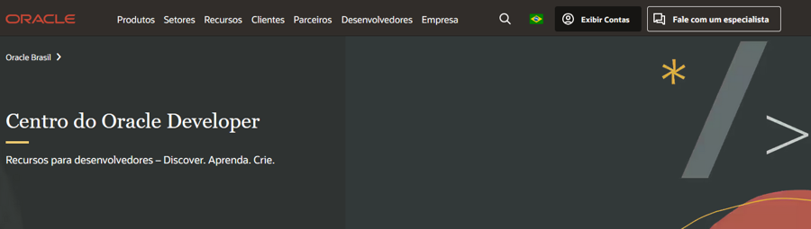
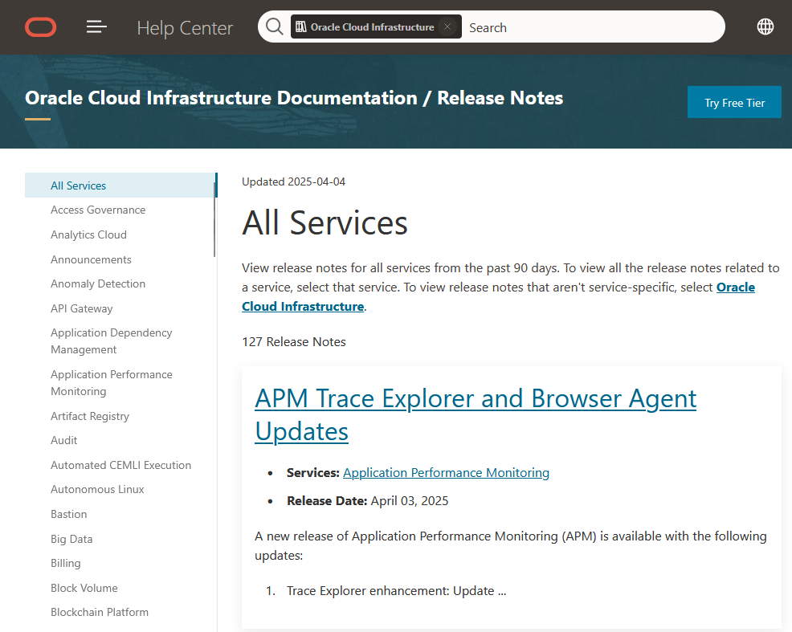
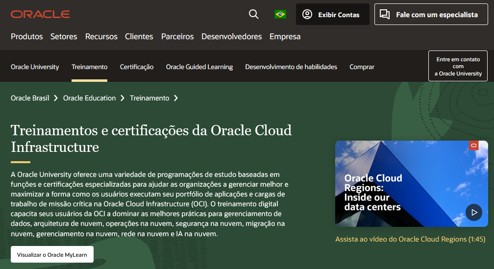

---
hide:
  - toc
---

# Capítulo 3: OCI Foundations

# 3.8 Ajuda Extra, Informações Adicionais, Treinamentos e Certificações

Nesta seção, abordaremos recursos adicionais que podem ser extremamente úteis para aprimorar sua experiência com o OCI. Aqui, você encontrará informações sobre suporte técnico, comunidades online, documentação oficial, cursos de treinamento e certificações que podem ajudá-lo a se aprofundar ainda mais nas funcionalidades e melhores práticas do OCI.

### **[GUOCB - Grupo de Usuários Oracle Cloud Brasil](https://t.me/GUOCB)**

Grupo do Telegram dedicado a discutir temas relacionados ao OCI, abrangendo IaaS, PaaS, segurança, gerenciamento, Autonomous Database, inteligência artificial, machine learning, GPU, DevOps, blockchain, IoT e soluções cloud native.

 

- Link: [GUOCB - Grupo de Usuários Oracle Cloud Brasil](https://t.me/GUOCB)

### **[Oracle Architecture Center](https://docs.oracle.com/solutions/?lang=pt-br)**

_[Oracle Architecture Center](https://docs.oracle.com/solutions/?lang=pt-br)_ oferece uma variedade de exemplos de arquitetura, manuais de solução e exemplos de códigos para auxiliá-lo na implementação de suas soluções em nuvem, multicloud, nuvem distribuída e on-premises. 

 

- Link: [Oracle Architecture Center](https://docs.oracle.com/solutions/?lang=pt-br)

### **[Oracle Cloud Infrastructure Blog](https://blogs.oracle.com/cloud-infrastructure/)**

_[Oracle Cloud Infrastructure Blog](https://blogs.oracle.com/cloud-infrastructure/)_ é uma plataforma essencial para profissionais de tecnologia, desenvolvedores e entusiastas da nuvem que desejam se manter atualizados sobre as últimas novidades, tendências e melhores práticas relacionadas ao Oracle Cloud Infrastructure (OCI).

 

- Link: [Oracle Cloud Infrastructure Blog](https://blogs.oracle.com/cloud-infrastructure/)

- Link: [LAD Cloud Experts Portuguese Blog](https://blogs.oracle.com/lad-cloud-experts-pt/)

### **[Oracle Forums](https://forums.oracle.com)**

_[Oracle Forums](https://forums.oracle.com)_ são uma plataforma interativa onde usuários, desenvolvedores e profissionais de TI podem se conectar, compartilhar conhecimentos e discutir uma ampla gama de tópicos relacionados aos produtos e serviços da Oracle, incluindo o Oracle Cloud Infrastructure (OCI).

 

- Link: [Oracle Forums](https://forums.oracle.com)

### **[Open Source at Oracle](https://github.com/oracle)**

_[Open Source at Oracle](https://github.com/oracle)_ contém diversos repositórios de código aberto no _[GitHub](https://github.com/oracle)_, abrangendo uma variedade de projetos da Oracle.

 

- Link: [Open Source at Oracle](https://github.com/oracle)

### **[Oracle Developer Center](https://www.oracle.com/br/developer/)**

_[Oracle Developer Center](https://www.oracle.com/br/developer/)_ é um recurso essencial para desenvolvedores que desejam explorar, aprender e criar soluções utilizando as tecnologias da Oracle. Este centro oferece uma ampla gama de ferramentas, recursos e informações que ajudam os desenvolvedores a maximizar seu potencial e a construir aplicações inovadoras na Oracle Cloud.

 

- Link: [Oracle Developer Center](https://www.oracle.com/br/developer/)

- Link: [Python no OCI](https://www.oracle.com/br/developer/python-developers/)

### **[Oracle Cloud Infrastructure Release Notes](https://docs.oracle.com/en-us/iaas/releasenotes/)**

_[OCI Release Notes](https://docs.oracle.com/en-us/iaas/releasenotes/)_ fornecem atualizações detalhadas sobre novos serviços, recursos e melhorias no OCI, permitindo que os usuários se mantenham informados sobre as últimas inovações.

 

- Link: [Oracle Cloud Infrastructure Release Notes](https://docs.oracle.com/en-us/iaas/releasenotes/)

### **[Hub de Soluções de IA](https://www.oracle.com/br/artificial-intelligence/solutions/)**

_[Hub de Soluções de IA](https://www.oracle.com/br/artificial-intelligence/solutions/)_ da Oracle é um portal que oferece informações detalhadas, exemplos de código e casos de uso práticos sobre a utilização das diversas ferramentas de inteligência artificial da Oracle.

- Link: [Hub de Soluções de IA](https://www.oracle.com/br/artificial-intelligence/solutions/)

### **[My Oracle Support](https://support.oracle.com)**

_[My Oracle Support](https://support.oracle.com)_ é uma plataforma dedicada ao suporte técnico, onde os usuários podem acessar documentação, abrir chamados, e consultar uma base de conhecimento abrangente para resolver problemas e otimizar suas implementações.

 

- Link: [My Oracle Support](https://support.oracle.com)

### **[Oracle University](https://www.oracle.com/br/education/training/oracle-cloud-infrastructure/)**

A _[Oracle University](https://www.oracle.com/br/education/training/oracle-cloud-infrastructure/)_ oferece uma vasta gama de programas de estudo voltados para funções e certificações especializadas em diversas tecnologias da Oracle, incluindo o Oracle Cloud Infrastructure (OCI). Esses programas são projetados para capacitar os profissionais a desenvolverem habilidades essenciais e a maximizarem o uso das soluções da Oracle.

 

- Link: [Oracle University](https://www.oracle.com/br/education/training/oracle-cloud-infrastructure/)
