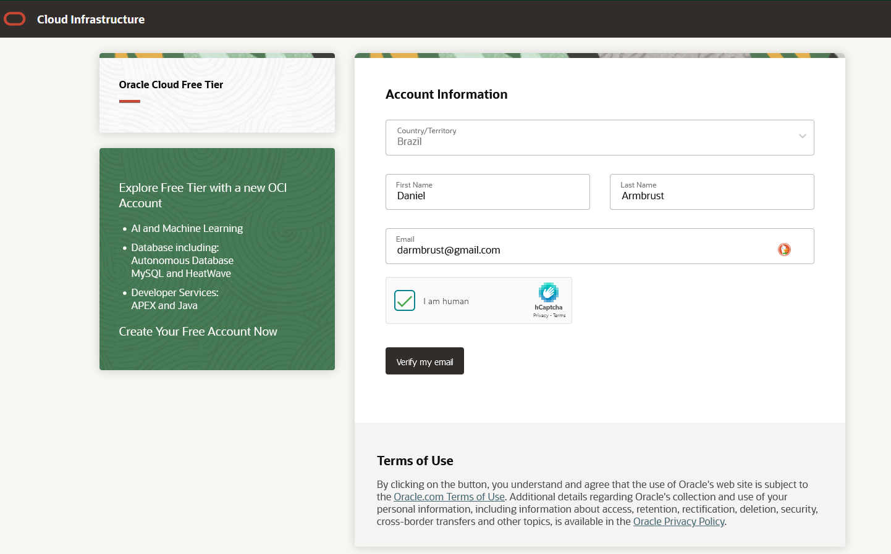
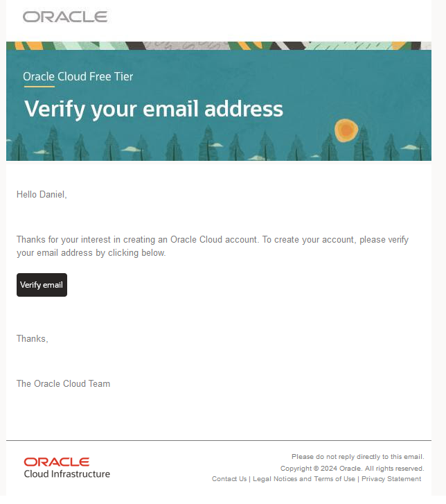
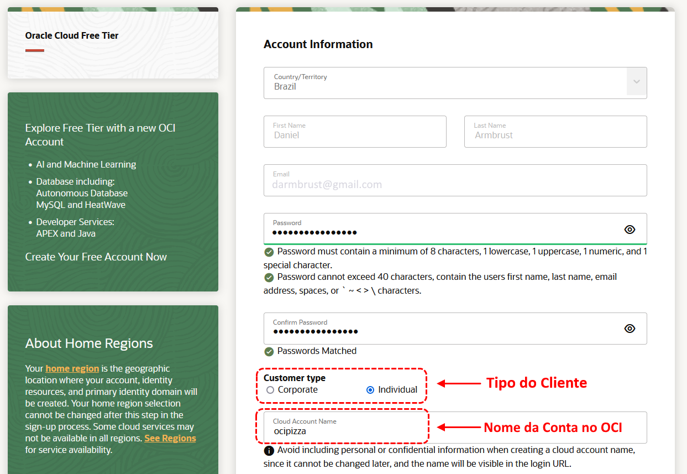
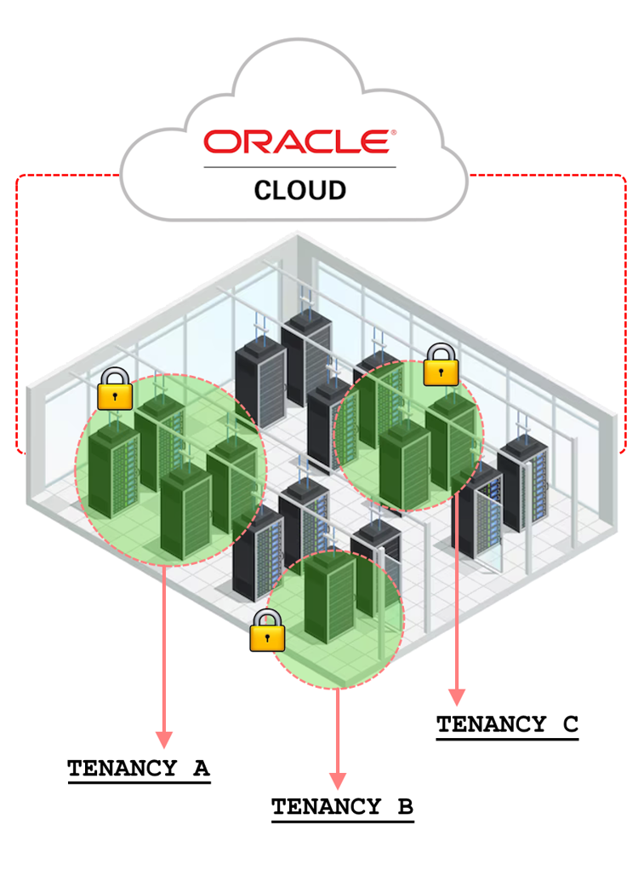
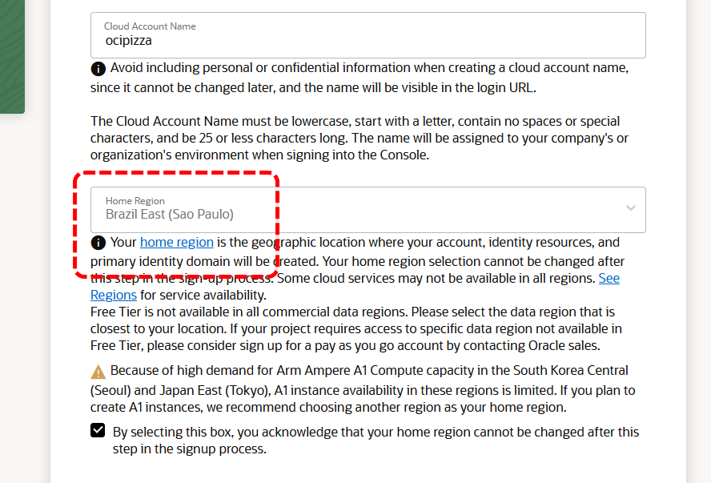
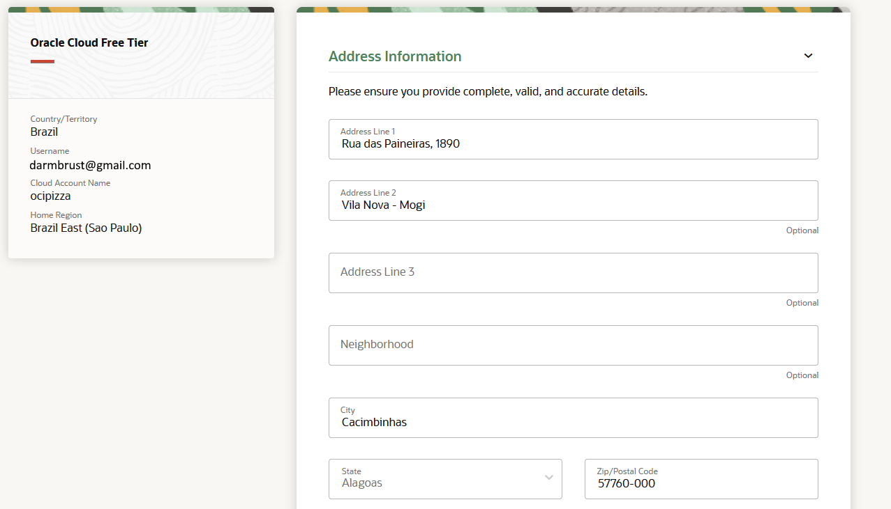
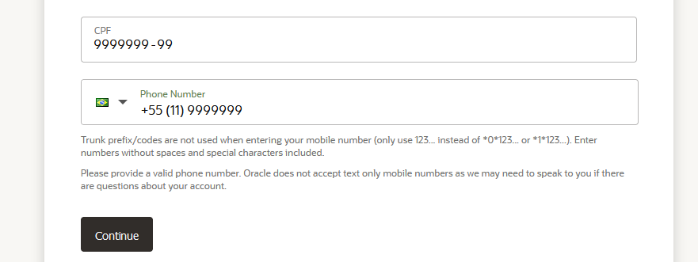
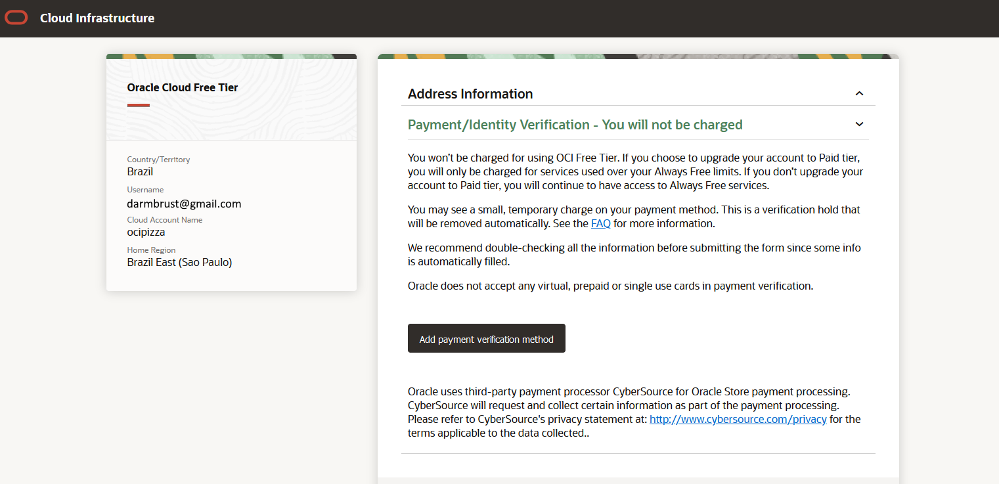
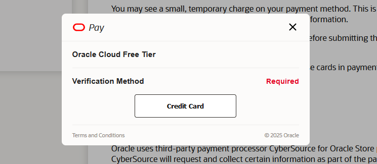
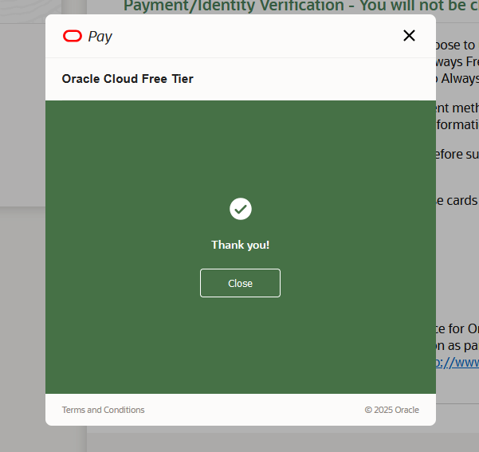

---
hide:
  - toc
---

# Capítulo 3: OCI Foundations

# 3.2 Criando e Ativando a sua Conta no OCI

## 3.2.1 Criando a sua Conta no OCI

Todo o processo de criação de uma nova conta no OCI deve ser realizado por meio do link _[https://signup.oraclecloud.com/](https://signup.oraclecloud.com/)_.

Após acessar o link, um formulário será exibido solicitando algumas informações iniciais, como _Nome_, _Sobrenome_, _País_ e, o mais importante, o _endereço de e-mail do Administrador da conta_.

 

Após inserir essas informações iniciais, o OCI enviará um e-mail para o endereço fornecido. O e-mail recebido contém um botão **_"Verify email"_** que deve ser clicado para confirmar que o e-mail é válido e pode ser utilizado para criar a conta.

 

Após clicar no botão, você será direcionado para uma nova página onde serão solicitadas algumas outras informações, como a _Senha do Administrador da Conta_, o _Tipo de Cliente (Customer Type)_ e o _Nome da Conta no OCI (Cloud Account Name)_. 

 

Aqui vale uma explicação sobre o **_Tipo do Cliente (Customer Type)_** e o **_Nome da Conta no OCI (Cloud Account Name)_**.

### **Tipo do Cliente (Customer Type)**

Essa opção geralmente se refere à categoria do usuário que está criando a conta, como individual ou empresa.

### **Nome da Conta (Cloud Account Name)**

**_Cloud Account Name_** ou, também conhecido como **_Tenancy_**, é o nome que identificará sua conta no OCI. Ele deve ser um nome único, só conter letras e números e é recomendável escolher um nome que represente sua organização ou o propósito da conta.

Assim que você completar o cadastro de uma nova conta, o OCI utiliza o _Cloud Account Name_ para criar um _Tenancy_ para você. O conceito de _Tenancy_, ou _multi-locatário_, refere-se a uma partição segura e isolada criada para você no OCI, onde é possível criar, organizar e administrar seus recursos de nuvem.

Um provedor de Computação em Nuvem, como o OCI, disponibiliza um conjunto de recursos computacionais que podem ser utilizados por diversos clientes com contas ativas. Um _Tenancy_ representa um subconjunto ou _"uma fatia"_ desse conjunto maior de recursos, sendo isolado e seguro em relação aos demais _Tenancies_ existentes, garantindo que os dados e as operações de cada cliente permaneçam protegidos e separados.

!!! note "NOTA"
    O **_Nome da Conta (Cloud Account Name)_** ou nome do **_Tenancy_** não deve ser um nome de usuário ou qualquer outra string aleatória. É recomendado que o nome do _Tenancy_ seja o nome da sua empresa. No caso deste livro, estamos utilizando o nome **_ocipizza_**, que indica o nome do projeto da aplicação _OCI Pizza_.

Assim que o nome da conta for inserido, é hora de escolher a _[Home Region](https://docs.oracle.com/pt-br/iaas/Content/Identity/regions/managingregions.htm#Home)_, que indica em qual região do OCI sua conta e os recursos do _[Serviço IAM](https://docs.oracle.com/pt-br/iaas/Content/Identity/getstarted/identity-domains.htm#overview)_ serão criados (como usuários, grupos de usuários, políticas de acesso, compartimentos, etc.). Os recursos IAM são globais, o que significa que um usuário criado na região _Brazil East (São Paulo)_ não precisa ser recriado na região _Brazil Southeast (Vinhedo)_. No entanto, é necessário selecionar uma região para ser a _[Home Region](https://docs.oracle.com/pt-br/iaas/Content/Identity/regions/managingregions.htm#Home)_, para que os recursos IAM sejam criados nessa região.

 

!!! note "NOTA"
    Qualquer recurso criado ou modificado pelo _[Serviço IAM](https://docs.oracle.com/pt-br/iaas/Content/Identity/getstarted/identity-domains.htm#overview)_ não é atualizado de forma imediata em todas as regiões nas quais você se inscreveu. A criação ou atualização de um recurso do IAM pode levar vários minutos para que as alterações na _[Home Region](https://docs.oracle.com/pt-br/iaas/Content/Identity/regions/managingregions.htm#Home)_ se tornem disponíveis em todas as outras regiões.

Por fim, deve-se completar o cadastro após a seleção da _[Home Region](https://docs.oracle.com/pt-br/iaas/Content/Identity/regions/managingregions.htm#Home)_.

 

 

Como último passo, é necessário adicionar um Número de Cartão de Crédito válido. Neste momento, não haverá nenhuma cobrança, apenas um débito e estorno no valor de **_US$1_** como forma de validar o cartão de crédito.

 

 

 

!!! note "NOTA"
    Como meio de pagamento, o OCI aceita apenas cartões de crédito. Cartões de débito, cartões virtuais ou cartões pré-pagos não são aceitos. Além disso, um cartão de crédito cadastrado será verificado periodicamente pela Oracle para confirmar a veracidade das informações.

Cadastro concluído! Agora, basta aguardar um e-mail de confirmação que indicará que sua conta foi criada com sucesso.