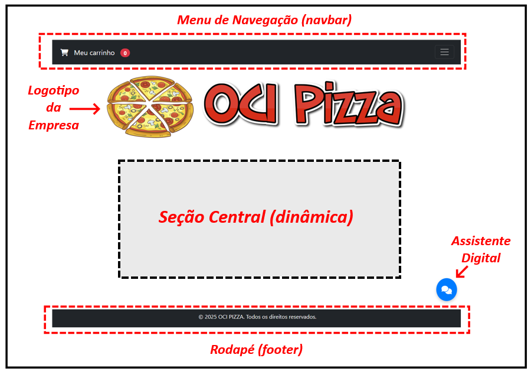
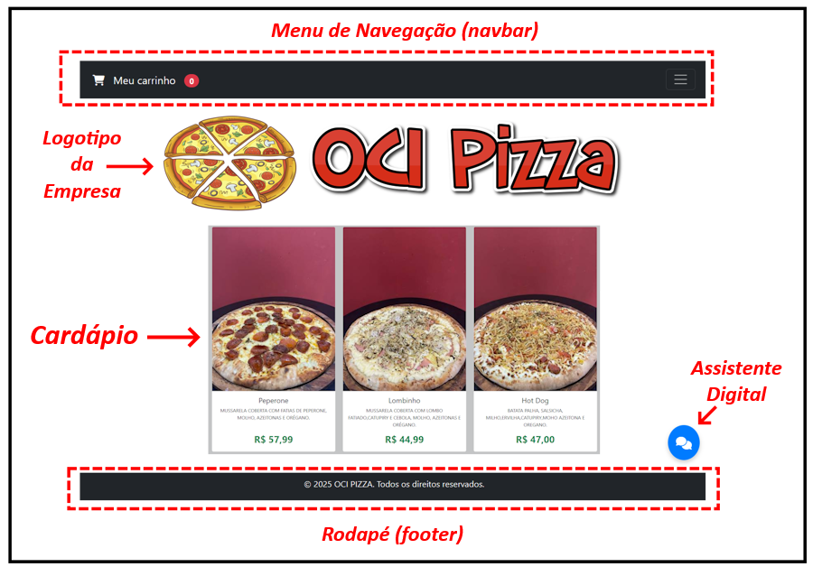
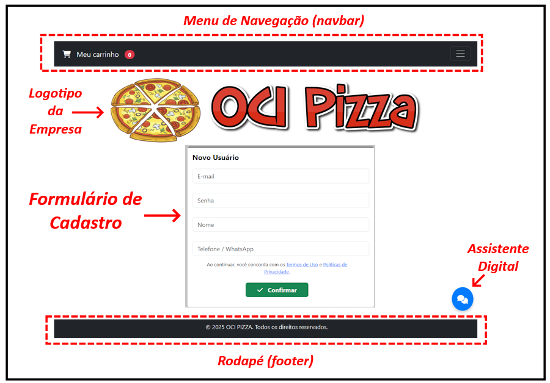
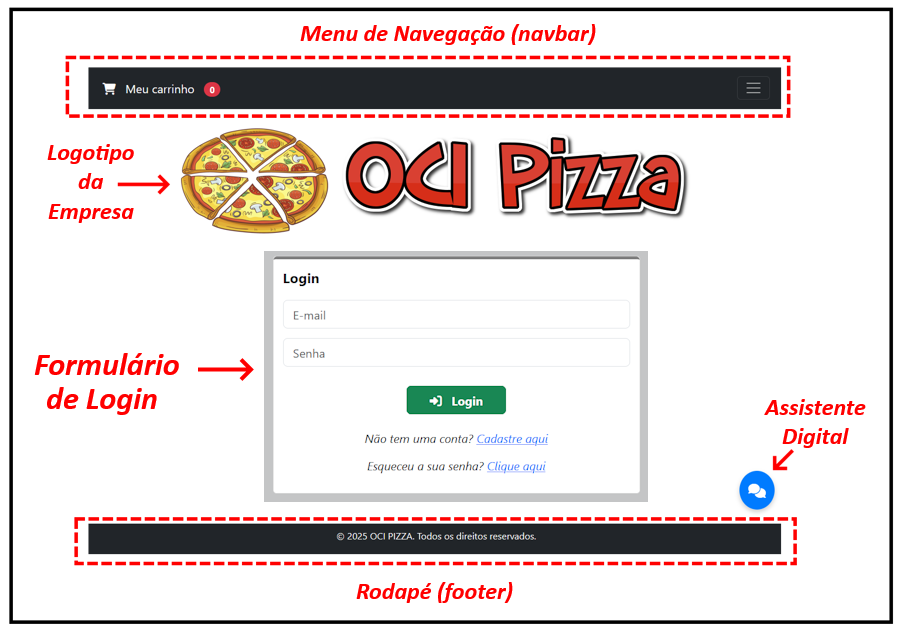
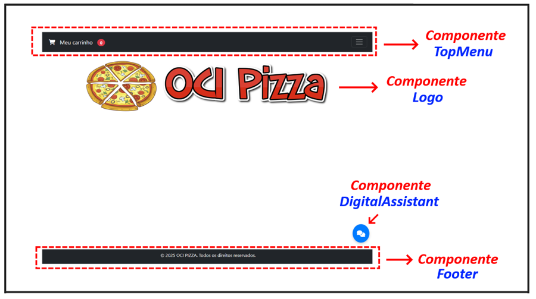
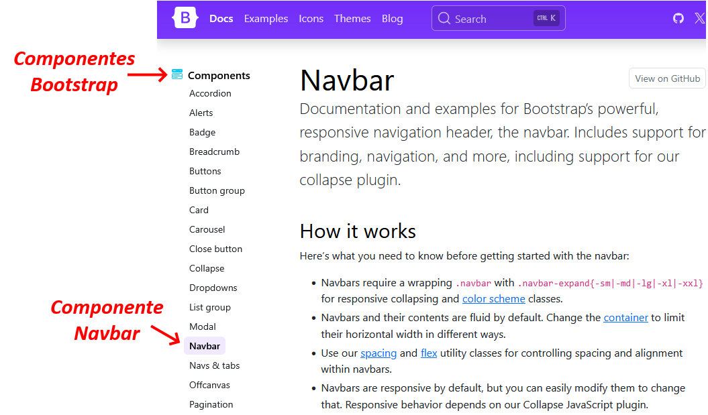

---
hide:
  - toc
---

# Capítulo 3: Aplicação OCI PIZZA

Após a análise dos requisitos, é hora de converter essas informações em código, ou seja, em instruções que o computador possa executar. Essa fase é conhecida como codificação e, no contexto de aplicações web, é geralmente dividida em duas partes:  a _codificação do frontend_ e a _codificação do backend_.

O frontend, frequentemente chamado de _"client side"_, refere-se à interface gráfica que atua como o principal ponto de interação do usuário. Em outras palavras, é a parte da aplicação que o usuário visualiza e com a qual interage, sendo desenvolvida com as tecnologias _HTML_, _CSS_ e _JavaScript_. É importante destacar que os navegadores são responsáveis pela renderização das páginas da web, que são compostas por marcações HTML, estilizadas com CSS e se tornam interativas por meio do JavaScript.

O frontend, também conhecido como _"client side"_, é a interface gráfica que serve como o principal ponto de interação do usuário. Ou seja, é a parte da aplicação que o usuário vê e interage, sendo desenvolvido com as tecnologias _HTML_, _CSS_ e _JavaScript_. É fundamental ressaltar que os navegadores são responsáveis por renderizar as páginas da web. Essas páginas são formadas por marcações HTML, que são estilizadas com CSS e se tornam interativas por meio do JavaScript.

Por outro lado, o backend, também conhecido como _"server side"_, é responsável pelo processamento dos dados da aplicação através das suas regras de negócios (ou lógica de negócios). É no backend que são tratadas questões relacionadas à autenticação de usuários e à comunicação com o banco de dados.

Iniciarei com uma descrição básica do desenvolvimento do frontend, seguida pela explicação do desenvolvimento do backend da aplicação **OCI PIZZA**.

# 3.1 Desenvolvimento Frontend e Backend

## 3.1.1 Frontend com Bootstrap e React

Frameworks e bibliotecas podem ser usadas para facilitar e auxiliar no desenvolvimento do frontend e no caso do frontend da aplicação **OCI PIZZA**, será utilizado o framework _[Bootstrap](https://getbootstrap.com/)_ e a biblioteca JavaScript _[React](https://react.dev/)_ para desenvolver a interface do usuário.

- **[Bootstrap](https://getbootstrap.com/)**
    - Bootstrap é um framework de código aberto criado inicialmente por desenvolvedores do Twitter que facilita o desenvolvimento de sites e aplicações web responsivas e móveis.

- **[React](https://react.dev/)**
    - React é uma biblioteca JavaScript de código aberto desenvolvida e mantida pelo Facebook para a construção de interfaces de usuário especialmente para aplicações web de página única conhecidas pela sigla _SPA (Single Page Application)_.

O _[Bootstrap](https://getbootstrap.com/)_ fornece uma série de componentes HTML responsivos e estilos predefinidos prontos para uso que serão usados para a construção do _layout_ das páginas da aplicação. Já o _[React](https://react.dev/)_, será usado para construir toda a estrutura de navegação do site, gerenciar a interação com as APIs do backend e atualizar o frontend com os dados recebidos do servidor.

### **Layout da Aplicação**

O _layout_ básico da aplicação **OCI PIZZA** é organizado tendo um _menu de navegação no topo (navbar)_, o _logotipo_, uma _seção central_ que muda o seu conteúdo de acordo com a página da aplicação que está sendo acessada, um _rodapé (footer)_ e um botão para acessar um _assistente digital_ que tem como finalidade ajudar o usuário a realizar consultas e obter informações sobre pizzas e pedidos.


<br>

Dessa forma, a seção central da _página principal (index.html)_ exibe o cardápio da pizzaria, que inclui todos os sabores de pizzas disponíveis:


<br>

A página de _Novo Usuário (newuser.html)_, exibe um formulário destinado ao cadastro de novos usuários:


<br>

A página de _Login (login.html)_ exibe um formulário onde usuários já cadastrados podem inserir suas credenciais de acesso para realizar um pedido:


<br>

Assim, pode-se afirmar que as páginas da aplicação compartilham a mesma estrutura, sendo que somente a _seção central_ muda conforme a página muda.

### **Bootstrap**

### **Pensando como um Desenvolvedor React**

Uma aplicação web é composta por diversas páginas HTML, cada uma contendo elementos visuais que colaboram para oferecer uma experiência interativa e funcional ao usuário. Estruturar a aplicação em múltiplas páginas facilita a organização do conteúdo, permitindo que cada página tenha um propósito específico, como a página de login, a página do cardápio de pizzas, a página para adicionar um novo usuário, entre outras.

Com base na estrutura da aplicação **OCI PIZZA** apresentada, é possível identificar alguns **_elementos visuais_** que se repetem em todas as páginas. Entre esses elementos, destacam-se o _menu de navegação no topo (navbar)_, o _logotipo_, o _rodapé (footer)_ e o botão para acessar o _assistente digital_.

No mundo _[React](https://react.dev)_, esses elementos visuais independentes são conhecidos como **_componentes_** e são a essência de qualquer aplicação _[React](https://react.dev)_. 

Por enquanto, sem entrar em detalhes, um componente _[React](https://react.dev)_ é uma função JavaScript que possui sua própria lógica e aparência. Ele pode representar desde uma página inteira ou um simples botão e, o mais importante, deve ser projetado para ser **_reutilizável_**. Quanto menor a abstração, de certa forma, mais reutilizável o componetne se torna.

!!! note "NOTA"
    A abordagem de desenvolvimento que consiste em dividir a interface gráfica em partes menores, projetadas para serem reutilizáveis em diferentes páginas da aplicação, é conhecida pela sigla _[DRY (Don't repeat yourself - Não repita a si mesmo)](https://pt.wikipedia.org/wiki/Don%27t_repeat_yourself)_.

Por exemplo, o elemento visual que representa o _menu de navegação no topo (navbar)_ é exibido em todas as páginas da aplicação. Com isso, é possível criar um componente _[React](https://react.dev)_ que pode ser reutilizado em todas as páginas, eliminando a necessidade de repetir o mesmo HTML em cada uma delas. Isso não significa que o elemento HTML do menu não esteja presente em todas as páginas; na verdade, em _[React](https://react.dev)_, você escreve o componente uma única vez e o referencia nas páginas que quiser, promovendo assim a reutilização.

A proposta é criar componentes sempre que você identificar um _"padrão de repetição"_, ou seja, elementos visuais iguais que aparecem em diferentes páginas. Com isso em mente, podemos inicialmente identificar e nomear os seguintes componentes da aplicação **OCI PIZZA**, destacados em azul no desenho abaixo:


<br>

Outra forma de identificar componentes em uma aplicação web é consultar a página de documentação do _[Bootstrap](https://getbootstrap.com/docs/5.3/getting-started/introduction/)_, disponível neste _[link aqui](https://getbootstrap.com/docs/5.3/getting-started/introduction/)_.


<br>

### **E por que toda essa explicação sobre o React?**

Lembre-se de que o objetivo do livro é conhecer os serviços do OCI para possibilitar você a implantar (deploy) e gerenciar aplicações _[Cloud Native](../capitulo-1/cloud-native.md)_. Uma das características desse tipo de aplicação é que elas fazem uso de _APIs REST (são API-First)_ para a troca de informações.

Isso nos leva a um outro conceito importante no desenvolvimento de aplicações _[Cloud Native](../capitulo-1/cloud-native.md)_: o frontend é desacoplado do backend. 

Isso significa que, como uma boa prática, o frontend web deve operar de maneira independente do backend. Assim, é possível desenvolver páginas web com _[React](https://react.dev)_ e criar uma aplicação _[Android](https://pt.wikipedia.org/wiki/Android)_ nativa utilizando _[Java](https://www.java.com/en/)_ ou _[Kotlin](https://kotlinlang.org/)_, por exemplo. Toda a comunicação, independentemente da forma como o frontend é desenvolvido, ocorre por meio de _APIs REST_. Isso também permite que equipes independentes trabalhem de acordo com suas especialidades, aumentando a eficiência e a agilidade no desenvolvimento.

!!! note "NOTA"
    Como informação, para o desenvolvimento de aplicativos móveis, é possível utilizar também o framework _[React Native](https://reactnative.dev/)_.

### **Node.js**

Para desenvolver uma aplicação _[React](https://react.dev)_, é necessário primeiro instalar o _[Node.js](https://nodejs.org/en/download)_, que é um ambiente de execução JavaScript (runtime) que possibilita a execução de código JavaScript fora do navegador.

!!! note "NOTA"
    O processo de instalação do _[Node.js](https://nodejs.org/en/download)_ é bastante simples e não será detalhado aqui. Instruções específicas para cada sistema operacional podem ser encontradas diretamente na página do _[Node.js](https://nodejs.org/en/download)_ através deste _[link](https://nodejs.org/en/download)_.

A versão do _[Node.js](https://nodejs.org/en/download)_ utilizadas no livro podem ser conferidas abaixo:

```bash linenums="1"
$ node -v
v22.14.0
```

### **Create React App**

O _[Create React App](https://create-react-app.dev/)_ é uma ferramenta que simplifica o processo de configuração e inicialização de projetos React, configurando automaticamente um ambiente de desenvolvimento com todas as dependências necessárias.

Create React App é ideal para iniciantes pois possibilita que os desenvolvedores se concentrem na construção dos seus componentes. A partir dele é possível iniciar rapidamente novos projetos com uma estrutura de arquivos e diretórios padrão prontas para o uso que organizam a aplicação e facilitam o desenvolvimento.

```bash linenums="1"
$ npx create-react-app frontend
```

```bash linenums="1"
npm install react-router-dom@latest
```

### **Criando um componente**