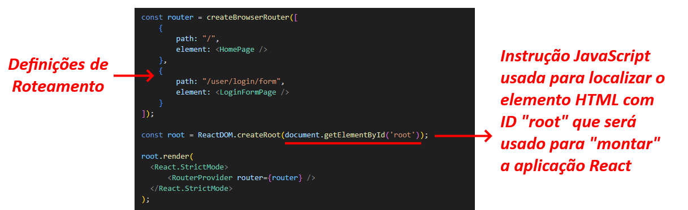

---
hide:
  - toc
---

# Capítulo 3: Aplicação OCI PIZZA

Após a análise dos requisitos, é hora de converter essas informações em código, ou seja, em instruções que o computador possa executar. Essa fase é conhecida como codificação e, no contexto de aplicações web, é geralmente dividida em duas partes:  a _codificação do frontend_ e a _codificação do backend_.

O frontend, frequentemente chamado de _"client side"_, refere-se à interface gráfica que atua como o principal ponto de interação do usuário. Em outras palavras, é a parte da aplicação que o usuário visualiza e com a qual interage, sendo desenvolvida com as tecnologias _HTML_, _CSS_ e _JavaScript_. É importante destacar que os navegadores _(web browsers)_ são responsáveis pela renderização das páginas da web, que são compostas por marcações HTML, estilizadas com CSS e se tornam interativas por meio do JavaScript.

Iniciarei com uma descrição básica do desenvolvimento do frontend, seguida pela explicação do desenvolvimento do backend da aplicação **OCI PIZZA**.

# 3.4 Frontend com Bootstrap e React

Frameworks e bibliotecas podem ser usadas para facilitar e auxiliar no desenvolvimento. Para o frontend da aplicação **OCI PIZZA**, decidi utilizar o framework _[Bootstrap](https://getbootstrap.com/)_ e a biblioteca JavaScript _[React](https://react.dev/)_ para a construção da interface do usuário pois ambos são os mais utilizados no momento em que escrevo este livro.

- **[Bootstrap](https://getbootstrap.com/)**
    - Bootstrap é um framework de código aberto criado inicialmente por desenvolvedores do _[Twitter](https://pt.wikipedia.org/wiki/Twitter)_ que facilita o desenvolvimento de sites e aplicações web responsivas e móveis.


<br>

- **[React](https://react.dev/)**
    - React é uma biblioteca JavaScript de código aberto desenvolvida e mantida pelo _[Facebook](https://pt.wikipedia.org/wiki/Facebook)_ para a construção de interfaces de usuário especialmente para aplicações web de página única conhecidas pela sigla _SPA (Single Page Application)_.


<br>

O _[Bootstrap](https://getbootstrap.com/)_ fornece uma série de componentes HTML responsivos e estilos predefinidos prontos para uso que serão usados para a construção do _layout_ das páginas da aplicação. Já o _[React](https://react.dev/)_, será usado para construir toda a estrutura de navegação do site, gerenciar a interação com as APIs do backend e atualizar o frontend com os dados recebidos do servidor.

## 3.4.1 Layout da Aplicação

O _layout_ básico da aplicação **OCI PIZZA** é organizado tendo um _menu de navegação no topo (navbar)_, o _logotipo_, uma _seção central_ que muda o seu conteúdo de acordo com a página da aplicação que está sendo acessada, um _rodapé (footer)_ e um botão para acessar um _assistente digital_ que tem como finalidade ajudar o usuário a realizar consultas e obter informações sobre pizzas e pedidos.


<br>

Dessa forma, a seção central da _página principal (index.html)_ exibe o cardápio da pizzaria, que inclui todos os sabores de pizzas disponíveis:


<br>

A página de _Novo Usuário (newuser.html)_, exibe um formulário destinado ao cadastro de novos usuários:


<br>

A página de _Login (login.html)_ exibe um formulário onde usuários já cadastrados podem inserir suas credenciais de acesso para realizar um pedido:


<br>

Assim, pode-se afirmar que as páginas da aplicação compartilham a mesma estrutura, sendo que somente a _seção central_ muda conforme a página muda.

## 3.4.2 Bootstrap

## 3.4.3 Pensando como um desenvolvedor React

Uma aplicação web é composta por diversas páginas HTML, cada uma contendo elementos visuais que colaboram para oferecer uma experiência interativa e funcional ao usuário. Estruturar a aplicação em múltiplas páginas facilita a organização do conteúdo, permitindo que cada página tenha um propósito específico, como a página de login, a página do cardápio de pizzas, a página para adicionar um novo usuário, entre outras.

Com base na estrutura da aplicação **OCI PIZZA** apresentada, é possível identificar alguns **_elementos visuais_** que se repetem em todas as páginas. Entre esses elementos, destacam-se o _menu de navegação no topo (navbar)_, o _logotipo_, o _rodapé (footer)_ e o botão para acessar o _assistente digital_.

No mundo _[React](https://react.dev)_, esses elementos visuais independentes são conhecidos como **_componentes_** e são a essência de qualquer aplicação _[React](https://react.dev)_. 

Por enquanto, sem entrar em detalhes, um componente _[React](https://react.dev)_ é uma função JavaScript que pode receber dados, encapsula sua própria lógica e aparência, e, por fim, retorna um HTML. Ele pode representar desde uma página inteira até um simples botão e, o mais importante, deve ser projetado para ser **_reutilizável_**. Quanto maior a abstração do seu componente, maior será sua capacidade de reutilização.

!!! note "NOTA"
    A abordagem de desenvolvimento que consiste em dividir a interface gráfica em partes menores, projetadas para serem reutilizáveis em diferentes páginas da aplicação, é conhecida pela sigla _[DRY (Don't repeat yourself - Não repita a si mesmo)](https://pt.wikipedia.org/wiki/Don%27t_repeat_yourself)_.

Por exemplo, o elemento visual que representa o _menu de navegação no topo (navbar)_ é exibido em todas as páginas da aplicação. Com isso, é possível criar um componente _[React](https://react.dev)_ que pode ser reutilizado em todas as páginas, eliminando a necessidade de repetir o mesmo HTML em cada uma delas. Isso não significa que o elemento HTML do menu não esteja presente em todas as páginas; na verdade, em _[React](https://react.dev)_, você escreve o componente uma única vez e o referencia nas páginas que quiser, promovendo assim a reutilização.

A proposta é criar componentes sempre que você identificar um _"padrão de repetição"_, ou seja, elementos visuais iguais que aparecem em diferentes páginas. Com isso em mente, podemos inicialmente identificar e nomear os seguintes componentes da aplicação **OCI PIZZA**, destacados em azul no desenho abaixo:


<br>

Outra forma de identificar componentes em uma aplicação web é consultar a página de documentação do _[Bootstrap](https://getbootstrap.com/docs/5.3/getting-started/introduction/)_, disponível neste _[link aqui](https://getbootstrap.com/docs/5.3/getting-started/introduction/)_.


<br>

!!! note "NOTA"
    Assista _[React.js: The Documentary](https://youtu.be/8pDqJVdNa44?si=pYqZbSVqIjci80BK)_.

### **E por que toda essa explicação sobre o React?**

Lembre-se de que o objetivo do livro é conhecer os serviços do OCI para possibilitar você a implantar (deploy) e gerenciar aplicações _[Cloud Native](../capitulo-1/cloud-native.md)_. Uma das características desse tipo de aplicação é que elas fazem uso de _APIs REST (são API-First)_ para a troca de informações.

Quando a comunicação entre o frontend e o backend é feita por meio de APIs, podemos afirmar que o frontend é desacoplado do backend, funcionando de forma separada. Essa separação permite que o desenvolvimento do frontend ocorra de maneira independente, possibilitando a criação de páginas web com _[React](https://react.dev)_ e uma aplicação móvel nativa para _[Android](https://pt.wikipedia.org/wiki/Android)_, desenvolvida em _[Java](https://www.java.com/en/)_ ou _[Kotlin](https://kotlinlang.org/)_, por exemplo, ambas utilizando o mesmo conjunto de APIs do backend.

!!! note "NOTA"
    Para o desenvolvimento de aplicativos móveis, também é possível utilizar o framework _[React Native](https://reactnative.dev/)_.

Essa abordagem, além de ser uma boa prática ao permitir que o frontend opere de forma independente do backend e, é também um tipo de arquitetura utilizada em aplicações _[Cloud Native](../capitulo-1/cloud-native.md)_ onde usam APIs para a troca de informações, podem ser desenvolvidas por equipes diferentes cada uma com suas próprias esteiras de testes e processos de deployment CI/CD, entre outras vantagens.

## 3.4.4 Desenvolvimento React

### **Node.js**

Para desenvolver uma aplicação _[React](https://react.dev)_, é necessário primeiro instalar o _[Node.js](https://nodejs.org/en)_, que é um ambiente de execução JavaScript (runtime) que possibilita a execução de código JavaScript fora do navegador.

!!! note "NOTA"
    O processo de instalação do _[Node.js](https://nodejs.org/en)_ é bastante simples e não será detalhado aqui. Instruções específicas para cada sistema operacional podem ser encontradas diretamente na página do _[Node.js](https://nodejs.org/en/download)_ através deste _[link](https://nodejs.org/en/download)_.

A versão do _[Node.js](https://nodejs.org/en)_ utilizada no livro pode ser conferida abaixo:

```bash linenums="1"
$ node -v
v22.14.0
```

### **Create React App (create-react-app)**

O _[Create React App](https://create-react-app.dev/)_ é uma ferramenta que simplifica o processo de configuração e inicialização de projetos  _[React](https://react.dev)_. Ideal para iniciantes, ela permite que os desenvolvedores se concentrem na construção de seus componentes, sem se preocupar com as configurações do ambiente de desenvolvimento. Com o _[Create React App](https://create-react-app.dev/)_, é possível iniciar rapidamente novos projetos, fornecendo uma estrutura de arquivos e diretórios que organiza a aplicação e simplifica o processo de desenvolvimento.

!!! note "NOTA"
    O _[Create React App](https://create-react-app.dev/)_ é uma ferramenta que foi descontinuada. Uma alternativa mais moderna é o _[Vite](https://vite.dev/)_.Recomendo explorar o _[Vite](https://vite.dev/)_ para o desenvolvimento de novas aplicações, pois ele oferece um desempenho superior e uma experiência de desenvolvimento mais ágil.

Para o frontend da aplicação **OCI PIZZA**, utilizaremos o _[Create React App](https://create-react-app.dev/)_ para inicializar e criar toda a estrutura de arquivos e diretórios da aplicação _[React](https://react.dev)_ no diretório `frontend/`, conforme exibido abaixo:

```bash linenums="1"
$ npx create-react-app frontend
```

Após alguns minutos temos a seguinte estrutura de diretórios que foram criadas pelo _[Create React App](https://create-react-app.dev/)_:

```bash linenums="1"
$ tree -d -L 1 frontend/
frontend/
├── node_modules
├── public
└── src

3 directories
```

- **node_modules/**
    - O diretório `node_modules/` armazena todas as dependências e pacotes instalados para um projeto _[Node.js](https://nodejs.org/en)_, incluindo suas dependências.

- **public/**
    - Contém arquivos estáticos e públicos que são servidos diretamente pelo servidor, incluindo o arquivo `index.html`, que é a página principal da aplicação.

- **src/**
    - O diretório `src/` em um projeto _[React](https://react.dev)_ contém o código-fonte da aplicação, incluindo componentes, estilos CSS e outros arquivos JavaScript que compõem a lógica e a interface do usuário. 

O diretório `node_modules/` possui uma extensa estrutura de arquivos e subdiretórios, pois contém todas as dependências do projeto. Abaixo, utilizaremos a opção `-I` do comando `tree` para ocultar a exibição do diretório `node_modules/` e assim obter uma visão mais enxuta de como o _[Create React App](https://create-react-app.dev/)_ organizou a aplicação:

```bash linenums="1"
$ tree -I "node_modules" frontend/
frontend/
├── README.md
├── package-lock.json
├── package.json
├── public
│   ├── favicon.ico
│   ├── index.html
│   ├── logo192.png
│   ├── logo512.png
│   ├── manifest.json
│   └── robots.txt
└── src
    ├── App.css
    ├── App.js
    ├── App.test.js
    ├── index.css
    ├── index.js
    ├── logo.svg
    ├── reportWebVitals.js
    └── setupTests.js

2 directories, 17 files
```

É importante entender alguns arquivos que são os mais importantes para se começar o desenvolvimento de aplicações _[React](https://react.dev)_. São eles:

#### **public/index.html**

A linha `<div id="root"></div>` contida no arquivo `public/index.html` é importante, pois é o local onde a aplicação _[React](https://react.dev)_ será _"montada"_. Todos os componentes que você cria serão renderizados dentro dessa `<div>` com `id=root`.


No caso da aplicação **OCI PIZZA**, o `id=root` foi colocado direto na tag `<body>`.


Por fim, neste arquivo, o _[Bootstrap](https://getbootstrap.com/)_ será inicializado utilizando as tags HTML contidas na seção _[Quick start](https://getbootstrap.com/docs/5.3/getting-started/introduction/#quick-start)_ do site oficial do _[Bootstrap](https://getbootstrap.com/)_.


#### **src/index.js**

O arquivo `src/index.js` é o primeiro arquivo JavaScript lido e executado pelo navegador, servindo como o ponto de entrada da aplicação _[React](https://react.dev)_. Nele, além de definir o local onde a aplicação será montada pelo `id=root`, também configuramos o roteamento da aplicação através do _[React Router](https://reactrouter.com/)_.



### **Introdução à Criação de Componentes**

Como mencionado anteriormente, cada componente em _[React](https://react.dev)_ é uma função JavaScript que retorna um conteúdo HTML. O HTML retornado por um componente é escrito em _[JSX (JavaScript XML ou JavaScript Syntax eXtension)](https://en.wikipedia.org/wiki/JSX_(JavaScript))_, uma sintaxe desenvolvida originalmente pela empresa _[Meta](https://pt.wikipedia.org/wiki/Meta_Platforms)_ para ser utilizada com o _[React](https://react.dev)_ que permite escrever um código parecido com HTML dentro de um código JavaScript.

Antes de criar um componente, vamos criar dois diretórios dentro do diretório `src/` para organizar melhor a estrutura da aplicação:

```bash linenums="1"
$ mkdir src/components
$ mkdir src/pages
```

O diretório `src/components` será utilizado para armazenar os componentes reutilizáveis da aplicação **OCI PIZZA**, que podem ser utilizados em diferentes páginas. Por sua vez, o diretório `src/pages` conterá as páginas da aplicação. É importante ressaltar que, no contexto do _[React](https://react.dev)_, páginas e componentes são essencialmente a mesma coisa: ambos são funções JavaScript escritas em _[JSX](https://en.wikipedia.org/wiki/JSX_(JavaScript))_ que retorna um HTML que o navegador exibirá ao usuário.

#### **Criando um Componente**

Nesta seção, abordaremos os conceitos fundamentais sobre o conteúdo e a estrutura de um componente _[React](https://react.dev)_.

Para começar, é necessário criar um arquivo dentro do diretório `src/components/` que conterá o código _[JSX](https://en.wikipedia.org/wiki/JSX_(JavaScript))_ que representa o componente:

```bash linenums="1"
$ touch src/components/MeuComponente.js
```

A estrutura básica de um componente é composta pelo seguinte código: 


Algumas considerações importantes ao desenvolver um componente:

**1.** Por convenção, utiliza-se a notação _TitleCase_ (primeira letra maiúscula) para nomear componentes. Assim, tanto o nome do arquivo quanto o nome do componente devem ser escritos como `MeuComponente`, e não como `meuComponente` ou `meu-componente`.

**2.** Componentes são funções JavaScript que podem ser escritas na forma tradicional `function MeuComponente() { /* código */ }` ou utilizando a sintaxe de _arrow function (ou função de seta)_ `MeuComponente = () => { /* código */ }`.

**3.** Componentes podem receber valores através de propriedades, conhecidas como _"props"_. Para acessar o valor de uma propriedade, utiliza-se a sintaxe `{props.nomeDaPropriedade}`. Além de valores simples, é possível passar funções através das _props_, permitindo que sejam executadas dentro do componente.

**4.** _[JSX](https://en.wikipedia.org/wiki/JSX_(JavaScript))_ utiliza chaves `{}` para inserir expressões dentro do HTML. Por exemplo, a expressão `{texto}` será avaliada, e o valor `Código JSX` será exibido quando o componente for renderizado no navegador.

**5.** Atributos _[JSX](https://en.wikipedia.org/wiki/JSX_(JavaScript))_ são escritos em _camelCase_ (primeira letra em minúscula). Por exemplo, em HTML, a tag `` é representada em _[JSX](https://en.wikipedia.org/wiki/JSX_(JavaScript))_ como ``, onde o atributo `class` é substituído por `className`. Outro exemplo é o atributo  `onclick`, que se torna `onClick` em _[JSX](https://en.wikipedia.org/wiki/JSX_(JavaScript))_.

**6.** Tags HTML sem conteúdo devem ser auto-fechadas, como ``.

**7.** Quando um componente retorna múltiplos elementos sem um elemento pai, é necessário envolvê-los entre "<>" e "</\>", que são conhecidos como _React Fragments_. 

**8.** A sentença `export default MeuComponente;` torna o componente reutilizável e permite que outros componentes ou páginas o utilizem através de `import` como `import MeuComponente from '/components/MeuComponente;'`.

**9.** Após importar um componente através da instrução `import`, você pode incorporá-lo em outra página ou dentro de outro componente utilizando a sintaxe `<MeuComponente />`. 

**10.** Estilos _inline_ escritos em HTML na forma `style="font-weight: bold"` devem ser convertidos em _[JSX](https://en.wikipedia.org/wiki/JSX_(JavaScript))_ para `style={{ fontWeight: 'bold' }}`. Observe que `font-weight` é alterado para `fontWeight`, pois o uso do caractere `-` em _[JSX](https://en.wikipedia.org/wiki/JSX_(JavaScript))_ resulta em um erro de sintaxe.

**11.** Todo componente deve retornar o _[JSX](https://en.wikipedia.org/wiki/JSX_(JavaScript))_ utilizando a palavra-chave `return`. Ele pode retornar um único elemento, como em `return <h1>Código JSX </h1>`, ou múltiplos elementos, que devem ser encapsulados em um único contêiner, como em `return ('<div align="center"> <h1>Código JSX </h1> </div>')`.

!!! note "NOTA"
    O código-fonte dos componentes e das páginas da aplicação **OCI PIZZA** estão localizado nos diretórios `frontend/src/componentes` e `frontend/src/pages` do repositório **_["ocipizza-monolito"](https://github.com/daniel-armbrust/ocipizza-monolito)_**. 

### **Navegação entre Páginas**

_[React Router](https://reactrouter.com/)_ é uma biblioteca para _[React](https://react.dev)_ que facilita a navegação entre diferentes páginas em uma aplicação. Ela permite gerenciar rotas e o histórico de navegação, atualizando apenas uma parte do layout da aplicação sem a necessidade de recarregar a página.

Para utilizar o _[React Router](https://reactrouter.com/)_, é necessário instalá-lo primeiro, utilizando o seguinte comando:

```bash linenums="1"
$ cd frontend/
$ npm install react-router-dom@latest
```

Abaixo está uma parte do conteúdo do arquivo `src/index.js`, que contém as definições de rotas para a aplicação OCI PIZZA:


!!! note "NOTA"
    Ao definir o roteamento que inclui o path _"/"_, que renderiza a página inicial da aplicação `<HomePage />`, o arquivo `src/App.js` deixa de ser utilizado na aplicação **OCI PIZZA**. Em muitas aplicações React, esse arquivo representa o componente principal, frequentemente referido como _"ponto de entrada para a aplicação."_.

### **Interagindo com as APIs do Backend**

### **npm start**

Utiliza-se o comando `npm start` dentro do diretório `frontend/` para iniciar o ambiente de desenvolvimento da aplicação _[React](https://react.dev)_:

```bash linenums="1"
$ npm start
```

Após a conclusão da inicialização, você pode acessar a aplicação pelo endereço: `http://localhost:3000/`

De forma simplificada, as etapas de inicialização de uma aplicação _[React](https://react.dev)_ seguem o seguinte fluxo:
