---
hide:
  - toc
---

# Capítulo 3: OCI Foundations

# 3.6 IAM, Limites, Cotas e Audit

O serviço _[Identity and Access Management (IAM)](https://docs.oracle.com/pt-br/iaas/Content/Identity/getstarted/identity-domains.htm)_ fornece recursos para o **_gerenciamento de identidades_** e o **_controle de acesso_** aos recursos que você cria e gerencia no OCI.

- **Gerenciamento de Identidades**
    - Envolve a administração de usuários, senhas e grupos.

- **Controle de Acesso**
    - Refere-se às políticas de acesso que definem e concedem autorizações, determinando quem pode acessar quais recursos e em que nível.

Toda ação realizada sobre qualquer recurso no OCI, deve ser iniciada por um usuário válido que consiga se **_autenticar_**. Este é o primeiro passo no processo de concessão de acesso. Após uma autenticação bem-sucedida, o OCI verifica se o usuário possui a **_autorização_** necessária para executar a ação solicitada.

Esse conjunto de processos, que começa com a verificação da autenticação e passa pela checagem de autorização, é gerenciado pelo serviço _[IAM](https://docs.oracle.com/pt-br/iaas/Content/Identity/getstarted/identity-domains.htm)_. 

Em resumo, o _[IAM](https://docs.oracle.com/pt-br/iaas/Content/Identity/getstarted/identity-domains.htm)_ assegura que apenas usuários autenticados e autorizados possam interagir com recursos específicos, garantindo a segurança e a integridade do seu ambiente no OCI.

Iniciaremos com uma explicação sobre o **_gerenciamento de identidades_**, abordando usuários e grupos. Em seguida, discutiremos o processo de **_autorização ou controle de acesso_** e, por último, exploraremos o que são _[Limites do Serviço](https://docs.oracle.com/pt-br/iaas/Content/General/Concepts/servicelimits.htm)_ e _[Cotas de Compartimento](https://docs.oracle.com/pt-br/iaas/Content/Quotas/Concepts/resourcequotas.htm)_.

## 3.6.1 Gerenciamento de Identidades

Cada ação realizada nos recursos do OCI, que incluem os recursos do seu _[Tenancy](../capitulo-1/definicoes-nist.md#resource-pooling-agrupamento-de-recursos)_, deve ser executada por um usuário nomeado e válido, independentemente de ser através do _[Web Console](./acessando-o-oci.md#web-console)_, _[OCI CLI](./acessando-o-oci.md#oci-cli-oci-command-line-interface)_ ou _[SDK](./acessando-o-oci.md#oci-sdk-oci-software-development-kits)_.

O gerenciamento de identidades no OCI é feito através de dois recursos:

- **[Contas de Usuários](https://docs.oracle.com/en-us/iaas/Content/Identity/users/about-managing-users.htm)**
    - Uma conta de usuário é uma entidade que representa uma pessoa ou um serviço que pode interagir com os recursos do OCI.

- **[Grupos de Usuários](https://docs.oracle.com/pt-br/iaas/Content/Identity/groups/managinggroups.htm)**
    - Um grupo de usuários é uma coleção de contas de usuários que compartilham as mesmas permissões e políticas de acesso.

Iniciaremos a explicação sobre o _Gerenciamento de Identidades_ através do usuário _Administrador_ do _[Tenancy](../capitulo-1/definicoes-nist.md#resource-pooling-agrupamento-de-recursos)_. Em seguida, abordaremos o processo de criação de usuários e grupos.

### **Usuário Administrador**

Toda conta criada no OCI possui, por padrão, um usuário _administrador_. Além de ter **_acesso total_** ao _[Tenancy](../capitulo-1/definicoes-nist.md#resource-pooling-agrupamento-de-recursos)_, este é o primeiro usuário do _[IAM](https://docs.oracle.com/pt-br/iaas/Content/Identity/getstarted/identity-domains.htm)_ criado após a ativação da conta, sendo responsável por configurar todos os demais usuários.

O usuário administrador pertence automaticamente ao grupo **_Administrators_**. Você não pode excluir esse grupo, e deve sempre haver pelo menos um usuário contido nele. 

```bash linenums="1"
$ oci iam group list --name "Administrators"
{
  "data": [
    {
      "compartment-id": "ocid1.tenancy.oc1..aaaaaaaaaaaaaaaaaaaaaaaaaaaaaaaaaaaaaaaa",
      "defined-tags": {},
      "description": "Administrators",
      "freeform-tags": {},
      "id": "ocid1.group.oc1..aaaaaaaaqqqqqzzzzzyyyyyyyyxxxxxx",
      "inactive-status": null,
      "lifecycle-state": "ACTIVE",
      "name": "Administrators",
      "time-created": "2024-09-16T19:11:12.670000+00:00"
    }
  ]
}
```

Apenas para registrar, e abordaremos isso mais adiante, o acesso total ao _[Tenancy](../capitulo-1/definicoes-nist.md#resource-pooling-agrupamento-de-recursos)_ para o grupo **_Administrators_** é concedido por meio de uma _[Policy](https://docs.oracle.com/pt-br/iaas/Content/Identity/policieshow/Policy_Basics.htm#top)_ chamada **_"Tenant Admin Policy"_**. Essa _[Policy](https://docs.oracle.com/pt-br/iaas/Content/Identity/policieshow/Policy_Basics.htm#top)_ pode ser consultada utilizando o comando abaixo:

```bash linenums="1"
$ oci iam policy list \
> --compartment-id "ocid1.tenancy.oc1..aaaaaaaaaaaaaaaaaaaaaaaaaaaaaaaaaaaaaaaa" \
> --name "Tenant Admin Policy" \
> --query 'data[].statements'
[
  [
    "ALLOW GROUP Administrators to manage all-resources IN TENANCY"
  ]
]
```

!!! note "NOTA"
    O comando para consultar a _[policy](https://docs.oracle.com/pt-br/iaas/Content/Identity/policieshow/Policy_Basics.htm#top)_ _"Tenant Admin Policy"_ deve incluir, no parâmetro _--compartment-id_, o valor _[OCID](./gerenciando-o-oci-atraves-do-oci-cli.md#251-oracle-cloud-identifier-ocid)_ do _[Tenancy](../capitulo-1/definicoes-nist.md#resource-pooling-agrupamento-de-recursos)_. Note que o comando anterior, que exibiu o grupo _Administrators_, trouxe esse valor por meio da chave _"compartment-id"_.

### **Criando Usuários**

O comando abaixo é utilizado para criar um novo usuário com o nome de login _fulano.beltrano_:

```bash linenums="1"
$ oci iam user create \
> --name "fulano.beltrano" \
> --email "fbeltrano@sem-dominio.br" \
> --description "Usuário Fulano Beltrano da equipe de Redes." \
> --wait-for-state "ACTIVE"
```

O parâmetro **_--email_** permite especificar o endereço de e-mail do usuário, que deve ser exclusivo entre todos os usuários do _[Tenancy](../capitulo-1/definicoes-nist.md#resource-pooling-agrupamento-de-recursos)_. Uma das principais funções desse endereço de e-mail é facilitar ações de _recuperação de senha_, por exemplo.

Para definir uma senha para o usuário, que será utilizada para acessar o OCI por meio da _[Web Console](./acessando-o-oci.md#web-console)_, é necessário primeiro obter o _[OCID](./gerenciando-o-oci-atraves-do-oci-cli.md#251-oracle-cloud-identifier-ocid)_ do usuário utilizando o seguinte comando:

```bash linenums="1"
$ oci iam user list --name "fulano.beltrano" --query "data[].id"
[
  "ocid1.user.oc1..aaaaaaaaaaaaaaaaaaaaaaaaaaaaaaaaaaaaaaaa"
]
```

Com o _[OCID](./gerenciando-o-oci-atraves-do-oci-cli.md#251-oracle-cloud-identifier-ocid)_ do usuário, é possível definir uma nova senha, seja para um novo acesso ou em caso de perda da senha anterior:

```bash linenums="1"
$ oci iam user ui-password create-or-reset \
> --user-id "ocid1.user.oc1..aaaaaaaaaaaaaaaaaaaaaaaaaaaaaaaaaaaaaaaa"
{
  "data": {
    "inactive-status": null,
    "lifecycle-state": "ACTIVE",
    "password": "EbvyTY9r8Zl6",
    "time-created": "2025-03-28T16:44:40.393000+00:00",
    "user-id": "ocid1.user.oc1..aaaaaaaaaaaaaaaaaaaaaaaaaaaaaaaaaaaaaaaa"
  },
  "etag": "518161f35e8944e8a28c923c4a8bb7b5"
}
```

Observe que a senha, presente na chave _"password"_, foi gerada automaticamente pelo OCI.

!!! note "NOTA"
    Consulte _["Gerenciando Políticas de Senha"](https://docs.oracle.com/pt-br/iaas/Content/Identity/passwordpolicies/Managing-Password-Policies.htm)_ para obter mais informações sobre como ajustar as políticas de senha do Tenancy.

!!! note "NOTA"
    O OCI também oferece suporte ao uso de usuários federados, além dos usuários locais criados diretamente no IAM. Para um exemplo de como federar usuários com o _Microsoft Active Directory (AD)_, consulte o apêndice _[A.4 Federação com Microsoft Active Directory (AD)](../apendice-a/federacao-com-microsoft-active-directory.md)_.

### **Criando Grupos**

O acesso aos diversos recursos do OCI é concedido a grupos, e não a usuários individuais. Isso significa que, como administrador, você deve autorizar um grupo de usuários em vez de conceder permissões a cada usuário individual.

Um **_grupo é uma coleção de usuários_**, e um usuário pode ser membro de mais de um grupo.

Para criar um grupo de usuários, execute o comando abaixo:

```bash linenums="1"
$ oci iam group create \
> --name "network-users" \
> --description "Grupo de usuários que pertencem à equipe de Redes." \
> --wait-for-state "ACTIVE"
```

Após a criação do grupo, é possível adicionar usuários a ele. Para isso, é necessário obter o _[OCID](./gerenciando-o-oci-atraves-do-oci-cli.md#251-oracle-cloud-identifier-ocid)_ tanto do grupo quanto do usuário que será adicionado.

O comando abaixo retorna o _[OCID](./gerenciando-o-oci-atraves-do-oci-cli.md#251-oracle-cloud-identifier-ocid)_ do grupo _group-network_ recém-criado:

```bash linenums="1"
$ oci iam group list --name "network-users" --query "data[].id"
[
  "ocid1.group.oc1..aaaaaaaaaaaaaaaaaaaaaaaaaaaaaaaaaaaaaaaa"
]
```

Para adicionar o usuário _fulano.beltrano_ ao grupo _network-users_, utilize o seguinte comando:

```bash linenums="1"
$ oci iam group add-user \
> --group-id "ocid1.group.oc1..aaaaaaaaaaaaaaaaaaaaaaaaaaaaaaaaaaaaaaaa" \
> --user-id "ocid1.user.oc1..aaaaaaaaaaaaaaaaaaaaaaaaaaaaaaaaaaaaaaaa"
```

O comando abaixo exibe a lista de usuários que são membros do grupo _network-users_:

```bash linenums="1"
$ oci iam group list-users \
> --group-id "ocid1.group.oc1..aaaaaaaaaaaaaaaaaaaaaaaaaaaaaaaaaaaaaaaa" \
> --all \
> --query "data[].name"
[
  "fulano.beltrano"
]
```

### **Grupos de Usuários da Aplicação OCI PIZZA**

O script **_[scripts/capitulo-2/group.sh](https://github.com/daniel-armbrust/ocipizza-iac/blob/main/scripts/capitulo-2/group.sh)_** contido no repositório **_["ocipizza-iac"](https://github.com/daniel-armbrust/ocipizza-iac)_**, inclui todos os comandos necessários para a criação dos Grupos de Usuários utilizados pela aplicação **OCI PIZZA**.

## 3.6.2 Controle de Acesso

Toda interação com as APIs do OCI exige uma **_autorização_** explícita. Isso significa que, por exemplo, para que um usuário possa criar uma _[VCN](https://docs.oracle.com/pt-br/iaas/Content/Network/Tasks/Overview_of_VCNs_and_Subnets.htm)_, após se autenticar com sucesso, ele deve ter as permissões adequadas para realizar essa ação.

A concessão de acesso ou autorização no OCI é realizada por meio de dois recursos principais, que são:

- **[Compartimentos](https://docs.oracle.com/pt-br/iaas/Content/Identity/compartments/managingcompartments.htm)**
    - São unidades de organização que permitem agrupar e isolar recursos, facilitando a gestão e o controle de acesso.

- **[Políticas de Acesso](https://docs.oracle.com/pt-br/iaas/Content/Identity/policieshow/Policy_Basics.htm)**
    - São regras que definem permissões e controlam o acesso aos recursos.

Uma boa prática é iniciar o _"desenho do processo de autorização"_ com as definições dos _[compartimentos](https://docs.oracle.com/pt-br/iaas/Content/Identity/compartments/managingcompartments.htm)_. Após a criação dos _[compartimentos](https://docs.oracle.com/pt-br/iaas/Content/Identity/compartments/managingcompartments.htm)_, é necessário criar as _[políticas de acesso](https://docs.oracle.com/pt-br/iaas/Content/Identity/policieshow/Policy_Basics.htm)_ para permitir que um _[grupo de usuários](#criando-grupos)_ crie e gerencie os recursos contidos em cada _[compartimento](https://docs.oracle.com/pt-br/iaas/Content/Identity/compartments/managingcompartments.htm)_ específico.

### **[Compartimentos](https://docs.oracle.com/pt-br/iaas/Content/Identity/compartments/managingcompartments.htm)**

_[Compartimentos](https://docs.oracle.com/pt-br/iaas/Content/Identity/compartments/managingcompartments.htm)_, ou _[Compartments](https://docs.oracle.com/pt-br/iaas/Content/Identity/compartments/managingcompartments.htm)_, são uma **_estrutura lógica_** que permite **_organizar_** e **_isolar_** os recursos que você cria no OCI. Utilizar _[compartimentos](https://docs.oracle.com/pt-br/iaas/Content/Identity/compartments/managingcompartments.htm)_ facilita o gerenciamento desses recursos e proporciona uma camada adicional de **_proteção contra acessos não autorizados_**.

!!! note "NOTA"
    **Lembre-se:** um _[compartimento](https://docs.oracle.com/pt-br/iaas/Content/Identity/compartments/managingcompartments.htm)_, juntamente com sua _[política de acesso](https://docs.oracle.com/pt-br/iaas/Content/Identity/access/manage-accessresources.htm)_ correspondente, protege o acesso dos usuários às APIs do OCI, permitindo listar, criar, excluir ou atualizar recursos na nuvem. No entanto, os _[compartimento](https://docs.oracle.com/pt-br/iaas/Content/Identity/compartments/managingcompartments.htm)_ não impõem controle de acesso em nível de rede, ou seja, não funcionam como um _firewall_.

Toda conta no OCI possui um **_Root Compartment_** ou **_Tenancy Compartment_**, que é criado automaticamente após a ativação da conta. Isso se deve ao fato de que todos os recursos que você cria, deve ser colocado dentro de um _[compartimento](https://docs.oracle.com/pt-br/iaas/Content/Identity/compartments/managingcompartments.htm)_. Em outras palavras, cada recurso deve pertencer a um único _[compartimento](https://docs.oracle.com/pt-br/iaas/Content/Identity/compartments/managingcompartments.htm)_.

O nome do **_Root Compartment_** corresponde ao **_nome da conta_** que foi especificado durante o processo de cadastro _(ocipizza)_. Você pode obter o seu _[OCID](./gerenciando-o-oci-atraves-do-oci-cli.md#251-oracle-cloud-identifier-ocid)_ utilizando o comando abaixo:

```bash linenums="1"
$ oci iam compartment list \
> --include-root \
> --all \
> --name "ocipizza" \
> --query 'data[*].[name,id]'
[
  [
    "ocipizza",
    "ocid1.tenancy.oc1..aaaaaaaaaaaaaaaaaaaaaaaaaaaaaaaaaaaaaaaa"
  ]
]
```

Entenda o **_Root ou Tenancy Compartment_**, como se fosse o _"contêiner pai"_ que abriga todos os seus recursos no OCI, incluindo os recursos de outros _[compartimento](https://docs.oracle.com/pt-br/iaas/Content/Identity/compartments/managingcompartments.htm)_.

!!! note "NOTA"
    Alocar recursos diretamente no _Root Compartment_ não é uma boa prática, especialmente quando há diferentes usuários na organização que precisarão interagir com os recursos no OCI. A boa prática é ter diferentes _[compartimentos](https://docs.oracle.com/pt-br/iaas/Content/Identity/compartments/managingcompartments.htm)_ sendo que cada _[compartimento](#compartimentos)_, será gerenciado por um grupo específico de usuários.

A _[Web Console](./acessando-o-oci.md#web-console)_ filtra a exibição dos seus recursos por _[compartimento](https://docs.oracle.com/pt-br/iaas/Content/Identity/compartments/managingcompartments.htm)_ dentro da região, e você deve selecionar o _[compartimento](https://docs.oracle.com/pt-br/iaas/Content/Identity/compartments/managingcompartments.htm)_ em que deseja trabalhar a partir de uma lista.

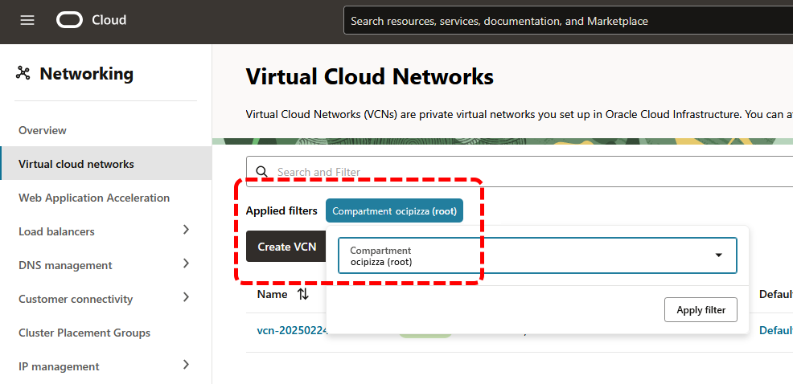
<br>

Os _[compartimento](https://docs.oracle.com/pt-br/iaas/Content/Identity/compartments/managingcompartments.htm)_ são **_recursos globais_** e, uma vez criados, estarão disponíveis em todas as regiões inscritas.

Por fim, é possível criar até **_seis subcompartimentos_** dentro de um _[compartimento](https://docs.oracle.com/pt-br/iaas/Content/Identity/compartments/managingcompartments.htm)_, e a maioria dos recursos pode ser movida entre _[compartimentos](https://docs.oracle.com/pt-br/iaas/Content/Identity/compartments/managingcompartments.htm)_.


<br>

#### **Compartimentos da Aplicação OCI PIZZA**

Para ilustrar melhor o uso de _[Compartimento](#compartimentos)_, imagine diferentes grupos de profissionais de TI colaborando no desenvolvimento da aplicação **_[OCI PIZZA](../capitulo-3/ocipizza-overview.md)_**. Esses grupos incluem:

- **REDES**
    - Grupo de pessoas responsáveis pela criação e gerenciamento dos recursos de rede no OCI.
        
- **APLICAÇÃO**
    - Grupo de pessoas responsáveis pela criação e gerenciamento de recursos de computação, bem como pela implantação da aplicação.

- **DBA**
    - Grupo de pessoas responsáveis pela criação e gerenciamento dos Bancos de Dados.

A separação de funções por tipo de profissional é uma prática comum que garante que cada equipe tenha acesso somente aos recursos necessários para desempenhar suas atividades. Por exemplo, os profissionais da equipe de **_REDES_** terão permissão apenas para gerenciar recursos de rede, como _[VCNs](../capitulo-4/servico-de-redes.md)_, _[sub-redes](../capitulo-4/servico-de-redes.md)_, _[VPNs Site-To-Site](https://docs.oracle.com/pt-br/iaas/Content/Network/Tasks/overviewIPsec.htm)_, etc.

Por outro lado, os profissionais de **_APLICAÇÃO_** terão acesso somente aos recursos de computação, como _[Compute Instances](https://docs.oracle.com/pt-br/iaas/Content/Compute/Concepts/computeoverview.htm)_, _[Container Instances](https://docs.oracle.com/pt-br/iaas/Content/container-instances/overview-of-container-instances.htm)_, _[Kubernetes Engine (OKE)](../capitulo-8/index.md)_, etc.

Da mesma forma, os profissionais **_DBA_** terão acesso somente aos recursos de bancos de dados, como o _[Oracle NoSQL](https://docs.oracle.com/en/database/other-databases/nosql-database/index.html)_.

Além da separação por grupos de usuários, outra forma de organizar os recursos é através da distinção por _"ambientes"_, como **_Produção (PRD)_**, **_Homologação (HML)_** e **_Desenvolvimento (DEV)_**.

Com base nessas definições, temos a seguinte estrutura de _[compartimento](#compartimentos)_ e _subcompartimentos (child compartments)_ para o _ambiente de produção (prd)_:

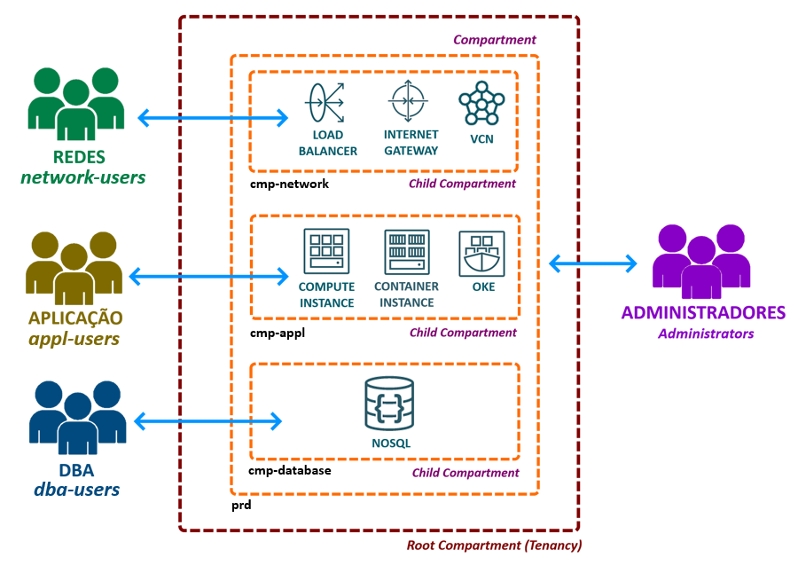
<br>

A partir do desenho, é possível observar que o grupo de usuários de redes _(group-network)_ terá autorização para criar recursos de rede exclusivamente no _[compartimento](#compartimentos)_ _cmp-network_. Outros grupos de usuários, como o de _aplicação (group-appl)_ e o de _DBA (group-dba)_, também terão permissões restritas aos seus respectivos _[compartimentos](#compartimentos)_ _(cmp-appl e cmp-database)_. Por fim, o grupo _Administrators_ tem acesso total a todos os _[compartimentos](#compartimentos)_.

Para criar um _[compartimento](#compartimentos)_, utilize o seguinte comando:

```bash linenums="1"
$ oci iam compartment create \
> --compartment-id "ocid1.tenancy.oc1..aaaaaaaaaaaaaaaaaaaaaaaaaaaaaaaaaaaaaaaa" \
> --name "cmp-prd" \
> --description "Compartimento para os recursos de produção (cmp-prd)." \
> --wait-for-state "ACTIVE"
```

Após a criação do _[compartimento](#compartimentos)_, obteremos seu  _[OCID](./gerenciando-o-oci-atraves-do-oci-cli.md#251-oracle-cloud-identifier-ocid)_ que será utilizado na criação do próximo _[compartimentos](#compartimentos)_, estabelecendo assim a hierarquia de _[compartimentos](#compartimentos)_, igual ao que foi apresentado na imagem anterior.

```bash linenums="1"
$ oci iam compartment list \
> --name "cmp-prd" \
> --query "data[].id"
[
  "ocid1.compartment.oc1..aaaaaavvvvvvvddddddddddd"
]
```

Com o _[OCID](./gerenciando-o-oci-atraves-do-oci-cli.md#251-oracle-cloud-identifier-ocid)_ do _[compartimento](#compartimentos)_ do _ambiente de produção (prd)_, prosseguimos para a criação do próximo _[compartimento](#compartimentos)_, que é o _cmp-network_:

```bash linenums="1"
$ oci iam compartment create \
> --compartment-id "ocid1.compartment.oc1..aaaaaavvvvvvvddddddddddd" \
> --name "cmp-network" \
> --description "Compartimento para os recursos de redes do ambiente de produção." \
> --wait-for-state "ACTIVE"
```

A criação dos demais _[compartimentos](#compartimentos)_ seguem a mesma lógica e não serão apresentados aqui.

O script **_[scripts/capitulo-2/compartment.sh](https://github.com/daniel-armbrust/ocipizza-iac/blob/main/scripts/capitulo-2/compartment.sh)_** contido no repositório **_["ocipizza-iac"](https://github.com/daniel-armbrust/ocipizza-iac)_**, inclui todos os comandos para a criação dos _[compartimentos](#compartimentos)_ da aplicação **OCI PIZZA**.

!!! note "NOTA"
    A Oracle recomenda a criação e configuração de um _[compartimentos](#compartimentos)_ **_sandbox_** para proporcionar aos usuários um espaço dedicado para testar recursos. No _[compartimento](#compartimentos)_ _sandbox_, você pode conceder permissões aos usuários para criar e gerenciar recursos, enquanto mantém permissões mais restritivas nos demais _[compartimentos](#compartimentos)_.

- TODO: os exemplos do livro utilizam o compartimento de produção apenas.

### **[Políticas de Acesso](https://docs.oracle.com/pt-br/iaas/Content/Identity/policieshow/Policy_Basics.htm)**

Uma _[Política de Acesso](https://docs.oracle.com/pt-br/iaas/Content/Identity/policieshow/Policy_Basics.htm)_, _[Política](https://docs.oracle.com/pt-br/iaas/Content/Identity/policieshow/Policy_Basics.htm)_ ou _[Policy](https://docs.oracle.com/pt-br/iaas/Content/Identity/policieshow/Policy_Basics.htm)_, é um documento que contém uma ou mais declarações destinadas a conceder acesso e autorizar, um grupo de usuários, em gerenciar determinado serviço ou recurso do OCI. A Policy permite especificar permissões em nível de _[compartimento](#compartimentos)_ ou para todo o _[Tenancy](../capitulo-1/definicoes-nist.md#resource-pooling-agrupamento-de-recursos)_.

A concessão de acesso é feita a um grupo de usuários ou a um serviço, e não a um usuário específico. Além disso, todo grupo de usuários que é criado não possui nenhuma permissão de acesso, a menos que uma _[Policy](https://docs.oracle.com/pt-br/iaas/Content/Identity/policieshow/Policy_Basics.htm)_ tenha sido previamente definida. É responsabilidade do administrador do _[Tenancy](../capitulo-1/definicoes-nist.md#resource-pooling-agrupamento-de-recursos)_ conceder permissões ao grupo ou serviço por meio de uma ou mais _[policies](https://docs.oracle.com/pt-br/iaas/Content/Identity/policieshow/Policy_Basics.htm)_.

Basicamente, a sintaxe geral da _[Policy](https://docs.oracle.com/pt-br/iaas/Content/Identity/policieshow/Policy_Basics.htm)_ possui o seguinte formato:


_[Policies](https://docs.oracle.com/pt-br/iaas/Content/Identity/policieshow/Policy_Basics.htm)_ sempre começam com a palavra **_Allow_**. Isso significa que as _[Policies](https://docs.oracle.com/pt-br/iaas/Content/Identity/policieshow/Policy_Basics.htm)_ que você cria apenas concedem ou autorizam acesso, não podendo negá-lo, uma vez que, por padrão, tudo já é negado.

Abaixo está o significado de cada uma das partes em destaque que compõem uma _[Policy](https://docs.oracle.com/pt-br/iaas/Content/Identity/policieshow/Policy_Basics.htm)_:

#### **[Assunto](https://docs.oracle.com/pt-br/iaas/Content/Identity/policysyntax/subject.htm)**

O elemento _[assunto](https://docs.oracle.com/pt-br/iaas/Content/Identity/policysyntax/subject.htm)_ pode especificar um _[Grupo de Usuários](#261-gerenciamento-de-identidades)_, _[Grupo Dinâmico](https://docs.public.oneportal.content.oci.oraclecloud.com/pt-br/iaas/Content/Identity/dynamicgroups/Working_with_Dynamic_Groups.htm)_ ou serviços do OCI, utilizando uma das seguintes formas:

- **group**
    - Nome do _[Grupo de Usuários](#261-gerenciamento-de-identidades)_ no qual o acesso será concedido.

- **group id**
    - _[OCID](./gerenciando-o-oci-atraves-do-oci-cli.md#251-oracle-cloud-identifier-ocid)_ do _[Grupo de Usuários](#261-gerenciamento-de-identidades)_ no qual o acesso será concedido.

- **dynamic-group**
    - Nome do _[Grupo Dinâmico](https://docs.public.oneportal.content.oci.oraclecloud.com/pt-br/iaas/Content/Identity/dynamicgroups/Working_with_Dynamic_Groups.htm)_ no qual o acesso será concedido.

- **dynamic-group id**
    - _[OCID](./gerenciando-o-oci-atraves-do-oci-cli.md#251-oracle-cloud-identifier-ocid)_ do _[Grupo Dinâmico](https://docs.public.oneportal.content.oci.oraclecloud.com/pt-br/iaas/Content/Identity/dynamicgroups/Working_with_Dynamic_Groups.htm)_ no qual o acesso será concedido.

- **service**
    - Especifica o nome do serviço OCI no qual o acesso será concedido.

- **any-group**
    - Indica todos os _[Grupos de Usuários](#261-gerenciamento-de-identidades)_ e _[Grupos Dinâmico](https://docs.public.oneportal.content.oci.oraclecloud.com/pt-br/iaas/Content/Identity/dynamicgroups/Working_with_Dynamic_Groups.htm)_ do _[Tenancy](../capitulo-1/definicoes-nist.md#resource-pooling-agrupamento-de-recursos)_.

Há também a sintaxe **_<Nome do Domínio de Identidade\>/<Nome do Grupo\>_** que pode ser utilizada para se referir a um _[Grupo de Usuários](#261-gerenciamento-de-identidades)_ existente em um _[Domínio de Identidade](https://docs.oracle.com/pt-br/iaas/Content/Identity/domains/overview.htm)_ que não é o **_Default_**.

!!! note "NOTA"
    O livro utiliza o _[Domínio de Identidade](https://docs.oracle.com/pt-br/iaas/Content/Identity/domains/overview.htm)_ **_Default_**, que é criado automaticamente durante o processo de ativação da conta. Para saber mais sobre _[Domínios de Identidade](https://docs.oracle.com/pt-br/iaas/Content/Identity/domains/overview.htm)_, consulte _["Gerenciando Domínios de Identidade"](https://docs.oracle.com/pt-br/iaas/Content/Identity/domains/overview.htm)_.

#### **[Verbo](https://docs.oracle.com/pt-br/iaas/Content/Identity/policieshow/Verbs.htm)**

O elemento _[verbo](https://docs.oracle.com/pt-br/iaas/Content/Identity/policieshow/Verbs.htm)_ especifica o _tipo de acesso_ que será concedido em relação as operações que podem ser feitas em uma determinada API de um determinado serviço. Seus valores incluem:

- **inspect**
    - Concede a autorização para listar recursos.

- **read**
    - Inclui as permissões do verbo _inspect_ mais a capacidade de obter metadados do recurso.

- **use**
    - Inclui as permissões do verbo _read_ mais a capacidade de poder _atualizar_ o recurso _(operações de update)_. Em geral, esse verbo não inclui a capacidade de criar ou excluir um recurso.

- **manage**
    - Inclui todas as permissões para o recurso. 

!!! note "NOTA"
    Como é possível perceber o nível de acesso é cumulativo à medida que você vai de _inspect > read > use > manage_.

Sabemos que, para cada serviço disponibilizado pelo OCI, existem uma ou mais APIs disponíveis, e cada API oferece uma funcionalidade específica relacionada ao serviço.

Em termos de concessão de acesso, por exemplo, o verbo _inspect_ para o serviço de _[Load Balancer](../capitulo-4/load-balancer.md)_, inclui a permissão nomeada **_LOAD\_BALANCER\_INSPECT_** que concede acesso às APIs **_ListLoadBalancers_**, **_ListShapes_**, **_ListPolicies_** e **_ListProtocols_**.

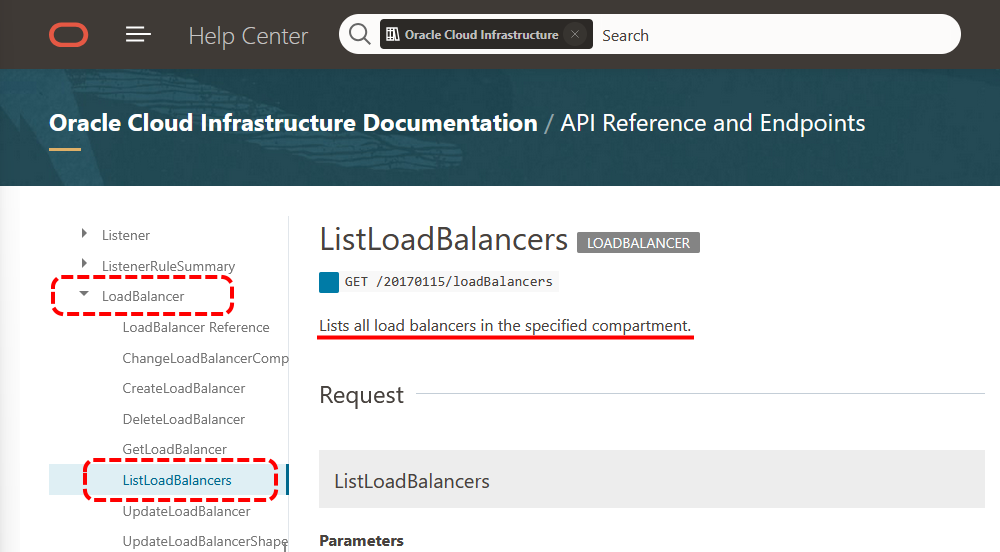
<br>

!!! note "NOTA"
    Normalmente, os nomes das APIs são autoexplicativos. No entanto, se você deseja obter informações detalhadas sobre os tipos de operações de uma API específica, consulte o link _["API Reference and Endpoints"](https://docs.oracle.com/en-us/iaas/api/#/)_.

O objetivo dos _verbos_ é simplificar o processo de concessão de diversas permissões relacionadas. Para facilitar a compreensão, abaixo está um exemplo da correlação entre um _verbo_ e as _permissões_ associadas às APIs do serviço _[Load Balancer](../capitulo-4/load-balancer.md)_:

| Verbo   | Permissão                      | API                                                         |
|---------|--------------------------------|-------------------------------------------------------------|
| inspect | LOAD_BALANCER_INSPECT          | _[ListLoadBalancers](https://docs.oracle.com/en-us/iaas/api/#/en/loadbalancer/20170115/LoadBalancer/ListLoadBalancers)_, _[ListShapes](https://docs.oracle.com/en-us/iaas/api/#/en/loadbalancer/20170115/LoadBalancerShape/ListShapes)_, _[ListPolicies](https://docs.oracle.com/en-us/iaas/api/#/en/loadbalancer/20170115/LoadBalancerPolicy/ListPolicies)_ e _[ListProtocols](https://docs.oracle.com/en-us/iaas/api/#/en/loadbalancer/20170115/LoadBalancerProtocol/ListProtocols)_ |
| read    | _inspect_ + LOAD_BALANCER_READ | _[GetLoadBalancer](https://docs.oracle.com/en-us/iaas/api/#/en/loadbalancer/20170115/LoadBalancer/GetLoadBalancer)_, _[GetBackendSet](https://docs.oracle.com/en-us/iaas/api/#/en/loadbalancer/20170115/BackendSet/GetBackendSet)_, _[GetBackend](https://docs.oracle.com/en-us/iaas/api/#/en/loadbalancer/20170115/Backend/GetBackend)_, _[GetHealthChecker](https://docs.oracle.com/en-us/iaas/api/#/en/loadbalancer/20170115/HealthChecker/GetHealthChecker)_, etc. |
| use     | _read_ + LOAD_BALANCER_UPDATE e LOAD_BALANCER_MOVE | _[UpdateBackendSet](https://docs.oracle.com/en-us/iaas/api/#/en/loadbalancer/20170115/BackendSet/UpdateBackendSet)_, _[DeleteBackendSet](https://docs.oracle.com/en-us/iaas/api/#/en/loadbalancer/20170115/BackendSet/DeleteBackendSet)_, _[UpdateListener](https://docs.oracle.com/en-us/iaas/api/#/en/loadbalancer/20170115/Listener/UpdateListener)_, etc. |
| manage  | _use_ + LOAD_BALANCER_CREATE e LOAD_BALANCER_DELETE | _[CreateLoadBalancer](https://docs.oracle.com/en-us/iaas/api/#/en/loadbalancer/20170115/LoadBalancer/CreateLoadBalancer)_ e _[DeleteLoadBalancer](https://docs.oracle.com/en-us/iaas/api/#/en/loadbalancer/20170115/LoadBalancer/DeleteLoadBalancer)_ |

!!! note "NOTA"
    O link _["Referência da Política de Serviço Detalhada"](https://docs.oracle.com/pt-br/iaas/Content/Identity/policyreference/policyreference.htm)_ contém todos os detalhes referente as permissões e operações às APIs para todos os serviços disponibilizados pelo OCI.

No exemplo abaixo, a _[Policy](https://docs.oracle.com/pt-br/iaas/Content/Identity/policieshow/Policy_Basics.htm)_ escrita concede ao _grupo network-users_, acesso a todas as APIs do serviço que gerencia _[VCNs](../capitulo-4/servico-de-redes.md)_ em todo o _[Tenancy](../capitulo-1/definicoes-nist.md#resource-pooling-agrupamento-de-recursos)_:

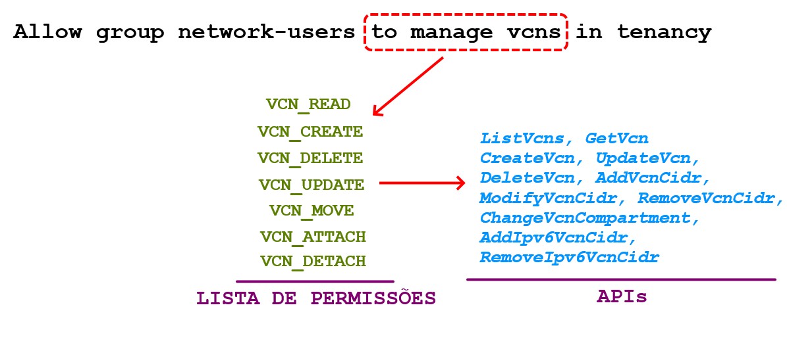
<br>

Compreender a relação entre permissões e as APIs disponíveis por serviço facilita a elaboração de _[Policies](https://docs.oracle.com/pt-br/iaas/Content/Identity/policieshow/Policy_Basics.htm)_ mais granulares em termos de acesso. Veremos adiante que é possível, por exemplo, conceder acesso apenas às APIs _[AddVcnCidr](https://docs.oracle.com/en-us/iaas/api/#/en/iaas/20160918/Vcn/AddVcnCidr)_ e _[RemoveVcnCidr](https://docs.oracle.com/en-us/iaas/api/#/en/iaas/20160918/Vcn/RemoveVcnCidr)_ do verbo _manage_, sem conceder acesso às demais APIs, como _[CreateVcn](https://docs.oracle.com/en-us/iaas/api/#/en/iaas/20160918/Vcn/CreateVcn)_, _[UpdateVcn](https://docs.oracle.com/en-us/iaas/api/#/en/iaas/20160918/Vcn/UpdateVcn)_ ou _[DeleteVcn](https://docs.oracle.com/en-us/iaas/api/#/en/iaas/20160918/Vcn/DeleteVcn)_.

#### **[Tipo do Recurso](https://docs.oracle.com/pt-br/iaas/Content/Identity/policiesgs/policies_topic-ResourceTypes.htm)**

O elemento _[tipo do recurso](https://docs.oracle.com/pt-br/iaas/Content/Identity/policiesgs/policies_topic-ResourceTypes.htm)_ refere-se a um recurso específico ou a uma _família de recursos_.

Por exemplo, a _família de recursos_ **_virtual-network-family_** abrange vários recursos específicos relacionados a _[VCN](../capitulo-4/servico-de-redes.md)_, como **_vcns_**, **_subnets_**, **_route-tables_**, **_security-lists_**, entre outros. Nesse contexto, **_vcns_** e **_subnets_** correspondem a recursos específicos, como _[VCNs](../capitulo-4/servico-de-redes.md)_ e _[Sub-rede](../capitulo-4/servico-de-redes.md)_.

Trabalhar com um recurso específico ou uma _família de recursos_ proporciona a flexibilidade de definir exatamente quais recursos terão acesso concedido.

Há também o tipo **_all-resources_**, que pode ser usado para fazer referência a todos os recursos do _[Tenancy](../capitulo-1/definicoes-nist.md#resource-pooling-agrupamento-de-recursos)_.


!!! note "NOTA"
    Consulte _["Referência da Política de Serviço Detalhada"](https://docs.oracle.com/pt-br/iaas/Content/Identity/policyreference/policyreference.htm)_ para verificar os tipos de recursos disponíveis e o nome da família de recursos à qual cada recurso pertence.

#### **[Local](https://docs.oracle.com/pt-br/iaas/Content/Identity/policysyntax/location.htm)**

O elemento _[local](https://docs.oracle.com/pt-br/iaas/Content/Identity/policysyntax/location.htm)_ especifica o _[Compartimento](#compartimentos)_ ou _[Tenancy](../capitulo-1/definicoes-nist.md#resource-pooling-agrupamento-de-recursos)_ no qual a _[Policy](https://docs.oracle.com/pt-br/iaas/Content/Identity/policieshow/Policy_Basics.htm)_ concede acesso. Em outras palavras, ele define o escopo do acesso, que pode ser um _[compartimento](#compartimentos)_ específico ou todo o _[Tenancy](../capitulo-1/definicoes-nist.md#resource-pooling-agrupamento-de-recursos)_.

Os seguintes valores que podem ser usados para o elemento _[local](https://docs.oracle.com/pt-br/iaas/Content/Identity/policysyntax/location.htm)_ são:

- **tenancy**
    - Abrange todos os recursos do Tenancy.

- **compartment**
    - Usado para especificar o nome do compartimento onde a policy será aplicada. Se houver subcompartimentos abaixo do compartimento especificado, a policy se aplicará a todos os compartimentos a partir do nível mais alto da hierarquia.
  
- **compartment id**
    - Usado para especificar o _[OCID](./gerenciando-o-oci-atraves-do-oci-cli.md#251-oracle-cloud-identifier-ocid)_ do compartimento onde a policy será aplicada. 

Valores válidos para o elemento _[local](https://docs.oracle.com/pt-br/iaas/Content/Identity/policysyntax/location.htm)_ também podem incluír um _[compartimento](#compartimentos)_ específico dentro de uma hierarquia de _[compartimentos](#compartimentos)_:

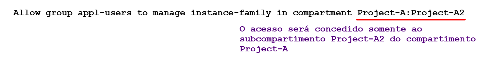

Para **_compartment id_**, é possível utilizar apenas um valor _[OCID](./gerenciando-o-oci-atraves-do-oci-cli.md#251-oracle-cloud-identifier-ocid)_ de um  _[compartimento](#compartimentos)_ específico. Não é permitido fazer referência a uma hierarquia de  _[compartimentos](#compartimentos)_.

#### **[Condição](https://docs.oracle.com/pt-br/iaas/Content/Identity/policysyntax/conditions.htm)**

O elemento _[condição](https://docs.oracle.com/pt-br/iaas/Content/Identity/policysyntax/conditions.htm)_ e é opcional e pode ser usado para restringir o escopo das permissões concedidas em uma política.

Uma condição é escrita utilizando a cláusula **where**, seguida de uma comparação que pode ser simples (uma única condição) ou que pode abranger múltiplas condições.

O exemplo abaixo demonstra a utilização de uma condição simples que usa o operador de negação **!=** para excluír somente a permissão **VCN_DELETE** do grupo _network-users_. Com isso, os usuários desse grupo podem criar VCNs, listar ou atualizar suas informações, mas não têm permissão para excluir uma VCN.


Além de **_request.permission_** é possível utilizar **_request.operation_** para fazer referência a uma operação específica da API:


As condições podem ser agrupadas entre chaves na forma **_{ condição-1, condição-2 }_** para avaliação. Para criar um _OR lógico_ entre um conjunto de condições, utilize a palavra **any**. Para estabelecer um _AND lógico_ entre um conjunto de condições, utilize **all**.

A _[policy](https://docs.oracle.com/pt-br/iaas/Content/Identity/policieshow/Policy_Basics.htm)_ de exemplo abaixo utiliza o operador **any** para criar um _OR lógico_, limitando o acesso do grupo _network-users_ às operações de APIs _[AddVcnCidr](https://docs.oracle.com/en-us/iaas/api/#/en/iaas/20160918/Vcn/AddVcnCidr)_ ou _[RemoveVcnCidr](https://docs.oracle.com/en-us/iaas/api/#/en/iaas/20160918/Vcn/RemoveVcnCidr)_.


Uma política de acesso pode ser criada da seguinte forma, utilizando o _[OCI CLI](./acessando-o-oci.md#oci-cli-oci-command-line-interface)_:

```bash linenums="1"
$ oci iam policy create \
> --compartment-id "ocid1.tenancy.oc1..aaaaaaaaaaaaaaaaaaaaaaaaaaaaaaaaaaaaaaaa" \
> --name "network-users-policy" \
> --description "Políticas de Acesso para o Grupo network-users." \
> --statements "[
> 'Allow group network-users to manage virtual-network-family in compartment cmp-prd:cmp-network',
> 'Allow group network-users to manage virtual-network-family in compartment cmp-hml:cmp-network',
> 'Allow group network-users to manage virtual-network-family in compartment cmp-dev:cmp-network']" \
> --wait-for-state "ACTIVE"
```

!!! note "NOTA"
    A página da documentação do OCI sobre _[Políticas Comuns](https://docs.oracle.com/pt-br/iaas/Content/Identity/Concepts/commonpolicies.htm)_ apresenta diversos exemplos de policies que podem servir como base para a elaboração das suas próprias políticas de acesso.

### **As Políticas de Acesso da Aplicação OCI PIZZA**

O script **_[scripts/capitulo-2/policy.sh](https://github.com/daniel-armbrust/ocipizza-iac/blob/main/scripts/capitulo-2/policy.sh)_** contido no repositório **_["ocipizza-iac"](https://github.com/daniel-armbrust/ocipizza-iac)_**, inclui todas as políticas de acesso utilizadas pela aplicação **OCI PIZZA**.

## 3.6.3 Grupos Dinâmicos

Os _[Grupos Dinâmicos](https://docs.oracle.com/pt-br/iaas/Content/Identity/Tasks/managingdynamicgroups.htm)_ são um tipo especial de grupo projetado para agrupar recursos, em vez de usuários. 

A finalidade dos _[Grupos dinâmicos](https://docs.oracle.com/pt-br/iaas/Content/Identity/Tasks/managingdynamicgroups.htm)_ é conceder acesso às APIs do OCI a uma _[instância de computação](../capitulo-6/index.md)_ ou recurso, que podem incluir não apenas servidores virtuais, mas também servidores que fazem parte de um cluster _[Kubernetes (OKE)](../capitulo-8/index.md)_ ou um _[Container Instances](https://docs.oracle.com/pt-br/iaas/Content/container-instances/overview-of-container-instances.htm)_, por exemplo.

<div align="center" style="font-weight: bold; font-style: italic;">
Pense da seguinte forma: quando a intenção é conceder acesso de um serviço do OCI a outro, você deve utilizar Grupos Dinâmicos.
</div>

Uma vez que o _[Grupos Dinâmicos](https://docs.oracle.com/pt-br/iaas/Content/Identity/Tasks/managingdynamicgroups.htm)_ foi criado, também é necessário criar uma _[política de acesso](#políticas-de-acesso)_ para autorizar esse grupo a interagir com uma ou mais APIs do OCI. É importante destacar que os _[Grupos Dinâmicos](https://docs.oracle.com/pt-br/iaas/Content/Identity/Tasks/managingdynamicgroups.htm)_ inclui como membro um recurso específico, e o acesso concedido a esse recurso, conforme definido na _[política de acesso](#políticas-de-acesso)_, permitirá que ele crie e gerencie outros recursos no OCI.

A definição de um recurso que faz parte do _[Grupo Dinâmico](https://docs.oracle.com/pt-br/iaas/Content/Identity/Tasks/managingdynamicgroups.htm)_ é feita através de um conjunto de _regras de correspondência_ que especificam recursos através do uso das seguintes variáveis:

- **instance.compartment.id**
    - Especifica o compartimento onde a instância de computação reside.

- **instance.id**
    - Especifica o _[OCID](./gerenciando-o-oci-atraves-do-oci-cli.md#251-oracle-cloud-identifier-ocid)_ da instância de computação.

- **tag.<tagnamespace\>.<tagkey\>.value**
    - Especifica o _namespace da tag_ e a _chave da tag_ que podem fazer referência a uma ou mais instâncias de computação no qual incluem as informações da _[tag](https://docs.oracle.com/pt-br/iaas/Content/Tagging/Concepts/taggingoverview.htm)_ especificada.

- **tag.<tagnamespace\>.<tagkey\>.value='<tagvalue\>'**
    - Especifica além do _namespace da tag_ e a _chave da tag_, é possível fazer referência ao valor que uma _[tag](https://docs.oracle.com/pt-br/iaas/Content/Tagging/Concepts/taggingoverview.htm)_ específica possui.

- **resource.compartment.id**
    - Especifica o compartimento onde o recurso reside.

- **resource.id**
    - Especifica o _[OCID](./gerenciando-o-oci-atraves-do-oci-cli.md#251-oracle-cloud-identifier-ocid)_ do recurso.

- **resource.type**
    - Especifica o tipo do recurso.

!!! note "NOTA"
    Consulte a página _["Visão Geral do Serviço Tagging"](https://docs.oracle.com/pt-br/iaas/Content/Tagging/Concepts/taggingoverview.htm)_ para obter mais informações sobre o uso de _tags_ em recursos.

Os operadores lógicos **_any (OR)_** e **_all (AND)_** podem ser utilizados para criar regras de correspondência em um _[Grupo Dinâmico](https://docs.oracle.com/pt-br/iaas/Content/Identity/Tasks/managingdynamicgroups.htm)_.

Por exemplo, a imagem abaixo ilustra uma regra de correspondência de um _[Grupo Dinâmico](https://docs.oracle.com/pt-br/iaas/Content/Identity/Tasks/managingdynamicgroups.htm)_ **_instances-dyngrp_**, que incluem as _[instâncias de computação](../capitulo-6/index.md)_ de um compartimento específico **_(instance.compartment.id)_** ou **_(OR lógico)_**, uma única instância **_(instance.id)_**:

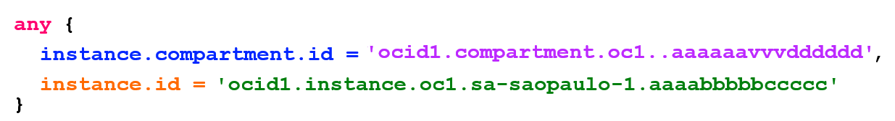

!!! note "NOTA"
    Os nomes dos _[Grupos Dinâmicos](https://docs.oracle.com/pt-br/iaas/Content/Identity/Tasks/managingdynamicgroups.htm)_ devem ser exclusivos em todo o _[Tenancy](../capitulo-1/definicoes-nist.md#resource-pooling-agrupamento-de-recursos)_.

A partir do _[Grupo Dinâmico](https://docs.oracle.com/pt-br/iaas/Content/Identity/Tasks/managingdynamicgroups.htm)_ que foi definido, podemos escrever uma _[policy](https://docs.oracle.com/pt-br/iaas/Content/Identity/policieshow/Policy_Basics.htm)_ que concede acesso total aos objetos do serviço _[Object Storage](https://docs.oracle.com/pt-br/iaas/Content/Object/Concepts/objectstorageoverview.htm)_ dentro do compartimento especificado:


Em resumo, neste exemplo, a definição do _[Grupo Dinâmico](https://docs.oracle.com/pt-br/iaas/Content/Identity/Tasks/managingdynamicgroups.htm)_ e da _[policy](https://docs.oracle.com/pt-br/iaas/Content/Identity/policieshow/Policy_Basics.htm)_ associada permitem que qualquer _[instância de computação](../capitulo-6/index.md)_ dentro do compartimento especificado, ou a instância identificada pelo seu _[OCID](./gerenciando-o-oci-atraves-do-oci-cli.md#251-oracle-cloud-identifier-ocid)_, manipule objetos do serviço _[Object Storage](https://docs.oracle.com/pt-br/iaas/Content/Object/Concepts/objectstorageoverview.htm)_ que estão armazenados no compartimento _cmp-prd:cmp-appl_.

Para criar um _[Grupo Dinâmico](https://docs.oracle.com/pt-br/iaas/Content/Identity/Tasks/managingdynamicgroups.htm)_ através do _[OCI CLI](./acessando-o-oci.md#oci-cli-oci-command-line-interface)_, utilize como exemplo o seguinte comando:

```bash linenums="1"
$ oci iam dynamic-group create \
> --name "instances-dyngrp" \
> --description "Grupo dinâmico das instâncias de computação que usam o Object Storage." \
> --matching-rule "any {
> instance.compartment.id = 'ocid1.compartment.oc1..aaaaaavvvvvvvddddddddddd', 
> instance.id = 'ocid1.instance.oc1.sa-saopaulo-1.acccccvvvbbbbbbbbbbb'}" \
> --wait-for-state "ACTIVE"
```

### **Grupos Dinâmicos da Aplicação OCI PIZZA**

O script **_[scripts/capitulo-2/dynamic-group.sh](https://github.com/daniel-armbrust/ocipizza-iac/blob/main/scripts/capitulo-2/dynamic-group.sh)_** contido no repositório **_["ocipizza-iac"](https://github.com/daniel-armbrust/ocipizza-iac)_**, inclui os _[Grupos Dinâmicos](https://docs.oracle.com/pt-br/iaas/Content/Identity/Tasks/managingdynamicgroups.htm)_ utilizadas pela aplicação **OCI PIZZA**.

## 3.6.4 Limites e Cotas

### **[Limites](https://docs.oracle.com/pt-br/iaas/Content/General/Concepts/servicelimits.htm)**

Após a ativação da sua conta, o OCI estabelece um conjunto de limites para os recursos que você pode criar. Esses limites referem-se à quantidade máxima de recursos permitidos em seu _[Tenancy](../capitulo-1/definicoes-nist.md#resource-pooling-agrupamento-de-recursos)_, e cada recurso ou serviço possui um limite específico. 

Por exemplo, o OCI estabelece um limite inicial de criação de até seis _[Container Instances](https://docs.oracle.com/pt-br/iaas/Content/container-instances/overview-of-container-instances.htm)_ em todo o _[Tenancy](../capitulo-1/definicoes-nist.md#resource-pooling-agrupamento-de-recursos)_, para contas que utilizam o modelo de cobrança _[Pay As You Go](./modelos-de-cobraca.md#231-pay-as-you-go-payg-e-upfront-subscription)_ ou _Trial (contas para avaliação)_. Em contrapartida, para contas que operam sob o modelo _[Oracle Universal Credits](./modelos-de-cobraca.md#231-pay-as-you-go-payg-e-oracle-universal-credits-ouc)_, o limite inicial é de até dois mil _[Container Instances](https://docs.oracle.com/pt-br/iaas/Content/container-instances/overview-of-container-instances.htm)_.

!!! note "NOTA"
    Todos os limites iniciais para os diversos serviços, seja para contas que utilizam o modelo de cobrança _[Pay As You Go](./modelos-de-cobraca.md#231-pay-as-you-go-payg-e-upfront-subscription)_, _Trial_ ou _[Oracle Universal Credits](./modelos-de-cobraca.md#231-pay-as-you-go-payg-e-oracle-universal-credits-ouc)_, podem ser consultados na documentação oficial do OCI em _["Limites do Serviço"](https://docs.oracle.com/pt-br/iaas/Content/General/Concepts/servicelimits.htm)_.

Para consultar o limite de um serviço específico utilizando o _[OCI CLI](./acessando-o-oci.md#oci-cli-oci-command-line-interface)_, é necessário, primeiramente, ter em mãos o _"Nome do Serviço"_, conforme demonstrado no comando a seguir:

```bash linenums="1"
$ oci limits service list \
> --compartment-id "ocid1.tenancy.oc1..aaaaaaaaaaaaaaaaaaaaaaaaaaaaaaaaaaaaaaaa" \
> --all \
> --query 'data[*].{"Descrição do Serviço": description, "Nome do Serviço": name}' \
> --output table
+---------------------------------------+-----------------------------+
| Descrição do Serviço                  | Nome do Serviço             |
+---------------------------------------+-----------------------------+
| Application Dependency Management     | adm                         |
| Access Governance                     | agcs                        |
| AI Anomaly Detection                  | ai-anomaly-detection        |
| AI Document                           | ai-document                 |
| AI Forecasting                        | ai-forecasting              |
| Generative AI                         | ai-generative               |
| AI Language                           | ai-language                 |
| AI Speech                             | ai-speech                   |
| AI Vision                             | ai-vision                   |
| Analytics                             | analytics                   |
| Announcements                         | announcements               |
| API Gateway                           | api-gateway                 |
| Application Performance Monitoring    | apm                         |
| Application Configuration             | app-configuration           |
| Account Tracking and Automation Tools | atat                        |
| Auto Scaling                          | auto-scaling                |
| Autonomous Recovery Service           | autonomous-recovery-service |
| Big Data                              | big-data                    |
```

!!! note "NOTA"
    O resultado do comando acima foi limitada devido à grande quantidade de serviços disponíveis no OCI. Você pode obter esse comando a partir do script **_[scripts/capitulo-2/all-services.sh](https://github.com/daniel-armbrust/ocipizza-iac/blob/main/scripts/capitulo-2/all-services.sh)_**, que está contido no repositório **_["ocipizza-iac"](https://github.com/daniel-armbrust/ocipizza-iac)_**.

Uma vez que você tenha o nome do serviço, é possível consultar os limites associados a ele:

```bash linenums="1"
$ oci limits value list \
> --compartment-id "ocid1.tenancy.oc1..aaaaaaaaaaaaaaaaaaaaaaaaaaaaaaaaaaaaaaaa" \
> --all \
> --service-name "vpn"
{
  "data": [
    {
      "availability-domain": null,
      "name": "cpe-count",
      "scope-type": "REGION",
      "value": 10
    },
    {
      "availability-domain": null,
      "name": "ipsec-connection-count",
      "scope-type": "REGION",
      "value": 4
    }
  ]
}
```

Neste caso, para o serviço de VPN que foi consultado, existem dois limites aplicáveis:

- **cpe-count**
    - Este limite indica que você pode ter até dez _[Customer Premises Equipment (CPE)](https://docs.oracle.com/pt-br/iaas/Content/Network/Tasks/configuringCPE.htm)_ em uma região específica. O CPE é um dispositivo que conecta sua rede local à rede do OCI, permitindo a comunicação entre os dois ambientes.

- **ipsec-connection-count**
    - Este limite especifica que você pode ter até quatro conexões _[IPSec](https://docs.oracle.com/en-us/iaas/Content/Network/Tasks/overviewIPsec.htm)_ em uma região. As conexões _[IPSec](https://docs.oracle.com/en-us/iaas/Content/Network/Tasks/overviewIPsec.htm)_ são usadas para estabelecer uma conexão segura entre sua rede local e o OCI, utilizando criptografia para proteger os dados transmitidos.

#### **[Solicitando Aumento dos Limites](https://support.oracle.com/knowledge/Oracle%20Cloud/2907244_1.html)**

Para solicitar aumento de limites para qualquer serviço do OCI, utilize a opção **_"Request a limit increase"_** da _[Web Console](./acessando-o-oci.md#web-console)_ conforme demonstrado na figura abaixo:

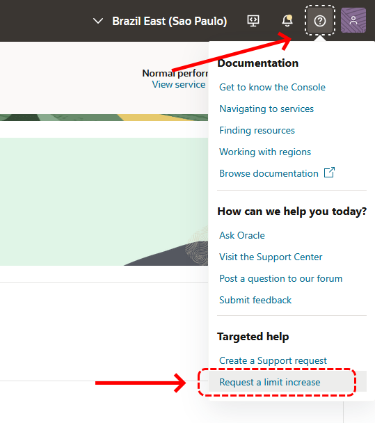
<br>

Após isso, você será direcionado para um assistente virtual, onde deverá clicar no botão **_"Limit Increase"_** em duas telas consecutivas:

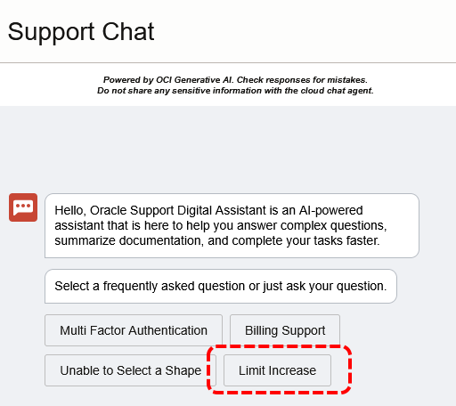
<br>

Um formulário será exibido, onde você deverá selecionar a categoria do serviço **_(Service Category)_**, o recurso ou item relacionado ao serviço **_(Resource)_**, o novo limite desejado para a região **_(sa-saopaulo-1 Region Limit)_**, e fornecer uma justificativa **_(Reason for request)_**. Em seguida, basta clicar no botão **_"Create Support Request"_**:

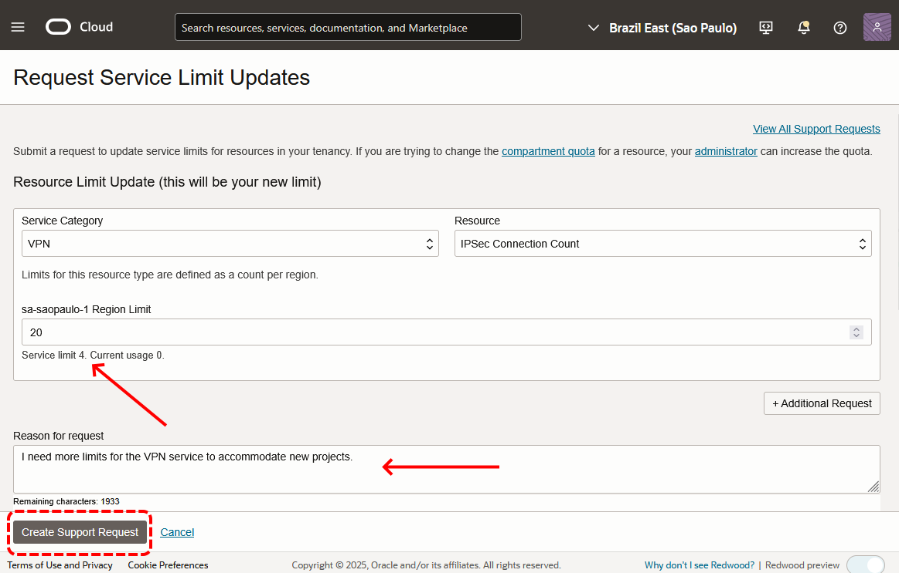
<br>

Essa ação criará uma solicitação para a equipe do OCI, que, após análise, irá efetivar o novo valor solicitado. Toda a comunicação será realizada por meio do e-mail cadastrado do usuário que está solicitando o aumento do limite.

### **[Cotas](https://docs.oracle.com/pt-br/iaas/Content/Quotas/Concepts/resourcequotas.htm)**

_[Cotas](https://docs.oracle.com/pt-br/iaas/Content/Quotas/Concepts/resourcequotas.htm)_ ou _[Cotas de Compartimento](https://docs.oracle.com/pt-br/iaas/Content/Quotas/Concepts/resourcequotas.htm)_ são utilizadas para controlar a quantidade de recursos que podem ser criados dentro de um _[compartimento](#compartimentos)_. As cotas de compartimento são semelhantes aos _[limites do serviço](#limites)_, mas a principal diferença é que os _[limites do serviço](#limites)_ são estabelecidos pela Oracle, enquanto as _[cotas de compartimento](https://docs.oracle.com/pt-br/iaas/Content/Quotas/Concepts/resourcequotas.htm)_ são definidas pelos administradores do _[Tenancy](../capitulo-1/definicoes-nist.md#resource-pooling-agrupamento-de-recursos)_ ou por qualquer outro usuário que possua privilégios adequados.

De forma prática, você pode definir, por meio de _[cotas](https://docs.oracle.com/pt-br/iaas/Content/Quotas/Concepts/resourcequotas.htm)_, o número máximo de _[Container Instances](https://docs.oracle.com/pt-br/iaas/Content/container-instances/overview-of-container-instances.htm)_ que podem ser criadas no _[compartimento](#compartimentos)_ _cmp-appl_, por exemplo. Isso permite um controle eficaz sobre a utilização dos recursos dentro de um _[compartimento](#compartimentos)_.

Para definir cotas, utiliza-se uma linguagem declarativa própria, semelhante à utilizada nas políticas de acesso. Essa linguagem inclui três tipos de instruções que podem ser usadas. São elas:

- **zero**
    - Redefine todos os limites de cota de um recurso para zero.

- **unset**
    - Redefine as cotas de volta para os limites do serviço padrão.

- **set**
    - Define um número máximo de recursos que podem ser criados.

Por exemplo, o seguinte comando pode ser utilizado para restringir a criação de até oito _[Container Instances](https://docs.oracle.com/pt-br/iaas/Content/container-instances/overview-of-container-instances.htm)_ com processadores do tipo E4 nas regiões _sa-saopaulo-1_ ou _sa-vinhedo-1_:

```bash linenums="1"
$ oci limits quota create \
> --compartment-id ocid1.tenancy.oc1..aaaaaaaaaaaaaaaaaaaaaaaaaaaaaaaaaaaaaaaa" \
> --name "container-instance-quota" \
> --description "Cotas para os serviços Compute Instances e Container Instances." \
> --statements "[
> 'zero compute-core quota in tenancy', 
> 'set compute-core quota standard-e4-core-count to 8 in tenancy where any {request.region = sa-saopaulo-1, request.region = sa-vinhedo-1}']" \
> --wait-for-state "ACTIVE"
```

Observe que, para aplicar a _[cota](https://docs.oracle.com/pt-br/iaas/Content/Quotas/Concepts/resourcequotas.htm)_ de forma eficaz, inicialmente zeramos o limite utilizando a instrução **_zero_**. Em seguida, com a instrução **_set_**, definimos o valor do limite para um item específico, que neste caso é a CPU do tipo E4, identificada como **_standard-e4-core-count_**, pertencente à família do serviço **_compute-core_**.

!!! note "NOTA"
    As cotas para o serviço de _[Container Instances](https://docs.oracle.com/pt-br/iaas/Content/container-instances/overview-of-container-instances.htm)_ pertencem à mesma família **_compute-core_** que as cotas do serviço _[Compute Instances](https://docs.oracle.com/pt-br/iaas/Content/Compute/Concepts/computeoverview.htm)_.

!!! note "NOTA"
    A documentação disponível em _[Cotas Disponíveis por Serviço](https://docs.oracle.com/pt-br/iaas/Content/Quotas/Concepts/resourcequotas_topic-Available_Quotas_by_Service.htm)_ contém informações sobre todas as _[cotas](https://docs.oracle.com/pt-br/iaas/Content/Quotas/Concepts/resourcequotas.htm)_ disponíveis por serviço.

#### **Cotas da Aplicação OCI PIZZA**

O script **_[scripts/capitulo-2/quotas.sh](https://github.com/daniel-armbrust/ocipizza-iac/blob/main/scripts/capitulo-2/quotas.sh)_** contido no repositório **_["ocipizza-iac"](https://github.com/daniel-armbrust/ocipizza-iac)_**, contém as _[cotas](https://docs.oracle.com/pt-br/iaas/Content/Quotas/Concepts/resourcequotas.htm)_ utilizadas pela aplicação **OCI PIZZA**.

## 3.6.5 Gerenciamento de Regiões

Um _[Tenancy](../capitulo-1/definicoes-nist.md#resource-pooling-agrupamento-de-recursos)_ dentro do modelo de cobrança _[Pay As You Go](./modelos-de-cobraca.md#231-pay-as-you-go-payg-e-upfront-subscription)_ ou _[Free Tier](./modelos-de-cobraca.md#233-free-tier-e-o-always-free)_ é restrito a uma única _[região](./introducao-ao-oci.md#211-região)_. Isso significa que, para utilizar outra _[região](./introducao-ao-oci.md#211-região)_, você precisará solicitar uma inscrição para essa nova _[região](./introducao-ao-oci.md#211-região)_.

O comando abaixo solicita a inscrição na _[região](./introducao-ao-oci.md#211-região)_ _"Sudeste do Brasil (Vinhedo)"_:

```bash linenums="1"
$ oci iam region-subscription create \
> --tenancy-id "ocid1.tenancy.oc1..aaaaaaaaaaaaaaaaaaaaaaaaaaaaaaaaaaaaaaaa" \
> --region-key "VCP"
{
  "data": {
    "is-home-region": false,
    "region-key": "VCP",
    "region-name": "sa-vinhedo-1",
    "status": "IN_PROGRESS"
  }
}
```

Observe que a região é especificada por meio de sua chave, que neste caso é **_VCP_**.

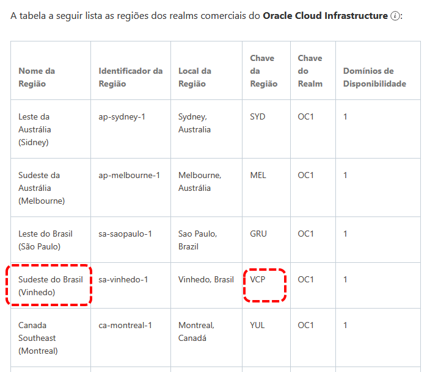

Após alguns minutos, você poderá verificar que a região solicitada já está disponível para uso **_(STATUS: READY)_**:

```bash linenums="1"
$ oci iam region-subscription list \
> --tenancy-id "ocid1.tenancy.oc1..aaaaaaaaaaaaaaaaaaaaaaaaaaaaaaaaaaaaaaaa" \
> --all \
> --query 'data[*].{"Nome da Região": "region-name", "Chave da Região": "region-key", "Status": status}' \
> --output table
+-----------------+----------------+--------+
| Chave da Região | Nome da Região | Status |
+-----------------+----------------+--------+
| GRU             | sa-saopaulo-1  | READY  |
| VCP             | sa-vinhedo-1   | READY  |
+-----------------+----------------+--------+
```

## 3.6.6 Serviço Audit

O _[Serviço Audit](https://docs.oracle.com/pt-br/iaas/Content/Audit/Concepts/auditoverview.htm)_ registra automaticamente todas as chamadas e ações realizadas nas _APIs do OCI_, proporcionando um histórico detalhado das operações executadas em sua conta.

Os eventos de log registrados pelo _[Serviço Audit](https://docs.oracle.com/pt-br/iaas/Content/Audit/Concepts/auditoverview.htm)_ incluem todas as chamadas feitas as _APIs do OCI_, seja através do _[Web Console](./acessando-o-oci.md#web-console)_,  _[OCI CLI](./acessando-o-oci.md#oci-cli-oci-command-line-interface)_, _[SDK](./acessando-o-oci.md#oci-sdk-oci-software-development-kits)_ ou qualquer outra forma personalizada de interação com as _APIs REST_ do OCI. Esses dados de eventos podem ser utilizados para realizar diagnósticos e monitorar atividades relacionadas à criação, exclusão ou modificação de qualquer recurso em seu _[Tenancy](../capitulo-1/definicoes-nist.md#resource-pooling-agrupamento-de-recursos)_.

Para ilustrar melhor o uso do _[Audit](https://docs.oracle.com/pt-br/iaas/Content/Audit/Concepts/auditoverview.htm)_, imagine que você deseja descobrir quem excluiu uma determinada _[VCN](https://docs.oracle.com/pt-br/iaas/Content/Network/Tasks/Overview_of_VCNs_and_Subnets.htm)_ do seu _[Tenancy](../capitulo-1/definicoes-nist.md#resource-pooling-agrupamento-de-recursos)_. Como o _[Serviço Audit](https://docs.oracle.com/pt-br/iaas/Content/Audit/Concepts/auditoverview.htm)_ fornece informações sobre as interações realizadas com as _APIs do OCI_, o primeiro passo é identificar o **_nome da ação_** que o _[Serviço de Redes](../capitulo-4/index.md)_ utiliza para excluir uma _[VCN](https://docs.oracle.com/pt-br/iaas/Content/Network/Tasks/Overview_of_VCNs_and_Subnets.htm)_.

Os nomes das ações disponíveis para operações relacionadas a uma _[VCN](https://docs.oracle.com/pt-br/iaas/Content/Network/Tasks/Overview_of_VCNs_and_Subnets.htm)_ podem ser encontrados diretamente na documentação _["API Reference and Endpoints"](https://docs.oracle.com/en-us/iaas/api/#/)_:

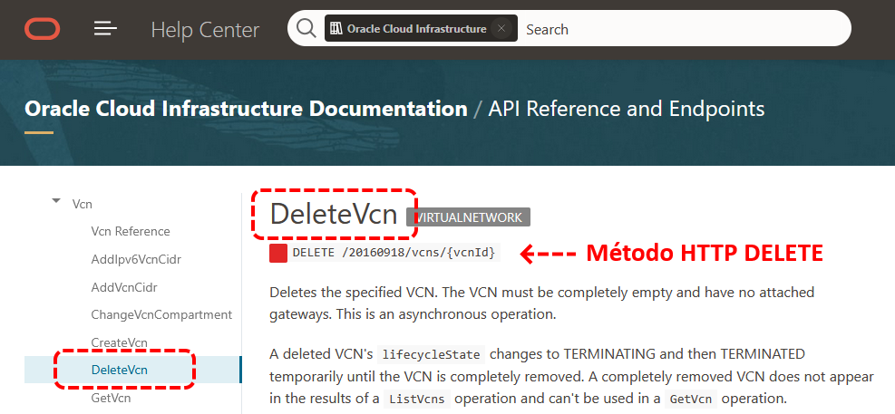
<br>

A maneira mais simples de visualizar os eventos registrados pelo _[Serviço Audit](https://docs.oracle.com/pt-br/iaas/Content/Audit/Concepts/auditoverview.htm)_ é através do _[Web Console](./acessando-o-oci.md#web-console)_. Para isso, acesse o _"menu de hambúrguer"_ e navegue até **_"Identity & Security > Audit"_**.

Depois de identificar o **_nome da ação (DeleteVcn)_**, insira-o no campo **_Keywords_** do serviço _[Audit](https://docs.oracle.com/pt-br/iaas/Content/Audit/Concepts/auditoverview.htm)_. Como o serviço registra todas as interações com as _APIs_, você encontrará uma vasta quantidade de registros a serem analisados. Para este exemplo, vamos filtrar apenas as ocorrências do método **_HTTP DELETE_**, definindo um intervalo de datas e horários de início e fim mais restrito:

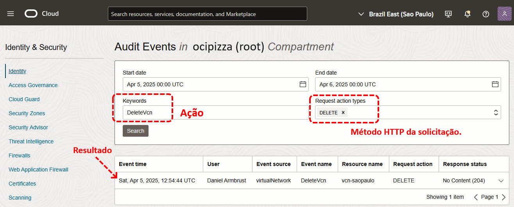
<br>

!!! note "NOTA"
    O OCI opera em _[UTC (Tempo Universal Coordenado)](https://pt.wikipedia.org/wiki/Tempo_Universal_Coordenado)_ para garantir consistência global, facilitando a integração entre sistemas em diferentes fusos horários e evitando confusões relacionadas à conversão de horários. Nos exemplos deste livro, o fuso horário utilizado é sempre GMT-3. Assim, um registro com o horário de 13:00 UTC corresponde a 10:00 em GMT-3.

Para cada resultado exibido, há um conjunto de informações que permite identificar o usuário que realizou a **_ação DeleteVcn_**:

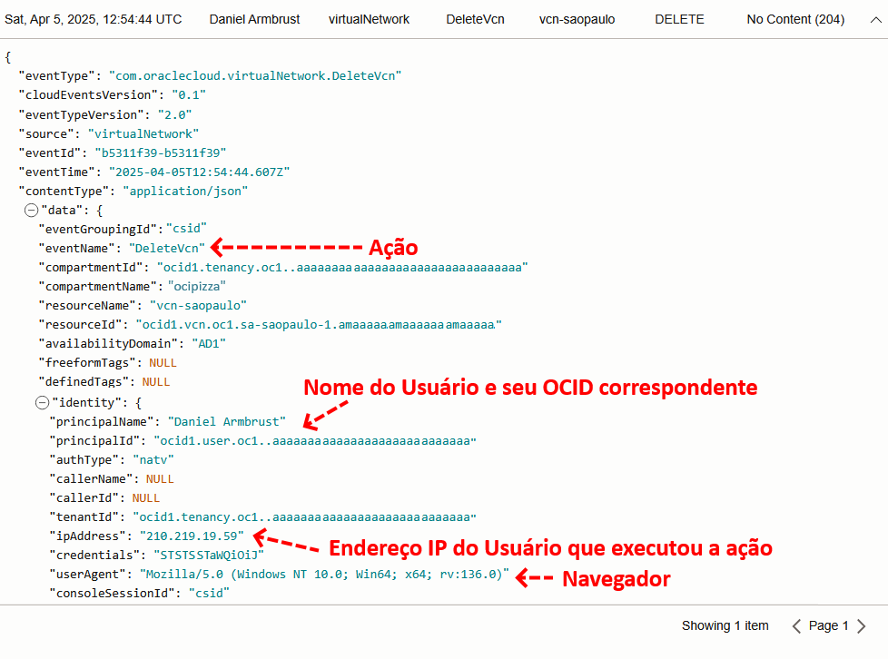

!!! note "NOTA"
    Consulte a documentação através do link _["Conteúdo de um Evento de Log de Auditoria"](https://docs.oracle.com/pt-br/iaas/Content/Audit/Reference/logeventreference.htm)_, que apresenta o nome e a descrição de todos os campos registrados pelo _[Serviço Audit](https://docs.oracle.com/pt-br/iaas/Content/Audit/Concepts/auditoverview.htm)_.

É possível também obter os eventos pelo _[OCI CLI](./acessando-o-oci.md#oci-cli-oci-command-line-interface)_ porém como já mencionado aqui, para consultas simples é mais fácil e prático consultar os dados pela _[Web Console](./acessando-o-oci.md#web-console)_.

O comando abaixo lista todos os eventos dentro do intervalo de tempo especificado pelos parâmetros **_--start-time_** e **_--end-time_**:

```bash linenums="1"
$ oci audit event list \
> --compartment-id "ocid1.tenancy.oc1..aaaaaaaaaaaaaaaaaaaaaaaaaaaaaaaaaaaaaaaa" \
> --start-time "2025-04-04T10:00Z" \
> --end-time "2025-04-04T11:00Z" \
> --all
```
!!! note "NOTA"
    A data e a hora para consulta devem ser informadas em um dos formatos especificados na _[RFC 3339 - Date and Time on the Internet: Timestamps](https://datatracker.ietf.org/doc/html/rfc3339)_.

Para o comando exibido, existe a opção **_--stream-output_**, que redireciona todo o resultado para o _stdout_. Como normalmente há uma grande quantidade de informações e eventos, essa opção é útil para direcionar o fluxo de dados para um _[stream](https://docs.oracle.com/pt-br/iaas/Content/Streaming/Concepts/streamingoverview.htm)_, que pode, por exemplo, encaminhar as informações para um _[Serviço Analytics](https://docs.oracle.com/pt-br/iaas/analytics-cloud/index.html)_ usado para processar e visualizar os dados de forma mais eficaz.    