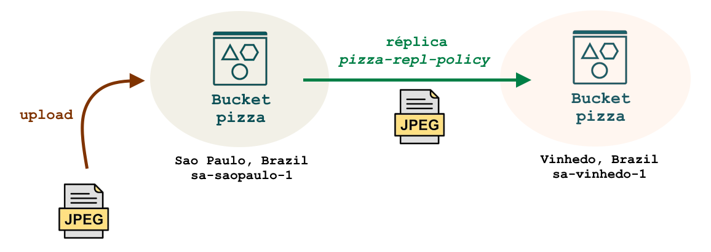
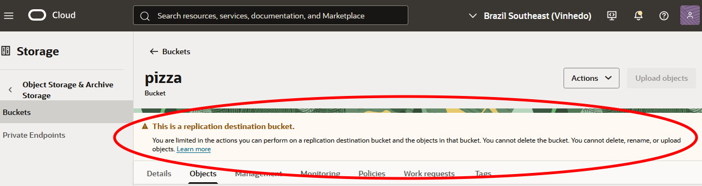
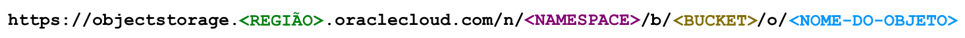

---
hide:
  - toc
---

# Capítulo 4: Serviços Auxiliares e Persistência de Dados

# 4.1 Object Storage

## 4.1.1 O que é o Object Storage?

O <a href="https://docs.oracle.com/pt-br/iaas/Content/Object/home.htm" target="_blank">Object Storage</a> é um serviço que oferece uma plataforma para armazenamento de dados ilimitado, de alto desempenho, seguro, escalável, durável, além de estar disponível em múltiplas [regiões](../capitulo-3/introducao-ao-oci.md#311-região). Este serviço é ideal para armazenar qualquer tipo de arquivo estático, sem uma estrutura fixa, sendo, portanto, utilizado para armazenar **dados não estruturados**.

**_Multi-região_** refere-se ao fato de que o serviço de <a href="https://docs.oracle.com/pt-br/iaas/Content/Object/home.htm" target="_blank">Object Storage</a> é disponibilizado nas várias [regiões](../capitulo-3/introducao-ao-oci.md#311-região) do [OCI](../capitulo-3/introducao-ao-oci.md) por meio de uma **_URL Base_** específica. Alguns exemplos incluem:

- **São Paulo, Brasil (sa-saopaulo-1)**
    - <a href="https://objectstorage.sa-saopaulo-1.oraclecloud.com" target="_blank">https://objectstorage.sa-saopaulo-1.oraclecloud.com</a>

- **Vinhedo, Brasil (sa-vinhedo-1)**
    - <a href="https://objectstorage.sa-vinhedo-1.oraclecloud.com" target="_blank">https://objectstorage.sa-vinhedo-1.oraclecloud.com</a>

- **Montreal, Canadá (ca-toronto-1)**
    - <a href="https://objectstorage.ca-montreal-1.oraclecloud.com" target="_blank">https://objectstorage.ca-montreal-1.oraclecloud.com</a>

Devido ao fato de que cada objeto possui uma URL exclusiva para acesso, o <a href="https://docs.oracle.com/pt-br/iaas/Content/Object/home.htm" target="_blank">Object Storage</a> pode ser integrado facilmente a qualquer aplicação web para fornecer conteúdo estático. Além disso, por ser **_multi-região_**, é possível distribuir e recuperar conteúdo pela Internet a partir de locais fisicamente mais próximos dos usuários, resultando em uma melhoria significativa na latência de acesso aos dados.

!!! note "NOTA"
    É possível acessar os <a href="https://docs.oracle.com/pt-br/iaas/Content/Object/Tasks/managingobjects.htm" target="_blank">objetos</a> armazenados no <a href="https://docs.oracle.com/pt-br/iaas/Content/Object/home.htm" target="_blank">Object Storage</a> de forma privada a partir de uma a <a href="https://docs.oracle.com/pt-br/iaas/Content/Network/Tasks/Overview_of_VCNs_and_Subnets.htm" target="_blank">VCN</a> por meio de um recurso chamado <a href="https://docs.oracle.com/pt-br/iaas/Content/Network/Tasks/servicegateway.htm#overview" target="_blank">Service Gateway</a>, eliminando a necessidade de utilizar a Internet. O <a href="https://docs.oracle.com/pt-br/iaas/Content/Network/Tasks/servicegateway.htm#overview" target="_blank">Service Gateway</a> será abordado no [Capítulo 5](../capitulo-5/index.md).

Algumas das principais características do <a href="https://docs.oracle.com/pt-br/iaas/Content/Object/home.htm" target="_blank">Object Storage</a> incluem:

- **Seguro**
    - Todos os <a href="https://docs.oracle.com/pt-br/iaas/Content/Object/Tasks/managingobjects.htm" target="_blank">objetos</a> armazenados no <a href="https://docs.oracle.com/pt-br/iaas/Content/Object/home.htm" target="_blank">Object Storage</a> são automaticamente criptografados antes de serem salvos. Além disso, o serviço oferece a opção de criptografia dos <a href="https://docs.oracle.com/pt-br/iaas/Content/Object/Tasks/managingobjects.htm" target="_blank">objetos</a> utilizando uma chave fornecida pelo cliente.
    - O acesso aos objetos também é controlado pelo [Serviço IAM](../capitulo-3/iam-limites-cotas-e-audit.md).

- **Escalável**
    - Escalável significa que o serviço oferece espaço praticamente ilimitado, ajustando-se automaticamente de acordo com a demanda de uso.

- **Durável**
    - Os <a href="https://docs.oracle.com/pt-br/iaas/Content/Object/Tasks/managingobjects.htm" target="_blank">objetos</a> são armazenados em vários servidores de forma redundante sem qualquer intervenção. Isso significa que o <a href="https://docs.oracle.com/pt-br/iaas/Content/Object/home.htm" target="_blank">Object Storage</a> mantém cópias dos <a href="https://docs.oracle.com/pt-br/iaas/Content/Object/Tasks/managingobjects.htm" target="_blank">objetos</a> entre vários servidores dentro da [região](../capitulo-3/introducao-ao-oci.md#311-região).
    - Em [regiões](../capitulo-3/introducao-ao-oci.md#311-região) com mais de um [Availability Domain (AD)](../capitulo-3/introducao-ao-oci.md#312-availability-domains-ad), os dados são replicados automaticamente entre os [ADs](../capitulo-3/introducao-ao-oci.md#312-availability-domains-ad) da [região](../capitulo-3/introducao-ao-oci.md#311-região).

- **Compatível com Amazon S3**
    - O <a href="https://docs.oracle.com/pt-br/iaas/Content/Object/home.htm" target="_blank">Object Storage</a> é totalmente compatível com o <a href="https://docs.oracle.com/pt-br/iaas/Content/Object/Tasks/s3compatibleapi.htm" target="_blank">Amazon S3</a>, permitindo que você migre sua aplicação do <a href="https://docs.oracle.com/pt-br/iaas/Content/Object/Tasks/s3compatibleapi.htm" target="_blank">Amazon S3</a> para o <a href="https://docs.oracle.com/pt-br/iaas/Content/Object/home.htm" target="_blank">Object Storage</a> sem a necessidade de modificar o código.
    
## 4.1.2 Bucket

Um <a href="https://docs.oracle.com/pt-br/iaas/Content/Object/Tasks/managingbuckets.htm" target="_blank">bucket</a> é um contêiner lógico que funciona basicamente como um _"diretório raiz"_ dentro do <a href="https://docs.oracle.com/pt-br/iaas/Content/Object/home.htm" target="_blank">Object Storage</a>, a partir do qual é possível armazenar e recuperar <a href="https://docs.oracle.com/pt-br/iaas/Content/Object/Tasks/managingobjects.htm" target="_blank">objetos</a> (download).

Um <a href="https://docs.oracle.com/pt-br/iaas/Content/Object/Tasks/managingbuckets.htm" target="_blank">bucket</a> possui **_dois modos de acesso_** que são definidos durante sua criação:

- **Privado** (`NoPublicAccess`)
    - Um <a href="https://docs.oracle.com/pt-br/iaas/Content/Object/Tasks/managingbuckets.htm" target="_blank">bucket</a> privado requer um usuário autenticado e com a devida autorização para acessar os <a href="https://docs.oracle.com/pt-br/iaas/Content/Object/Tasks/managingobjects.htm" target="_blank">objetos</a> armazenados.

- **Público** (`ObjectRead` ou `ObjectReadWithoutList`)
    - Um <a href="https://docs.oracle.com/pt-br/iaas/Content/Object/Tasks/managingbuckets.htm" target="_blank">bucket</a> público pode ser acessado de forma anônima, sem a necessidade de autenticação ou autorização. Isso significa que os <a href="https://docs.oracle.com/pt-br/iaas/Content/Object/Tasks/managingobjects.htm" target="_blank">objetos</a> armazenados nele estão disponíveis para qualquer pessoa na Internet.

Independentemente de o <a href="https://docs.oracle.com/pt-br/iaas/Content/Object/Tasks/managingbuckets.htm" target="_blank">bucket</a> ser público ou privado, existem duas opções que determinam como o acesso aos <a href="https://docs.oracle.com/pt-br/iaas/Content/Object/Tasks/managingobjects.htm" target="_blank">objetos</a> pode ser realizado:

- **Listar e Download** (`ObjectRead`)
    - Permite que os usuários façam download e visualizem todos os <a href="https://docs.oracle.com/pt-br/iaas/Content/Object/Tasks/managingobjects.htm" target="_blank">objetos</a> armazenados no <a href="https://docs.oracle.com/pt-br/iaas/Content/Object/Tasks/managingbuckets.htm" target="_blank">bucket</a> em formato de lista.

- **Somente Download** (`ObjectReadWithoutList`)
    - Permite que os usuários façam o download apenas sem ser possível visualizar a lista de <a href="https://docs.oracle.com/pt-br/iaas/Content/Object/Tasks/managingobjects.htm" target="_blank">objetos</a> armazenados no <a href="https://docs.oracle.com/pt-br/iaas/Content/Object/Tasks/managingbuckets.htm" target="_blank">bucket</a>. Nesse caso, o usuário deve ter a URL completa do arquivo para poder realizar o download.

### **Buckets da Aplicação OCI PIZZA**

A aplicação **OCI PIZZA** utiliza dois <a href="https://docs.oracle.com/pt-br/iaas/Content/Object/Tasks/managingbuckets.htm" target="_blank">buckets</a> públicos, um em cada [região](../capitulo-3/introducao-ao-oci.md#311-região), chamado **pizza**. Esses <a href="https://docs.oracle.com/pt-br/iaas/Content/Object/Tasks/managingbuckets.htm" target="_blank">buckets</a> não possibilitam listar os <a href="https://docs.oracle.com/pt-br/iaas/Content/Object/Tasks/managingobjects.htm" target="_blank">objetos</a>, oferecendo apenas a opção de download (`ObjectReadWithoutList`) e, serão utilizados exclusivamente para armazenar as imagens das pizzas.

Para criar o <a href="https://docs.oracle.com/pt-br/iaas/Content/Object/Tasks/managingbuckets.htm" target="_blank">bucket</a> na região **sa-saopaulo-1**, no [compartimento](../capitulo-3/iam-limites-cotas-e-audit.md#compartimentos) `cmp-appl` do ambiente de produção, utilize o seguinte comando:

```bash linenums="1"
$ oci os bucket create \
> --region "sa-saopaulo-1" \
> --compartment-id "ocid1.compartment.oc1..aaaaaaaaaaaaaaaabbbbbbbbccc" \
> --name "pizza" \
> --public-access-type "ObjectReadWithoutList"
```

!!! note "NOTA"
    Os scripts para a criação dos <a href="https://docs.oracle.com/pt-br/iaas/Content/Object/Tasks/managingbuckets.htm" target="_blank">bucket</a> de ambas as [regiões](../capitulo-3/introducao-ao-oci.md#311-região) do [OCI](../capitulo-3/introducao-ao-oci.md) estão localizados no diretório <a href="https://github.com/daniel-armbrust/ocn-ocipizza/tree/main/scripts/capitulo-4" target="_blank">"scripts/capitulo-4"</a> do <a href="https://github.com/daniel-armbrust/ocn-ocipizza" target="_blank">repositório de códigos</a> da aplicação **OCI PIZZA**. Os arquivos estão nomeados como <a href="https://github.com/daniel-armbrust/ocn-ocipizza/blob/main/scripts/capitulo-4/bucket-saopaulo.sh" target="_blank">"bucket-saopaulo.sh"</a> e <a href="https://github.com/daniel-armbrust/ocn-ocipizza/blob/main/scripts/capitulo-4/bucket-vinhedo.sh" target="_blank">"bucket-vinhedo.sh"</a>.

### **Ativando a Replicação de Objetos**

<a href="https://docs.oracle.com/pt-br/iaas/Content/Object/Tasks/managingbuckets.htm" target="_blank">Buckets</a> podem ter seus <a href="https://docs.oracle.com/pt-br/iaas/Content/Object/Tasks/managingobjects.htm" target="_blank">objetos</a> <a href="https://docs.oracle.com/pt-br/iaas/Content/Object/Tasks/usingreplication.htm" target="_blank">replicados</a> para outra [região](../capitulo-3/introducao-ao-oci.md#311-região) por meio de <a href="https://docs.oracle.com/pt-br/iaas/Content/Object/Tasks/usingreplication.htm" target="_blank">politicas de replicação</a>.

No caso da aplicação **OCI PIZZA**, cada <a href="https://docs.oracle.com/pt-br/iaas/Content/Object/Tasks/managingobjects.htm" target="_blank">objeto</a> criado no <a href="https://docs.oracle.com/pt-br/iaas/Content/Object/Tasks/managingbuckets.htm" target="_blank">bucket</a> **pizza** na [região](../capitulo-3/introducao-ao-oci.md#311-região) **sa-saopaulo-1** será automaticamente replicado para a [região](../capitulo-3/introducao-ao-oci.md#311-região) **sa-vinhedo-1**. Essa <a href="https://docs.oracle.com/pt-br/iaas/Content/Object/Tasks/usingreplication.htm" target="_blank">replicação</a> de dados é ativada para garantir que as imagens das pizzas disponibilizadas pela aplicação estejam acessíveis em ambas as [regiões](../capitulo-3/introducao-ao-oci.md#311-região).



Para ativar a <a href="https://docs.oracle.com/pt-br/iaas/Content/Object/Tasks/usingreplication.htm" target="_blank">replicação</a> dos <a href="https://docs.oracle.com/pt-br/iaas/Content/Object/Tasks/managingobjects.htm" target="_blank">objetos</a> do <a href="https://docs.oracle.com/pt-br/iaas/Content/Object/Tasks/managingbuckets.htm" target="_blank">bucket</a> **pizza**, utilize o comando abaixo:

```bash linenums="1"
$ oci os replication create-replication-policy \
> --region "sa-saopaulo-1" \
> --bucket-name "pizza" \
> --destination-bucket "pizza" \
> --destination-region "sa-vinhedo-1" \
> --name "pizza-repl-policy"
```

!!! note "NOTA"
    A <a href="https://docs.oracle.com/pt-br/iaas/Content/Object/Tasks/usingreplication.htm" target="_blank">replicação</a> de <a href="https://docs.oracle.com/pt-br/iaas/Content/Object/Tasks/managingobjects.htm" target="_blank">objetos</a> requer uma [Política IAM](../capitulo-3/iam-limites-cotas-e-audit.md#políticas-de-acesso) para funcionar. Consulte o capítulo _["3.7 Cotas, Políticas IAM e Compartimentos da Aplicação OCI PIZZA"](../capitulo-3/cotas-politicas-iam-e-compartimentos-da-aplicacao-oci-pizza.md)_ para obter informações sobre como criar essas políticas.

!!! note "NOTA"
    O script para ativar a <a href="https://docs.oracle.com/pt-br/iaas/Content/Object/Tasks/usingreplication.htm" target="_blank">replicação</a> pode ser encontrado no diretório <a href="https://github.com/daniel-armbrust/ocn-ocipizza/tree/main/scripts/capitulo-4" target="_blank">"scripts/capitulo-4"</a> do <a href="https://github.com/daniel-armbrust/ocn-ocipizza" target="_blank">repositório de códigos</a> da aplicação **OCI PIZZA**, sob o nome <a href="https://github.com/daniel-armbrust/ocn-ocipizza/blob/main/scripts/capitulo-4/bucket-replication.sh" target="_blank">"bucket-replication.sh"</a>.

Após a ativação da <a href="https://docs.oracle.com/pt-br/iaas/Content/Object/Tasks/usingreplication.htm" target="_blank">réplica</a>, o <a href="https://docs.oracle.com/pt-br/iaas/Content/Object/Tasks/managingbuckets.htm" target="_blank">bucket</a> de destino, localizado na [região](../capitulo-3/introducao-ao-oci.md#311-região) **sa-vinhedo-1**, é configurado em **modo somente-leitura**. Desso modo, não é possível excluír, renomear ou criar novos <a href="https://docs.oracle.com/pt-br/iaas/Content/Object/Tasks/managingobjects.htm" target="_blank">objetos</a>.



Para ativar o modo **leitura-escrita** no <a href="https://docs.oracle.com/pt-br/iaas/Content/Object/Tasks/managingbuckets.htm" target="_blank">bucket</a> **sa-vinhedo-1**, 
é necessário excluir a <a href="https://docs.oracle.com/pt-br/iaas/Content/Object/Tasks/usingreplication.htm" target="_blank">réplica</a> ativa. Para isso, deve-se primeiro obter o identificador da <a href="https://docs.oracle.com/pt-br/iaas/Content/Object/Tasks/usingreplication.htm" target="_blank">réplica</a> no <a href="https://docs.oracle.com/pt-br/iaas/Content/Object/Tasks/managingbuckets.htm" target="_blank">bucket</a> de origem, situado na [região](../capitulo-3/introducao-ao-oci.md#311-região) do [OCI](../capitulo-3/introducao-ao-oci.md) **sa-saopaulo-1**, utilizando o seguinte comando:

```bash linenums="1"
$ oci os replication list-replication-policies \
> --region "sa-saopaulo-1" \
> --bucket-name "pizza" \
> --all \
> --query data[].id
[
  "aBcDEEdf33-X12c-3434-111-iuiuzocip"
]
```

A partir do identificador da <a href="https://docs.oracle.com/pt-br/iaas/Content/Object/Tasks/usingreplication.htm" target="_blank">réplica</a>, é possível excluí-la utilizando o seguinte comando:

```bash linenums="1"
$ oci os replication delete-replication-policy \
> --region "sa-saopaulo-1" \
> --bucket-name "pizza" \
> --replication-id "aBcDEEdf33-X12c-3434-111-iuiuzocip" \
> --force
```

## 4.1.3 Arquivo ou Objeto?

Um arquivo é a unidade de armazenamento com a qual o seu computador local interage. Quando um arquivo é enviado e armazenado no <a href="https://docs.oracle.com/pt-br/iaas/Content/Object/home.htm" target="_blank">Object Storage</a>, ele se transforma em um <a href="https://docs.oracle.com/pt-br/iaas/Content/Object/Tasks/managingobjects.htm" target="_blank">objeto</a>, que é composto por **dados e metadados**.

Por exemplo, é possível consultar os metadados do <a href="https://docs.oracle.com/pt-br/iaas/Content/Object/Tasks/managingobjects.htm" target="_blank">objeto</a> `marguerita.jpg`, que contém o conteúdo de uma imagem, utilizando o seguinte comando:

```bash linenums="1"
$ oci os object head --region "sa-saopaulo-1" --bucket-name "pizza" --name "marguerita.jpg"
{
  "accept-ranges": "bytes",
  "access-control-allow-credentials": "true",
  "access-control-allow-methods": "POST,PUT,GET,HEAD,DELETE,OPTIONS",
  "access-control-allow-origin": "*",
  "access-control-expose-headers": "accept-ranges,access-control-allow-credentials,access-control-allow-methods,access-control-allow-origin,content-length,content-md5,content-type,date,etag,last-modified,opc-client-info,opc-client-request-id,opc-request-id,storage-tier,strict-transport-security,version-id,x-api-id,x-content-type-options",
  "content-length": "18002",
  "content-md5": "0mIM5ASDASDASDASGLW/f5aeA==",
  "content-type": "image/jpeg",
  "date": "Wed, 01 Oct 2025 12:36:15 GMT",
  "etag": "7a98c9cf-58f2-4137-ab38-2af8e5288b84",
  "last-modified": "Wed, 01 Oct 2025 12:30:28 GMT",
  "opc-client-request-id": "ED8CC936ASDASDSADASA62D",
  "opc-request-id": "gru-1:24yOkt3xjpASDASDASDSADASSDAKA_FD7_X_",
  "storage-tier": "Standard",
  "strict-transport-security": "max-age=31536000; includeSubDomains",
  "version-id": "ooASDASD-00eeee6-asdas-eeee-7a73asdasdase",
  "x-api-id": "native",
  "x-content-type-options": "nosniff"
}
```
Metadados são úteis porque descrevem os dados por meio de propriedades. No exemplo acima, é possível verificar a data de criação do <a href="https://docs.oracle.com/pt-br/iaas/Content/Object/Tasks/managingobjects.htm" target="_blank">objeto</a> através da propriedade `date`, o tamanho do <a href="https://docs.oracle.com/pt-br/iaas/Content/Object/Tasks/managingobjects.htm" target="_blank">objeto</a> pela propriedade `content-length`, o tipo de conteúdo do arquivo pela propriedade `content-type`, etc.

### **Upload de Arquivos**

Arquivos enviados para o <a href="https://docs.oracle.com/pt-br/iaas/Content/Object/home.htm" target="_blank">Object Storage</a> podem ser de qualquer tipo, com tamanho máximo de **10 TiB (10 tebibytes)** cada.

Para transferir um arquivo ou mais do seu computador local para o <a href="https://docs.oracle.com/pt-br/iaas/Content/Object/home.htm" target="_blank">Object Storage</a>, utilize o seguinte comando:

```bash linenums="1"
$ oci os object bulk-upload \
> --region "sa-saopaulo-1" \
> --bucket-name "pizza" \
> --src-dir "imgs/" \
> --content-type "image/jpeg" \
> --verify-checksum
```

Abaixo está uma breve descrição de alguns dos parâmetros utilizados:

- `--src-dir`
    - Diretório de onde todo o seu conteúdo será copiado para o <a href="https://docs.oracle.com/pt-br/iaas/Content/Object/Tasks/managingbuckets.htm" target="_blank">bucket</a> especificado pelo parâmetro `--bucket-name`.

-  `--content-type`
    - Define o <a href="https://developer.mozilla.org/en-US/docs/Web/HTTP/Guides/MIME_types" target="_blank">MIME type</a> que especifica o tipo de conteúdo do arquivo a ser copiado. Essa opção é útil, pois informa ao navegador como interpretar o arquivo. 
    
- `--verify-checksum`
    - Realiza uma verificação de checksum dos <a href="https://docs.oracle.com/pt-br/iaas/Content/Object/Tasks/managingobjects.htm" target="_blank">objetos</a> copiados, garantindo assim a integridade dos dados.

!!! note "NOTA"
    A opção `--content-type` é importante, pois indica ao navegador como ele deve interpretar o arquivo. No caso da aplicação **OCI PIZZA**, que utiliza o <a href="https://docs.oracle.com/pt-br/iaas/Content/Object/home.htm" target="_blank">Object Storage</a> para armazenar arquivos de imagem, é necessário especificar o valor `image/jpeg`. Caso contrário, o padrão será `application/octet-stream`, o que fará com que o navegador baixe o arquivo em vez de exibi-lo como uma imagem. Consulte o link <a href="https://developer.mozilla.org/en-US/docs/Web/HTTP/Guides/MIME_types" target="_blank">"Media types (MIME types)"</a> para uma visão geral dos tipos de arquivos que podem ser especificados.

!!! note "NOTA"
    No diretório <a href="https://github.com/daniel-armbrust/ocn-ocipizza/tree/main/scripts/capitulo-4" target="_blank">"scripts/capitulo-4"</a> do <a href="https://github.com/daniel-armbrust/ocn-ocipizza" target="_blank">repositório de códigos</a> da aplicação **OCI PIZZA**, encontra-se o script <a href="https://github.com/daniel-armbrust/ocn-ocipizza/blob/main/scripts/capitulo-4/bucket-file-upload.sh" target="_blank">"bucket-file-upload.sh"</a>, utilizado para o upload das imagens em abas as [regiões](../capitulo-3/introducao-ao-oci.md#311-região). Também está presente o diretório <a href="https://github.com/daniel-armbrust/ocn-ocipizza/blob/main/scripts/capitulo-4/imgs" target="_blank">"imgs/"</a>, que contém as imagens das pizzas utilizadas pela aplicação.

## 4.1.4 Acessando Objetos

Todo <a href="https://docs.oracle.com/pt-br/iaas/Content/Object/Tasks/managingobjects.htm" target="_blank">objeto</a> armazenado no <a href="https://docs.oracle.com/pt-br/iaas/Content/Object/home.htm" target="_blank">Object Storage</a> tem uma URL específica que pode ser utilizada para acessá-lo. Essa URL possui o seguinte formato:



- **REGIÃO**
    - Identificador da [região](../capitulo-3/introducao-ao-oci.md#311-região) onde reside o <a href="https://docs.oracle.com/pt-br/iaas/Content/Object/Tasks/managingobjects.htm" target="_blank">objeto</a>.

- **NAMESPACE**
    - Contêiner de nível superior usado por todos os <a href="https://docs.oracle.com/pt-br/iaas/Content/Object/Tasks/managingbuckets.htm" target="_blank">buckets</a> e <a href="https://docs.oracle.com/pt-br/iaas/Content/Object/Tasks/managingobjects.htm" target="_blank">objetos</a>. No momento da criação da conta, cada tenant do [OCI](../capitulo-3/introducao-ao-oci.md) recebe um identificador <a href="https://docs.oracle.com/pt-br/iaas/Content/Object/Tasks/understandingnamespaces.htm" target="_blank">namespace</a> exclusivo que não pode ser alterado.

- **BUCKET**
    - Nome do <a href="https://docs.oracle.com/pt-br/iaas/Content/Object/Tasks/managingbuckets.htm" target="_blank">bucket</a> onde o <a href="https://docs.oracle.com/pt-br/iaas/Content/Object/Tasks/managingobjects.htm" target="_blank">objeto</a> reside.

- **NOME-DO-OBJETO**
    - Nome do <a href="https://docs.oracle.com/pt-br/iaas/Content/Object/Tasks/managingobjects.htm" target="_blank">objeto</a> dentro do <a href="https://docs.oracle.com/pt-br/iaas/Content/Object/Tasks/managingbuckets.htm" target="_blank">bucket</a>.

No caso da aplicação **OCI PIZZA**, o <a href="https://docs.oracle.com/pt-br/iaas/Content/Object/Tasks/managingbuckets.htm" target="_blank">bucket</a> **pizza** é público, permitindo o acesso direto aos seus <a href="https://docs.oracle.com/pt-br/iaas/Content/Object/Tasks/managingobjects.htm" target="_blank">objetos</a> por meio de suas URLs, sem a necessidade de autenticação ou autorização.

```bash linenums="1"
$ curl --head https://objectstorage.sa-saopaulo-1.oraclecloud.com/n/WYYdXX82dnaS/b/pizza/o/a-moda-da-casa.jpg
HTTP/1.1 200 OK
accept-ranges: bytes
Content-Length: 20819
content-md5: 0mIM5ASDASDASDASGLW/f5aeA==
last-modified: Mon, 06 Oct 2025 12:29:09 GMT
etag: 7a98c9cf-58f2-4137-ab38-2af8e5288b84
version-id: 8f63aabb-ce5e-464f-befe-6d931306e43d
storage-tier: Standard
Content-Type: image/jpeg
date: Mon, 06 Oct 2025 13:50:40 GMT
opc-request-id: gru-1:24yOkt3xjpASDASDASDSADASSDAKA_FD7_X_
x-api-id: native
x-content-type-options: nosniff
strict-transport-security: max-age=31536000; includeSubDomains
access-control-allow-origin: *
access-control-allow-methods: POST,PUT,GET,HEAD,DELETE,OPTIONS
access-control-allow-credentials: true
access-control-expose-headers: accept-ranges,access-control-allow-credentials
```

!!! note "NOTA"
    O comando `curl` acima foi utilizado apenas para acessar os cabeçalhos, sem realizar o download do <a href="https://docs.oracle.com/pt-br/iaas/Content/Object/Tasks/managingobjects.htm" target="_blank">objeto</a>. Para realizar o download do <a href="https://docs.oracle.com/pt-br/iaas/Content/Object/Tasks/managingobjects.htm" target="_blank">objeto</a> utilize a opção `-O`.

!!! note "NOTA"
    Apesar do <a href="https://docs.oracle.com/pt-br/iaas/Content/Object/Tasks/managingbuckets.htm" target="_blank">bucket</a> **pizza** ser público, é necessário ter uma [Chave de Acesso](../capitulo-3/gerenciando-o-oci-atraves-do-oci-cli.md#utilizando-a-api-key-com-o-oci-cli) válida e [Políticas IAM](../capitulo-3/iam-limites-cotas-e-audit.md#políticas-de-acesso) apropriadas que permitam o envio de arquivos à ele.