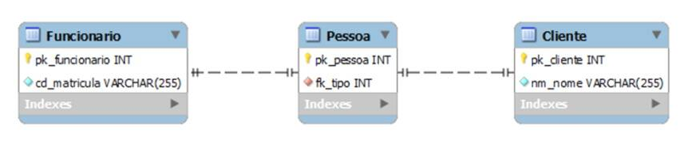
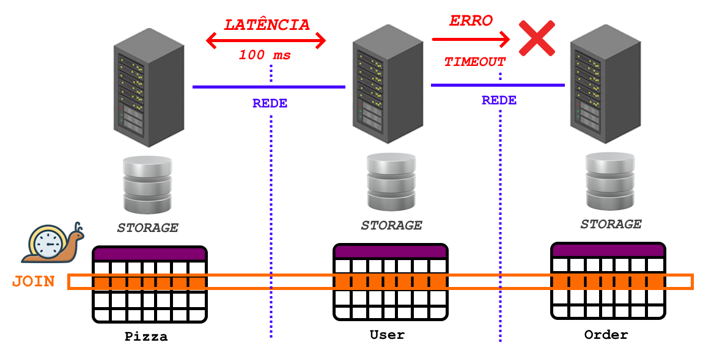
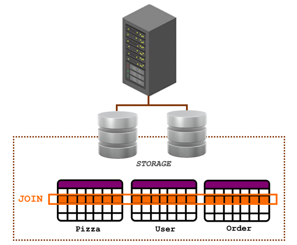
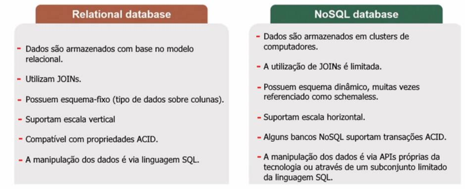
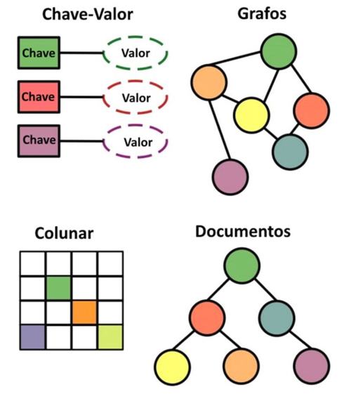
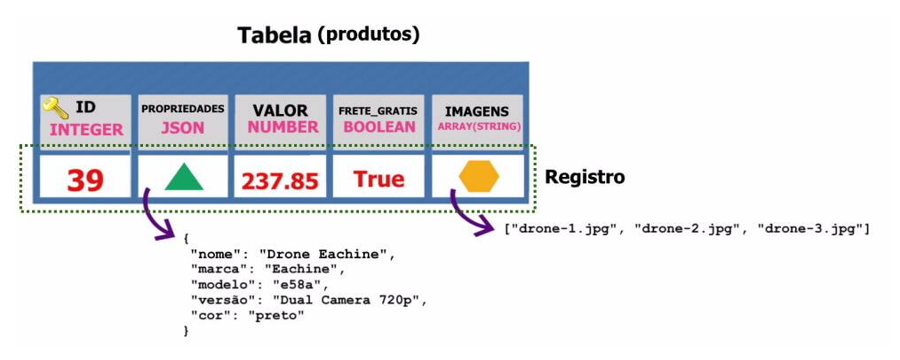
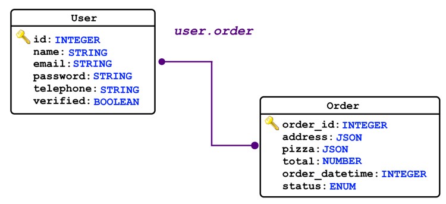

---
hide:
  - toc
---

# Capítulo 4: Serviços Auxiliares e Persistência de Dados

# 4.2 Persistência de dados com o Oracle NoSQL

## 4.2.1 SQL vs. NoSQL

O principal propósito de um banco de dados é armazenar, gerenciar e recuperar grandes volumes de dados de forma eficiente e segura.

No <a href="https://pt.wikipedia.org/wiki/Modelo_relacional" target="_blank">modelo relacional</a>, os dados são organizados em tabelas, onde cada tabela é composta por linhas e colunas. Essas tabelas podem se relacionar umas com as outras, **formando relações** que constituem a base do <a href="https://pt.wikipedia.org/wiki/Modelo_relacional" target="_blank">modelo relacional</a>. É por essa razão que os bancos de dados que implementam esse modelo são conhecidos como **Sistemas de Gerenciamento de Banco de Dados Relacional (SGBD)** ou, em inglês, **Relational Database Management System (RDBMS)**.



Bancos de dados relacionais, como <a href="https://docs.oracle.com/en/database/oracle/oracle-database/23/index.html" target="_blank">Oracle Database</a>, <a href="https://docs.oracle.com/pt-br/iaas/mysql-database/home.htm" target="_blank">MySQL</a> e <a href="https://docs.oracle.com/pt-br/iaas/Content/postgresql/home.htm" target="_blank">PostgreSQL</a>, desempenham um papel vital na persistência segura das informações, além de gerenciar múltiplos acessos de escrita concorrente por meio de <a href="https://pt.wikipedia.org/wiki/Transa%C3%A7%C3%A3o_(banco_de_dados)" target="_blank"><i><b>transações</b></i></a>.

O termo <a href="https://pt.wikipedia.org/wiki/Transa%C3%A7%C3%A3o_(banco_de_dados)" target="_blank"><i>"transação"</i></a> refere-se a <a href="https://pt.wikipedia.org/wiki/Transa%C3%A7%C3%A3o_(banco_de_dados)" target="_blank">transações</a> <a href="https://pt.wikipedia.org/wiki/ACID" target="_blank">ACID (Atômicas, Consistentes, Isoladas e Duráveis)</a>, que asseguram a consistência dos dados, permitindo a adição, exclusão ou modificação de múltiplos registros em diferentes tabelas por meio de uma única operação. As <a href="https://pt.wikipedia.org/wiki/Transa%C3%A7%C3%A3o_(banco_de_dados)" target="_blank">transações</a> incorporam o conceito de unidade de trabalho, garantindo sucesso total ou falha total (tudo ou nada), sem espaço para um meio termo. Além disso, as <a href="https://pt.wikipedia.org/wiki/Transa%C3%A7%C3%A3o_(banco_de_dados)" target="_blank">transações</a> permitem decidir se as alterações devem ser _persistidas (commit)_ ou _descartadas (rollback)_. 

Já os bancos de dados do tipo <a href="https://docs.oracle.com/en/cloud/paas/nosql-cloud/dtddt/" target="_blank">NoSQL</a>, representam uma nova abordagem para o armazenamento e gerenciamento de dados, diferente do <a href="https://pt.wikipedia.org/wiki/Modelo_relacional" target="_blank">modelo relacional</a>. Eles foram desenvolvidos para operar em grandes <a href="https://pt.wikipedia.org/wiki/Cluster" target="_blank">clusters de computadores</a>, que favorecem a [escalabilidade horizontal](../capitulo-1/terminologias-da-computacao-em-nuvem.md#escalabilidade-scalability), e para atender à necessidade de aplicações que exigem um modelo de dados mais flexível ou **schemaless**.

**NoSQL ("Not SQL" ou "Not Only SQL")** não possui uma definição precisa. Ele é utilizado para descrever vários bancos de dados **não relacionais**, como <a href="https://redis.io/" target="_blank">Redis</a>, <a href="https://www.mongodb.com/" target="_blank">MongoDB</a>, <a href="https://docs.oracle.com/en/cloud/paas/nosql-cloud/dtddt/" target="_blank">Oracle NoSQL Database</a>, <a href="https://neo4j.com/" target="_blank">Neo4J</a>, entre outros.

Diferente dos bancos de dados do tipo <a href="https://docs.oracle.com/en/cloud/paas/nosql-cloud/dtddt/" target="_blank">NoSQL</a>, bancos de dados relacionais não conseguem [escalar horizontalmente](../capitulo-1/terminologias-da-computacao-em-nuvem.md#escalabilidade-scalability) devido ao funcionamento das <a href="https://pt.wikipedia.org/wiki/ACID" target="_blank">transações ACID</a>, que são incompatíveis com a execução em <a href="https://pt.wikipedia.org/wiki/Cluster" target="_blank">clusters de computadores</a>. Isso ocorre porque não é possível garantir a consistência dos dados nem realizar um <a href="https://pt.wikipedia.org/wiki/Join_(SQL)" target="_blank">JOIN</a> sobre dados distribuídos entre várias máquinas do cluster.

Para exemplificar, imagine uma instrução SQL que realiza um <a href="https://pt.wikipedia.org/wiki/Join_(SQL)" target="_blank">JOIN</a> entre diferentes tabelas armazenadas em várias máquinas conectadas à rede (<a href="https://pt.wikipedia.org/wiki/Cluster" target="_blank">clusters de computadores</a>). Esse <a href="https://pt.wikipedia.org/wiki/Join_(SQL)" target="_blank">JOIN</a>, que precisa recuperar dados de diferentes tabelas pela rede, pode enfrentar problemas como alta latência ou até mesmo erros de conexão, resultando na impossibilidade de retornar dados ou em um retorno parcial das informações.



Por outro lado, os bancos de dados relacionais foram projetados para operar em uma única máquina. Isso permite que as <a href="https://pt.wikipedia.org/wiki/ACID" target="_blank">transações ACID</a> sejam viáveis, uma vez que as tabelas estão contidas em uma única camada de storage, que pode ser dividida entre múltiplos discos conectados por barramentos de alta velocidade.



É importante mencionar que os bancos de dados <a href="https://docs.oracle.com/en/cloud/paas/nosql-cloud/dtddt/" target="_blank">NoSQL</a> não substituem os bancos de dados relacionais, e vice-versa. Os bancos de dados <a href="https://docs.oracle.com/en/cloud/paas/nosql-cloud/dtddt/" target="_blank">NoSQL</a>, que lidam com dados não estruturados, complementam os bancos de dados SQL em soluções empresariais. Na prática, é fundamental entender as necessidades do negócio e identificar onde cada tecnologia se _"encaixa melhor"_.

### **Resumo das principais diferenças**



## 4.2.2 Tipos de Banco de Dados NoSQL

A maioria dos bancos de dados <a href="https://docs.oracle.com/en/cloud/paas/nosql-cloud/dtddt/" target="_blank">NoSQL</a> é baseada em alguma forma de estrutura chave/valor, sendo as quatro principais categorias as seguintes:



- **Chave/Valor**
    - Os dados são armazenados por meio de chaves únicas.
    - Aqui, o banco de dados não conhece nem se preocupa com o valor ao qual a chave se refere. Assim, a recuperação de dados só é possível por meio de consultas que envolvam as chaves.
    
- **Documentos**
    - É bastante similar à implementação chave/valor e neste caso, o banco de dados conhece o valor (documento) ao qual a chave se refere.

- **Grafos**
    - Semelhante ao modelo relacional.
    - É especialmente útil para dados altamente interconectados, uma vez que a estrutura de um grafo revela de forma natural os relacionamentos entre os objetos.

- **Colunar**
    - O armazenamento colunar é semelhante a uma tabela.

## 4.2.3 Introdução ao Oracle NoSQL Database Cloud Service

O <a href="https://docs.oracle.com/en/cloud/paas/nosql-cloud/dtddt/" target="_blank">Oracle NoSQL Database Cloud Service</a> é um serviço de banco de dados <a href="https://docs.oracle.com/en/cloud/paas/nosql-cloud/dtddt/" target="_blank">NoSQL</a> totalmente gerenciado no [OCI](../capitulo-3/introducao-ao-oci.md), que permite aos desenvolvedores concentrar-se no desenvolvimento de aplicações, em vez de se preocupar com a configuração de servidores.

O serviço oferece suporte ao armazenamento de documentos <a href="https://pt.wikipedia.org/wiki/JSON" target="_blank">JSON</a>, dados do tipo chave/valor e dados em colunas (<a href="https://docs.oracle.com/en/database/other-databases/nosql-database/25.1/sqlreferencefornosql/table-management.html" target="_blank">tabelas</a>). Ele já inclui, por padrão, monitoramento, alta disponibilidade com dados distribuídos automaticamente entre [Fault Domains](../capitulo-3/introducao-ao-oci.md#313-fault-domains-fd) e [Availability Domains](../capitulo-3/introducao-ao-oci.md#312-availability-domains-ad), além de fácil escalabilidade com baixo tempo de resposta. Além disso, fornece uma variedade de recursos adicionais, incluindo:

- Suporte a transações ACID.
- Atualizações parciais em documentos JSON.
- Criação de índices adicionais.
- Manipulação e acesso aos dados via linguagem SQL padrão.
- TTL (Tempo de Vida), permitindo a definição de um tempo de expiração para as linhas da tabela.
- Replicação de dados entre diferentes regiões por meio da funcionalidade <a href="https://docs.oracle.com/en/cloud/paas/nosql-cloud/gasnd/index.html" target="_blank">Global Active Tables</a>.

!!! note "NOTA"
    Para mais informações sobre o serviço, consulte o link <a href="https://docs.oracle.com/en/cloud/paas/nosql-cloud/dtddt/" target="_blank"><i>"Oracle NoSQL Database Cloud Service"</i></a>.

### **<a href="https://docs.oracle.com/en/database/other-databases/nosql-database/25.1/sqlreferencefornosql/table-management.html" target="_blank">Tabelas</a>**

No <a href="https://docs.oracle.com/en/cloud/paas/nosql-cloud/dtddt/" target="_blank">Oracle NoSQL</a>, os dados são armazenados e organizados em <a href="https://docs.oracle.com/en/database/other-databases/nosql-database/25.1/sqlreferencefornosql/table-management.html" target="_blank">Tabelas</a>, sendo possível criar tanto tabelas **sem um esquema fixo** quanto tabelas com **esquema fixo**.

Uma **tabela sem esquema**, ou **schemaless**, é basicamente uma <a href="https://docs.oracle.com/en/database/other-databases/nosql-database/25.1/sqlreferencefornosql/table-management.html" target="_blank">tabela</a> que armazena documentos <a href="https://pt.wikipedia.org/wiki/JSON" target="_blank">JSON</a>, onde cada documento inserido pode ter uma estrutura única e independente. Nesse caso, o banco de dados não valida a estrutura interna do <a href="https://pt.wikipedia.org/wiki/JSON" target="_blank">JSON</a> antes de persistir os dados, ele apenas verifica se o dado possui um documento <a href="https://pt.wikipedia.org/wiki/JSON" target="_blank">JSON</a> válido.

```sql linenums="1"
CREATE TABLE IF NOT EXISTS produtos (
    id INTEGER GENERATED ALWAYS AS IDENTITY (START WITH 1 INCREMENT BY 1),
    propriedades JSON,
    PRIMARY KEY(id))
```

Uma <a href="https://docs.oracle.com/en/database/other-databases/nosql-database/25.1/sqlreferencefornosql/table-management.html" target="_blank">tabela</a> com um **esquema fixo** possui colunas que têm tipos de dados específicos. Isso significa que, antes de persistir os dados, o banco de dados valida a estrutura dos dados em relação ao tipo de dados definido. Por exemplo, uma coluna definida para armazenar valores inteiros aceitará apenas números inteiros, enquanto uma coluna de texto permitirá apenas strings. 

```sql linenums="1"
CREATE TABLE IF NOT EXISTS produtos (
    id INTEGER GENERATED ALWAYS AS IDENTITY (START WITH 1 INCREMENT BY 1),
    nome STRING,
    descricao STRING,
    valor NUMBER NOT NULL DEFAULT 0,
    frete_gratis BOOLEAN DEFAULT TRUE,
    imagens ARRAY(STRING),
    PRIMARY KEY(id))
```

!!! note "NOTA"
    Consulte o link <a href="https://docs.oracle.com/en/cloud/paas/nosql-cloud/rnpxl/index.html" target="_blank"><i>"Supported Data Types"</i></a> para acessar a lista dos tipos de dados suportados pelo <a href="https://docs.oracle.com/en/cloud/paas/nosql-cloud/dtddt/" target="_blank">Oracle NoSQL</a>.

O <a href="https://docs.oracle.com/en/cloud/paas/nosql-cloud/dtddt/" target="_blank">Oracle NoSQL</a> também suporta **tabelas híbridas (Hybrid Tables)**, que permitem a combinação de colunas do tipo <a href="https://pt.wikipedia.org/wiki/JSON" target="_blank">JSON</a> para armazenar documentos sem estrutura fixa e colunas com tipos de dados específicos.

```sql linenums="1"
CREATE TABLE IF NOT EXISTS produtos (
    id INTEGER GENERATED ALWAYS AS IDENTITY (START WITH 1 INCREMENT BY 1),
    propriedades JSON,
    valor NUMBER NOT NULL DEFAULT 0,
    frete_gratis BOOLEAN DEFAULT TRUE,
    imagens ARRAY(STRING),   
    PRIMARY KEY(id))
```



Independentemente de a <a href="https://docs.oracle.com/en/database/other-databases/nosql-database/25.1/sqlreferencefornosql/table-management.html" target="_blank">tabela</a> ter um esquema fixo ou não, é obrigatório criar pelo menos uma coluna destinada a ser a chave primária da <a href="https://docs.oracle.com/en/database/other-databases/nosql-database/25.1/sqlreferencefornosql/table-management.html" target="_blank">tabela</a> por meio da instrução `PRIMARY KEY`. As colunas designadas como chave primária devem ser dos tipos `INTEGER`, `LONG`, `FLOAT`, `DOUBLE`, `NUMBER`, `STRING`, `ENUM`, `BOOLEAN` ou `TIMESTAMP`.

A coluna `id` nas instruções SQL acima, além de ser a chave primária, é designada como <a href="https://docs.oracle.com/en/database/other-databases/nosql-database/25.1/sqlreferencefornosql/identity-column.html" target="_blank">coluna de identidade (IDENTITY Column)</a>. Essa coluna especial é projetada para gerar automaticamente valores únicos e sequenciais para cada novo registro inserido, eliminando a necessidade de gerenciar os valores da chave primária manualmente pela aplicação.

!!! note "NOTA"
    Consulte o link <a href="https://docs.oracle.com/en/database/other-databases/nosql-database/25.1/sqlreferencefornosql/create-table.html" target="_blank"><i>"CREATE TABLE Statement"</i></a> para obter mais informações sobre a sintaxe do comando `CREATE TABLE`, e <a href="https://docs.oracle.com/en/database/other-databases/nosql-database/25.1/sqlreferencefornosql/identity-column.html" target="_blank"><i>"Using the IDENTITY Column"</i></a> para saber mais sobre <a href="https://docs.oracle.com/en/database/other-databases/nosql-database/25.1/sqlreferencefornosql/identity-column.html" target="_blank">coluna de identidade</a> no <a href="https://docs.oracle.com/en/cloud/paas/nosql-cloud/dtddt/" target="_blank">Oracle NoSQL</a>.
    
### **Armazenamento, Unidades de Escrita e Leitura** 

Ao criar uma <a href="https://docs.oracle.com/en/database/other-databases/nosql-database/25.1/sqlreferencefornosql/table-management.html" target="_blank">tabela</a>, é necessário especificar a **quantidade total de armazenamento em Gigabytes** (`maxStorageInGBs`), além de duas propriedades que determinam as **capacidades de leitura** (`maxReadUnits`) e **escrita** (`maxWriteUnits`) da tabela (**throughput**), as quais são:

- **Unidades de Escrita ou Gravação** (`maxWriteUnits`)
    - Uma unidade de escrita corresponde a um throughput de até 1 kilobyte (KB) de dados por segundo para operações como inserção, atualização ou exclusão de um registro. Atualizações de índices também consomem unidades de escrita.
    - Por exemplo: um registro com menos de 1 KB requer 1 unidade de escrita. Para operações em registros de 1,5 KB, são necessárias 2 unidades de escrita.

- **Unidades de Leitura** (`maxReadUnits`)
    - Uma unidade de leitura corresponde a um throughput de até 1 kilobyte (KB) de dados por segundo em operações de leitura eventualmente consistentes.
    - Por exemplo, um registro com menos de 1 KB de dados exige apenas 1 unidade de leitura eventualmente consistente. Para um registro que contém 1,5 KB de dados, serão necessárias 2 unidades de leitura eventualmente consistentes.

- **Capacidade de Armazenamento em Gigabytes** (`maxStorageInGBs`)
    - A capacidade de armazenamento refere-se ao total disponível em gigabytes (GB) para a tabela de dados NoSQL, representando a quantidade máxima de informações que podem ser armazenadas.

Durante a criação da <a href="https://docs.oracle.com/en/database/other-databases/nosql-database/25.1/sqlreferencefornosql/table-management.html" target="_blank">tabela</a>, tanto a **capacidade de armazenamento** quanto as **unidades de leitura e escrita** são controladas pelo parâmetro `capacityMode`, que pode ser definido manualmente (`PROVISIONED`) ou, deixar o [OCI](../capitulo-3/introducao-ao-oci.md) ajustar automaticamente os valores conforme a demanda por algum deles aumentar mais do que o especificado (`ON_DEMAND`). 

Utilizar `PROVISIONED` é financeiramente mais barato, porém exige que o administrador ou alguma funcionalidade da aplicação, ajuste os valores para cima quando a demanda aumenta. Em contrapartida, `ON_DEMAND` é mais custoso, pois o [OCI](../capitulo-3/introducao-ao-oci.md) ajustará esses valores automaticamente, sem necessidade de intervenção.

Abaixo está um exemplo da criação de uma <a href="https://docs.oracle.com/en/database/other-databases/nosql-database/25.1/sqlreferencefornosql/table-management.html" target="_blank">tabela</a> em que seus limites de utilização são especificados pelo parâmetro `--table-limits`: 

```bash linenums="1"
$ oci nosql table create \
> --region "sa-saopaulo-1" \
> --compartment-id "ocid1.compartment.oc1..aaaaaaaaaaaaaaaabbbbbbbbccc" \
> --name "pizza" \
> --table-limits "{\"capacityMode\": \"PROVISIONED\", \"maxReadUnits\": 5, \"maxWriteUnits\": 5, \"maxStorageInGBs\": 2}" \
> --wait-for-state "SUCCEEDED" \
> --ddl-statement "
     CREATE TABLE IF NOT EXISTS pizza (
        id INTEGER,
        name STRING,
        description STRING,
        image STRING,
        price NUMBER
     PRIMARY KEY(id))"
```

Para atualizar manualmente as capacidades da <a href="https://docs.oracle.com/en/database/other-databases/nosql-database/25.1/sqlreferencefornosql/table-management.html" target="_blank">tabela</a>, seja aumentando ou diminuindo, utilize o seguinte comando:

```bash linenums="1"
$ oci nosql table update \
> --region "sa-saopaulo-1" \
> --compartment-id "ocid1.compartment.oc1..aaaaaaaaaaaaaaaabbbbbbbbccc" \
> --table-name-or-id "pizza" \
> --table-limits "{\"capacityMode\": \"PROVISIONED\", \"maxReadUnits\": 15,\"maxWriteUnits\": 5, \"maxStorageInGBs\": 2}" \
> --wait-for-state "SUCCEEDED" \
> --force
```

!!! note "NOTA"
    Para configurar o `capacityMode` como `ON_DEMAND`, os parâmetros `maxReadUnits` e `maxWriteUnits` devem ser definidos como zero (`0`), enquanto o parâmetro `maxStorageInGBs` deve ter um valor inicial superior a zero (`0`).

#### **Leitura Eventual ou Absoluta**

Ao lidar com dados distribuídos, como em bancos de dados do tipo <a href="https://docs.oracle.com/en/cloud/paas/nosql-cloud/dtddt/" target="_blank">NoSQL</a>, outros dois conceitos se tornam fundamentais durante o processo de **leitura dos dados** que são:

- **Consistência de Leitura Eventual**
    - Isso indica que os dados retornados de uma operação de leitura podem não ser os mais recentemente gravados.
    - Para uma melhor compreensão, imagine que uma operação de escrita foi recentemente executada (inserção, atualização ou exclusão). Os dados dessa operação precisam ser replicados em todos os nós do cluster para garantir a consistência das informações. O tempo necessário para essa replicação pode impactar a consistência das leituras. Dependendo das exigências do seu negócio, essa latência pode ser aceitável e é denominada **consistência eventual** ou **eventualmente consistente**.

- **Consistência de Leitura Absoluta**
    - Os dados retornados a partir de uma operação de leitura, são os mais recentes gravados.
    - Nesse caso, uma operação de leitura é realizada em vários nós do cluster para comparar a consistência dos dados e retornar o registro mais recentemente gravado.

Por meio das APIs do <a href="https://docs.oracle.com/en/cloud/paas/nosql-cloud/dtddt/" target="_blank">Oracle NoSQL</a> é possível especificar o tipo de leitura desejada, seja ela **Eventual** (`EVENTUAL`) ou **Absoluta** (`ABSOLUTE`).

Por exemplo, o comando abaixo realiza uma **Leitura Absoluta** através do parâmetro `--consistency "ABSOLUTE"`:

```bash linenums="1"
$ oci nosql query execute \
> --region "sa-saopaulo-1" \
> --compartment-id "ocid1.compartment.oc1..aaaaaaaaaaaaaaaabbbbbbbbccc" \
> --consistency "ABSOLUTE" \
> --statement "SELECT name, email, telephone FROM user WHERE email='rita.cassia@ocipizza.com.br'"
{
  "data": {
    "items": [
      {
        "email": "rita.cassia@ocipizza.com.br",
        "name": "Rita de Cássia",
        "telephone": "16999999999"
      }
    ],
    "usage": {
      "read-units-consumed": 20,
      "write-units-consumed": 0
    }
  }
}
```

### **<a href="https://docs.oracle.com/en/database/other-databases/nosql-database/25.1/sqlreferencefornosql/table-hierarchies.html" target="_blank">Hierarquias de Tabelas</a>**

O <a href="https://docs.oracle.com/en/cloud/paas/nosql-cloud/dtddt/" target="_blank">Oracle NoSQL</a> permite criar <a href="https://docs.oracle.com/en/database/other-databases/nosql-database/25.1/sqlreferencefornosql/table-management.html" target="_blank">tabelas</a> que seguem um relacionamento **_pai-filho_**. Isso é conhecido como <a href="https://docs.oracle.com/en/database/other-databases/nosql-database/25.1/sqlreferencefornosql/table-hierarchies.html" target="_blank">Hierarquias de Tabelas</a>. 

<a href="https://docs.oracle.com/en/database/other-databases/nosql-database/25.1/sqlreferencefornosql/table-hierarchies.html" target="_blank">Hierarquias de Tabelas</a> são uma forma de estabelecer relações de dados do tipo **1 para N** entre uma ou mais <a href="https://docs.oracle.com/en/database/other-databases/nosql-database/25.1/sqlreferencefornosql/table-management.html" target="_blank">tabelas</a>, funcionando de maneira semelhante às chaves estrangeiras (`FOREIGN KEY`) que conectam duas ou mais tabelas em bancos de dados relacionais.

Por exemplo, na aplicação **OCI PIZZA**, existe um relacionamento **pai-filho** entre a tabela **user** e a tabela **order**, formando assim a relação **user.order**.



A **tabela filha**, ou **Child Table**, herda as colunas da chave primária de sua tabela pai, além das propriedades relacionadas ao total de armazenamento, unidades de escrita e unidades de leitura. 

Por exemplo, a seguinte instrução `SELECT` demonstra como um `JOIN` no <a href="https://docs.oracle.com/en/cloud/paas/nosql-cloud/dtddt/" target="_blank">Oracle NoSQL</a> pode ser usado para recuperar todos os pedidos de pizzas feitos pelo usuário **"Rita de Cássia"** na aplicação **OCI PIZZA**:

```sql linenums="1"
SELECT name, email, telephone, pizza FROM user User
    LEFT OUTER JOIN user.order UserOrder ON User.id=UserOrder.id
WHERE User.name="Rita de Cássia"
```

!!! note "NOTA"
    Consulte o link <a href="https://docs.oracle.com/en/database/other-databases/nosql-database/25.1/nsdev/overview-left-outer-joins.html" target="_blank"><i>"Overview of Left Outer Joins"</i></a> para maiores informações sobre a instrução `LEFT OUTER JOIN`.

### **<a href="https://docs.oracle.com/en/cloud/paas/nosql-cloud/gasnd/index.html" target="_blank">Global Active Tables</a>**

O <a href="https://docs.oracle.com/en/cloud/paas/nosql-cloud/gasnd/index.html" target="_blank">Global Active Tables</a> é uma funcionalidade do <a href="https://docs.oracle.com/en/cloud/paas/nosql-cloud/dtddt/" target="_blank">Oracle NoSQL</a> que permite a replicação de dados de <a href="https://docs.oracle.com/en/database/other-databases/nosql-database/25.1/sqlreferencefornosql/table-management.html" target="_blank">tabelas</a> de forma transparente entre as [regiões](../capitulo-3/introducao-ao-oci.md#311-região) do [OCI](../capitulo-3/introducao-ao-oci.md). Isso significa que os dados escritos ou atualizados em uma <a href="https://docs.oracle.com/en/database/other-databases/nosql-database/25.1/sqlreferencefornosql/table-management.html" target="_blank">tabela</a> em uma [região](../capitulo-3/introducao-ao-oci.md#311-região) específica são automaticamente replicados para outras [regiões](../capitulo-3/introducao-ao-oci.md#311-região) que fazem parte do esquema de replicação.

Essa funcionalidade é útil, pois possibilita a execução simultânea de aplicações em diferentes [regiões](../capitulo-3/introducao-ao-oci.md#311-região) **(modo ativo-ativo)**. Um exemplo disso é a aplicação **OCI PIZZA**, que opera simultaneamente nas [regiões](../capitulo-3/introducao-ao-oci.md#311-região) **sa-saopaulo-1** e **sa-vinhedo-1**. Além disso, oferece tolerância a falhas em caso de indisponibilidade de uma [região](../capitulo-3/introducao-ao-oci.md#311-região).

A seguir, estão algumas considerações importantes para ativar o <a href="https://docs.oracle.com/en/cloud/paas/nosql-cloud/gasnd/index.html" target="_blank">Global Active Tables</a>:

#### **1. Freeze e Unfreeze**

O esquema da <a href="https://docs.oracle.com/en/database/other-databases/nosql-database/25.1/sqlreferencefornosql/table-management.html" target="_blank">tabela</a> deve ser alterado de **Mutável** para **Não Mutável** (<a href="https://docs.oracle.com/en/cloud/paas/nosql-cloud/rcgat/index.html" target="_blank">FREEZE</a>) usando a instrução `ALTER TABLE <tabela> FREEZE SCHEMA FORCE`. Essa ação é necessária para evitar qualquer modificação no esquema da <a href="https://docs.oracle.com/en/database/other-databases/nosql-database/25.1/sqlreferencefornosql/table-management.html" target="_blank">tabela</a> replicada e pode ser executada com o seguinte comando:

```bash linenums="1"
$ oci nosql table update \
> --region "sa-saopaulo-1" \
> --table-name-or-id "pizza" \
> --compartment-id "ocid1.compartment.oc1..aaaaaaaaaaaaaaaabbbbbbbbccc" \
> --ddl-statement "ALTER TABLE pizza FREEZE SCHEMA FORCE" \
> --wait-for-state "SUCCEEDED" \
> --force
```

Após concluir o <a href="https://docs.oracle.com/en/cloud/paas/nosql-cloud/rcgat/index.html" target="_blank">FREEZE</a> do esquema, é possível configurar a replicação para a [região](../capitulo-3/introducao-ao-oci.md#311-região) desejada utilizando o seguinte comando:

```bash linenums="1"
$ oci nosql table create-replica \
> --region "sa-saopaulo-1" \
> --replica-region "sa-vinhedo-1" \
> --compartment-id "ocid1.compartment.oc1..aaaaaaaaaaaaaaaabbbbbbbbccc" \
> --table-name-or-id "pizza" \
> --wait-for-state "SUCCEEDED"
```

Se for necessário fazer qualquer alteração no esquema, é preciso primeiro remover a réplica e, em seguida, retornar o esquema para **Mutável** (<a href="https://docs.oracle.com/en/cloud/paas/nosql-cloud/rcgat/index.html" target="_blank">UNFREEZE</a>) usando a instrução `ALTER TABLE <tabela> UNFREEZE SCHEMA`. 

Isso pode ser realizado usando a sequência de comandos a seguir:

```bash linenums="1"
$ oci nosql table delete-replica \
> --region "sa-saopaulo-1" \
> --replica-region "sa-vinhedo-1" \
> --compartment-id "ocid1.compartment.oc1..aaaaaaaaaaaaaaaabbbbbbbbccc" \
> --table-name-or-id "pizza" \
> --wait-for-state "SUCCEEDED" \
> --force
```

```bash linenums="1"
$ oci nosql table update \
> --region "sa-saopaulo-1" \
> --table-name-or-id "pizza" \
> --compartment-id "ocid1.compartment.oc1..aaaaaaaaaaaaaaaabbbbbbbbccc" \
> --ddl-statement "ALTER TABLE pizza UNFREEZE SCHEMA" \
> --wait-for-state "SUCCEEDED" \
> --force
```

!!! note "NOTA"
    O script <a href="https://github.com/daniel-armbrust/ocn-ocipizza/blob/main/scripts/capitulo-4/nosql-replica.sh" target="_blank">"nosql-replica.sh"</a>, que é responsável pela criação das réplicas e pelo <a href="https://docs.oracle.com/en/cloud/paas/nosql-cloud/rcgat/index.html" target="_blank">FREEZE</a> dos esquemas das <a href="https://docs.oracle.com/en/database/other-databases/nosql-database/25.1/sqlreferencefornosql/table-management.html" target="_blank">tabelas</a> da aplicação **OCI PIZZA**, está localizado no diretório <a href="https://github.com/daniel-armbrust/ocn-ocipizza/tree/main/scripts/capitulo-4" target="_blank">"scripts/capitulo-4"</a> do <a href="https://github.com/daniel-armbrust/ocn-ocipizza" target="_blank">repositório de códigos</a>.

#### **2. Colunas de Identidade**

<a href="https://docs.oracle.com/en/database/other-databases/nosql-database/25.1/sqlreferencefornosql/identity-column.html" target="_blank">Colunas de identidade (IDENTITY Column)</a> não podem ser utilizadas, pois não é possível garantir a unicidade dos seus valores entre as [regiões](../capitulo-3/introducao-ao-oci.md#311-região) que participam do esquema de replicação. Nesse cenário, a responsabilidade pela unicidade dos valores das chaves primárias recai sobre a aplicação.

#### **3. Replicação Assíncrona**

As atualizações das <a href="https://docs.oracle.com/en/database/other-databases/nosql-database/25.1/sqlreferencefornosql/table-management.html" target="_blank">tabelas</a> que participam do esquema de replicação são realizadas de forma **assíncrona**. Isso significa que, ao executar uma operação de escrita ou atualização de dados em uma [região](../capitulo-3/introducao-ao-oci.md#311-região), essa ação é concluída primeiro nessa [região](../capitulo-3/introducao-ao-oci.md#311-região), antes que os dados sejam replicados para as demais [regiões](../capitulo-3/introducao-ao-oci.md#311-região). 

### **Oracle NoSQL Database Python SDK**

Existem duas formas para acessar e trabalhar com o <a href="https://docs.oracle.com/en/cloud/paas/nosql-cloud/dtddt/" target="_blank">Oracle NoSQL</a> em uma aplicação <a href="https://www.python.org/" target="_blank">Python</a>:

#### **<a href="https://docs.oracle.com/en-us/iaas/Content/API/SDKDocs/pythonsdk.htm" target="_blank">1. OCI Python SDK</a>**

A forma mais simples de interagir com o <a href="https://docs.oracle.com/en/cloud/paas/nosql-cloud/dtddt/" target="_blank">Oracle NoSQL</a> é através do <a href="https://docs.oracle.com/en-us/iaas/Content/API/SDKDocs/pythonsdk.htm" target="_blank">OCI Python SDK</a>. Nesse modo, o acesso ao serviço é realizado exclusivamente por meio das APIs REST do [OCI](../capitulo-3/introducao-ao-oci.md). No entanto, essa abordagem não é a mais recomendada para manipular grandes volumes de dados que exigem a execução de consultas mais complexas.

```python linenums="1"
import oci

COMPARTMENT_ID = 'ocid1.compartment.oc1..aaaaaaaaaaaaaaaabbbbbbbbccc'

config = oci.config.from_file()
nosql_client = oci.nosql.NosqlClient(config=config)

query_details = oci.nosql.models.QueryDetails(
    compartment_id=COMPARTMENT_ID,
    consistency='ABSOLUTE',
    statement='SELECT name, telephone FROM user WHERE id=1'
)

resp = nosql_client.query(query_details=query_details)

print(resp.data)
```

Consultas mais complexas, como por exemplo a instrução `SELECT max(id) FROM user`, não são suportadas, resultando em mensagens de exceção como: `The driver or SDK being used does not support complex query`.

#### **<a href="https://pypi.org/project/borneo/" target="_blank">2. Oracle NoSQL Database Python SDK (borneo)</a>**

O <a href="https://pypi.org/project/borneo/" target="_blank">Borneo</a> é um driver para o <a href="https://docs.oracle.com/en/cloud/paas/nosql-cloud/dtddt/" target="_blank">Oracle NoSQL</a> que utiliza um protocolo binário e que pode ser utlizado para lidar com grandes volumes de dados além de possibilitar a execução de consultas complexas.

Além de ser a forma utilizada pela aplicação **OCI PIZZA**, é a opção mais recomendada para interagir com o <a href="https://docs.oracle.com/en/cloud/paas/nosql-cloud/dtddt/" target="_blank">Oracle NoSQL</a>, tanto no [OCI](../capitulo-3/introducao-ao-oci.md) quanto em instalações on-premises.

<a href="https://pypi.org/project/borneo/" target="_blank">Borneo</a> requer o <a href="https://docs.oracle.com/en-us/iaas/Content/API/SDKDocs/pythonsdk.htm" target="_blank">OCI Python SDK</a>, e ambos podem ser instalados com o comando a seguir:

```bash linenums="1"
$ pip install oci borneo
```

A utilização do <a href="https://pypi.org/project/borneo/" target="_blank">Borneo</a>  requer mais parametrizações no código em comparação ao <a href="https://docs.oracle.com/en-us/iaas/Content/API/SDKDocs/pythonsdk.htm" target="_blank">OCI Python SDK</a>. Por exemplo, o código a seguir pode ser utilizado para executar a instrução `SELECT max(id) FROM user`:

```python linenums="1"
from borneo.iam import SignatureProvider
from borneo import NoSQLHandleConfig, NoSQLHandle, Regions
from borneo import Consistency, QueryRequest

COMPARTMENT_ID = 'ocid1.compartment.oc1..aaaaaaaaaaaaaaaabbbbbbbbccc'

sigprov = SignatureProvider(config_file='~/.oci/config')

nosql_handle_config = NoSQLHandleConfig(Regions.SA_SAOPAULO_1)
nosql_handle_config.set_authorization_provider(sigprov)
nosql_handle_config.set_default_compartment(COMPARTMENT_ID)

nosql_handle = NoSQLHandle(nosql_handle_config)

query_request = QueryRequest()
query_request.set_consistency(Consistency.ABSOLUTE)        
query_request.set_statement('SELECT max(id) FROM user')

resp = nosql_handle.query(query_request)

nosql_handle.close()

print(resp.get_results())
```

!!! note "NOTA"
    Embora os exemplos usem a linguagem de programação <a href="https://docs.oracle.com/pls/topic/lookup?ctx=en/database/other-databases/nosql-database/25.1/nsdev&id=nosql-python-sdk-git" target="_blank">Python</a>, o <a href="https://docs.oracle.com/en/database/other-databases/nosql-database/25.1/nsdev/getting-started-oracle-nosql-database1.html" target="_blank">Oracle NoSQL SDK</a>  está disponível para várias outras linguagens de programação, como <a href="https://docs.oracle.com/pls/topic/lookup?ctx=en/database/other-databases/nosql-database/25.1/nsdev&id=nosql-java-sdk-git" target="_blank">Java</a>, <a href="https://docs.oracle.com/pls/topic/lookup?ctx=en/database/other-databases/nosql-database/25.1/nsdev&id=nosql-go-sdk-git" target="_blank">Go</a>, <a href="https://docs.oracle.com/pls/topic/lookup?ctx=en/database/other-databases/nosql-database/25.1/nsdev&id=nosql-node-sdk-git" target="_blank">Node.js</a>, entre outras.  Para uma lista completa dos SDKs para as diferentes linguagens de programação suportadas, consulte o link <a href="https://docs.oracle.com/en/database/other-databases/nosql-database/25.1/nsdev/getting-started-oracle-nosql-database1.html" target="_blank"><i>"Getting started with Oracle NoSQL Database"</i></a>.

## 4.2.4 Tabelas da Aplicação OCI PIZZA

A aplicação **OCI PIZZA** utiliza quatro <a href="https://docs.oracle.com/en/database/other-databases/nosql-database/25.1/sqlreferencefornosql/table-management.html" target="_blank">tabelas</a> do serviço <a href="https://docs.oracle.com/en/cloud/paas/nosql-cloud/dtddt/" target="_blank">Oracle NoSQL</a>, cujos dados são replicados entre as regiões **sa-saopaulo-1** e **sa-vinhedo-1** através da funcionalidade <a href="https://docs.oracle.com/en/cloud/paas/nosql-cloud/gasnd/index.html" target="_blank">Global Active Tables</a>. 

Abaixo, segue uma descrição de cada uma das tabelas:

- **pizza**
    - Tabela que armazena informações sobre o cardápio de pizzas, incluindo o nome da pizza, uma descrição e o nome do arquivo correspondente à imagem da pizza.
    - O nome do arquivo da imagem corresponde ao arquivo que foi transferido para o [Object Storage](./object-storage.md).

- **user**
    - Tabela que armazena os usuários da aplicação, incluindo nome, e-mail, senha, telefone e o status de confirmação do cadastro, indicando se o usuário validou seu registro.
    - Cada novo usuário recebe um e-mail com um link para confirmar seu cadastro após a inscrição.

- **user.order**
    - A tabela **order** é filha da tabela **user** e é utilizada para registrar os pedidos de pizzas feitos pelos usuários (ordens de compra).
    - O <a href="https://docs.oracle.com/en/cloud/paas/nosql-cloud/dtddt/" target="_blank">Oracle NoSQL</a> utiliza a notação de ponto entre os nomes das tabelas para representar relacionamentos entre elas.

- **email_verification**
    - Tabela de dados temporários utilizada para confirmar o cadastro de novos usuários e para o processo de redefinição de senha.
    - Cada novo usuário recebe um e-mail com um link que contém um token temporário, utilizado para ativar o cadastro. O processo de redefinição de senha segue a mesma lógica.
    - Essa tabela também utiliza a funcionalidade que remove automaticamente registros com mais de um dia de idade (`TTL 1 DAYS`). Assim, qualquer registro que ultrapassar um dia, será automaticamente excluído pelo serviço.