---
hide:
  - toc
---

# Capítulo 7: Conectividade e Redes

# 7.2 Endereçamento IPv6

## 7.2.1 Introdução ao IPv6

O IPv6 foi desenvolvido principalmente para suprir a falta de endereços IPv4. Hoje, todo novo host que _"nasce"_ na internet, _"nasce"_ com IPv6 e não mais com IPv4. Na verdade, nasce com IPv4 também porém, muitos provedores pela falta de endereços IPv4, utilizam técnicas de NAT como o _[CGNAT](https://pt.wikipedia.org/wiki/Carrier_Grade_NAT)_ para permitir que esses hosts possam se comunicar utilizando endereços IPv4.

!!! note "NOTA"
    Aqui, utilizaremos os termos _"host"_ e _"nó" (node)_ para nos referir a qualquer elemento de rede que possua um endereço IP e tenha a capacidade de se comunicar dentro da rede.

O IPv6 foi desenvolvido com base no IPv4, mas eles são incompatíveis entre si. Isso significa que uma máquina que opera exclusivamente com IPv4 não consegue se comunicar com uma máquina que utiliza apenas IPv6, e vice-versa.

Quando analisamos um endereço IPv6, a principal diferença em relação ao IPv4, à primeira vista, é a quantidade de bits disponíveis para endereçamento. 

Como visto no capítulo anterior, um endereço IPv4 possui **32 bits**, enquanto um endereço IPv6 é formado por **128 bits**. Com 128 bits disponíveis para representar os endereços, temos um total de aproximadamente **340 undecilhões** de endereços disponíveis para uso.


Diferentemente do IPv4, a quantidade de endereços disponíveis no IPv6 é um número absurdamente grande. Por ter muitos endereços disponíveis, algumas soluções técnicas, como o uso de _[NAT (Network Address Translation)](https://pt.wikipedia.org/wiki/Network_address_translation)_, tornam-se desnecessárias no IPv6.

Essa é uma outra diferenciação entre IPv4 e IPv6: **_no IPv6, não há compartilhamento de endereços por meio de [NAT (Network Address Translation)](https://pt.wikipedia.org/wiki/Network_address_translation)_**. Com a abundância de endereços disponíveis no IPv6, a ideia é promover a conectividade direta entre os dispositivos de rede, alinhando-se ao projeto original da Internet (comunicação fim-a-fim).

Devido ao maior número de bits disponíveis, sua representação passa a ser de outra forma. O endereço é composto por **_oito conjuntos de quatro caracteres hexadecimais,  separados por dois-pontos, sendo esses conjuntos conhecidos como hexadecatetos_**.


Um caractere hexadecimal é representado por números de **0 a 9** e letras de **A a F**. Isso significa que um caractere hexadecimal pode representar valores decimais que variam de **0 a 15**. 

Utilizar a base binária ou mesmo a base decimal para representar um endereço IPv6 é inviável. Por essa razão, optou-se pela base hexadecimal, que proporciona uma representação mais compacta dos valores binários, uma vez que cada caractere hexadecimal corresponde a **4 bits**:

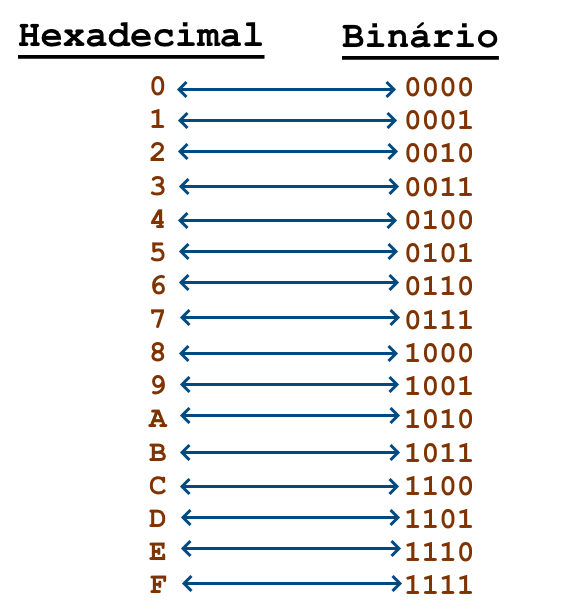

A partir desses detalhes, a compreensão de um endereço IPv6 e seu conjunto numérico pode ser resumida da seguinte forma:


Para simplificar a representação, os endereços IPv6 podem ser escritos eliminando os zeros iniciais de cada conjunto hexadecimal, começando sempre da direita para a esquerda:


Além disso, grupos de zeros podem ser eliminados completamente. Por exemplo, o endereço que representa o _[localhost](https://pt.wikipedia.org/wiki/Localhost)_ ou _[loopback](https://pt.wikipedia.org/wiki/Localhost)_, pode ser escrito da seguinte forma:

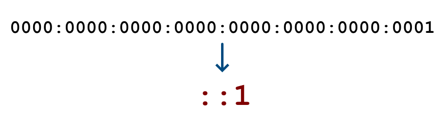

!!! note "NOTA"
    Um conjunto de zeros, independentemente do tamanho, pode ser representado usando apenas dois-pontos `::`. No entanto, essa abreviação pode ser utilizada apenas uma vez em um endereço.

A representação de **_prefixos de rede_**, por meio da notação _[CIDR](https://pt.wikipedia.org/wiki/Roteamento_Interdom%C3%ADnio_Sem_Classes)_, utilizada no IPv4, é aplicada da mesma forma no IPv6 para identificar a parte do endereço que representa a rede e a parte que representam os hosts:


Por fim, é importante ressaltar que a _[RFC 4291](https://www.rfc-editor.org/rfc/rfc4291.html#section-2.5.1)_ recomenda que os prefixos que identificam a rede não devem ultrapassar `/64`. Isso significa que, em um espaço de 128 bits, recomenda-se sempre reservar **64 bits** para a parte que **identifica a rede** e os **64 bits** restantes para a identificação das **interfaces de rede**. Essa divisão é essencial para o funcionamento da **autoconfiguração** do IPv6, a qual será detalhada mais adiante.


!!! note "NOTA"
    Um prefixo é a parte do endereço onde os bits têm valores fixos.

## 7.2.2 Tipos de Endereços

No IPv6, existem **_três tipos de endereços_** utilizados para **_diferentes formas de comunicação_** entre os dispositivos da rede. São eles:

### **[Unicast](https://www.rfc-editor.org/rfc/rfc4291.html#section-2.5)**

Um endereço do tipo _[Unicast](https://www.rfc-editor.org/rfc/rfc4291.html#section-2.5)_ é utilizado para **_identificar de maneira única uma interface de rede dentro de uma rede_**. Isso significa que um pacote de dados enviado para um endereço do tipo _[Unicast](https://www.rfc-editor.org/rfc/rfc4291.html#section-2.5)_ será entregue a uma única interface de rede. 

Na imagem abaixo, é possível observar que cada host da rede possui um endereço IPv6 único e exclusivo, permitindo que os computadores se comuniquem entre si de maneira individual, **_um-para-um_**: 

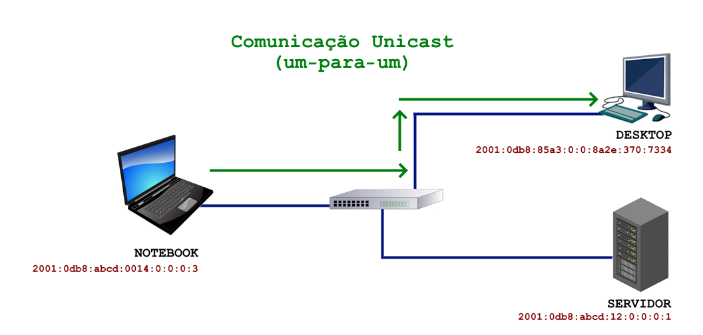

### **[Multicast](https://www.rfc-editor.org/rfc/rfc4291.html#section-2.7)**

Endereços do tipo _[Multicast](https://www.rfc-editor.org/rfc/rfc4291.html#section-2.7)_ são utilizados para comunicação com um **_grupo de hosts (multicast group)_** ou um **_grupo de interfaces de rede (VNICs)_**. Esses endereços estão contidos no prefixo `FF00::/8`, o que significa que todos os endereços que começam com `FF` são sempre do tipo _[Multicast](https://www.rfc-editor.org/rfc/rfc4291.html#section-2.7)_.

A _[RFC 4291](https://www.rfc-editor.org/rfc/rfc4291.html#section-2.7)_, na seção _["2.7. Multicast Addresses"](https://www.rfc-editor.org/rfc/rfc4291.html#section-2.7)_, define que um endereço do tipo _[Multicast](https://www.rfc-editor.org/rfc/rfc4291.html#section-2.7)_ serve como um **_identificador_** para um **_grupo de interfaces de rede_**, geralmente localizadas em diferentes nós. Além disso, as comunicações do tipo _[Multicast](https://www.rfc-editor.org/rfc/rfc4291.html#section-2.7)_ são sempre do tipo **_um-para-todos_**.


Diferentemente do IPv4, no IPv6 **_não existe endereço de broadcast_** e dessa forma, o protocolo _[ARP (Address Resolution Protocol)](https://www.rfc-editor.org/rfc/rfc826)_, que faz uso de endereços broascast, também deixa de existir. Mais adiante, você verá que essas funcionalidades são substituídas pelo protocolo _[NDP (Neighbor Discovery Protocol)](https://pt.wikipedia.org/wiki/Neighbor_Discovery_Protocol)_, que utiliza endereços do tipo multicast para realizar a descoberta dos demais hosts da rede (vizinhos).

!!! note "NOTA"
    A comunicação do tipo _[Multicast](https://www.rfc-editor.org/rfc/rfc4291.html#section-2.7)_ é **_essencial para o funcionamento do IPv6_**. Para que a rede IPv6 opere corretamente, é necessário que esse tipo de comunicação funcione. Por exemplo, se, por algum motivo, o firewall de um host na rede for configurado para bloquear as comunicações do tipo _[Multicast](https://www.rfc-editor.org/rfc/rfc4291.html#section-2.7)_, isso impedirá o seu funcionamento em uma rede IPv6.

### **[Anycast](https://www.rfc-editor.org/rfc/rfc4291.html#section-2.6)**

_[Anycast](https://www.rfc-editor.org/rfc/rfc4291.html#section-2.6)_ é uma forma seletiva de comunicação que direciona os pacotes de dados para o **_nó mais próximo_** dentro de um grupo de nós. Os pacotes são enviados da **_origem para o destino mais próximo (menor custo)_**. É importante mencionar que os pacotes de dados também podem ser enviados de uma origem para um **_grupo de destinos mais próximos_**, **_um-para-o-mais-próximo_**.

Um exemplo de comunicação do tipo _[Anycast](https://www.rfc-editor.org/rfc/rfc4291.html#section-2.6)_ é a resolução de nomes DNS. Na imagem abaixo, é possível observar que os servidores compartilham o mesmo endereço IP (sim, isto é possível no IPv6). Quando o notebook precisa resolver um nome, o roteador **_seleciona o servidor mais próximo_**, com o **_menor custo_**, para atender a essa solicitação:


!!! note "NOTA"
    Ao contrário dos endereços do tipo _[Unicast](https://www.rfc-editor.org/rfc/rfc4291.html#section-2.5)_ e _[Multicast](https://www.rfc-editor.org/rfc/rfc4291.html#section-2.7)_, os endereços do tipo _[Anycast](https://www.rfc-editor.org/rfc/rfc4291.html#section-2.6)_ não possuem um prefixo específico.

## 7.2.3 Endereços Unicast

Assim como no IPv4, o IPv6 também possui endereços do tipo privado, que são utilizados exclusivamente para comunicação em redes locais (não roteáveis), e endereços IP públicos, também conhecidos como endereços válidos, que são 
usados para comunicação na Internet (roteáveis).

Embora existam endereços do tipo privado e público, a proposta é sempre utilizar os endereços IP públicos, independentemente de o host precisar ou não se comunicar com a Internet. Isso pode parecer estranho à primeira vista, pois estamos acostumados com o mundo IPv4, onde toda a rede interna é uma rede privada que deve ser endereçada com IPs privados _([RFC 1918](https://www.rfc-editor.org/rfc/rfc1918))_ e, para acessar a Internet, a rede interna precisa compartilhar o único IP público fornecido pelo provedor de acesso por meio de técnicas de _[NAT (Network Address Translation)](https://pt.wikipedia.org/wiki/Network_address_translation)_.

!!! note "NOTA"
    É importante ressaltar novamente que, no IPv6, não se utiliza _[NAT](https://pt.wikipedia.org/wiki/Network_address_translation)_ para a comunicação na Internet. Não há necessidade de compartilhar um único endereço público entre uma rede de endereços privados. Com a abundância de endereços IPv6 disponíveis, seu provedor de serviços de Internet atribuirá mais de um endereço a você. Na verdade, o provedor fornece um prefixo de rede que pode ser distribuído entre os dispositivos da sua rede local.  

Outro aspecto importante relacionado aos endereços em uma rede IPv6 é que o protocolo IPv6 foi projetado para suportar múltiplos endereços de diferentes tipos em uma única  interface de rede. A imagem abaixo exibe o resultado do comando `ipconfig`, mostrando a presença de vários endereços IPv6 em uma interface de rede de um sistema operacional Windows:

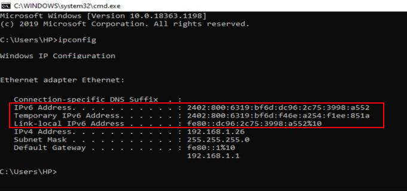

Embora os termos público e privado sejam comuns no contexto do IPv4, no IPv6 utiliza-se o termo **_escopo do endereço (address scope)_**. O escopo refere-se a uma área da rede onde o endereço é único e relevante. De acordo com a _[RFC 4007](https://www.rfc-editor.org/rfc/rfc4007#section-4)_, o escopo é definido como um intervalo topológico dentro do qual o endereço pode ser utilizado como um identificador exclusivo para uma interface de rede ou um conjunto de interfaces.

No IPv6, existem três tipos de escopos:

- **Link-Local**
    - Endereços que são acessíveis apenas dentro de um link de dados específico.

- **Site-Local**
    - Endereços que são acessíveis dentro de um site ou organização, utilizados por toda uma empresa e suas filiais, por exemplo. 

- **Global**
    - Endereços com alcance mundial ou global, que podem ser roteados na Internet.

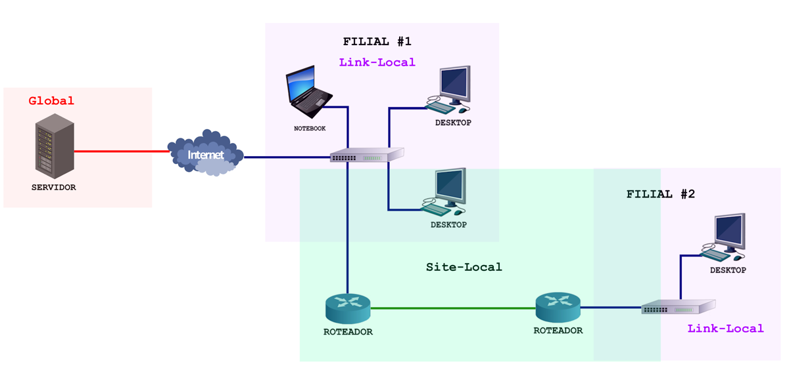

Abaixo está o resultado do comando `ifconfig` de um sistema operacional Linux, que exibe o escopo dos endereços IPv6:

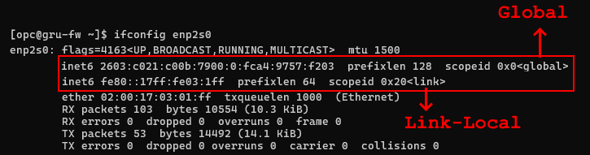

!!! note "NOTA"
    Para obter mais informações sobre o escopo dos endereços IPv6, consulte a _[RFC 4007 - IPv6 Scoped Address Architecture](https://www.rfc-editor.org/rfc/rfc4007#section-4)_.

A seguir, serão apresentados os tipos de endereços _[Unicast](https://www.rfc-editor.org/rfc/rfc4291.html#section-2.5)_ classificados de acordo com o seu escopo.

### **[GUA (Global Unicast Addresses)](https://www.rfc-editor.org/rfc/rfc4291.html#section-2.5.4)**

Endereços do tipo _[GUA (Global Unicast Addresses)](https://www.rfc-editor.org/rfc/rfc4291.html#section-2.5.4)_ são identificados pelo prefixo `2000::/3` e são **_equivalentes aos endereços públicos/válidos do IPv4 (escopo global)_** . No IPv6, todo dispositivo que deseja acessar a Internet necessita de um endereço do tipo _[GUA](https://www.rfc-editor.org/rfc/rfc4291.html#section-2.5.4)_.

Diferentemente do IPv4, o IPv6 oferece uma abundância de endereços disponíveis, permitindo que cada host que precise se comunicar na Internet tenha seu próprio endereço público exclusivo. Assim, por exemplo, se em uma rede com dez hosts e os dez hosts precisam se comunicar com a Internet, cada um dos dez terá o seu próprio endereço do tipo _[GUA](https://www.rfc-editor.org/rfc/rfc4291.html#section-2.5.4)_. O IPv6 restabelece o modelo de comunicação _Fim-a-Fim_, que é o princípio original da Internet.


#### **Formato dos Endereços GUA**

De acordo com a _[RFC 4291](https://www.rfc-editor.org/rfc/rfc4291.html#section-2.5.4)_, os endereços do tipo _[GUA](https://www.rfc-editor.org/rfc/rfc4291.html#section-2.5.4)_ possuem o seguinte formato:

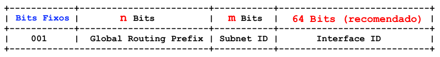

- **Bits Fixos**
    - O três primeiros bits `001` do endereço são fixos e representa o prefixo `2000::/3`. Assim, os endereços do tipo _[GUA](https://www.rfc-editor.org/rfc/rfc4291.html#section-2.5.4)_ estão contidos na faixa que vai de `2000:0:0:0:0:0:0` até `3fff:ffff:ffff:ffff:ffff:ffff:ffff:ffff`.

- **Global Routing Prefix**
    - Prefixo de roteamento global, utilizado para identificar o tamanho do prefixo atribuído a uma rede.

- **Subnet ID**
    - Identificação da sub-rede, utilizada para identificar um enlace em uma rede.

- **Interface ID**
    - Identifica de maneira única uma interface de rede dentro da sub-rede. Como mencionado anteriormente, é recomendado utilizar **64 bits** para a parte que identifica as interfaces de rede.

#### **Políticas de Alocação e Designação**

A gestão e alocação dos prefixos IPv6 em nível mundial é feita pela _[IANA (Internet Assigned Numbers Authority)](https://www.iana.org/)_. Esta por sua vez, aloca um prefixo `/12` para cada _[RIR (Registros Regionais de Internet)](https://pt.wikipedia.org/wiki/Registro_Regional_da_Internet)_, como a _[ARIN (American Registry for Internet Numbers)](https://www.arin.net/)_, _[APNIC (Asia-Pacific Network Information Centre)](https://www.apnic.net/)_, _[LACNIC (Latin America and Caribbean Network Information Centre)](https://www.lacnic.net)_, entre outros.

Na América Latina, que fica sob a gestão do _[LACNIC](https://www.lacnic.net)_, o prefixo `2800::/12`, alocado pela _[IANA](https://www.iana.org/)_, é dividido e distribuído entre os países da região. No Brasil, o _[NIC.br](https://www.nic.br/)_ é responsável pelo gerenciamento do prefixo `2804::/16`. A partir desse prefixo, o _[NIC.br](https://www.nic.br/)_ aloca prefixos para provedores de acesso à Internet _[(ISP - Internet Service Provider)](https://pt.wikipedia.org/wiki/Fornecedor_de_acesso_%C3%A0_internet)_, empresas e organizações, instituições de ensino e pesquisa, além de entidades governamentais.

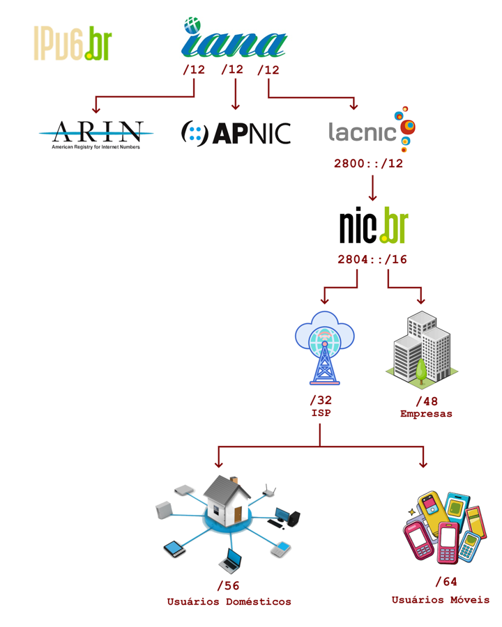

!!! note "NOTA"
    O _[NIC.br](https://www.nic.br/)_ também gerencia prefixos menores, como `2001:1280::/25` e `2001:1280::/25`, que são provenientes de alocações antigas. Para mais informações, consulte a página _[Endereçamento](https://ipv6.nic.br/post/enderecamento/)_ do _[NIC.br](https://www.nic.br/)_.

A partir do prefixo `2804::/16`, o _[NIC.br](https://www.nic.br/)_ segue suas próprias políticas de alocação:

**1.** A alocação mínima para provedores de serviços de Internet (ISPs) é um prefixo `/32`. No entanto, alocações maiores podem ser realizadas mediante a apresentação de uma justificativa de utilização.

**2.** Prefixos `/56` a `/64` para usuários domésticos. No entanto, o _[NIC.br](https://www.nic.br/)_ recomenda que os provedores de acesso atribuam prefixos `/56` a esses usuários.

**3.** Para usuários móveis pode-se utilizar um prefixo `/64`, pois geralmente uma única rede é suficiente.

**4.** Prefixo `/48` para usuários corporativos. Empresas maiores podem receber mais de um prefixo `/48`.

Para se ter uma ideia, a partir de um prefixo `/32`, temos **32 bits** disponíveis para criar sub-redes (`64 - 32 = 32 bits`). Isso permite a criação de até **quatro bilhões de sub-redes** diferentes (`2^32 = 4.294.967.296`). 

Em um prefixo `/48`, há **16 bits** para a criação de sub-redes (`64 - 48 = 16 bits`), o que representa um total de **65.536 sub-redes** possíveis (`2^16 = 65,536`).

Já em um prefixo `/56`, temos **8 bits** para criar sub-redes (`64 - 56 = 8 bits`), resultando em um total de **256 sub-redes** disponíveis (`2^8 = 256`).

Observe que a alocação e a subdivisão para a criação das sub-redes ocorrem nos primeiros 64 bits de um endereço IPv6. Os 64 bits restantes são utilizados para identificar as interfaces de rede, permitindo endereçar aproximadamente **dezoito quatrilhões de interfaces de rede** dentro de uma sub-rede (`2 ^ 64 = 18.446.744.073.709.551,616`).

!!! note "NOTA"
    É bastante provável que o seu provedor de acesso forneça um prefixo `/56` para que você possa acessar a Internet. Como você verá, o _[OCI](https://www.oracle.com/cloud/)_ também disponibiliza um prefixo `/56` nas VCNs com sub-redes públicas configuradas para IPv6.

### **[ULA (Unique Local IPv6 Unicast Addresses)](https://www.rfc-editor.org/rfc/rfc4193)**

Endereços do tipo _[ULA (Unique Local IPv6 Unicast Addresses)](https://www.rfc-editor.org/rfc/rfc4193)_, também conhecidos de forma abreviada como _[Local IPv6 Address](https://www.rfc-editor.org/rfc/rfc4193)_, são identificados pelo prefixo `FC00::/7` e são **_equivalentes aos endereços privados do IPv4 (escopo site-local)_**.

Esses endereços são utilizados exclusivamente para comunicação interna de um site e não devem aparecer ou ser roteados na Internet. Provedores de acesso à Internet bloqueiam esse tipo de endereço da mesma forma que ocorre com os endereços privados do IPv4 _([RFC 1918](https://www.rfc-editor.org/rfc/rfc1918))_.

Como sabemos, a funcionalidade do _[NAT (Network Address Translation)](https://pt.wikipedia.org/wiki/Network_address_translation)_ para acesso à Internet a partir de uma rede interna IPv4 não se aplica a redes IPv6. Em uma interface de rede IPv6, é possível ter simultaneamente um endereço do tipo _[GUA (Global Unicast Addresses)](https://www.rfc-editor.org/rfc/rfc4291.html#section-2.5.4)_ e um endereço do tipo _[ULA](https://www.rfc-editor.org/rfc/rfc4193)_. O sistema operacional geralmente escolhe automaticamente o endereço apropriado com base no tipo de comunicação que está sendo realizada.

Em resumo, o _[GUA](https://www.rfc-editor.org/rfc/rfc4291.html#section-2.5.4)_ é preferencial para comunicação com a Internet, enquanto o _[ULA](https://www.rfc-editor.org/rfc/rfc4193)_ é preferencial para comunicação interna, dentro de um site.

!!! note "NOTA"
    Consulte a _[RFC 6724 - Default Address Selection for Internet Protocol Version 6 (IPv6)](https://www.rfc-editor.org/rfc/rfc6724)_ para obter mais informações sobre a utilização dos algoritmos de seleção de endereços, que são definidos com base no tipo de comunicação que o host irá realizar.

#### **Formato dos Endereços ULA**

De acordo com a _[RFC 4193](https://www.rfc-editor.org/rfc/rfc4193)_, os endereços do tipo _[ULA](https://www.rfc-editor.org/rfc/rfc4193)_ possuem o seguinte formato:

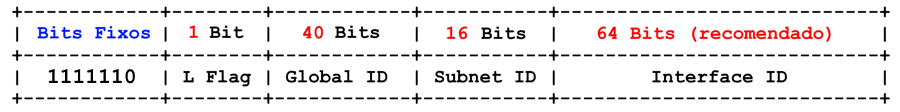

- **Bits Fixos**
    - Os sete primeiros bits `1111110` do endereço são fixos e representa o prefixo `FC00::/7`, que identifica endereços do tipo _[ULA](https://www.rfc-editor.org/rfc/rfc4193)_. Este prefixo por sua vez foi dividido em dois `/8`: `FC00::/8` e `FD00::/8`.

- **L Flag**
    - A L Flag (ou Local Flag) é utilizada para identificar se o prefixo de endereços é **global** ou **local**. Um valor de `0` indica que o prefixo é destinado ao uso global, enquanto um valor `1` indica que o prefixo é para uso local. 

- **Global ID**
    - Os `40 bits` são utilizados para identificar a sua rede. Você verá que, recomenda-se que esses bits sejam gerados por meio de algoritmos específicos que produzem valores pseudo-aleatórios.
    
- **Subnet ID**
    - Os `16 bits` são utilizados para identificar uma sub-rede dentro de um site e podem ser escolhidos livremente.

- **Interface ID**
    - Os `64 bits` são utilizados para identificar as interfaces de rede dentro de uma sub-rede. É recomendado utilizar todo o espaço de `64 bits` para endereçar as interfaces de rede, nem menos nem mais.

#### **L Flag**

Para criar redes IPv6 usando prefixos privados de sua escolha, é necessário que o bit **L Flag** tenha o valor `1`. A especificação dos endereços _[ULA](https://www.rfc-editor.org/rfc/rfc4193)_ estabelece que, quando esse bit está definido como `0`, o endereço representa um prefixo global. Por outro lado, um valor de `1` indica que o prefixo é destinado ao uso privado.

A utilização do valor do bit em `0`, que define o prefixo **global** `FC00::/8`, não foi amplamente aceita, pois a intenção é que esses prefixos sejam administrados e alocados a partir das autoridades de Internet com a finalidade  de garantir que não haja conflitos de endereços privados entre as organizações em todo o mundo. Em outras palavras, neste caso, para utilizar um prefixo destinado ao endereçamento privado em sua rede, é necessário solicitá-lo a uma autoridade de Internet, em vez de escolher um prefixo qualquer de sua escolha.

Já para definir prefixos de uso **local**, é necessário que o bit **L Flag** esteja configurado com o valor `1`, resultando no prefixo `FD00::/8`. Esses prefixos, destinados ao uso privado, estão contidos na faixa que vai de `FD00:0:0:0:0:0:0` até `FDff:ffff:ffff:ffff:ffff:ffff:ffff:ffff`, podendo ser representados de forma abreviada como `FD00::/8`.

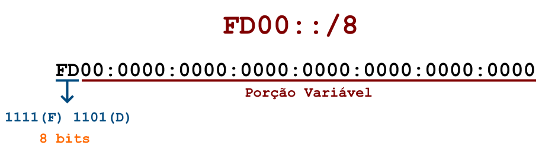

Esse é o prefixo que você deve utilizar para suas redes privadas IPv6: `FD00::/8`.

#### **Global ID**

A porção do endereço **Global ID**, composta por `40 bits`, é utilizada para identificar o prefixo de uso privado e exclusivo de uma organização. Como mencionado anteriormente, os valores para a porção **Global ID** foram projetados para serem administrados por autoridades da Internet. 

A ideia inicial parecia boa, pois, ao utilizar prefixos únicos, as organizações poderiam evitar problemas de endereçamento ao integrar redes, como endereços de VPN que se sobrepõem, entre outros. No entanto, o processo de solicitação de prefixos privados se torna burocrático e por isso não foi amplamente aceito.

Neste caso, a recomendação e a proposta aceita é que a geração da porção **Global ID** seja realizada por meio de algoritmos específicos que produzem valores pseudo-aleatórios. Essa abordagem, de certa forma, garante uma baixa probabilidade de que diferentes organizações utilizem o mesmo prefixo.

!!! note "NOTA"
    Consulte a seção _[3.2.2. Sample Code for Pseudo-Random Global ID Algorithm](https://www.rfc-editor.org/rfc/rfc4193#section-3.2.2)_ da _[RFC 4193](https://www.rfc-editor.org/rfc/rfc4193)_ para obter mais detalhes sobre o algoritmo proposto para a geração de prefixos pseudo-aleatórios.

Um site que eu particularmente gosto para gerar prefixos pseudo-aleatórios é o _[rovaughn.com/ipv6-subnet-generator](https://rovaughn.com/ipv6-subnet-generator/)_. Ele fornece como resultado os valores para **Global ID** e **Subnet ID**:

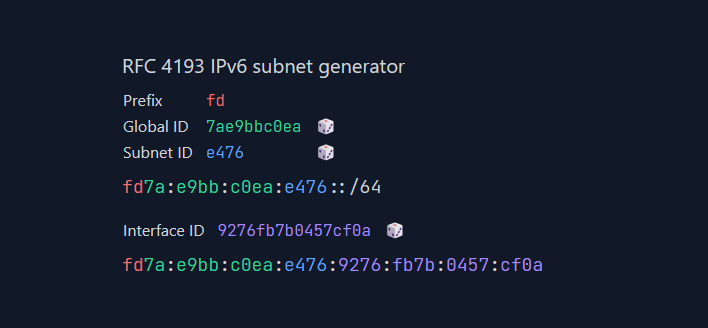

Apenas para complementar a explicação, também é possível utilizar a linha de comando para gerar prefixos de rede:

```bash linenums="1"
$ printf "fd%x:%x:%x::/48\n" "$(( $RANDOM/256 ))" "$RANDOM" "$RANDOM"
fd5f:62f:6926::/48

$ printf "fd%x:%x:%x::/48\n" "$(( $RANDOM/256 ))" "$RANDOM" "$RANDOM"
fd3b:7b75:6c88::/48

$ printf "fd%x:%x:%x::/48\n" "$(( $RANDOM/256 ))" "$RANDOM" "$RANDOM"
fd7e:1237:76e2::/48
```

!!! note "NOTA"
    Embora os valores aleatórios gerados pelo exemplo de linha de comando acima sejam fáceis de reproduzir, é importante mencionar que esse método não está em conformidade com as recomendações do algoritmo proposto pela _[RFC 4193](https://www.rfc-editor.org/rfc/rfc4193#section-3.2.2)_.

#### **Subnet ID**

**Subnet ID**, composto por `16 bits`, é a parte que identifica as sub-redes dentro do prefixo. Para se ter uma ideia, com `16 bits`, é possível ter até `65.536` sub-redes.

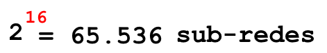

Existem alguns métodos para calcular sub-redes IPv6, visto que há um grande número de bits disponíveis para essa finalidade. É possível iniciar a criação das sub-redes a partir dos bits mais à direita, à esquerda ou até mesmo do meio do endereço. 

Abaixo, serão apresentados alguns exemplos de sub-redes criadas a partir do prefixo _[ULA](https://www.rfc-editor.org/rfc/rfc4193)_ `fde3:50e0:8c08::/48`:

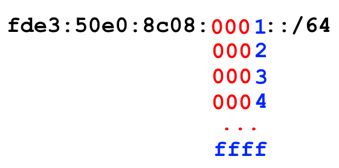

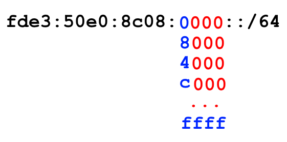

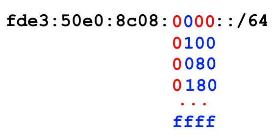

Para simplificar a criação de sub-redes IPv6, existe o script _[ipv6gen](https://code.google.com/archive/p/ipv6gen/)_. Esse script permite especificar a alocação das sub-redes utilizando os bits mais à direita (`-r`),  à esquerda (`-l`) ou a partir do meio do endereço (`-m`). 

Abaixo está um exemplo de geração de prefixos utilizando os bits mais à direita (`-r`):

```bash linenums="1"
$ ./ipv6gen.pl -r fde3:50e0:8c08::/48 64 | head -5
FDE3:50E0:8C08:0000::/64
FDE3:50E0:8C08:0001::/64
FDE3:50E0:8C08:0002::/64
FDE3:50E0:8C08:0003::/64
FDE3:50E0:8C08:0004::/64
```

!!! note "NOTA"
    O script _[ipv6gen](https://code.google.com/archive/p/ipv6gen/)_ pode ser baixado diretamente do site _[https://code.google.com/archive/p/ipv6gen/](https://code.google.com/archive/p/ipv6gen/)_.

#### **Interface ID**

**Interface ID** é a parte do endereço que identifica individualmente cada interface de rede dentro de uma sub-rede. Como já mencionado, recomenda-se que essa porção tenha `64 bits`. Com `64 bits`, é possível ter até `18 quintilhões` de endereços de rede dentro de uma única sub-rede.

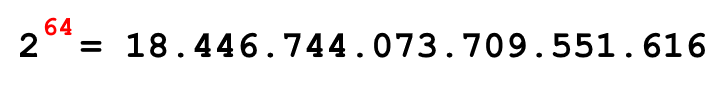

Um endereço completo _[ULA](https://www.rfc-editor.org/rfc/rfc4193)_ apresenta o seguinte formato:

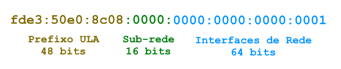

### **[Link-Local IPv6 Unicast Addresses](https://www.rfc-editor.org/rfc/rfc4291.html#section-2.5.6)**

Endereços do tipo _[Link-Local](https://www.rfc-editor.org/rfc/rfc4291.html#section-2.5.6)_ são identificados pelo prefixo `FE80::/10` e são **_equivalentes aos endereços [APIPA (Automatic Private IP Address)](https://www.rfc-editor.org/rfc/rfc3927) do IPv4_** (`169.254.0.0/16`).

Diferentemente dos endereços _[APIPA](https://www.rfc-editor.org/rfc/rfc3927)_, que são gerados automaticamente por um host quando ele não consegue obter um endereço IP de um servidor DHCP, os endereços _[Link-Local](https://www.rfc-editor.org/rfc/rfc4291.html#section-2.5.6)_ do IPv6 **_são sempre gerados automaticamente_** para cada interface de rede que suporte IPv6. Esses endereços **_são obrigatórios e sempre estão presentes_**.

Os endereços do tipo _[Link-Local](https://www.rfc-editor.org/rfc/rfc4291.html#section-2.5.6)_ são válidos apenas dentro da rede local, ou seja, são restritos a um único link e não devem ser propagados para fora da rede **_(escopo link-local)_**. Eles desempenham um papel importante na rede IPv6, sendo fundamentais principalmente para operações de _Autoconfiguração de Endereço_ e _Descoberta de Vizinhança [(Neighbor Discovery Protocol)](https://pt.wikipedia.org/wiki/Neighbor_Discovery_Protocol)_, que serão exploradas mais adiante. Se esses endereços não estiverem disponíveis ou se o tráfego entre os hosts da rede local que utilizam esses endereços não for permitido, a rede IPv6 não funcionará corretamente.

#### **Formato dos Endereços Link-Local**

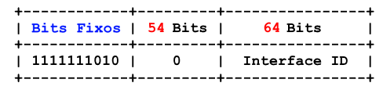

- **Bits Fixos**
    - Os dez primeiros bits `1111111010` do endereço são fixos e representa o prefixo `FE80::/10`, que identifica endereços do tipo _[Link-Local](https://www.rfc-editor.org/rfc/rfc4291.html#section-2.5.6)_. 

- **54 Bits**
    - Os próximos `54 bits` do endereço têm um valor fixo de zero. Portanto, o prefixo completo é definido como `fe80:0000:0000:0000::/64`.

- **Interface ID**
    - Os `64 bits` restantes são utilizados para identificar as interfaces de rede e são gerados automaticamente pelo host com base no _[MAC Address](https://pt.wikipedia.org/wiki/Endere%C3%A7o_MAC)_ da interface correspondente.

#### **Geração dos Endereços Link-Local**

Endereços _[Link-Local](https://www.rfc-editor.org/rfc/rfc4291.html#section-2.5.6)_ são gerados automaticamente pelo sistema operacional do host quando uma interface de rede que suporte o protocolo IPv6 é ativada.

A parte que identifica a **Interface ID** do endereço, é gerada com base no _[MAC Address](https://pt.wikipedia.org/wiki/Endere%C3%A7o_MAC)_ da interface de rede através do método mais comum denominado **_[EUI-64](https://www.geeksforgeeks.org/computer-networks/ipv6-eui-64-extended-unique-identifier/)_**.

Para entender como essa geração é realizada, será usado como exemplo o endereço _[MAC Address](https://pt.wikipedia.org/wiki/Endere%C3%A7o_MAC)_ `02:00:17:01:ed:ff` de uma interface de rede qualquer. É importante notar que o _[MAC Address](https://pt.wikipedia.org/wiki/Endere%C3%A7o_MAC)_ é um identificador de `48 bits` (ou 6 bytes) dividido em duas partes:

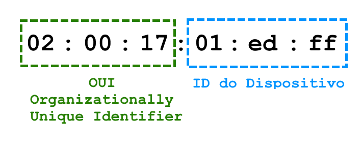

- **OUI (Organizationally Unique Identifier)**
    - Os primeiros `24 bits` ou `3 bytes` identificam o fabricante do dispositivo. Essa numeração é gerenciada pelo _[IEEE (Institute of Electrical and Electronics Engineers)](https://pt.wikipedia.org/wiki/Instituto_de_Engenheiros_Eletricistas_e_Eletr%C3%B4nicos)_, que é responsável por atribuir esses identificadores únicos às empresas que fabricam dispositivos de rede.

- **ID do Dispositivo**
    - Os últimos `24 bits` ou `3 bytes` de um endereço _[MAC](https://pt.wikipedia.org/wiki/Endere%C3%A7o_MAC)_ são gerenciados e definidos pelo fabricante do dispositivo, que controla a atribuição de identificadores únicos para cada dispositivo que produz.

A partir do endereço _[MAC](https://pt.wikipedia.org/wiki/Endere%C3%A7o_MAC)_, o protocolo IPv6 utiliza um método chamado _[64-bit Extended Unique Identifier ou EUI-64](https://www.geeksforgeeks.org/computer-networks/ipv6-eui-64-extended-unique-identifier/)_ para gerar endereços _[Link-Local](https://www.rfc-editor.org/rfc/rfc4291.html#section-2.5.6)_ únicos em uma rede. Para isso, o protocolo IPv6 aproveita a estrutura dos endereços _[MAC](https://pt.wikipedia.org/wiki/Endere%C3%A7o_MAC)_ para realizar a criação de um endereço IPv6 exclusivo. De forma simplificada, o processo segue os seguintes passos:

**1. O sétimo bit do primeiro byte é invertido. Se estiver definido como zero, ele se torna um. Se estiver definido como um, ele se torna zero:**

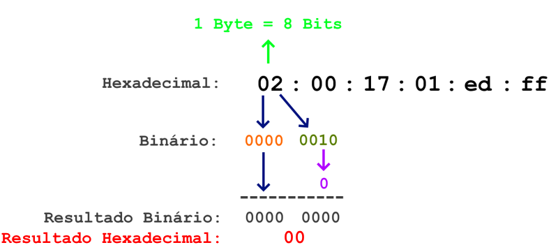

**2. O valor `FFFE` é inserido no meio do endereço:**

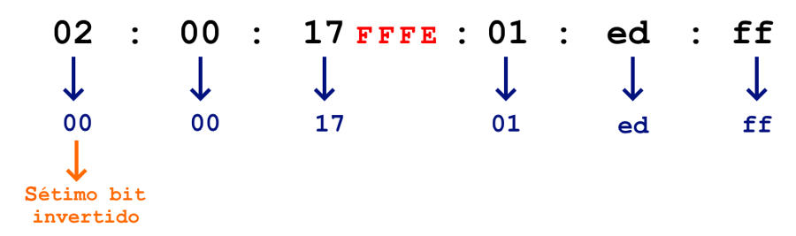

**3. Por fim, usa-se o prefixo `FE80::/64` junto com a parte do endereço que identifica a interface de rede (`0000:17FF:FE01:EDFF`):**

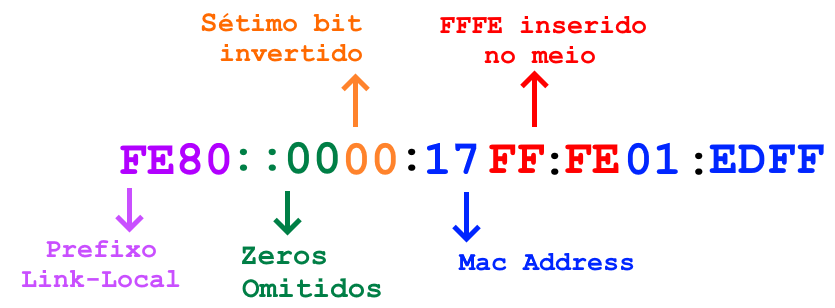

!!! note "NOTA"
    Na imagem acima, os zeros da parte que identifica o prefixo da rede foram omitidos para economizar espaço. No sistema operacional, o endereço exibido seria `FE80::17FF:FE01:EDFF`. 

## 7.2.4 Neighbor Discovery Protocol (NDP)

No IPv4, utiliza-se o protocolo _[ARP](https://www.rfc-editor.org/rfc/rfc826)_ e endereços do tipo **broadcast** para localizar e possibilitar a troca de dados entre dispositivos conectados ao mesmo link de dados. Já no IPv6, essas funções foram substituídas pelo protocolo _[Neighbor Discovery Protocol (NDP)](https://www.rfc-editor.org/rfc/rfc4861)_ que opera sobre o protocolo _[ICMPv6](https://www.rfc-editor.org/rfc/rfc4443)_. Em vez de endereços broadcast, o IPv6 utiliza endereços do tipo **multicast** para realizar essas operações.

!!! note "NOTA"
    O protocolo _[Neighbor Discovery Protocol (NDP)](https://www.rfc-editor.org/rfc/rfc4861)_ está especificado na _[RFC 4861](https://www.rfc-editor.org/rfc/rfc4861)_ e o protocolo _[ICMPv6](https://www.rfc-editor.org/rfc/rfc4443)_ está especificado na _[RFC 4443](https://www.rfc-editor.org/rfc/rfc4443)_.

De maneira análoga ao _[ARP](https://www.rfc-editor.org/rfc/rfc826)_, o protocolo _[Neighbor Discovery Protocol (NDP)](https://www.rfc-editor.org/rfc/rfc4861)_ utiliza um conjunto de mensagens e processos para facilitar a comunicação entre dispositivos conectados no mesmo link de dados, permitindo a _"descoberta da vizinhança"_. Para isso, ele trabalha com cinco diferentes tipos de mensagens:

- [Router Solicitation (RS)](https://www.rfc-editor.org/rfc/rfc4861#section-4.1)
    - Quando um host se torna ativo na rede, ele envia mensagens do tipo _[RS](https://www.rfc-editor.org/rfc/rfc4861#section-4.1)_ para descobrir os roteadores IPv6 disponíveis.

- [Router Advertisement (RA)](https://www.rfc-editor.org/rfc/rfc4861#section-4.2)
    - O roteador, por sua vez, envia mensagens do tipo _[RA](https://www.rfc-editor.org/rfc/rfc4861#section-4.2)_, não apenas em resposta a solicitações do tipo _[RS](https://www.rfc-editor.org/rfc/rfc4861#section-4.1)_, mas também de forma periódica para anunciar sua presença na rede. Essas mensagens contêm informações importantes sobre qual prefixo de rede que um host pode utilizar, informações de roteamento, _[MTU (Maximum Transmission Unit)](https://pt.wikipedia.org/wiki/Unidade_m%C3%A1xima_de_transmiss%C3%A3o)_ e se o host deve ou não prosseguir com o processo de autoconfiguração de seu endereço IP. 
    
- [Neighbor Solicitation (NS)](https://www.rfc-editor.org/rfc/rfc4861#section-4.3)
    - Os hosts enviam mensagens do tipo _[NS](https://www.rfc-editor.org/rfc/rfc4861#section-4.3)_ para solicitar o endereço da camada de enlace de um host de destino _[(MAC Address)](https://pt.wikipedia.org/wiki/Endere%C3%A7o_MAC)_.

- [Neighbor Advertisement (NA)](https://www.rfc-editor.org/rfc/rfc4861#section-4.4)
    - Um host responde com mengens do tipo _[NA](https://www.rfc-editor.org/rfc/rfc4861#section-4.4)_, que contêm seu endereço da camada de enlace, em resposta a solicitações do tipo _[NS](https://www.rfc-editor.org/rfc/rfc4861#section-4.3)_.

- [Redirect](https://www.rfc-editor.org/rfc/rfc4861#section-4.5)
    - Utilizado para informar aos hosts da rede sobre a existência de um roteador alternativo que é mais preferencial ou mais próximo do host.

Assim como a tabela _[ARP](https://www.rfc-editor.org/rfc/rfc826)_ que é mantida pelo sistema operacional, o protocolo _[NDP](https://www.rfc-editor.org/rfc/rfc4861)_ também possui a sua própria tabela, cuja função também é associar endereços da camada de enlace aos seus respectivos endereços da camada de rede. No sistema operacional Linux, essa tabela pode ser consultada utilizando o seguinte comando:

```bash linenums="1"
$ ip -6 neigh show
2803:1111:abcf:1277:84e7:6c6c:1234:1234 dev enp1s0 lladdr 12:34:56:78:9a:bc STALE
fe80::2412:acff:fe1a:8001 dev enp2s0 lladdr 98:76:54:32:10:fe STALE
fe80::9b73:2b13:61d7:22a4 dev enp1s0 lladdr ab:cd:ef:12:34:56 STALE
fe80::ead8:19ff:fe45:9b67 dev enp1s0 FAILED
fe80::200:5eff:fe00:101 dev enp2s0 lladdr 01:23:45:67:89:ab router DELAY
fe80::fa54:b8ff:fe20:d69 dev enp1s0 lladdr 12:34:56:78:9a:bc REACHABLE
fe80::29b6:6794:2e86:2882 dev enp1s0 lladdr 56:71:56:71:33:56 PROBE
```

Cada linha exibe o endereço de rede (IPv6), a interface de rede pela qual o endereço pode ser alcançado, o endereço da camada de enlace _[(MAC Address)](https://pt.wikipedia.org/wiki/Endere%C3%A7o_MAC)_e seu status, que pode apresentar um dos seguintes valores:

- **REACHABLE** 
    - O endereço está acessível e é possível comunicar-se com ele.

- **STALE** 
    - O endereço foi acessado anteriormente, mas não recentemente.

- **DELAY** 
    - O endereço foi utilizado recentemente, mas o sistema está aguardando um intervalo antes de enviar novos pacotes para evitar congestionamento.

- **PROBE** 
    - O sistema está verificando se o endereço ainda está ativo, geralmente após ter estado em STALE.

- **FAILED** 
    - O endereço não está acessível.

- **PERMANENT** 
    - A entrada é estática e não será verificada ou removida automaticamente pelo sistema.

Para o sistema operacional Windows, o comando equivalente é apresentado a seguir:

```bash linenums="1"
C:\>netsh interface ipv6 show neighbors
```

### **Autoconfiguração**

**_Autoconfiguração_** é o termo que descreve a capacidade de um host de atribuir a si mesmo um endereço de rede, sem depender da presença de um servidor _[DHCP](https://pt.wikipedia.org/wiki/Dynamic_Host_Configuration_Protocol)_ ativo na rede. Esse método, que é extremamente útil e presente no IPv6, é conhecido como _[SLAAC (Stateless Address Autoconfiguration)](https://www.rfc-editor.org/rfc/rfc4862)_, ou simplesmente **autoconfiguração stateless**. Assim como no IPv4, hosts IPv6 também podem contar com um servidor _[DHCPv6](https://pt.wikipedia.org/wiki/DHCPv6)_ ativo na rede, e esse modo de configuração é denominado **autoconfiguração stateful**.

!!! note "NOTA"
    O processo de autoconfiguração stateless é especificado na _[RFC 4862](https://www.rfc-editor.org/rfc/rfc4862)_. Por outro lado, o _[DHCPv6](https://pt.wikipedia.org/wiki/DHCPv6)_ está especificado na _[RFC 8415](https://www.rfc-editor.org/rfc/rfc8415)_.

Por fim, é importante mencionar que a configuração de endereços IPv6, independentemente de ser stateless, stateful ou manual, é validada por mais um processo do protocolo _[NDP](https://www.rfc-editor.org/rfc/rfc4861)_, denominado _[Duplicate Address Detection](https://www.rfc-editor.org/rfc/rfc4862#section-5.4)_. Esse processo tem a função de identificar endereços duplicados entre os dispositivos que compartilham o mesmo link de dados.

!!! note "NOTA"
    Para mais detalhes sobre a funcionalidade que detecta endereços duplicados, consulte a seção _[5.4. Duplicate Address Detection](https://www.rfc-editor.org/rfc/rfc4862#section-5.4)_ da _[RFC 4862](https://www.rfc-editor.org/rfc/rfc4862)_.