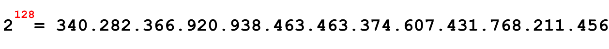
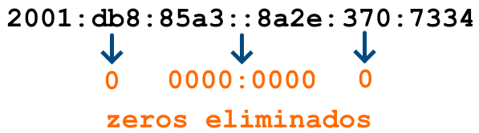
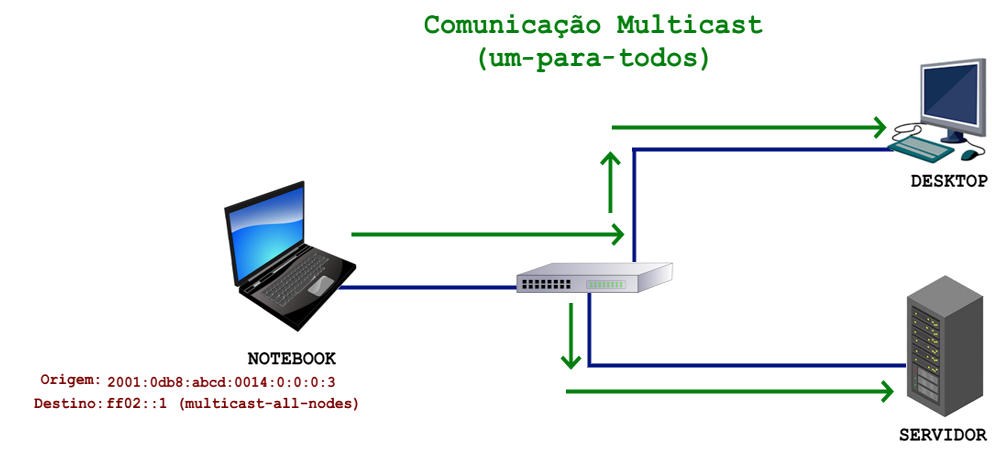

---
hide:
  - toc
---

# Capítulo 7: Conectividade e Redes

# 7.2 Endereçamento IPv6

## 7.2.1 Introdução ao IPv6

#TODO: Vantagens do IPv6 = https://www.rfc-editor.org/rfc/rfc1883

O IPv6 foi desenvolvido principalmente para suprir a falta de endereços do tipo IPv4. Hoje, todo novo host que _"nasce"_ na internet, _"nasce"_ com IPv6 e não mais com IPv4. Na verdade, nasce com IPv4 também porém, muitos provedores utilizam técnicas de NAT como CGNAT para permitir que esses novos hosts se comuniquem também com IPv4.

!!! note "NOTA"
    Aqui, utilizaremos os termos _"host"_ ou _"nó"_ (node) para especificar qualquer elemento de rede que possua um endereço IP e seja capaz de se comunicar na rede. O termo _"interface de rede"_ ou _"VNIC"_ é usado para o mesmo propósito porém, uma interface de rede pode ter múltiplos endereços associados a ela e isso é comum no IPv6.

O IPv6 foi desenvolvido com base no IPv4, mas eles são incompatíveis entre si. Isso significa que uma máquina que opera exclusivamente com IPv4 não consegue se comunicar com uma máquina que utiliza apenas IPv6, e vice-versa.

Quando analisamos um endereço IPv6, a principal diferença em relação ao IPv4, à primeira vista, é a quantidade de bits disponíveis para endereçamento. 

Como vimos, um endereço IPv4 é um número de **32 bits**, enquanto um endereço IPv6 é composto por **128 bits**. Com 128 bits disponíveis para representar os endereços, temos um total de aproximadamente **340 undecilhões** de endereços disponíveis para uso.

Diferentemente do IPv4, a quantidade de endereços disponíveis no IPv6 é um número absurdamente grande. Por ter muitos endereços disponíveis, algumas soluções técnicas, como o uso de _[NAT (Network Address Translation)](https://pt.wikipedia.org/wiki/Network_address_translation)_, tornam-se desnecessárias no IPv6.

Essa é uma outra diferenciação entre IPv4 e IPv6: **_no IPv6, não há compartilhamento de endereços por meio de [NAT (Network Address Translation)](https://pt.wikipedia.org/wiki/Network_address_translation)_**. Com a abundância de endereços disponíveis no IPv6, a ideia é promover a conectividade direta entre os dispositivos de rede, alinhando-se ao projeto original da Internet (comunicação fim-a-fim).

Devido ao maior número de bits disponíveis, sua representação passa a ser de outra forma. O endereço é composto por **_oito conjuntos de quatro caracteres hexadecimais,  separados por dois-pontos, sendo esses conjuntos conhecidos como hexadecatetos_**.

Um caractere hexadecimal é representado por números de **0 a 9** e letras de **A a F**. Isso significa que um caractere hexadecimal pode representar valores decimais que variam de **0 a 15**. 

Utilizar a base binária ou mesmo a base decimal para representar um endereço IPv6 é inviável e por isso, o uso de caracteres hexadecimais torna-se mais fácil, pois permite uma representação mais compacta dos valores binários, uma vez que cada caractere hexadecimal representa **4 bits**:

A partir desses detalhes, a compreensão de um endereço IPv6 e seu conjunto numérico pode ser resumida da seguinte forma:

Para simplificar a representação, os endereços IPv6 podem ser escritos eliminando os zeros iniciais de cada conjunto hexadecimal, começando sempre da direita para a esquerda:

Além disso, grupos de zeros podem ser eliminados completamente. Por exemplo, o endereço que representa o _[localhost](https://pt.wikipedia.org/wiki/Localhost)_ ou _[loopback](https://pt.wikipedia.org/wiki/Localhost)_, pode ser escrito da seguinte forma:

!!! note "NOTA"
    Um conjunto de zeros, independentemente do tamanho, pode ser representado usando apenas dois-pontos `::`. No entanto, essa abreviação pode ser utilizada apenas uma vez em um endereço.

A representação de **_prefixos de rede_**, por meio da notação _[CIDR](https://pt.wikipedia.org/wiki/Roteamento_Interdom%C3%ADnio_Sem_Classes)_, utilizada no IPv4, é aplicada da mesma forma no IPv6 para identificar a parte do endereço que representa a rede e a parte que representam os hosts:

## 7.2.2 Tipos de Endereços

No IPv6, existem _três tipos de endereços_ utilizados para diferentes _formas de comunicação_ entre os dispositivos da rede. São eles:

### **[Unicast](https://www.rfc-editor.org/rfc/rfc4291.html#section-2.5)**

Um endereço do tipo _[Unicast](https://www.rfc-editor.org/rfc/rfc4291.html#section-2.5)_ é utilizado para **_identificar de forma única uma interface de rede_**. Isso significa que um pacote de dados enviado para um endereço do tipo _[Unicast](https://www.rfc-editor.org/rfc/rfc4291.html#section-2.5)_ será entregue a uma única interface de rede.

Assim como no IPv4, os endereços _[IPv6 Unicast](https://www.rfc-editor.org/rfc/rfc4291.html#section-2.5)_ devem ser únicos e identificar de maneira exclusiva uma interface de rede dentro de uma sub-rede. 

Na imagem abaixo, é possível observar que cada host da rede possui um endereço IPv6 único e exclusivo, permitindo que os computadores se comuniquem entre si de maneira individual, **_um-para-um_**: 

!!! note "NOTA"
    _[Unicast](https://www.rfc-editor.org/rfc/rfc4291.html#section-2.5)_ possui um duplo significado. Ele se refere tanto à _forma de comunicação um-para-um_ quanto aos _tipos de endereços_ utilizados para identificar um host de maneira única. Como você verá, existem diversos endereços do tipo _[Unicast](https://www.rfc-editor.org/rfc/rfc4291.html#section-2.5)_.

### **[Multicast](https://www.rfc-editor.org/rfc/rfc4291.html#section-2.7)**

Endereços do tipo _[Multicast](https://www.rfc-editor.org/rfc/rfc4291.html#section-2.7)_ são utilizados para comunicação com um **_grupo de hosts (multicast group)_** ou um **_grupo de interfaces de rede (VNICs)_**. Esses endereços estão contidos no prefixo `FF00::/8`, o que significa que todos os endereços que começam com `FF` são sempre do tipo _[Multicast](https://www.rfc-editor.org/rfc/rfc4291.html#section-2.7)_.

A _[RFC 4291](https://www.rfc-editor.org/rfc/rfc4291.html#section-2.7)_, na seção _["2.7. Multicast Addresses"](https://www.rfc-editor.org/rfc/rfc4291.html#section-2.7)_, define que um endereço do tipo _[Multicast](https://www.rfc-editor.org/rfc/rfc4291.html#section-2.7)_ serve como um **_identificador_** para um **_grupo de interfaces de rede_**, geralmente localizadas em diferentes nós. Além disso, as comunicações do tipo _[Multicast](https://www.rfc-editor.org/rfc/rfc4291.html#section-2.7)_ são sempre do tipo **_um-para-todos_**.

!!! note "NOTA"
    Diferentemente do IPv4, no IPv6 **_não existe endereço de broadcast_**. Essa funcionalidade foi substituída pela comunicação do tipo _[Multicast](https://www.rfc-editor.org/rfc/rfc4291.html#section-2.7)_. No IPv4, o protocolo _[ARP (Address Resolution Protocol)](https://pt.wikipedia.org/wiki/Address_Resolution_Protocol)_, que utiliza endereço de _broadcast_, também deixa de existir, sendo substituído pelo protocolo _[NDP (Neighbor Discovery Protocol)](https://pt.wikipedia.org/wiki/Neighbor_Discovery_Protocol)_.

!!! note "NOTA"
    A comunicação do tipo _[Multicast](https://www.rfc-editor.org/rfc/rfc4291.html#section-2.7)_ é **_essencial para o funcionamento do IPv6_**. Para que a rede IPv6 opere corretamente, é necessário que esse tipo de comunicação funcione. Por exemplo, se, por algum motivo, o firewall de um host na rede for configurado para bloquear as comunicações do tipo _[Multicast](https://www.rfc-editor.org/rfc/rfc4291.html#section-2.7)_, isso impedirá o seu funcionamento em uma rede IPv6.

### **[Anycast](https://www.rfc-editor.org/rfc/rfc4291.html#section-2.6)**

_[Anycast](https://www.rfc-editor.org/rfc/rfc4291.html#section-2.6)_ é uma forma seletiva de comunicação que direciona os pacotes de dados para o **_nó mais próximo_** dentro de um grupo de nós. Os pacotes são enviados da **_origem para o destino mais próximo_**. É importante mencionar que os pacotes de dados também podem ser enviados de uma origem para um **_grupo de destinos mais próximos_**, **_um-para-o-mais-próximo_**.

!!! note "NOTA"
    Diferente do _[Unicast](https://www.rfc-editor.org/rfc/rfc4291.html#section-2.5)_ e _[Multicast](https://www.rfc-editor.org/rfc/rfc4291.html#section-2.7)_, não há um range de endereços específico para _[Anycast](https://www.rfc-editor.org/rfc/rfc4291.html#section-2.6)_. O _[Anycast](https://www.rfc-editor.org/rfc/rfc4291.html#section-2.6)_ refere-se à forma de comunicação _um-para-o-mais-próximo_.

Um exemplo de comunicação do tipo _[Anycast](https://www.rfc-editor.org/rfc/rfc4291.html#section-2.6)_ é a resolução de nomes DNS. Na imagem abaixo, é possível observar que os servidores compartilham o mesmo endereço IP (sim, isto é possível no IPv6). Quando o notebook precisa resolver um nome, o roteador **_seleciona o servidor mais próximo_**, com o **_menor custo_**, para atender a essa solicitação:

## 7.2.3 Endereços Unicast

Já discutimos que um endereço do tipo _[Unicast](https://www.rfc-editor.org/rfc/rfc4291.html#section-2.5)_ é utilizado para identificar de forma única uma interface de rede dentro de uma rede. Assim como no IPv4, o IPv6 também possui endereços do tipo privado, que são utilizados exclusivamente para comunicação em redes locais (não roteáveis), e endereços IP públicos, também conhecidos como endereços válidos, que são 
usados para comunicação na Internet (roteáveis).

Embora existam endereços do tipo privado e público, a proposta é sempre utilizar os endereços IP públicos, independentemente de o host precisar ou não se comunicar com a Internet. Isso pode parecer estranho à primeira vista, pois estamos acostumados com o mundo IPv4, onde toda a rede interna é uma rede privada que deve ser endereçada com IPs privados _([RFC 1918](https://www.rfc-editor.org/rfc/rfc1918))_ e, para acessar a Internet, a rede interna precisa compartilhar o único IP público fornecido pelo provedor de acesso por meio de técnicas de _[NAT (Network Address Translation)](https://pt.wikipedia.org/wiki/Network_address_translation)_.

Outro aspecto importante relacionado aos endereços em uma rede IPv6 é que, em uma única interface de rede, é possível associar mais de um endereço IP. Dessa forma, uma única interface de rede pode ter, simultaneamente, um endereço do tipo público e um endereço do tipo privado, ou até mesmo vários endereços.

A imagem abaixo apresenta o resultado do comando `ipconfig`, demonstrando a presença de múltiplos endereços IPv6 em uma interface de rede de um sistema operacional Windows:

A seguir, veremos os tipos de endereços _[Unicast](https://www.rfc-editor.org/rfc/rfc4291.html#section-2.5)_ do IPv6, classificados de acordo com seu escopo de utilização.

### **[GUA (Global Unicast Addresses)](https://www.rfc-editor.org/rfc/rfc4291.html#section-2.5.4)**

Endereços do tipo _[GUA (Global Unicast Addresses)](https://www.rfc-editor.org/rfc/rfc4291.html#section-2.5.4)_ estão contidos no bloco `2000::/3` e são **_equivalentes aos endereços públicos/válidos do IPv4_**. No IPv6, todo dispositivo que deseja acessar a Internet necessita de um endereço do tipo _[GUA](https://www.rfc-editor.org/rfc/rfc4291.html#section-2.5.4)_.

Diferentemente do IPv4, o IPv6 oferece uma abundância de endereços disponíveis, permitindo que cada host que precise se comunicar na Internet tenha seu próprio endereço público exclusivo. Assim, por exemplo, se em uma rede com dez hosts e os dez hosts precisam se comunicar com a Internet, cada um dos dez terá o seu próprio endereço do tipo _[GUA](https://www.rfc-editor.org/rfc/rfc4291.html#section-2.5.4)_. O IPv6 restabelece o modelo de comunicação _Fim-a-Fim_, que é o princípio original da Internet.

!!! note "NOTA"
    É importante reforçar: **NÃO SE USA [NAT](https://pt.wikipedia.org/wiki/Network_address_translation) NO IPv6!** Embora existam alguns tipos de NAT no IPv6, como NAT64, NAT46 e NAT66, seu uso é destinado a outros fins e não para compartilhar um IP público entre várias máquinas na rede local para acessar a Internet. No IPv6, cada host, ou mais precisamente, cada interface de rede, recebe seu próprio IP público diretamente do provedor de acesso para se conectar à Internet.

#### **Políticas de Alocação e Designação**

A gestão e alocação dos blocos IPv6 em nível mundial é feita pela _[IANA (Internet Assigned Numbers Authority)](https://www.iana.org/)_. Esta por sua vez, aloca um bloco um bloco `/12` para cada _[RIR (Registros Regionais de Internet)](https://pt.wikipedia.org/wiki/Registro_Regional_da_Internet)_, como a _[ARIN (American Registry for Internet Numbers)](https://www.arin.net/)_, _[APNIC (Asia-Pacific Network Information Centre)](https://www.apnic.net/)_, _[LACNIC (Latin America and Caribbean Network Information Centre)](https://www.lacnic.net)_, entre outros.

Na América Latina, que fica sob a gestão do _[LACNIC](https://www.lacnic.net)_, o bloco `2800::/12`, alocado pela _[IANA](https://www.iana.org/)_, é dividido e distribuído entre os países da região. No Brasil, o _[NIC.br](https://www.nic.br/)_ é responsável pelo gerenciamento do bloco `2804::/16`. A partir desse bloco, o _[NIC.br](https://www.nic.br/)_ aloca blocos para provedores de acesso à Internet _[(ISP - Internet Service Provider)](https://pt.wikipedia.org/wiki/Fornecedor_de_acesso_%C3%A0_internet)_, empresas e organizações, instituições de ensino e pesquisa, além de entidades governamentais.

!!! note "NOTA"
    O _[NIC.br](https://www.nic.br/)_ também gerencia blocos menores, como `2001:1280::/25` e `2001:1280::/25`, que são provenientes de alocações antigas. Para mais informações, consulte a página _[Endereçamento](https://ipv6.nic.br/post/enderecamento/)_ do _[NIC.br](https://www.nic.br/)_.

A partir do bloco `2804::/16`, o _[NIC.br](https://www.nic.br/)_ segue suas próprias políticas de alocação:

**1.** A alocação mínima para provedores de serviços de Internet (ISPs) é um bloco `/32`. No entanto, alocações maiores podem ser realizadas mediante a apresentação de uma justificativa de utilização.

**2.** Blocos `/56` a `/64` para usuários domésticos. No entanto, o _[NIC.br](https://www.nic.br/)_ recomenda que os provedores de acesso atribuam blocos `/56` a esses usuários.

**3.** Para usuários móveis pode-se utilizar um bloco `/64`, pois geralmente uma única rede é suficiente.

**4.** Bloco `/48` para usuários corporativos. Empresas maiores podem receber mais de um bloco `/48`.

#### **Formato dos Endereços GUA**

De acordo com a _[RFC 4291](https://www.rfc-editor.org/rfc/rfc4291.html#section-2.5.4)_, os endereços do tipo _[GUA](https://www.rfc-editor.org/rfc/rfc4291.html#section-2.5.4)_ possuem o seguinte formato:

- **Bits Fixos**
    - O três primeiros bits `001` do endereço são fixos e representam o bloco `2000::/3`. Assim, os endereços do tipo _[GUA](https://www.rfc-editor.org/rfc/rfc4291.html#section-2.5.4)_ variam de `2000::` até `3fff:ffff:ffff:ffff:ffff:ffff:ffff:ffff`, sendo que a letra `f` pode variar de `0` à `F` em hexadecimal.

- **Global Routing Prefix**
    - Prefixo de roteamento global, utilizado para identificar o tamanho do bloco atribuído a uma rede.

- **Subnet ID**
    - Identificação da sub-rede, utilizada para identificar um enlace em uma rede.

- **Interface ID**
    - Identifica de forma única uma interface de rede dentro da sub-rede.