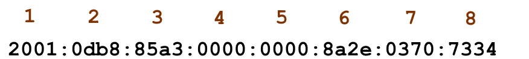
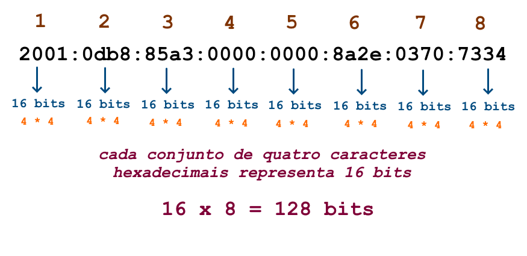

---
hide:
  - toc
---

# Capítulo 7: Conectividade e Redes

# 7.1 Fundamentos de Redes de Computadores

## 7.1.x Endereçamento IPv6

### **Visão Geral**

O IPv6 foi desenvolvido com base no IPv4, mas eles são incompatíveis entre si. Isso significa que uma máquina que opera exclusivamente com IPv4 não consegue se comunicar com uma máquina que utiliza apenas IPv6.

Quando analisamos um endereço IPv6, a principal diferença em relação ao IPv4, à primeira vista, é a quantidade de bits disponíveis para endereçamento. 

Como vimos, um endereço IPv4 é um número de **32 bits**, enquanto um endereço IPv6 é composto por **128 bits**. Com 128 bits disponíveis para representar os endereços, temos um total de aproximadamente **340 undecilhões** de endereços disponíveis para uso:

Diferentemente do IPv4, a quantidade de endereços disponíveis no IPv6 é um número absurdamente grande. Por ter muitos endereços disponíveis, algumas soluções técnicas, como o uso de _[NAT (Network Address Translation)](https://pt.wikipedia.org/wiki/Network_address_translation)_, tornam-se desnecessárias no IPv6.

!!! note "NOTA"
    Aqui está uma diferenciação entre o IPv6 e o IPv4: **_no IPv6, não se compartilham endereços por meio de [NAT (Network Address Translation)](https://pt.wikipedia.org/wiki/Network_address_translation)_**, como ocorre no IPv4. Com a abundância de endereços disponíveis no IPv6, a ideia é promover a conectividade direta entre os dispositivos de rede, alinhando-se ao projeto original da Internet.

Devido ao maior número de bits disponíveis no IPv6, sua representação foi alterada. O endereço é composto por **_oito grupos de quatro caracteres hexadecimais, separados por dois-pontos (oito hexadecatetos)_**:

Um caractere hexadecimal é representado por números de **0 a 9** e letras de **A a F**. Isso significa que um caractere hexadecimal pode representar valores decimais que variam de **0 a 15**. 

Utilizar a base binária ou decimal para representar um endereço IPv6 é inviável e por isso, o uso de caracteres hexadecimais é útil, pois permite uma representação mais compacta dos valores binários, uma vez que cada caractere hexadecimal representa **4 bits**:

A partir desses detalhes, a compreensão de um endereço IPv6 e seu conjunto numérico pode ser resumida da seguinte forma:

Para simplificar a representação, os endereços IPv6 podem ser escritos eliminando os zeros iniciais de cada conjunto hexadecimal, começando sempre da direita para a esquerda:

Além disso, grupos de zeros podem ser eliminados completamente. Por exemplo, o endereço que representa o _[localhost](https://pt.wikipedia.org/wiki/Localhost)_ ou _[loopback](https://pt.wikipedia.org/wiki/Localhost)_, pode ser representado da seguinte forma:

!!! note "NOTA"
    Um conjunto de zeros, independentemente do tamanho, pode ser representado usando apenas dois-pontos `::`. No entanto, essa abreviação pode ser utilizada apenas uma vez em um endereço.

A representação de prefixos de rede, por meio da notação _[CIDR](https://pt.wikipedia.org/wiki/Roteamento_Interdom%C3%ADnio_Sem_Classes)_, é idêntica à utilizada no IPv4:

### **Tipos de Endereços**
