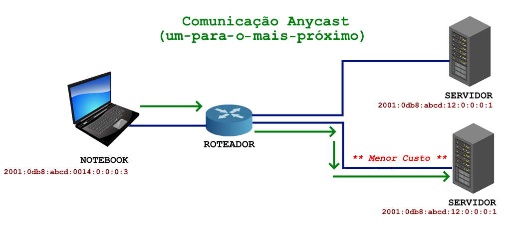

---
hide:
  - toc
---

# Capítulo 7: Conectividade e Redes

# 7.1 Fundamentos de Redes de Computadores

## 7.1.x Endereçamento IPv6

O surgimento do IPv6 se deu pelo fato da falta de endereços IPv4. Hoje, todo novo host que _"nasce"_ na internet, _"nasce"_ com IPv6 e não mais com IPv4 (pelo menos é o que se espera). Na verdade, nasce com IPv4 também porém, muitos provedores utilizam técnicas de NAT como CGNAT para permitir que esses novos hosts se comuniquem também com IPv4.

!!! note "NOTA"
    Aqui, utilizaremos os termos "host" ou "nó" (node) para especificar qualquer elemento de rede que possua um endereço IP e seja capaz de se comunicar na rede. O termo "interface de rede" ou "VNIC" é usado para o mesmo propósito, mas uma interface de rede pode ter múltiplos endereços associados a ela.

O IPv6 foi desenvolvido com base no IPv4, mas eles são incompatíveis entre si. Isso significa que uma máquina que opera exclusivamente com IPv4 não consegue se comunicar com uma máquina que utiliza apenas IPv6.

Quando analisamos um endereço IPv6, a principal diferença em relação ao IPv4, à primeira vista, é a quantidade de bits disponíveis para endereçamento. 

Como vimos, um endereço IPv4 é um número de **32 bits**, enquanto um endereço IPv6 é composto por **128 bits**. Com 128 bits disponíveis para representar os endereços, temos um total de aproximadamente **340 undecilhões** de endereços disponíveis para uso:

Diferentemente do IPv4, a quantidade de endereços disponíveis no IPv6 é um número absurdamente grande. Por ter muitos endereços disponíveis, algumas soluções técnicas, como o uso de _[NAT (Network Address Translation)](https://pt.wikipedia.org/wiki/Network_address_translation)_, tornam-se desnecessárias no IPv6.

!!! note "NOTA"
    Aqui está uma diferenciação entre o IPv6 e o IPv4: **_no IPv6, não se compartilham endereços por meio de [NAT (Network Address Translation)](https://pt.wikipedia.org/wiki/Network_address_translation)_**, como ocorre no IPv4. Com a abundância de endereços disponíveis no IPv6, a ideia é promover a conectividade direta entre os dispositivos de rede, alinhando-se ao projeto original da Internet.

Devido ao maior número de bits disponíveis no IPv6, sua representação foi alterada. O endereço é composto por **_oito grupos de quatro caracteres hexadecimais, separados por dois-pontos (oito hexadecatetos)_**:

Um caractere hexadecimal é representado por números de **0 a 9** e letras de **A a F**. Isso significa que um caractere hexadecimal pode representar valores decimais que variam de **0 a 15**. 

Utilizar a base binária ou decimal para representar um endereço IPv6 é inviável e por isso, o uso de caracteres hexadecimais é útil, pois permite uma representação mais compacta dos valores binários, uma vez que cada caractere hexadecimal representa **4 bits**:

A partir desses detalhes, a compreensão de um endereço IPv6 e seu conjunto numérico pode ser resumida da seguinte forma:

Para simplificar a representação, os endereços IPv6 podem ser escritos eliminando os zeros iniciais de cada conjunto hexadecimal, começando sempre da direita para a esquerda:

Além disso, grupos de zeros podem ser eliminados completamente. Por exemplo, o endereço que representa o _[localhost](https://pt.wikipedia.org/wiki/Localhost)_ ou _[loopback](https://pt.wikipedia.org/wiki/Localhost)_, pode ser representado da seguinte forma:

!!! note "NOTA"
    Um conjunto de zeros, independentemente do tamanho, pode ser representado usando apenas dois-pontos `::`. No entanto, essa abreviação pode ser utilizada apenas uma vez em um endereço.

A representação de prefixos de rede, por meio da notação _[CIDR](https://pt.wikipedia.org/wiki/Roteamento_Interdom%C3%ADnio_Sem_Classes)_, é idêntica à utilizada no IPv4:

### **Tipos de Endereços**

No IPv6, existem _três tipos de endereços_ utilizados para diferentes _formas de comunicação_ entre os dispositivos da rede. São eles:

#### **[Unicast](https://www.rfc-editor.org/rfc/rfc4291.html#section-2.5)**

Um endereço do tipo _[Unicast](https://www.rfc-editor.org/rfc/rfc4291.html#section-2.5)_ é utilizado para **_identificar de forma única uma interface de rede_**. Isso significa que um pacote de dados enviado para um endereço do tipo _[Unicast](https://www.rfc-editor.org/rfc/rfc4291.html#section-2.5)_ será entregue a uma única interface de rede.

Assim como no IPv4, os endereços _[IPv6 Unicast](https://www.rfc-editor.org/rfc/rfc4291.html#section-2.5)_ devem ser únicos e identificar de maneira exclusiva uma interface de rede dentro de uma sub-rede. 

Na imagem abaixo, cada host da rede possui um endereço IPv6 único e exclusivo, permitindo que os computadores se comuniquem entre si de maneira individual.

#### **[Anycast](https://www.rfc-editor.org/rfc/rfc4291.html#section-2.6)**

A comunicação do tipo _[Anycast](https://www.rfc-editor.org/rfc/rfc4291.html#section-2.6)_ é uma forma seletiva de comunicação que direciona os pacotes para o **_nó mais próximo_** dentro de um grupo de nós. Os pacotes são enviados da **_origem para o destino mais próximo_**. É importante ressaltar que eles também podem ser enviados de uma origem para um **_grupo de destinos mais próximos_**.

Um exemplo de comunicação _[Anycast](https://www.rfc-editor.org/rfc/rfc4291.html#section-2.6)_ é a resolução de nomes DNS. Na imagem abaixo, observe que os servidores compartilham o mesmo endereço IP. Quando o notebook precisa resolver um nome, o roteador **_seleciona o servidor mais próximo_**, com o **_menor custo_**, para atender a essa solicitação.

#### **[Multicast](https://www.rfc-editor.org/rfc/rfc4291.html#section-2.7)**

Endereços do tipo _[Multicast](https://www.rfc-editor.org/rfc/rfc4291.html#section-2.7)_ são utilizados para comunicação com um **_grupo de hosts (multicast group)_** ou um **_grupo de interfaces de rede (VNICs)_**. Esses endereços estão contidos no prefixo `FF00::/8`, o que significa que todos os endereços que começam com `FF` são sempre do tipo multicast.

A _[RFC 4291](https://www.rfc-editor.org/rfc/rfc4291.html#section-2.7)_, seção _["2.7. Multicast Addresses"](https://www.rfc-editor.org/rfc/rfc4291.html#section-2.7)_, afirma que um endereço _[Multicast](https://www.rfc-editor.org/rfc/rfc4291.html#section-2.7)_ serve como um **_identificador_** para um **_grupo de interfaces de rede_**, geralmente localizadas em diferentes nós.

!!! note "NOTA"
    Diferentemente do IPv4, no IPv6 **_não existe endereço de broadcast_**. Essa funcionalidade foi substituída pela comunicação do tipo _[Multicast](https://www.rfc-editor.org/rfc/rfc4291.html#section-2.7)_. No IPv4, o protocolo _[ARP (Address Resolution Protocol)](https://pt.wikipedia.org/wiki/Address_Resolution_Protocol)_, que utiliza endereço de _broadcast_, também deixa de existir, sendo substituído pelo protocolo _[NDP (Neighbor Discovery Protocol)](https://pt.wikipedia.org/wiki/Neighbor_Discovery_Protocol)_.

!!! note "NOTA"
    A comunicação do tipo _[Multicast](https://www.rfc-editor.org/rfc/rfc4291.html#section-2.7)_ é **_essencial para o funcionamento do IPv6_**. Para que a rede IPv6 opere corretamente, é necessário que esse tipo de comunicação funcione. Se, por algum motivo, o firewall de um host na rede for configurado para bloquear a comunicação _[Multicast](https://www.rfc-editor.org/rfc/rfc4291.html#section-2.7)_, isso impedirá o seu funcionamento em uma rede IPv6.

### **Tipos de Endereços Unicast**

Já abordamos que um endereço do tipo _[Unicast](https://www.rfc-editor.org/rfc/rfc4291.html#section-2.5)_ é utilizado para identificar de forma única uma interface de rede dentro da rede. Assim como no IPv4, no IPv6 há diferentes tipos de endereços, classificados de acordo com seu escopo de comunicação. Existem endereços IP privados, que são utilizados exclusivamente para comunicação em redes locais, e endereços IP públicos, usados para comunicação na Internet.

Embora existam endereços públicos e privados no IPv6, a proposta é sempre utilizar endereços IP públicos para qualquer host que precise se comunicar na Internet. Isso pode parecer estranho inicialmente, pois estamos acostumados com o mundo IPv4, onde a rede interna é uma rede privada que deve ser endereçada com IPs privados, conforme definido na _[RFC 1918](https://www.rfc-editor.org/rfc/rfc1918)_. Nesse modelo, a comunicação com a Internet é realizada por meio de técnicas de _[NAT (Network Address Translation)](https://pt.wikipedia.org/wiki/Network_address_translation)_, uma vez que os provedores de acesso só consegue fornecer apenas um único endereço IP público, devido à escassez de endereços IPv4. 

!!! note "NOTA"
    Não se preocupe com a escassez de endereços IPv6. Os provedores de acesso possuem uma grande quantidade de endereços IP públicos disponíveis para seus clientes, uma vez que há uma infinidade deles. Os hosts que iniciam ou recebem conexões da Internet são atribuídos endereços IP públicos pelo seu provedor de acesso. Essa abordagem resgata o conceito original da Internet, onde qualquer host pode se comunicar diretamente uns com os outros, promovendo a comunicação fim-a-fim.

Dentro da categoria de endereços Unicast, temos:

#### GUA

Diferentemente do IPv4, devido à abundância de endereços disponíveis no IPv6, cada host na Internet pode ter seu próprio endereço público e exclusivo. Assim, por exemplo, em uma rede com dez hosts, cada um deles poderá se comunicar diretamente na Internet com seu próprio IP público, sem a necessidade de utilizar técnicas de _[NAT (Network Address Translation)](https://pt.wikipedia.org/wiki/Network_address_translation)_ para permitir essa comunicação. O IPv6 restabelece o modelo de comunicação _Fim-a-Fim_, que é o princípio original da Internet.

!!! note "NOTA"
    É importante reforçar: **NÃO SE USA [NAT](https://pt.wikipedia.org/wiki/Network_address_translation) NO IPv6!** Embora existam alguns tipos de NAT no IPv6, como NAT64, NAT46 e NAT66, seu uso é destinado a outros fins e não para compartilhar um IP público entre várias máquinas na rede local para acessar a Internet. No IPv6, cada host, ou mais precisamente, cada interface de rede, recebe seu próprio IP público diretamente do provedor de acesso para se conectar à Internet.