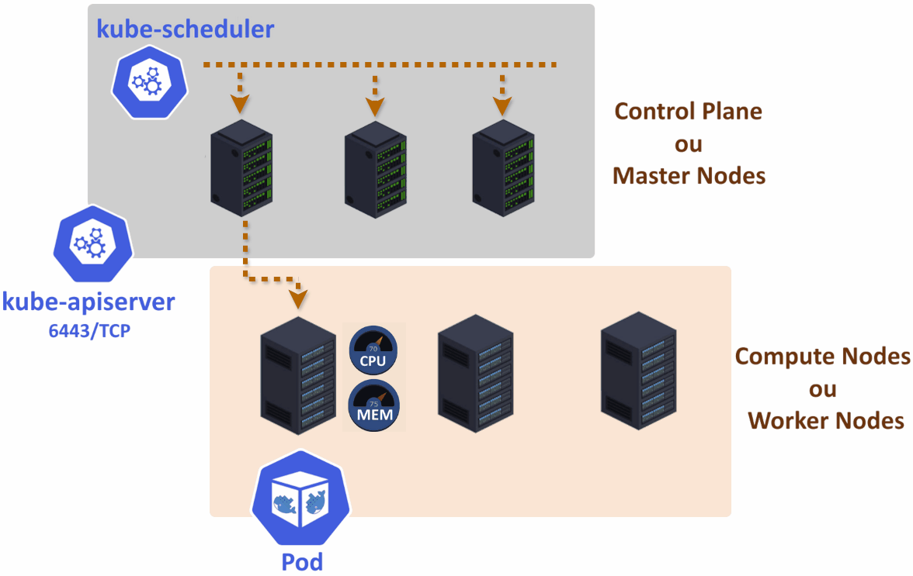

# Capítulo 8: Oracle Kubernetes Engine (OKE)

# 8.3 Arquitetura do Kubernetes

O Kubernetes é composto por diversos componentes distribuídos e independentes, cada um com sua própria responsabilidade. A maioria deles foi desenvolvida na _[linguagem de programação Go](https://go.dev/)_ e muitos fazem parte da _[Cloud Native Computing Foundation (CNCF)](../capitulo-1/cloud-native.md)_.

Para que um cluster Kubernetes funcione corretamente, é necessário instalar e configurar todos esses componentes que serão detalhados a seguir.

Além de detalhar os componentes, será apresentada a arquitetura geral do Kubernetes e a forma como esses componentes interagem entre si.

Para facilitar a identificação, a equipe de desenvolvimento do Kubernetes utiliza o prefixo **_kube_** na maioria dos componentes e utilitários que fazem parte do projeto. A exceção a essa convenção são duas dependências externas: o **_Container Engine_** e o **_etcd_**.

!!! note "NOTA"
    Aqui, são apresentados alguns termos e objetos do Kubernetes, como _Pods, Services e Deployments_. Não se preocupe, pois os detalhes de cada um deles e o seu funcionamento serão explorados na seção _[8.5 Objetos Kubernetes](./objetos-kubernetes.md)_.

## 8.3.1 Master Nodes e Worker Nodes

Um cluster Kubernetes típico é composto por várias máquinas, que podem ser físicas, virtuais ou uma combinação de ambas, conhecidas como _Nodes_. Esses _nodes_ são organizados em dois grupos principais:

!!! note "NOTA"
    É importante ressaltar que, embora seja possível executar todos os componentes do Kubernetes em uma única máquina, essa configuração não oferece tolerância a falhas. A abordagem recomendada é ter pelo menos duas máquinas configuradas como _Master Nodes_ e outras duas como _Worker Nodes_. Essa configuração proporciona maior resiliência e disponibilidade.

!!! note "NOTA"
    As máquinas do _Master Nodes_ deve ser _Linux_. Já as máquinas dos _Worker Nodes_ podem ser _Linux_ ou _Windows_.

### Control Plane ou Master Nodes

Esse grupo de máquinas supervisiona e envia tarefas para os _Worker Nodes_. Ou seja, elas são responsáveis por manter o _"estado desejado do cluster"_.

Toda a inteligência do Kubernetes está concentrada nos _Master Nodes_, e cada cluster deve ter pelo menos uma máquina designada para desempenhar essa função.

Há uma coleção de serviços que operam continuamente em cada _Master Nodes_, responsáveis por manter o estado do cluster, incluindo:

!!! note "NOTA"
    A documentação de todos os componentes do Kubernetes está disponível no link _["Core Components"](https://kubernetes.io/docs/concepts/overview/components/#core-components)_.

#### [kube-apiserver](https://kubernetes.io/docs/concepts/architecture/#kube-apiserver)

O _[kube-apiserver](https://kubernetes.io/docs/concepts/architecture/#kube-apiserver)_ é o _frontend_ do Kubernetes, atuando como o _"ponto de administração"_ que permite aos usuários enviar comandos e consultar informações sobre o cluster. 

Esse componente expõe uma _API RESTful via HTTPS_, que, por padrão, _"escuta"_ as requisições na porta **_6443/TCP_**. Essa API permite que os usuários gerenciem, monitorem e obtenham informações sobre todo o cluster, através do utilitário de linha de comando **_[kubectl](https://kubernetes.io/docs/reference/kubectl/)_**.

!!! note "NOTA"
    Devido ao fato de o _[kube-apiserver](https://kubernetes.io/docs/reference/command-line-tools-reference/kube-apiserver/)_ ser uma _API RESTful_, é possível interagir com ele utilizando até mesmo o utilitário de linha de comando _[curl](https://curl.se/)_. No entanto, é mais prático e fácil realizar essas interações através do _[kubectl](https://kubernetes.io/docs/reference/kubectl/)_.

Uma outra função desse componente, é realizar cosultas periódicas ao banco de dados _[etcd](https://etcd.io/)_.

#### [etcd](https://etcd.io/)

Todos os comandos enviados pelo _[kube-apiserver](https://kubernetes.io/docs/reference/command-line-tools-reference/kube-apiserver/)_, especialmente aqueles que alteram o **_"estado do cluster"_**, são persistidos ou atualizados em um banco de dados chave/valor distribuído nos _Master Nodes_ conhecido como _[etcd](https://etcd.io/)_.

A principal função do _etcd_ é armazenar de maneira persistente todas as alterações que foram enviadas ao _[kube-apiserver](https://kubernetes.io/docs/concepts/architecture/#kube-apiserver)_. O Kubernetes consulta periodicamente o _[etcd](https://etcd.io/)_ para verificar se o **_"estado do cluster"_** está em conformidade com os dados ali armazenados.

Outro ponto importante é que nenhum componente pode ler ou escrever no  _[etcd](https://etcd.io/)_ sem passar pelo _[kube-apiserver](https://kubernetes.io/docs/concepts/architecture/#kube-apiserver)_. 

O _[etcd](https://etcd.io/)_ não é um componente do projeto Kubernetes, mas é um projeto independente que também faz parte da _[Cloud Native Computing Foundation (CNCF)](../capitulo-1/cloud-native.md)_.

!!! note "NOTA"
    Existe um playground online acessível pelo link _[http://play.etcd.io/play](http://play.etcd.io/play)_, que permite aprender e gerenciar clusters com o _[etcd](https://etcd.io/)_.

#### [kube-scheduler](https://kubernetes.io/docs/concepts/architecture/#kube-scheduler)

A principal função do _[kube-scheduler](https://kubernetes.io/docs/concepts/architecture/#kube-scheduler)_ é monitorar periodicamente o _[kube-apiserver](https://kubernetes.io/docs/reference/command-line-tools-reference/kube-apiserver/)_ em busca de novos _Pods_ que precisam ser criados. Com base nas informações disponíveis, o  _[kube-scheduler](https://kubernetes.io/docs/concepts/architecture/#kube-scheduler)_ seleciona um ou mais _Worker Nodes_ adequados para a execução desses _Pods_, garantindo que os requisitos de recursos e restrições de afinidade sejam atendidos.

!!! note "NOTA"    
    Uma explicação mais detalhada sobre objetos do Kubernetes será apresentada no capítulo _[8.4 Objetos Kubernetes](./objetos-kubernetes.md)_. Por enquanto, é importante compreender que um _Pod_ é um objeto do Kubernetes utilizado para definir uma unidade de execução que pode conter um ou mais [contêineres](../capitulo-7/containers.md).

Um _Pod_ recém-criado não possui um _Worker Node_ designado para sua execução. Chamamos de _"Unschedule Pod"_ o _Pod_ que não possui um _Worker Node_ elegível para execução, e seu status fica como _"Pending"_. Já o termo _"Schedule"_ refere-se ao processo de atribuição do _Pod_ a um _Worker Node_ capaz de realizar a sua execução. Em outras palavras, quando um _Pod_ é _"scheduled"_, isso significa que ele foi atribuído a um _Worker Node_ específico que é capaz de executá-lo.

Além disso, o _[kube-scheduler](https://kubernetes.io/docs/concepts/architecture/#kube-scheduler)_ desempenha outras funções importantes, como a verificação de regras de afinidade e antiafinidade, a checagem da disponibilidade de portas de rede e a validação dos recursos de CPU e memória.

!!! note "NOTA" 
    O processo de _Scheduling_ do Kubernetes é bem mais complexo do que foi descrito aqui. Para maiores detalhes, consulte o _["Scheduling, Preemption and Eviction"](https://kubernetes.io/docs/concepts/scheduling-eviction/)_.

#### [kube-controller-manager](https://kubernetes.io/docs/concepts/architecture/#kube-controller-manager)

O _[kube-controller-manager](https://kubernetes.io/docs/concepts/architecture/#kube-controller-manager)_, também conhecido como **_controller_**, é responsável por executar o **_"loop de reconciliação" (reconciliation loop)_**, que tem como objetivo manter o **_"estado do cluster"_** em sincronia com as informações armazenadas no _[etcd](https://etcd.io/)_.

Por exemplo, quando solicitado, o Kubernetes é capaz de manter um número específico de _Pods_ distribuídos entre os diferentes _Worker Nodes_. Se, por qualquer motivo, o número total de _Pods_ ativos divergir do número de _Pods_ registrados no _[etcd](https://etcd.io/)_, o **_"loop de reconciliação"_** garantirá que os _Pods_ ausentes sejam criados e iniciados. Vale ressaltar que essa verificação é um processo contínuo, o que justifica o uso da palavra _"loop"_ para descrever sua funcionalidade.

Há diferentes **_controller_** que fazem parte do **_"loop de reconciliação"_** e cada um deles é responsável por gerenciar e cuidar de um tipo específico de objeto Kubernetes. Alguns deles são:

- Replication Controller
- Deployment Controller
- Job Controller
- Namespace Controller

#### [OCI Cloud Controller Manager (CCM)](https://github.com/oracle/oci-cloud-controller-manager)

O _[OCI Cloud Controller Manager](https://github.com/oracle/oci-cloud-controller-manager)_ _[(oci-cloud-controller-manager)](https://github.com/oracle/oci-cloud-controller-manager)_, é a implementação do _[cloud-controller-manager](https://kubernetes.io/docs/concepts/architecture/#cloud-controller-manager)_ responsável por conectar o Kubernetes às APIs do [OCI](../capitulo-2/oci-foundation.md).

!!! note "NOTA"
    O _[oci-cloud-controller-manager](https://github.com/oracle/oci-cloud-controller-manager)_ é um projeto de código aberto mantido pela Oracle. O código-fonte da implementação pode ser acessado por meio do link _[https://github.com/oracle/oci-cloud-controller-manager](https://github.com/oracle/oci-cloud-controller-manager)_.

Uma das funcionalidades do _[oci-cloud-controller-manager](https://github.com/oracle/oci-cloud-controller-manager)_ é a criação de _[Load Balance](../capitulo-4/load-balancer.md)_ no [OCI](../capitulo-2/oci-foundation.md) por meio do do objeto _Service_.

### Compute Nodes ou Worker Nodes

Em resumo, os _Worker Nodes_ têm a função de executar aplicações contêinerizadas, ou, mais precisamente, executar _Pods_.

Existem, basicamente, três componentes do cluster Kubernetes que são executados nos _Worker Nodes_ e são responsáveis pela execução dos Pods. São eles:

#### [Container Runtime](https://kubernetes.io/docs/setup/production-environment/container-runtimes/)

O _[Container Runtime](https://kubernetes.io/docs/setup/production-environment/container-runtimes/)_ é o software responsável pela criação, execução e gerenciamento de contêineres nos _Worker Nodes_. É necessário instalar um _[Container Runtime](https://kubernetes.io/docs/setup/production-environment/container-runtimes/)_ em cada _Worker Node_ para que os _Pods_ possam ser criados e executados.

Existem diferentes _[Container Runtime](https://kubernetes.io/docs/setup/production-environment/container-runtimes/)_ suportados e disponíveis para instalação, incluindo:

- [containerd](https://containerd.io/)
- [CRI-O](https://cri-o.io/)
- [Docker Engine](https://www.docker.com/products/container-runtime/)
- [Mirantis Container Runtime](https://www.mirantis.com/software/mirantis-container-runtime/)

O _[Docker Engine](https://www.docker.com/products/container-runtime/)_ foi, por muito tempo, o _[Container Runtime](https://kubernetes.io/docs/setup/production-environment/container-runtimes/)_ padrão para a execução de [contêineres](../capitulo-7/containers.md) no Kubernetes. No entanto, em dezembro de 2020, com o lançamento da versão 1.20, o projeto Kubernetes anunciou a descontinuação do suporte ao _[Docker Engine](https://www.docker.com/products/container-runtime/)_ como runtime de contêineres. Na versão 1.24, o suporte ao _[Docker Engine](https://www.docker.com/products/container-runtime/)_ foi completamente removido.

Essa decisão foi motivada para permitir a adoção de outros runtimes de contêiner, como _[containerd](https://containerd.io/)_, _[CRI-O](https://cri-o.io/)_, além de qualquer outro que siga as definições do _[Container Runtime Interface (CRI)](https://kubernetes.io/blog/2016/12/container-runtime-interface-cri-in-kubernetes/)_.

Isso não significa que imagens de contêineres _[Docker](https://www.docker.com/)_ não são compatíveis com o Kubernetes. Todas as imagens que seguem a especificação da _[Open Container Initiative](https://opencontainers.org/)_, são totalmente suportadas no Kubernetes, incluindo as imagens _[Docker](https://www.docker.com/)_.

Atualmente, é comum ter instalações do _[containerd](https://containerd.io/)_ ou _[CRI-O](https://cri-o.io/)_ sendo utilizados como runtimes de contêiner. Por exemplo, o _[Oracle Kubernetes Engine (OKE)](./funcionamento-provisionamento-oke.md)_ utiliza o _[containerd](https://containerd.io/)_ como seu runtime padrão.

!!! note "NOTA" 
    Consulte o artigo _["Don't Panic: Kubernetes and Docker"](https://kubernetes.io/blog/2020/12/02/dont-panic-kubernetes-and-docker/)_ que aborda a remoção do _[Docker Engine](https://www.docker.com/products/container-runtime/)_ como um runtime de contêiner suportado diretamente pelo Kubernetes.

#### [kubelet](https://kubernetes.io/docs/reference/command-line-tools-reference/kubelet/)

O _[kubelet](https://kubernetes.io/docs/reference/command-line-tools-reference/kubelet/)_, componente principal do _Worker Node_, é responsável por realizar consultas regulares ao _[kube-apiserver](https://kubernetes.io/docs/concepts/architecture/#kube-apiserver)_, buscando informações sobre os _Pods_ a serem criados ou removidos. Após obter essas informações, o _[kubelet](https://kubernetes.io/docs/reference/command-line-tools-reference/kubelet/)_ interage diretamente com o _[Container Runtime](https://kubernetes.io/docs/setup/production-environment/container-runtimes/)_ no _Worker Node_ para a criação ou exclusão efetiva dos _Pods_.

Mais especificamente, o _[kubelet](https://kubernetes.io/docs/reference/command-line-tools-reference/kubelet/)_ obtém e processa o chamado _[PodSpec](https://kubernetes.io/docs/reference/kubernetes-api/workload-resources/pod-v1/#PodSpec)_, que é um conjunto de informações que define as instruções de criação e o comportamento desejado do _Pod_. O _[PodSpec](https://kubernetes.io/docs/reference/kubernetes-api/workload-resources/pod-v1/#PodSpec)_ inclui detalhes como a imagem do contêiner a ser utilizada, as configurações de rede, as variáveis de ambiente, os recursos solicitados (como CPU e memória) e as políticas de _restart_. Com base nessas informações, o _[kubelet](https://kubernetes.io/docs/reference/command-line-tools-reference/kubelet/)_ gerencia a execução do _Pod_ no _Worker Node_, garantindo que ele atenda ao _"estado desejado"_ especificado.

#### [kube-proxy](https://kubernetes.io/docs/reference/command-line-tools-reference/kube-proxy/)

Em cada _Worker Node_, há uma instância em execução do _[kube-proxy](https://kubernetes.io/docs/reference/command-line-tools-reference/kube-proxy/)_, que funciona como um _[proxy de rede](https://pt.wikipedia.org/wiki/Proxy)_, garantindo a conectividade interna e externa. É o _[kube-proxy](https://kubernetes.io/docs/reference/command-line-tools-reference/kube-proxy/)_ que torna os _Pods_ acessíveis na rede por meio do objeto _Service_.

Assim como o _[kubelet](https://kubernetes.io/docs/reference/command-line-tools-reference/kubelet/)_, o _[kube-proxy](https://kubernetes.io/docs/reference/command-line-tools-reference/kube-proxy/)_ também interage regularmente com o _[kube-apiserver](https://kubernetes.io/docs/reference/command-line-tools-reference/kube-apiserver/)_.

## 8.3.2 Addons

_[Addons](https://kubernetes.io/docs/concepts/cluster-administration/addons/)_ são ferramentas que estendem as funcionalidades do Kubernetes.

Alguns _[Addons](https://kubernetes.io/docs/concepts/cluster-administration/addons/)_ são essenciais para o funcionamento adequado do cluster, enquanto outros são opcionais.

!!! note "NOTA"
    Para uma lista mais completa sobre os _[Addons](https://kubernetes.io/docs/concepts/cluster-administration/addons/)_ disponíveis, consulte o link _["Installing Addons"](https://kubernetes.io/docs/concepts/cluster-administration/addons/)_.

Alguns exemplos de _[Addons](https://kubernetes.io/docs/concepts/cluster-administration/addons/)_ essenciais incluem:

- **[CoreDNS](https://coredns.io/manual/toc/#what-is-coredns)**
    - O _[CoreDNS](https://coredns.io/manual/toc/#what-is-coredns)_ é um servidor DNS mais simples em comparação com servidores mais completos, como o _[BIND](https://www.isc.org/bind/)_. Ele foi projetado para ser utilizado como o servidor DNS padrão no Kubernetes, desempenhando a função de resolver nomes de _Services_ e _Pods_ dentro do cluster. No entanto, ele também pode ser configurado para atuar como um servidor _[DNS recursivo](https://pt.wikipedia.org/wiki/Sistema_de_Nomes_de_Dom%C3%ADnio#M%C3%A9todos_de_resolu%C3%A7%C3%A3o:_iterativo_e_recursivo)_, permitindo a resolução de nomes externos.

- **CNI plugin for pod networking**
    - _[CNI (Container Network Interface)](https://www.cni.dev/)_ é uma especificação e um conjunto de padrões que define uma interface para a configuração de redes em ambientes de contêineres. As implementações _[CNI](https://www.cni.dev/)_ mais utilizados no _[OKE](./funcionamento-provisionamento-oke.md)_ são:

    - [Flannel](https://github.com/flannel-io/flannel)
        - O plug-in CNI _[Flannel](https://github.com/flannel-io/flannel)_ fornece uma rede para os _Pods_ sem utilizar os endereços IP disponíveis de uma sub-rede do [OCI](../capitulo-2/oci-foundation.md). A rede disponibilizada pelo CNI _[Flannel](https://github.com/flannel-io/flannel)_ é frequentemente chamada de _"rede de sobreposição"_, pois consiste em uma rede IP que existe somente dentro do cluster, mais especificamente, nos _Worker Nodes_.

    - [OCI VCN-Native](https://docs.oracle.com/pt-br/iaas/Content/ContEng/Concepts/contengpodnetworking_topic-OCI_CNI_plugin.htm)
        - O plugin _[OCI VCN-Native](https://docs.oracle.com/pt-br/iaas/Content/ContEng/Concepts/contengpodnetworking_topic-OCI_CNI_plugin.htm)_ Pod Networking CNI, aloca endereços IP de uma sub-rede do [OCI](../capitulo-2/oci-foundation.md) diretamente para os _Pods_. Isso permite que os _Pods_ se comuniquem entre si de forma direta, sem a necessidade de utilizar um _Service_. Com essa abordagem, os _Pods_ se tornam _roteáveis_, assim como qualquer outro recurso que utilize um endereço IP, facilitando a comunicação e a integração dentro do ambiente de rede.

Alguns exemplos de _[Addons](https://kubernetes.io/docs/concepts/cluster-administration/addons/)_ opcionais incluem:

- [Kubernetes Dashboard](https://github.com/kubernetes/dashboard)
    - O _[Kubernetes Dashboard](https://github.com/kubernetes/dashboard)_ é uma aplicação Web projetada para administrar, monitorar e gerenciar _Pods, Services, Deployments_ e outros componentes, além de fornecer uma visão geral do próprio cluster Kubernetes.

- [Kubernetes Autoscaler](https://github.com/kubernetes/autoscaler)
    - O _[Kubernetes Autoscaler](https://github.com/kubernetes/autoscaler)_ é um _[addon](https://kubernetes.io/docs/concepts/cluster-administration/addons/)_ que ajusta automaticamente a capacidade de um cluster Kubernetes com base na demanda de recursos. Ele opera em duas frentes principais: o _HPA (Horizontal Pod Autoscaler)_, que tem como objetivo escalar horizontalmente, ou seja, aumentar ou diminuir o número de réplicas de um _Pod_, e o _VPA (Vertical Pod Autoscaler)_, que modifica a quantidade de recursos, como CPU e memória, alocados para um _Pod_.

- [OCI Native Ingress Controller](https://docs.oracle.com/pt-br/iaas/Content/ContEng/Tasks/contengsettingupnativeingresscontroller-cluster-addon-top-level.htm#contengsettingupnativeingresscontroller-cluster-addon-top-level)
    - É um componente desenvolvido pela Oracle que permite gerenciar o _tráfego de entrada (ingress)_ para aplicações em execução em um cluster Kubernetes que está hospedado no [OCI](../capitulo-2/oci-foundation.md). Ele fornece uma maneira de expor serviços de aplicações para o mundo externo, permitindo que os usuários acessem essas aplicações através de URLs e domínios.

- [NVIDIA GPU Plugin](https://github.com/NVIDIA/k8s-device-plugin)
    - É um _[addon](https://kubernetes.io/docs/concepts/cluster-administration/addons/)_ que permite expor um número de _GPUs NVIDIA_ para utilização em cada _Worker Node_.

## 8.3.3 Conclusão

Neste capítulo, foi apresentada uma visão geral do funcionamento e da arquitetura de um cluster Kubernetes. Foram explorados os diversos componentes de software que o compõem, destacando suas funções e a maneira como interagem entre si para formar o ecossistema do Kubernetes. Compreender a totalidade do sistema é fundamental não apenas para entender como o Kubernetes opera, mas também para auxiliar na identificação e resolução de problemas que possam surgir.