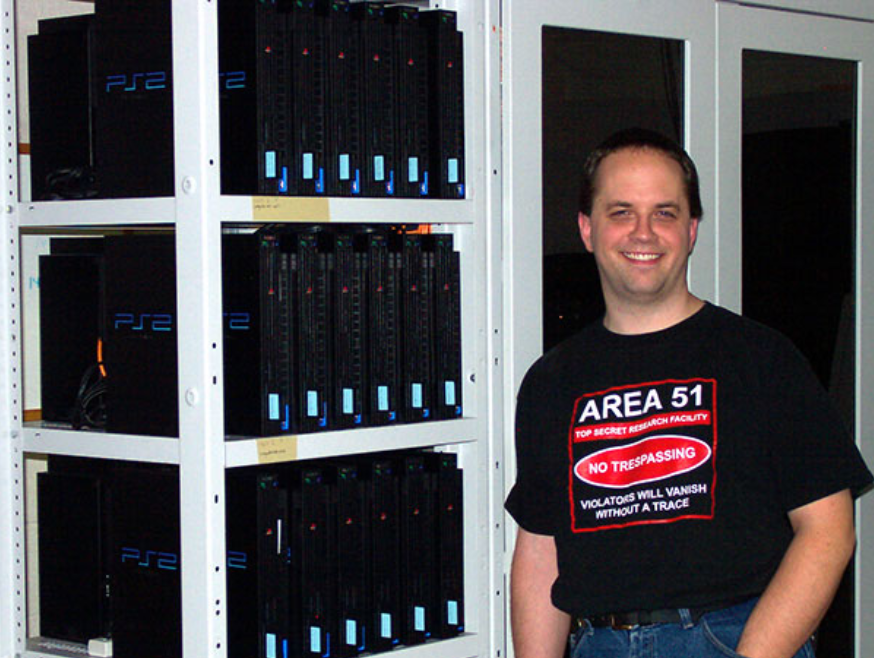

---
hide:
  - toc
---

# Capítulo 9: Oracle Kubernetes Engine (OKE)

# 9.2 Introdução ao Kubernetes

Os contêineres já se consolidaram como uma solução eficaz para a execução de aplicações. O Docker, em particular, oferece a poderosa capacidade de transferir uma aplicação e suas dependências de forma simples entre diferentes máquinas.

À medida que as organizações começaram a adotar contêineres para desenvolver e implantar suas aplicações, surgiu a necessidade de uma plataforma que pudesse simplificar o gerenciamento dessas aplicações.

Kubernetes, frequentemente abreviado como _K8s_, foi desenvolvido para ser um _orquestrador de contêineres_ que possui a responsabilidade de gerenciar e automatizar o ciclo de vida de aplicações em contêineres, facilitando a implantação, operação e escalabilidade dessas aplicações em ambientes complexos.

Ele abstrai toda a infraestrutura de hardware do datacenter, transformando-a em um único e grande recurso computacional. Como resultado, o Kubernetes se consolidou como a plataforma ideal para implantar aplicações _[nativos da nuvem (Cloud Native)](../capitulo-1/cloud-native.md)_, sendo frequentemente denominado o _"sistema operacional da nuvem"_.

<iframe width="560" height="315" src="https://www.youtube.com/embed/ZoFbcxBcJfg?si=yuTfoDOPtfm_pu4z" title="YouTube video player" frameborder="0" allow="accelerometer; autoplay; clipboard-write; encrypted-media; gyroscope; picture-in-picture; web-share" referrerpolicy="strict-origin-when-cross-origin" allowfullscreen></iframe>

 

 <b><em>Como o Kubernetes proporciona todos esses benefícios para as aplicações?</em></b>

O Kubernetes é projetado para funcionar em um _[cluster de computadores](https://pt.wikipedia.org/wiki/Cluster)_ que executa de maneira distribuída diversos serviços e componentes projetados para implantar, operar e manter disponíveis as suas aplicações. O fato de serem distribuídos, possibilita escalar e torna o cluster resiliente a falhas.

Esses diversos serviços e componentes constituem o _núcleo da orquestração de contêineres_ e serão detalhados a seguir.

Abaixo, uma figura que exibe diversos _[Playstation 2](https://www.ncsa.illinois.edu/playing-the-supercomputer-game/)_ foram usados para formar um cluster onde o objetivo era unir o poder computacional dos consoles para executar tarefas de computação em larga escala.

## 9.2.1 Problemas que o Kubernetes resolve

O Kubernetes não apenas simplifica a implantação de aplicações contêinerizadas, mas também cuida para não haver indisponibilidade, criando novas instâncias para substituir aquelas que falharam ou para atender a um aumento na demanda de utilização.

Abaixo, um alguns dos problemas que ele resolve:

### **Alta Disponibilidade (HA) das Aplicações**

O Kubernetes garante a disponibilidade das aplicações por meio da criação de múltiplas réplicas em diferentes máquinas.

Além de serem criadas, essas réplicas são monitoradas de forma contínua. Em caso de falha, o Kubernetes as substitui automaticamente, assegurando a continuidade do serviço.

### **Gerenciamento de Deploy**

O processo de deployment envolve a substituição de uma aplicação por uma versão mais recente. No entanto, quando realizado em um ambiente de produção, essa operação é considerada crítica, pois a aplicação está ativa e constantemente respondendo às requisições dos usuários.

O Kubernetes facilita a realização de deployments e rollbacks das aplicações sem causar impacto, através de diversas _estratégias de deployment_ como _Rolling Update, Blue-Green Deployment, Canary Deployment, A/B Testing e Shadow Deployment_.

### **Escalabilidade**

A escalabilidade refere-se à capacidade de ajustar o poder computacional de uma aplicação em resposta à demanda de uso. Nesse contexto, o Kubernetes oferece duas abordagens principais para escalabilidade: a _escalabilidade horizontal_ e a _escalabilidade vertical_.

A escalabilidade horizontal é realizada por meio do **Horizontal Pod Autoscaler (HPA)**, que permite aumentar automaticamente o número de réplicas de uma aplicação. Por outro lado, a escalabilidade vertical é gerenciada pelo **Vertical Pod Autoscaler (VPA)**, que ajusta CPU e memória.

## 9.2.2 Demais implementações Kubernetes

Implementações menores:

https://docs.k3s.io/
minikube

Hoje, diversos provedores de Computação em Nuvem implementam e disponibilizam o Kubernetes como serviço.

- **[Oracle Kubernetes Engine (OKE)](https://docs.oracle.com/en-us/iaas/Content/ContEng/Concepts/contengoverview.htm)**
    
- **[Google Kubernetes Engine (GKE)](https://cloud.google.com/kubernetes-engine)**
    
- **[Azure Kubernetes Service (AKS)](https://learn.microsoft.com/en-us/azure/aks/what-is-aks)**

- **[Amazon Elastic Kubernetes Service (EKS)](https://docs.aws.amazon.com/eks/latest/userguide/what-is-eks.html)**
    
- **[Alibaba Cloud Container Service for Kubernetes (ACK)](https://www.alibabacloud.com/en/product/kubernetes)**

- **[IBM Cloud Kubernetes Service](https://www.ibm.com/products/kubernetes-service)**

- **[DigitalOcean Kubernetes](https://www.digitalocean.com/products/kubernetes)**

- **[Red Hat OpenShift](https://www.redhat.com/en/technologies/cloud-computing/openshift)**

!!! note "NOTA"
    _Red Hat OpenShift_ não é exclusivamente uma solução de Kubernetes em nuvem. Ele é uma plataforma de contêineres que se fundamenta no Kubernetes no qual pode ser implantada em diversas nuvens.