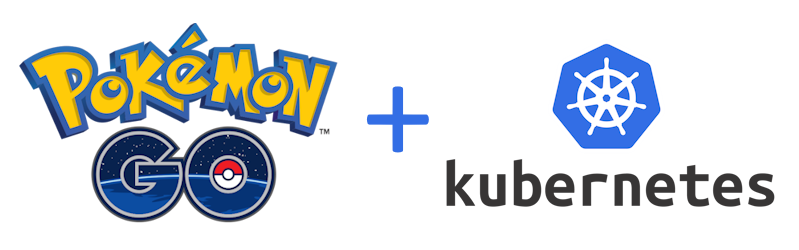
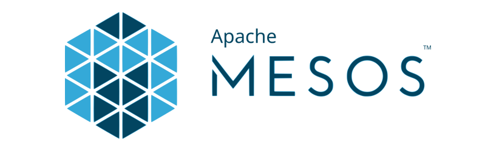

---
hide:
  - toc
---

# Capítulo 9: Oracle Kubernetes Engine (OKE)

# 9.1 Um pouco de História

A criação do Kubernetes teve origem no Google, que, no início dos anos 2000, buscava formas de gerenciar de maneira eficiente sua extensa infraestrutura de servidores e aplicações.

Com a percepção de que o uso de contêineres simplificava e unificava o processo de implantação das aplicações, surgiu a necessidade de criar um sistema capaz de gerenciar esses contêineres de forma eficiente, prática e em larga escala.

Diante dessa necessidade, entre 2003 e 2004, o Google desenvolveu o _[Borg](https://dl.acm.org/doi/pdf/10.1145/2741948.2741964)_, um sistema escrito em C++ projetado para executar aplicações em _[clusters de computadores](https://pt.wikipedia.org/wiki/Cluster)_ em grande escala.

!!! note "NOTA"
    Antes do Borg, o Google gerenciava a execução de serviços e tarefas por meio de dois sistemas distintos, chamados _Babysitter_ e _Global Work Queue_.

O nome Borg vem de _["Os Borg"](https://pt.wikipedia.org/wiki/Borg_(Star_Trek))_ que é um grupo de extraterrestres da série de televisão _[Star Trek](https://pt.wikipedia.org/wiki/Borg_(Star_Trek))_.

Naquela época, o Borg utilizava uma forma primitiva de contêineres, permitindo a execução de uma ampla variedade de aplicações e suas dependências de maneira isolada e segura. Ele foi fundamental no desenvolvimento e na implantação de diversos serviços de internet, como _Gmail, Google Docs, Google Search, Google Maps_ e _YouTube_. O sistema otimizava a utilização de recursos ao possibilitar a execução de contêineres na mesma máquina, além de facilitar o gerenciamento de cargas de trabalho em larga escala _(workloads)_. 

No entanto, o conceito de contêineres ganhou popularidade posteriormente, especialmente com o lançamento do Docker em 2013, que introduziu uma nova abordagem e ferramentas para o gerenciamento de contêineres. O Borg, por sua vez, foi um dos primeiros sistemas a implementar a execução de contêineres e influenciou significativamente o desenvolvimento de sistemas de orquestração, como o Kubernetes.

De acordo com o artigo publicado pelo próprio Google, _["Large-scale cluster management at Google with Borg"](https://dl.acm.org/doi/pdf/10.1145/2741948.2741964)_, o Borg foi concebido para proporcionar três principais benefícios:

1. Oculta os detalhes relacionados ao gerenciamento dos recursos de infraestrutura e do tratamento de falhas, permitindo que os usuários se concentrem no desenvolvimento das aplicações.

2. Opera com altíssima confiabilidade e disponibilidade.

3. Permite a execução eficiente de _"cargas de trabalho (workloads)"_ em dezenas de milhares de servidores.

Embora o Borg tenha sido um sistema inovador para o gerenciamento de clusters e contêineres em larga escala, sua complexidade e algumas limitações tornavam sua utilização desafiadora. Em resposta a isso, em meados da década de 2010, o Google iniciou o desenvolvimento do _[Omega](https://research.google/pubs/omega-flexible-scalable-schedulers-for-large-compute-clusters/)_, seu sistema de gerenciamento de contêineres de segunda geração, com o objetivo de aprimorar a engenharia de software do ecossistema Borg.

Desenvolvido do zero com uma arquitetura mais consistente, o Omega integrou diversas funcionalidades que se mostraram bem-sucedidas no Borg. Dessa forma, ele ampliou ainda mais o ecossistema Borg, proporcionando uma solução de _agendamento flexível (scheduling)_ e escalável para clusters de computadores ainda maiores.

!!! note "NOTA"
    O termo "agendamento" ou _"scheduling"_ será melhor compreendido na seção seguinte, que aborda o processo de implantação de uma aplicação no Kubernetes.

## 8.1.1 Do Docker ao Kubernetes

Por volta de 2013, o Google já utilizava e executava contêineres há aproximadamente 15 anos, por meio de seus sistemas _Borg_ e _Omega_ que também já implementavam a _orquestração de contêineres_. No entanto, esses são sistemas de uso interno e proprietários.

!!! note "NOTA"
    A expressão _"orquestração de contêineres"_ refere-se ao processo de automatizar a implantação, gerenciamento, escalonamento e rede de contêineres em ambientes de computação.

_Orquestração de contêineres_ era uma prática restrita a algumas grandes empresas que ofereciam e vendiam serviços de internet em escala. Era necessário democratizar essa tecnologia e torná-la acessível ao público, especialmente no contexto da Computação em Nuvem.

O Docker é um projeto de _[código aberto (open source)](https://github.com/docker)_ que consiste em um conjunto de soluções e ferramentas projetadas para resolver um problema específico: empacotar software de forma universal, permitindo seu transporte e execução em qualquer máquina ou servidor. Com isso, qualquer pessoa pode facilmente criar e executar contêineres.

Embora o Docker fosse excelente para criar e empacotar contêineres individuais e executá-los em máquinas isoladas, surgiu a necessidade de um orquestrador que fosse capaz de implantar e gerenciar um grande número de contêineres em várias máquinas, ou seja, em um cluster de computadores. O próximo passo, portanto, era desenvolver um sistema de código aberto _(open source)_ que, assim como o Docker, fosse fácil de usar e capaz de implantar, monitorar e manter esses contêineres em funcionamento em múltiplas máquinas.

Um contêiner Docker era um meio para se ter uma unidade de software que poderia ser reproduzida. No entanto, **_como garantir que três instâncias do mesmo software possam ser executadas em conjunto?_**

Uma equipe de engenheiros do Google, composta por _[Brendan Burns](https://www.linkedin.com/in/brendan-burns-487aa590/)_, _[Joe Beda](https://www.linkedin.com/in/jbeda/)_, _[Craig McLuckie](https://www.linkedin.com/in/craigmcluckie/)_ e outros que já estavam familiarizados com os sistemas Borg e Omega, viram a crescente popularidade da conteinerização impulsionada pelo Docker. Eles reconheceram a necessidade de desenvolver um sistema de _orquestração de contêineres_ de código aberto, que fosse amplamente acessível e permitisse que qualquer pessoa o utilizasse, e não apenas grandes corporações como o Google.

No entanto, internalizar e obter aprovação para essa ideia open source dentro do Google não foi uma tarefa fácil. Juntamente com outros colegas da época, eles dedicaram um tempo considerável para convencer a liderança executiva de que transformar esse projeto em um empreendimento de código aberto seria uma excelente iniciativa.

Por experiência própria, esse novo orquestrador deveria ter um conjunto básico de funcionalidades que eram:

1. Replicação para implantar múltiplas instâncias de um aplicativo.
2. Balanceamento de carga _(load balancing)_ e descoberta de serviços _(service discovery)_ para direcionar o tráfego para os contêineres replicados.
3. Monitoramento _(health checking)_ e auto-reparo _(self-healing)_ em caso de falhas.
4. Ser capaz de agrupar muitas máquinas em um único _"pool de máquinas"_ para poder distribuír cargas de trabalho a elas.

Na _[DockerCon](https://www.docker.com/blog/tag/dockercon/)_ em 2014, foi anunciado o Kubernetes como sendo um orquestrador no topo do Docker. Nesse mesmo dia, foram anunciados cerca de cinco ou seis outros sistemas de gerenciamento de contêineres, incluindo opções proprietárias e outras de código aberto.

O Facebook anunciou o Tupperware, o Google anunciou o Kubernetes, algumas outras anunciaram frameworks como soluções de monitoração de Docker e startups, que já estavam usando contêineres também aproveitaram a oportunidade para lançar novos negócios voltados para a orquestração nativa de contêineres e monitoramento.

O nome _"Kubernetes"_ tem origem no grego, significando _"timoneiro"_ ou _"piloto"_. A abreviação _"K8s"_ é derivada da contagem das oito letras entre o _"K"_ e o _"s"_ e é pronunciada como _"kates"_.

No ano de 2015, o **_Kubernetes 1.0_** foi lançado ao público durante a _[OSCON (O'Reilly Open Source Convention)](https://www.oreilly.com/conferences/oscon.html)_, marcando a sua primeira versão estável.

!!! note "NOTA"
    A _[OSCON](https://www.oreilly.com/conferences/oscon.html)_ é uma conferência anual dedicada ao software de código aberto e à cultura open source, organizada pela _[O'Reilly Media](https://www.oreilly.com/)_. O evento reúne desenvolvedores, profissionais de tecnologia, líderes de pensamento e entusiastas do código aberto para discutir tendências, compartilhar conhecimentos e explorar novas tecnologias.

Em 2016, a empresa _[Niantic](https://www.nianticlabs.com/)_ começou a utilizar a versão 1.0 do Kubernetes em produção, implementando um grande cluster para executar o jogo _[Pokémon GO](https://en.wikipedia.org/wiki/Pok%C3%A9mon_Go)_. O uso do Kubernetes permitiu que o jogo crescesse e se expandisse, atraindo jogadores de todo o mundo que começaram a jogar Pokémon GO em seus celulares.

Três anos depois, a comunidade Kubernetes cresceu exponencialmente, e o Kubernetes se tornou o carro chefe quando o assunto era sobre orquestração de contêienres. Varias empresas abraçaram a ideia e começaram a utilizar o Kubernetes e no final de 2017, a Amazon lança o seu produto Kubernetes na AWS.

Ter uma compania grande, como a Amazon, suportanto, utilizando e vendendo Kubernetes como solução para orquestração de contêineres, era um grande sinal de que a tecnologia veio pra ficar. Hoje, Kubernetes é de fato o padrão entre todos os provedores de nuvem, globalmente.

A Oracle, também em 2017, juntou-se à comunidade _Cloud Native Computing Foundation (CNCF)_ como membro platinum. Ela tornou open source um instalador do Kubernetes para o OCI e também para o Oracle Linux.

!!! note "NOTA"
    Os detalhes do anúncio referente a Oracle juntar-se ao _Cloud Native Computing Foundation (CNCF)_ pode ser visualizado em _["Oracle joins Cloud Native Computing Foundation as Platinum Member"](https://www.cncf.io/announcements/2017/09/13/oracle-joins-cloud-native-computing-foundation-platinum-member/)_.

## 8.1.2 Outras soluções para Orquestração de Contêineres

Empresas como _Netflix_, _Apple_ e _Airbnb_ utilizavam o _[Apache Mesos](https://mesos.apache.org/)_ antes da adoção do Kubernetes, pois, na época, essa era uma solução consolidada que já estava em uso há algum tempo e podia escalar para até 10.000 instâncias.

Porém, com o passar do tempo o Kubernetes rapidamente se tornou o padrão de fato para gerenciar aplicações em contêineres em ambientes de produção.

Embora o Kubernetes seja a solução mais popular para orquestração de contêineres atualmente, outras empresas já tinham soluções para gerenciar seus clusters de computadores e também seus contêineres.a

- **Facebook Tupperware**
    - O Tupperware é um um sistema de gerenciamento de contêineres desenvolvido pelo Facebook que foi anunciado durante a DockerCon em 2014.

- **Twitter Aurora**
    - Aurora é um sistema de gerenciamento de contêineres desenvolvido pelo Twitter. Ele foi projetado para facilitar a execução e o gerenciamento de aplicações em contêineres em larga escala.

- **[Apache Mesos](https://mesos.apache.org/)**
    - É um sistema de gerenciamento de cluster de código aberto que permite a abstração de recursos de hardware e a execução de aplicações em larga escala.

- **Microsoft Autopilot**
    - Oferece "automação do provisionamento e implantação de software; monitoramento do sistema; e execução de ações de reparo para lidar com falhas de software e hardware" em clusters da Microsoft.

- **[Docker Swarn](https://docs.docker.com/engine/swarm/)**
    - Docker Swarm é uma ferramenta de orquestração de contêineres nativa do Docker que permite gerenciar um cluster de instâncias do Docker como um único sistema.
