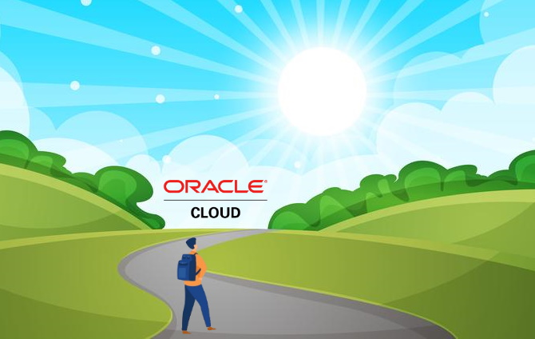

---
hide:
  - navigation
  - toc
---

# OCN - OCI Cloud Native
<h2 style="text-align: center; font-style: italic;">
Um guia prático para a construção de aplicações nativas da nuvem na Oracle Cloud Infrastructure (OCI).
</h2>

 

<h4 style="text-align: center; font-style: italic;">
   As vezes, algumas pessoas gostariam de entender aquilo que você já entendeu... por isso, compartilhe o conhecimento que você possui.
</h4>

**OCN - OCI Cloud Native** é um livro brasileiro que oferece um guia completo e prático sobre a construção de aplicações nativas da nuvem na **_[Oracle Cloud Infrastructure (OCI)](https://www.oracle.com/cloud/)_**. Por meio de uma aplicação web chamada **OCI Pizza**, o autor fornece uma explicação detalhada de todo o processo de desenvolvimento, implantação e execução de uma aplicação **_[Cloud Native](https://github.com/cncf/toc/blob/main/DEFINITION.md#portugu%C3%AAs-brasileiro)_** na **_[Oracle Cloud Infrastructure (OCI)](https://www.oracle.com/cloud/)_**.

Aqui, você encontrará informações sobre como aproveitar os diversos serviços disponíveis no _OCI_ para construir e implantar uma aplicação nativas da nuvem de forma eficiente e econômica.

Espero que este livro o ajude a explorar os incríveis serviços de nuvem disponíveis no _OCI_.

Boa leitura!

[LICENÇA DE USO](./license.md)
  

   

| Status              | Última Atualização | Versão   |
|---------------------|--------------------|----------|
| Ainda escrevendo... | 06/06/2026         | 1.0.0b   |

## Sumário

- [Prefácio](./prefacio.md)
- [Sobre o Autor](./sobre-o-autor.md)
- [Como usar este Livro](./como-usar-este-livro.md)
  

- [Capítulo 1: Introdução a Computação em Nuvem](./capitulo-1/index.md)
    - [1.1 Um pouco de História](./capitulo-1/historia-computacao-em-nuvem.md)
    - [1.2 Definições do NIST](./capitulo-1/definicoes-nist.md)
    - [1.3 Outras definições sobre Computação em Nuvem](./capitulo-1/outras-definicoes.md)
    - [1.4 Terminologias da Computação em Nuvem](./capitulo-1/terminologias.md)
    - [1.5 Vantagens e Desvantagens da Computação em Nuvem](./capitulo-1/vantagens-desvantagens.md)
    - [1.6 DevOps](./capitulo-1/devops.md)
    - [1.7 Cloud Native](./capitulo-1/cloud-native.md)
    - [1.8 Conclusão](./capitulo-1/conclusao.md)
  

- [Capítulo 2: Aplicação OCI PIZZA](./capitulo-2/index.md)        
    - [2.1 Da Necessidade à Definição de Requisitos](./capitulo-2/da-necessidade-a-definicao-de-requisitos.md)
    - [2.2 Arquitetura de Software](./capitulo-2/arquitetura-de-software.md)
    - [2.3 APIs REST](./capitulo-2/apis-rest.md)     
    - [2.4 Entendendo os Contêineres](./capitulo-2/entendendo-os-conteineres.md)     
    - [2.5 Ambiente de Desenvolvimento](./capitulo-2/ambiente-de-desenvolvimento.md)
    - [2.6 Os Doze Fatores (The Twelve-Factor App)](./capitulo-2/os-doze-fatores.md)
  
 
- [Capítulo 3: OCI Foundations](./capitulo-3/index.md)
    - [3.1 Introdução ao OCI](./capitulo-3/introducao-ao-oci.md)
    - [3.2 Criando e Ativando a sua Conta no OCI](./capitulo-3/criando-e-ativando-a-sua-conta-no-oci.md)
    - [3.3 Modelos de Cobraça](./capitulo-3/modelos-de-cobraca.md)
    - [3.4 Acessando o OCI](./capitulo-3/acessando-o-oci.md)
    - [3.5 Gerenciando o OCI através do OCI CLI](./capitulo-3/gerenciando-o-oci-atraves-do-oci-cli.md)
    - [3.6 IAM, Limites, Cotas e Audit](./capitulo-3/iam-limites-cotas-e-audit.md)
    - [3.7 Ajuda Extra, Informações Adicionais, Treinamentos e Certificações](./capitulo-3/ajuda-extra-informacoes-adicionais-treinamentos-certificacoes.md)
  

- [Capítulo 4: Oracle NoSQL Database Cloud Service](./capitulo-4/index.md)
    - [4.1 Persistência dos dados com o Oracle NoSQL](./capitulo-4/nosql.md)
  

- [Capítulo 5: Conectividade e Redes](./capitulo-5/index.md)
    - [5.1 O Serviço de Redes do OCI](./capitulo-5/servico-de-redes.md)
    - [5.2 Conectividade entre Regiões](./capitulo-5/conectividade-entre-regioes.md)
    - [5.3 Reserva de Endereço IP Público](./capitulo-5/reserva-ip-publico.md)
    - [5.4 DNS Público](./capitulo-5/dns-publico.md)
    - [5.5 Let's Encrypt e o Serviço de Certificados do OCI](./capitulo-5/lets-encrypt.md)
    - [5.6 Load Balancer](./capitulo-5/load-balancer.md)
    - [5.7 Web Application Firewall (WAF)](./capitulo-5/waf.md)
    - [5.8 Email Delivery](./capitulo-5/email-delivery.md)
    - [5.9 Conclusão](./capitulo-5/conclusao.md)
  

- [Capítulo 6: Serviço de Computação](./capitulo-6/index.md)
  

- [Capítulo 7: Desenvolvimento Moderno](./capitulo-7/index.md)
    - [7.1 Entendendo os Contêineres](./capitulo-7/containers.md)
    - [7.2 Introdução ao GraalVM](./capitulo-7/graalvm.md)
    - [7.3 Container Instances](./capitulo-7/container-instances.md)
    - [7.4 Functions](./capitulo-7/functions.md)
    - [7.5 Os Doze Fatores (The Twelve-Factor App)](./capitulo-7/os-doze-fatores.md)
  

- [Capítulo 8: Oracle Kubernetes Engine (OKE)](./capitulo-8/index.md)
    - [8.1 Um pouco de História](./capitulo-8/historia-do-kubernetes.md)
    - [8.2 Introdução ao Kubernetes](./capitulo-8/introducao-ao-kubernetes.md)
    - [8.3 Arquitetura do Kubernetes](./capitulo-8/arquitetura-kubernetes.md)
    - [8.4 Funcionamento e Provisionamento do OKE](./capitulo-8/funcionamento-provisionamento-oke.md)
    - [8.5 Objetos Kubernetes](./capitulo-8/objetos-kubernetes.md)
  

- [Capítulo 9: Serviço DevOps](./capitulo-9/index.md)
    - [9.1 Do GitHub para o OCI DevOps](./capitulo-9/github-ocidevops.md)
  

- [Capítulo 10: Monitoração e Observabilidade](./capitulo-10/index.md)
  

- [Capítulo 11: Ferramental de Inteligência Artificial](./capitulo-11/index.md)
    - 11.1 Introução à Inteligência Artificial
    - 11.2 Vibe Code
  

- [Apêndice A: OCI HOWTOs](./apendice-a/index.md)
    - [A.1 Roteamento de Trânsito com pfSense](./apendice-a/transit-routing-pfsense.md)
    - [A.2 Ansible Básico](./apendice-a/ansible-basico.md)
    - [A.3 Kubernetes the Hard Way](./apendice-a/kubernetes-hard-way.md)
    - [A.4 kubectl HOWTO](./apendice-a/kubectl-howto.md)
    - [A.5 OCI CLI HOWTO](./apendice-a/oci-cli-howto.md)
    - [A.6 Federação com Microsoft Active Directory (AD)](./apendice-a/federacao-com-microsoft-active-directory.md)
    - [A.7 Perguntas e Respostas sobre OCI](./apendice-a/perguntas-e-respostas-sobre-oci.md)
  

- [Bibliografia](./bibliografia.md)
